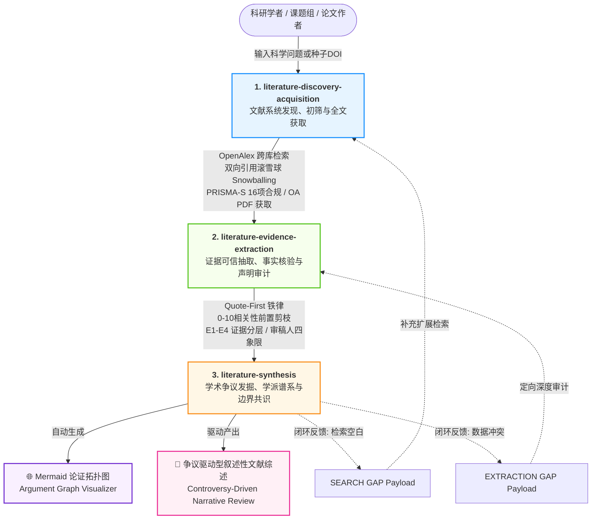

# 🎓 ScholarFlow

<p align="center">
  <b>面向严谨科研的智能体文献全生命周期工作流套件</b><br>
  <i>An evidence-grounded AI research workflow for literature discovery, evidence extraction, and controversy-aware synthesis.</i>
</p>

<p align="center">
  
  
  
  
  
</p>

---

## 📖 简介 (Introduction)

**ScholarFlow** 是为 AI 编程助手与自主智能体（Claude Code、Google Antigravity、Codex、Cursor 等）量身定制的**全生命周期科研文献调研智能体技能套件（Agent Skills Suite）**。

与常见的“喂一篇 PDF 做泛读总结”的浅层工具不同，ScholarFlow 深度吸收了 **FutureHouse `PaperQA2`**、**Stanford `STORM` / `Co-STORM`**、**`GPT-Researcher`** 以及 **`ChatPaper`** 的顶级前沿设计理念，严格恪守高水平科研出版与学位论文的严谨性标准：

1. **零幻觉保证（Quote-First Principle）**：核心数据必须锚定带页码的原文逐字引用。
2. **拒绝流水账（Controversy-Driven）**：综述绝非“张三做了 A、李四做了 B”，而是以科学冲突、方法论根因与适用边界为主线。
3. **拒绝文献民主投票（Weighted Evidence）**：严禁简单比拼文献篇数多数决，单篇高精度独立复现研究可一票降权粗放旧成果。
4. **全生命周期闭环（Upstream Gap Loop）**：综合分析发现文献断裂或数据模糊时，自动生成结构化任务载荷驱动上游补充检索与精准核验。
5. **轻量与零依赖（Zero Pip Dependencies）**：所有配套自动化脚本均基于 Python 3 标准库构建，跨平台零配置、毫秒级响应。

---

## 🏗️ 架构总览 (System Architecture)

ScholarFlow 由三个高度模块化、既可独立运行又可无缝协同的 Agent 技能构成：



---

## 🧩 三大核心技能详解 (Skills Breakdown)

### 1. `literature-discovery-acquisition` (文献系统发现与全文获取)
> **定位**：高召回、可审计的文献检索、商业库免爬虫摄取、PRISMA 双盲初筛与开源全文下载管道。

- **Stage 0 Grill-Me 问询门禁**：在发起检索前，先与用户厘清研究核心实体、目标时间窗口、排他条件与学位论文需求。
- **商业受限库极速摄取 (External Ingestion Pipeline)**：
  - 针对知网 (CNKI)、万方、Web of Science、Scopus 等反爬严格的商业库，提供布尔检索式生成 + 30 秒导出题录文件（Refworks/RIS/EndNote）一键自动化解析入库，免受验证码封禁之扰。
- **PRISMA 2020 Item 8 双盲独立初筛 (Dual-Reviewer Blind Protocol)**：
  - 派发双评阅人独立盲审，基于内置工具自动计算 **Cohen's Kappa ($\kappa$)** 与一致率，生成符合发表级 Meta 分析规范的 `screening_dual_audit.csv` 与分歧待仲裁队列。
- **双向引用滚雪球 (Dual-Direction Snowballing)**：
  - 支持传入种子文献 DOI，利用 OpenAlex API 自动追溯参考文献（`Backward Snowballing`）并追踪最新施引文献（`Forward Snowballing`），自动补全学派谱系。
- **PRISMA-S 16 项系统评价审计清单**：全流程记录概念矩阵（Concept Matrix）、检出饱和度日志（Search Saturation）与去重决策表。
- **双轨运行模式**：
  - **交互工作流**：适合人类学者把关指导；
  - **Headless CLI 模式**：通过 `python scripts/agent_search.py -q "..."` 直接输出契约化 JSON 流。

---

### 2. `literature-evidence-extraction` (证据可信抽取与声明审计)
> **定位**：严格恪守 `Quote → Extract → Verify → Interpret` 铁律的结构化抽取与事实核验引擎。

- **0-10 分相关性前置快速剪枝 (Relevance Gatekeeper)**：
  - 启发自 `PaperQA2` 评测基准。在进入全篇精读前，自动评估论文与课题契合度（0-10 分）。低于 6 分直接判定为 `PRUNE` 建议跳过，防止上下文污染与算力浪费。
- **顶刊审稿人四象限审计 (Reviewer 4-Quadrant Rubric)**：
  - 自动提炼四大必答项：`Q1 科学动机`、`Q2 前人局限`、`Q3 方法创新`、`Q4 实验严谨性与混杂变量`。
- **E1–E4 四级证据金字塔**：
  - **E1**：原始实验数据与测序读数；**E2**：经同行评议的模型统计值；**E3**：讨论推测；**E4**：专家观点或二级转引。
- **多实验体系隔离 (Assay Isolation)**：
  - 自动隔离同篇文献中的不同实验（如：不同退火温度、不同引物组、不同位点），杜绝跨实验混淆。
- **声明事实核验 CLI**：
  - `python scripts/audit_claims.py -i paper.pdf -c claims.json` 自动扫描原文并出具核验证据表。

---

### 3. `literature-synthesis` (综合分析、学术争议发掘与学派图谱)
> **定位**：对标 PaperQA2 思路，推行 `Claims-first, narrative-later` 的学术争议诊断与跨篇证据综合专家。

- **9 大学术争议分类学体系 (Type A ~ Type I)**：
  - 深入实验设计、采样偏差、探测率假定、等位基因脱落（ADO）、空间自相关与尺度依赖等底层技术根因。
- **加权证据共识模型（严禁篇数多数决）**：
  - 按照 E1-E4 权重核算共识得分（$CS \in [0, 1]$），划分为 6 级共识梯队，并强制声明**空间、时间、方法与生物学四维硬性适用边界**。
- **红队反方质询（Devil's Advocate）**：
  - 专设红队审议角色，强行挖掘反对文献、离群数据与替代性假设，杜绝大模型的确认偏误与一团和气。
- **学派与分析性分组判定**：
  - 严格区分真实理论谱系（`ESTABLISHED SCHOOL`）与仅使用同类工具的聚类（`ANALYTICAL GROUPING`）。
- **Mermaid 论证拓扑图自动可视化 (Argument Graph)**：
  - CLI `controversy_analyzer.py` 自动绘制带色彩阵营（支持/反对/调和边界）的论证网络图。
- **争议驱动型综述撰写规范**：
  - 彻底取缔流水账罗列，推行“核心分歧 → 冲突溯源 → 证据对决 → 边界共识 → 破局机遇”五步法。

---

## 📊 横向对比：ScholarFlow 与开源标杆

| 特性维度 | 传统 Agent / 通用 Prompt | GPT-Researcher | ChatPaper | Stanford STORM | **ScholarFlow (本项目)** |
|:---|:---:|:---:|:---:|:---:|:---:|
| **启动交互** | 盲目启动，易发散 | 单一搜索框 | 上传 PDF 直接读 | 多专家虚拟对话 | **Stage 0 Grill-Me 四级交互门禁** |
| **引文扩展** | 仅依赖关键词搜索 | 搜索引擎扩展 | 无 | 维基式多轮检索 | **双向引用滚雪球 (OpenAlex Snowballing)** |
| **相关度剪枝** | 无剪枝，全量读 | 启发式过滤 | 无 | 大纲树剪枝 | **0–10 分 Relevance Gatekeeper (<6分剪枝)** |
| **抽取铁律** | 易产生浮动幻觉 | 总结文本片段 | 结构化问答 | 文本汇总 | **严格 Quote-First + 页码逐字绑定** |
| **审稿人视角** | 无 | 无 | 审稿人评分表 | 无 | **顶刊审稿人四象限审计 (Q1-Q4)** |
| **争议分析** | 简单并列两派 | 文字综合报告 | 篇单维度 | 维基条目式汇总 | **9 类学术争议分类学 + 方法论根因溯源** |
| **共识算法** | 篇数多数决投票 | 频率多数决 | 无 | 综合叙述 | **加权证据分层 (E1-E4) + 四维边界标定** |
| **防确认偏误** | 倾向于顺从与讨好 | 无独立对抗 | 无 | 多视角专家 | **专设 Devil's Advocate (红队反方质询)** |
| **可视化呈现** | 纯文本 | Markdown 表格 | 脑图/思维导图 | 目录大纲树 | **自动化 Mermaid 论证拓扑图 (Argument Graph)** |
| **外部依赖** | 复杂环境配置 | 庞大 Python 库 | 复杂依赖 | 较多依赖 | **纯 Python 3 标准库，零外部 Pip 依赖** |

---

## 🚀 快速开始 (Quick Start)

### 1. 一键安装到您的 Agent 系统

克隆本仓库并执行安装脚本，自动将三大技能安装至全局环境（支持 Claude Code、Antigravity 与通用 Agent）：

#### Windows (PowerShell)
```powershell
git clone https://github.com/Daylily-Huang/ScholarFlow.git
cd ScholarFlow
.\scripts\install.ps1
```

#### Linux / macOS (Bash)
```bash
git clone https://github.com/Daylily-Huang/ScholarFlow.git
cd ScholarFlow
chmod +x ./scripts/install.sh
./scripts/install.sh
```

---

### 2. 在 Agent 中直接唤醒与使用

只要您的 Agent 支持标准 `SKILL.md` 规范，输入如下指令即可直接激活对应能力：

#### 场景 A：开展严谨开题与高召回文献检索
> *“请使用 `literature-discovery-acquisition` 帮我针对‘高山林线野生动物非损伤性遗传取样与个体识别’开展系统文献检索，先通过 Stage 0 问询明确边界。”*

#### 场景 B：从 PDF 中可信抽取实验数据与质控参数
> *“请调用 `literature-evidence-extraction`，按照多管 PCR 实验 Schema 抽取附件论文中的退火温度、循环数、ADO 率和 PID-sibs，恪守 Quote-First 铁律。”*

#### 场景 C：多篇文献学术争议发掘与争议驱动型综述
> *“针对这 8 篇文献在种群密度估算上的分歧，使用 `literature-synthesis` 进行 9 类争议分类溯源，输出加权证据对决表、Mermaid 论证图和具备适用边界的收敛共识。”*

---

### 3. 三级质检与学术诚信架构 (Multi-Tier Audit Hierarchy)

ScholarFlow 严格拒绝“同一个大模型换角色念台词的伪独立审查”，以学术诚信为底线清晰划分质检层级：
- **Level-1 启发式角色自检 (In-Context Persona Audit)**：在单会话内通过 Quality Gatekeeper / Devil's Advocate 角色扮演打破思维惯性并核验清单。本质属于模型自省（Self-Consistency），不具有统计学外部独立性，签发的 PASS 声明为内部自检放行；
- **Level-2 确定性程序级硬审计 (Deterministic Programmatic Audit)**：由纯 Python 确定性脚本对事实与数据进行程序级验真，杜绝大模型幻觉与偏见：
  - `download_oa_papers.py`：PDF 二进制 `%PDF-` 魔数核验，拦截 403 伪装 HTML；
  - `ingest_external_records.py`：知网/万方/WoS 外部导出题录 Schema 硬解析与四级去重；
  - `calculate_screening_agreement.py`：双评阅人 Cohen's $\kappa$ 数学统计检验与分歧自动剥离；
  - `audit_claims.py`：正文原句字符级精准对齐校验，零容忍 OCR 篡改与常识臆造；
  - `controversy_analyzer.py`：共识度加权数学严密验算与同源数据伪重复消除；
- **Level-3 物理隔离子智能体审计 (Isolated SubAgent Execution)**：在支持多智能体并发调度的平台中，Gatekeeper 与 Screening Reviewers 均通过无共享上下文的独立 SubAgent 会话执行，实现真正的背对背双盲审议。

---

### 4. 独立运行配套 CLI 工具箱

ScholarFlow 配套的 Python 脚本均为纯标准库实现，支持独立作为命令行工具使用：

```bash
# 1. 知网 (CNKI) / 万方 / WoS / Scopus 题录一键极速摄取与去重
python skills/literature-discovery-acquisition/scripts/ingest_external_records.py -i cnki_theses.txt -o candidates.json --source CNKI

# 2. PRISMA 2020 Item 8 双评阅人背对背初筛一致性检验 (计算 Cohen's Kappa 并输出仲裁表)
python skills/literature-discovery-acquisition/scripts/calculate_screening_agreement.py -a rev_a.json -b rev_b.json -o report.md --csv audit.csv

# 3. 基于核心论文 DOI 发起双向引用滚雪球追溯
python skills/literature-discovery-acquisition/scripts/agent_search.py --snowball "10.1016/j.biocon.2020.108581" --limit 20 -o snowball.json

# 4. 对论文执行 0-10 分前置相关性剪枝评估与声明核验
python skills/literature-evidence-extraction/scripts/audit_claims.py -i paper.pdf -r "fecal DNA microsatellite snow leopard" --claim "PID-sibs was 0.0004"

# 5. 运行争议诊断分析并生成 Mermaid 论证拓扑图
python skills/literature-synthesis/scripts/controversy_analyzer.py -i claims.json -f markdown -o controversy_report.md

# 6. 运行学派谱系与范式演进聚类分析
python skills/literature-synthesis/scripts/school_clustering.py -i studies.json -f markdown -o school_report.md
```

---

## 📂 仓库结构 (Repository Structure)

```text
ScholarFlow/
├── skills/                                    # 三大核心技能规范与资产
│   ├── literature-discovery-acquisition/      # 文献系统发现与全文获取
│   │   ├── SKILL.md                          # 技能规范入口
│   │   ├── scripts/                          # agent_search.py, download_oa_papers.py,
│   │   │                                     # ingest_external_records.py, calculate_screening_agreement.py
│   │   ├── references/                       # PRISMA-S, Stage 0, 双盲初筛, 商业库摄取, Zotero联动
│   │   └── assets/                           # 检索日志、概念矩阵、CSL-JSON Schema
│   │
│   ├── literature-evidence-extraction/        # 证据可信抽取与声明审计
│   │   ├── SKILL.md                          # 技能规范入口
│   │   ├── scripts/                          # audit_claims.py, pdf_evidence_locator.py
│   │   ├── references/                       # Quote-First 铁律, E1-E4 层级, 实验隔离
│   │   └── assets/                           # 结构化抽取 Schema, 审稿人四象限模板
│   │
│   └── literature-synthesis/                  # 学术争议发掘、学派谱系与边界共识
│       ├── SKILL.md                          # 技能规范入口
│       ├── role/                             # 总控、争议、学派、红队质询与门禁
│       ├── scripts/                          # controversy_analyzer.py, school_clustering.py
│       ├── references/                       # 9类争议分类学, 6级共识与边界, 综述指南
│       └── assets/                           # 争议图谱、论证拓扑图、上游空白请求模板
│
├── scripts/                                   # 一键安装脚本 (install.ps1 / install.sh)
├── .gitignore
├── LICENSE                                    # MIT License
└── README.md                                  # 项目说明文档
```

---

## 🤝 贡献与反馈 (Contributing)

欢迎科研同仁、导师学者以及 AI Agent 开发者提交 Issue 和 Pull Request！
- 贡献新的领域画像文件（如：医学、材料学、计算社会学等）
- 优化数据抽取与清洗算法
- 分享在博士/硕士学位论文开题与写作中的实战经验

---

## 📄 开源许可证 (License)

本项目基于 [MIT License](LICENSE) 开源发布。您可以自由地在学术研究、个人项目或商业应用中使用、修改与集成。

