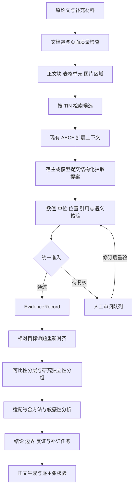

# ScholarFlow 深度检索、文献解析抽取与跨文献综合增强操作文档

> 文档状态：实施建议，尚未实现。  
> 编写日期：2026-09-07。  
> 核验基线：`529feaf9a0446805618eb63decad02e3c73e8d25`，项目版本 `0.6.4`。  
> 已通过 `git ls-remote origin HEAD refs/heads/main` 确认：编写时本地 HEAD 与 GitHub main 一致。  
> 本文中的“已确认”来自本版本代码、测试或合成输入复现；“建议”是待实施设计；性能目标是拟定验收线，不是当前成绩或行业标准。
> 追加修订：第17节补充 Deep 检索增强方案，复用现有检索覆盖台账与题录合同；原文件名保留，便于已有链接继续使用。
> 并行修改提示：追加第17节的最终校验时，工作区出现多处 schema、抽取/综合及覆盖模块的未提交修改。本文现状与测试数字保留为读取时的529feaf基线证据，不表示这些并行修改后的状态；实施前须重查相关函数，跳过已修复项。此次文档任务未更改这些业务文件。

## 1. 目标与实施原则

本文覆盖三个衔接问题，其中前两项详见第1–16节，检索增强详见第17节：

1. 文献解析与抽取：可靠读取正文、表格、图片及补充材料；保留原始定位；把候选发现、字段抽取、语义核验和质量裁决变成可回放的过程。
2. 跨文献综合：先判断证据是否可比、是否独立、是否真的支持目标命题，再形成当前证据集合内的综合结论，并显示边界和不确定性。
3. Deep 检索：从固定三轮、单源和单种子，升级为有真实分页、查询计划、多源互补、多种子追踪、预算与停止证据的检索流程。

保留现有三 Skill 结构、上下文扩展 AECE、主张对齐 A2 和 canonical schema。复用已有闭环，避免另造一套同名数据模型。第17节在现有检索 Skill 内增量改造，不以增加提示词、角色数量或评分公式作为主要改进。

实施优先级：

| 阶段 | 交付目标 | 优先级 | 进入下一阶段的条件 |
|---|---|---|---|
| M0 | 修复证据传递中的乐观默认、审计绕过及身份丢失 | P0 | 负向用例不能得到支持/通过，旧合同可迁移 |
| M1 | 建立统一文档包，支持正文、表格与扫描件 | P1 | 每个可用证据块可回到原文件和位置 |
| M2 | 建立候选检索、模型提案、程序核验和复核流水线 | P1 | 字段值、原文、位置、上下文联合验证 |
| M3 | 建立目标主张对齐、可比性分层及研究独立性处理 | P1 | 不可比研究、重复数据不能制造强结论 |
| M4 | 真实任务评测、敏感性分析与交付报告 | P1 | 满足冻结的任务验收标准；无未披露退化 |

M0、M1 是底座；M2 与 M3 的接口先共同确定，实现可以逐项推进。M4 的标注准备必须从 M0 开始，不能等全部开发完才收集“恰好通过”的案例。

## 2. 最新版本已经完成什么

本次重新核验后，以下能力应计入现有基础，不应重复列为从零建设：

| 已有组件 | 本版本能力 | 仍需增强的边界 |
|---|---|---|
| `extraction_pipeline.py` | `process_candidate()` 串联 AECE、角色分类、TIN 对齐、A2、证据提升和审计 | 输入候选及 `extracted_value` 由调用方提供；尚不是从原始文档自动完成抽取的完整入口 |
| `context_expansion.py` | 候选上下文扩展、状态检查、canonical EvidenceRecord 生成 | 原始图表转结构化信息仍需上游；字段值与具体原文的绑定需强化 |
| `evidence_to_claim.py` | EvidenceRecord → ClaimRecord，提供准入检查函数 | 命题方向、质量默认、空证据索引等仍有风险 |
| `claim_evidence_matrix.schema.json` | 统一 Claim–Evidence Matrix envelope | Schema 合格不保证证据引用、审计、独立性在转换后保留 |
| `controversy_analyzer.py` | 权重汇总、独立组检查、canonical SynthesisRecord 输出 | 归一化丢字段；主要仍为阈值分类；缺少可比性前置分层 |
| `test_cross_skill_roundtrip_contract.py` | 新增跨阶段 roundtrip 测试 | 仍需要反方向命题、空索引、坏审计、重复研究和真实 PDF 用例 |

现有源码入口：

- [抽取编排器](../../skills/literature-evidence-extraction/scripts/extraction_pipeline.py)
- [上下文扩展与证据提升](../../skills/literature-evidence-extraction/scripts/context_expansion.py)
- [主张对齐](../../skills/literature-evidence-extraction/scripts/claim_alignment.py)
- [证据转主张](../../skills/literature-synthesis/scripts/evidence_to_claim.py)
- [综合分析](../../skills/literature-synthesis/scripts/controversy_analyzer.py)
- [最新 roundtrip 测试](../../tests/test_cross_skill_roundtrip_contract.py)

本次运行 `python -B -m unittest discover -s tests -q`：**244 项通过**。这是本地回归基线。没有运行真实论文性能评测，没有运行外部项目对比；不能据此声称能力已经比肩或超越。

## 3. M0：先修复会改变结论的传递问题

### 3.1 已复现的风险与修复要求

以下合成用例只验证函数行为，不代表已有用户成果一定发生了同样错误。

| 编号 | 已确认行为 | 必须实现的变更 | 回归验收 |
|---|---|---|---|
| F01 | `map_evidence_to_claim()` 把旧 `claim_status=SUPPORTED` 直接映射为新目标的 `SUPPORT`，不验证目标命题是否改变 | 保存原始核验命题及其 ID；新目标必须重新计算语义关系 | 原证据“未改善”换成目标“改善”，不得得到 SUPPORT |
| F02 | 缺失/UNKNOWN 强度可以由 EXPLICIT 自动升级为 DIRECT_EMPIRICAL | 缺失保持 UNKNOWN；抽取方式与研究强度正交 | Discussion 原句即使 EXPLICIT 也不能自动变成直接实证 |
| F03 | 适配器默认 directness/independence/replication 为 HIGH、risk_of_bias 为 LOW | 全部未知项默认为 UNKNOWN，需定位与理由才能升级 | 新证据无质量评价时，不能获得默认高质量 |
| F04 | `evaluate_consensus_eligibility(claim, {})` 跳过证据引用检查，合成样例返回 True | 正式综合要求非空证据索引；缺失、空索引都失败关闭 | 有 evidence_ids 但没有可解析来源时拒绝准入 |
| F05 | `normalize_claim()` 丢失 evidence_ids、claim_id、independence_group_id，并重新计算准入 | 显式保留追溯字段；准入由统一检查器生成，普通归一化无权升级 | 同数据集组经过完整 analyze 路径后仍为同一组 |
| F06 | 包装器仅按 records 非空给 PASS，并固定 checklist_passed=True；UNSUPPORTED 合成记录仍 PASS | 接收实际逐条 GateResult；计算失败、待审和合格数量 | 缺失审计、审计失败或未核验，不能签署 PASS |
| F07 | 包装器硬编码时间为 `2026-09-07T00:00:00Z`，输出 schema_version=1.0，而共享 ExtractionResult 常量为 1.1 | 使用注入时钟和对应版本常量；测试固定时钟，运行使用真实 UTC | 时间可控可测，版本符合执行契约，不依赖宽松 schema 蒙混通过 |

额外静态风险：`process_candidate()` 先创建 evidence，再返回 audit_result；`promoted` 只看 evidence 是否存在。必须把“生成提案”和“最终准入”分开，最终审计失败后不能保留可综合的终态记录。

### 3.2 统一准入规则，消除多处默认值

建议新增 `shared/core/eligibility.py`，供抽取出口、Claim 适配器、分析入口、报告出口共同调用。文件为拟新增，当前不存在。

准入至少分三个层级：

1. **可展示**：有来源的候选和失败项都可展示，但必须带状态。
2. **可参与描述性综合**：证据引用可解析、必要核验完成、目标关系确定，且满足当前综合方法的条件。
3. **可支撑强结论**：除第二层外，还须满足可比性、独立性、质量与敏感性策略；UNKNOWN 不能当作 HIGH。

不要把“来源未知的旧记录”删除。应保留为待复核，但不能凭缺失数据获得强结论资格。`support_type=NOT_REPORTED` 永远不是正向或反向效应证据。

建议统一返回以下结构，不能只返回一个布尔值：

```json
{
  "gate_id": "GATE-DEMO-001",
  "policy_version": "proposal-1",
  "input_digest": "illustrative-digest",
  "display_eligible": true,
  "synthesis_eligible": false,
  "strong_conclusion_eligible": false,
  "reasons": ["SOURCE_EVIDENCE_UNRESOLVED"],
  "required_actions": ["Resolve evidence_ids against the source evidence index"]
}
```

上例是拟议接口片段，非当前 schema 的有效完整记录。正式实现要用真实摘要值，并在输入摘要或策略变化时重算；不得信任输入文件自带的 `consensus_eligible=true`。同样，旧拒绝标记也不能无证据地被普通归一化清除。

### 3.3 反证与“核验失败”必须分开

旧 claim_status 的含义绑定被核验的旧命题；新 synthesis target 可以不同。禁止机械映射：

```text
旧命题核验 SUPPORTED  ≠  支持任何新命题
旧命题核验 UNSUPPORTED  ≠  反驳该命题
未发现显著差异  ≠  证明等效
```

新设计至少保存 `verified_proposition_id`、`verified_proposition_text`、`synthesis_target_id`、`target_relation`、`relation_evidence_refs`。同一条可靠原始观察可以反驳一个命题、支持另一个命题。

对于反证，增加明确的“证据有效但方向相反”路径。必须同时通过来源与语义核验；不能简单放宽 A2 的所有拒绝。不能让反证因“不支持正向目标”而在抽取阶段消失。

## 4. 总体执行架构



模型负责理解与提案；程序负责状态、引用、算术、单位和可重复检查；人工处理高影响分歧。程序检查可以发现错误，但“未发现错误”不等于独立证明科学主张成立。

## 5. M1：建立统一文档包与解析路由

### 5.1 引入可插拔解析器

建议采用“现有轻量文本路径 + 一个主结构化解析器 + 可选失败兜底”。不要首版同时维护多个重型解析后端。

| 输入类型 | 建议首选 | 失败或不充分时 | 放行要求 |
|---|---|---|---|
| 原生 PDF，正文清晰 | 保留 pypdf 快速路径 | 切换结构化解析器 | 目标页字符、顺序和定位可用 |
| 双栏、复杂表格、跨页材料 | Docling 适配器作为首个试点 | MinerU 适配器作候选比较 | 表头、行列、单位和脚注可恢复 |
| 扫描 PDF | 启用 OCR 的结构化路径 | 目标页图像复核 | 关键数字和符号可核对 |
| 曲线、柱状图、图像面板 | 原图区域、图注和正文联合处理 | 视觉模型提案或人工判读 | 明确“图中印刷数值”与“几何估读” |
| 补充 CSV/XLSX | 对应结构化文件读取器 | 人工检查异常表头 | 保留 sheet、行列、单位、原文件摘要 |

选择 Docling 作为试点是工程建议，不是性能冠军结论。其官方文档提供统一文档对象、正文/表格/图片、阅读顺序和可用时的坐标与来源信息，适合接入统一数据层。[官方文档](https://docling-project.github.io/docling/concepts/docling_document/)

MinerU 提供复杂文档到 Markdown/JSON 的转换，可作为替代后端；应在同一批本地 PDF 上比较质量、耗时和资源消耗再决定是否接入。[官方仓库](https://github.com/opendatalab/MinerU)

**依赖策略：** 核心合同层继续允许标准库运行；解析器放入独立虚拟环境，通过 JSON 文件/子进程接口连接。选定版本后记录 Python 版本、包版本和模型资产版本；不要假设核心的 Python 3.9 支持范围等于第三方解析器范围。缺少解析器必须输出明确的降级状态，不得把原始 PDF 字节扫描当作可靠正文。

### 5.2 拟新增模块

| 拟新增路径 | 职责 |
|---|---|
| `shared/document_io/document_bundle.py` | 文档包对象、路径引用与摘要 |
| `shared/document_io/parser_registry.py` | 能力检测、路由、超时与降级 |
| `shared/document_io/adapters/pypdf_adapter.py` | 包装现有逐页文本读取 |
| `shared/document_io/adapters/docling_adapter.py` | 第一个结构化解析适配器 |
| `shared/document_io/quality.py` | 页级质量、可用覆盖率、图表缺口 |
| `schemas/document_bundle.schema.json` | DocumentBundle canonical schema |
| `tests/test_document_bundle.py` | 坐标、来源、多文件与降级测试 |

源文件只保留副本或引用及 SHA-256；解析、OCR、修订各自产生新产物，避免覆盖原件。

### 5.3 文档包最小字段

以下字段是设计要求；除非迁移明确规定，不应直接塞进现有 EvidenceRecord 顶层。

| 字段 | 语义与约束 |
|---|---|
| document_id / document_sha256 | 文档实例身份，不由标题单独决定 |
| record_id / study_id | 文献题录与研究身份分开；study_id 可待定 |
| attachments | 主文、补充 PDF、数据文件，含关系和可访问状态 |
| parser_run | 后端、版本、配置、执行时间、模型资产摘要 |
| pages | 页索引、印刷页码、页面大小与质量问题 |
| blocks | 稳定块 ID、文本、类型、阅读顺序、来源坐标 |
| tables | 表格 ID、行列表头、单元格、合并关系、脚注与单位 |
| figures | 图片区域、面板、图注、坐标轴及相关正文块 |
| coverage | 已处理页、不可读页、未取得的附录 |

坐标统一为左上角原点的 `[x0,y0,x1,y1]`，按页面宽高归一化到 0–1；同时记录页面旋转及转换关系。`page_index` 为 0 起始，UI 展示页为 `page_index+1`；印刷页码单列为字符串，不能混用。

原始文本与正规化文本分开存储。所有 offset 必须说明对应哪个文本版本；正规化后不能继续套用旧 offset。缓存键包含源摘要、解析器版本和配置摘要；OCR 变化后失效重建。

### 5.4 表格、图和公式的特殊要求

**表格：** 每个数值绑定行标题路径、列标题路径、单位、脚注及实验/队列 ID。跨页表只有在表号、表头和延续关系明确时才能合并。模型整理的 `Row: ... Column: ...` 是结构化描述，不得冒充原文逐字引句。

**图：** 优先找作者提供的源数据或补充表。印刷标签可作为明确报告数值；根据像素、曲线高度估读的数值需新增 `measurement_origin=FIGURE_DIGITIZED`、误差范围、轴类型和方法记录，不能标为原文明示的精确值。几何估读默认不参与主分析，只在批准的敏感性分支使用。

**公式：** 同时保存原图/原式文本、变量定义、输入证据 ID、单位和计算表达式。派生值标 DERIVED；程序复算并记录舍入，不得由模型自报计算正确。

**OCR：** 对负号、小数点、上下标、μ、±、百分号设关键字符检查。解析器间不一致时保存两份候选，不平均取值。关键字段未解决则 OCR_UNCERTAIN 或 NEEDS_REVIEW。

## 6. M2：从候选定位走向可核验抽取

### 6.1 明确输入需求 TIN

每个 TIN 必须描述要抽取的字段及上下文，而不是仅给“总结论文”。至少包含：

- `tin_id`、任务类型 ATTRIBUTE / CLAIM / COMPARISON；
- 对象、干预/方法、比较对象、结果指标、时间点和分析单位；
- 预期值类型、单位约束、允许的证据来源、精度要求；
- 所需补充材料、无法获得时的处理方式；
- 对 CLAIM，保存完整目标命题及 ID，禁止只传关键词。

数值字段使用 field specification 定义比较容差；计数通常要求精确，测量值容差依据原文精度，不能对所有指标套统一百分比。

### 6.2 先提高候选召回，再做精确验证

1. 用字段别名、实体别名、单位和章节检索正文与表头。
2. 可选添加语义检索；小语料先采用本地词法检索，不强制向量数据库。
3. 候选列表分配正文、表格、补充材料和反向证据的覆盖名额；不能让全文词频最高的段落占满窗口。
4. 进入现有 AECE，补齐指代、比较组、条件及表格上下文。
5. 排序只能改变阅读优先级；早期低关键词分不能直接判定“无此证据”或“全文未报告”。

`candidate_recall@K` 单独评测；K、上下文预算和重试上限写入配置，并通过开发集选择。NR 判断不能仅凭 top-K 没找到。

### 6.3 保留宿主模式，增加统一提案接口

无需把整个系统改成独立聊天机器人。定义 `ExtractionProvider` 接口，至少支持：

| 提供者 | 用途 | 输入/输出要求 |
|---|---|---|
| HostAgentProvider | 正常 Skill 使用，由宿主完成理解 | 读取候选上下文包，输出严格 JSON 提案 |
| ReplayProvider | CI 与离线重放 | 读取冻结的提案，不接模型，不宣称实时推理效果 |
| ModelProvider（可选） | 批量和公平对比实验 | 显式配置模型和预算，记录请求配置与响应摘要 |

新增接口只负责“提出抽取结果”，无权签署终审 PASS。每项提案必须带 candidate_id、field、value、unit、source_span_refs、context_unit_id、source_role、target_relation 及缺失项。无法识别时返回 null 与原因。

候选与 `extracted_value` 不能继续彼此独立：验证器必须证明数值来自引用位置，或可由带来源的输入计算出来。`process_candidate()` 可保留为兼容入口，但内部调用统一提案与核验流程。

### 6.4 三层核验与状态机

| 层 | 核验内容 | 失败后状态 |
|---|---|---|
| V1 来源与机械核验 | 文档摘要、引用存在、页/块/单元格、值和单位、派生复算 | REJECTED 或 NEEDS_REVIEW |
| V2 命题与上下文核验 | 主体、比较对象、否定、条件、指标、时间点、作者转引/推测 | VERIFIED_SUPPORT / VERIFIED_REFUTE / CONDITIONAL / UNRESOLVED |
| V3 质量与适用性评价 | 研究设计、混杂、独立性、直接性、适用边界 | 允许描述性综合/不允许强结论/待人工 |

这些是拟新增工作流状态，不能未经 schema 变更直接写入旧 `claim_status` 枚举。旧字段由兼容层映射，并保留新状态详细信息。

推荐持久化顺序：`PROPOSED → SOURCE_CHECKED → SEMANTIC_CHECKED → AUDITED`；失败可进入 `NEEDS_REVIEW` 或 `REJECTED`。修订创建新 revision，重新核验，保留旧裁决。

V2 核验器应先接收原文与待核验命题，不给上游的“肯定结论”及解释，以减少迎合；模型复核仍不等于独立人类审查。高影响冲突、图中估读和关键 OCR 歧义进入人工队列。

### 6.5 未报告、未找到和不可访问分开

新增 `missing_reason`：`NOT_REPORTED_AFTER_FULL_REVIEW`、`NOT_FOUND_IN_RETRIEVED_CONTEXT`、`SUPPLEMENT_UNAVAILABLE`、`UNREADABLE_SOURCE`、`NOT_APPLICABLE`。

只有完成协议要求的全文/补充材料覆盖后，才能生成 NOT_REPORTED。补充材料无法获得时，应如实标记不可访问；不得因下载失败断言作者没有报告。NOT_APPLICABLE 同样不映射为效应为零。

### 6.6 抽取端交付物

每次运行生成 `document_bundle.json`、`candidate_contexts.jsonl`、`extraction_result.json`、`audit_events.jsonl`、`review_queue.json`、`report.html` 和 `run_manifest.json`。

在现有 HTML 渲染器上增加：字段值 → 引用块/表格单元 → 原文位置；展示通过、待复核、拒绝、未取得补充材料。合并单元格和截图使用本地资源目录；所有模型/论文文本 HTML 转义，不从外部加载执行脚本。

run manifest 记录输入摘要、代码提交、模型/宿主信息（可获得时）、提示词版本、解析器版本、配置摘要、时间与失败数。不知道的宿主配置标 UNKNOWN，不编造可复现性。

## 7. M3：跨文献综合先判断可比性

### 7.1 建立固定目标命题

拟新增 `SynthesisTarget`：目标实体、方法/干预、比较对象、结果定义、方向、时间尺度、研究环境和分析单位。保存原始语言描述和正规化字段，原文与翻译分别保存。

`map_evidence_to_claim()` 改为读取 TargetAlignmentResult。目标 ID 或内容变化后，旧关系失效。映射器不得自行通过旧 claim_status 决定新 stance。

示例：证据“无菌条件下有效”对命题“无菌条件下有效”是 SUPPORT，对“所有环境下有效”只能支持受限子命题，不能自动 SUPPORT。

### 7.2 可比性矩阵

拟新增 `skills/literature-synthesis/scripts/comparability.py` 和 `schemas/comparison_record.schema.json`。

每个比较记录保存左右证据 ID、目标 ID、逐维裁决、必要变换及来源。输出：

| 状态 | 含义 | 后续动作 |
|---|---|---|
| DIRECTLY_COMPARABLE | 关键维度一致 | 可进入同一分层 |
| COMPARABLE_AFTER_TRANSFORM | 指标可经明确公式换算 | 记录公式、单位与输入后重验 |
| STRATIFY_REQUIRED | 条件不同但有研究意义 | 分层展示，禁止直接合并 |
| NOT_COMPARABLE | 核心估计对象或定义不同 | 并列描述，不能定性为直接冲突 |
| UNKNOWN | 缺少关键信息 | 产生补抽任务，保留待判 |

共同核对：对象、处理、比较组、结果指标、分母、时间点、样本来源、研究设计、统计估计量与分析单位。学科透镜可追加字段，不能覆盖通用证据原则。

不要将以上维度压成一个总分掩盖硬冲突；例如分母不同就是需要处理的条件。也不要按“共享一个相似邻居”连通聚类：A 与 B 可比、B 与 C 可比，不保证 A 与 C 可比。首版可按预先定义的分层键建组，并检查组内所有关键条件。

### 7.3 独立性以研究/数据为单位

分开保存 `paper_id`、`study_id`、`dataset_id`、`cohort_id`、`analysis_unit_id`、`independence_group_id`。

同一研究可有多篇论文，同一论文也可有多个研究；不同 DOI 不能自动证明独立。不同作者也不能自动证明独立，同一团队的新样本也不必然是重复数据。

操作顺序：

1. 根据注册号、数据集、样本地点/时间/规模等提出重叠候选。
2. 保存重叠依据和置信状态，未知不填写 HIGH。
3. 对同一研究、目标、指标、时间点选取预先规定的主效应记录；其余标为关联证据。
4. 数据重叠不明时运行保守合并与拆分两种敏感性情景；结论变化则降低确定程度。
5. 测试“一项研究拆成十条 claim”不能使证据总量或强结论资格上升。

### 7.4 选择合适的综合方法

优先输出可比较证据及质量剖面，再选择方法：

- **描述性证据综合（默认）**：展示各研究结果、反证、限制与未知，给出有边界的叙述。
- **方向性汇总（有限信息）**：明确只有效应方向，不能把显著/不显著作为赞成/反对；不据此声称效应大小。
- **定量合并（后续可选模块）**：只有指标、估计对象、方差和依赖结构满足选定统计方法时启用；单独设计与验证，首版不自造通用元分析公式。

非元分析综合应说明具体方法；按统计显著性投票有严重局限。方向性汇总也有信息损失与适用条件，不能与“领域共识”混同。[Cochrane Handbook 第12章](https://www.cochrane.org/authors/handbooks-and-manuals/handbook/current/chapter-12)

上述参考面向干预研究，跨学科时仅继承明确报告方法、避免错误投票的原则；不能把医学评价框架直接设为所有学科的强制标准。

### 7.5 权重降为辅助，不直接签发科学结论

现有 `heuristic_balance_score` 可以保留作解释性展示，但必须标明启发式。诸如 1.0、0.8、0.4 的系数不是概率，也不是已验证的效应量权重。

新增综合决策记录，包含：

- `synthesis_method` 与 `policy_version`；
- 可比性分层、有效独立研究数、排除与待审数量；
- 各质量维度的证据依据，未知项单列；
- 关键支持、关键反证及未解决的矛盾；
- 适用边界、缺口及敏感性结果；
- `classification_scope=CURRENT_EVIDENCE_SET_ONLY`。

若保留 STRONG_CONSENSUS，必须显式显示“仅当前证据集内”，并满足经过评测的质量规则；不得仅凭支持比例达到阈值放行。后续可考虑把展示名称改为“当前证据支持程度”，旧枚举仅用于兼容。

六级/五级不一致的处理建议：不要仓促把 EMERGING_VIEW 加入强度梯队。将“新兴/稳定/历史”作为单独的趋势维度；强度与新颖性正交。若采用该方案，同步修改 Skill、参考规程、schema、CLI 和测试，避免两套定义继续并存。

## 8. M4：敏感性分析、补证与正文核验

### 8.1 每个主要结论执行的敏感性分析

| 情景 | 要回答的问题 |
|---|---|
| 逐独立研究移除 | 是否只靠某一项研究支撑？ |
| 排除高偏倚/未审定记录 | 结论是否仍成立？ |
| 排除转引、作者推测 | 原始证据本身支持到什么程度？ |
| 重叠研究合并 | 是否被重复发表放大？ |
| 合理质量策略变化 | 结论是否依赖任意权重？ |
| 按关键环境/时间点分层 | 表面冲突是否消失？ |
| 排除图中估读值 | 结论是否受图像读数误差影响？ |

结论从支持变成未知，或强度明显改变时标记 `sensitivity_status=UNSTABLE`，给出触发因素。不要把敏感性稳定自动解释为因果真实。

### 8.2 补证闭环

在现有 SEARCH GAP / EXTRACTION GAP 中追加 `triggering_claim_ids`、`blocking_dimension`、`expected_decision_impact`、`acceptance_condition`、`attempt_history`。

例如：“补取 Table S3 的样本分母；若分母按反应次数而非独立样本统计，则两研究不能直接比较。”这比泛泛“再找更多论文”更可执行。

优先级用高/中/低并附依据；没有校准数据时不输出虚构的“70% 改变结论概率”。设置补证轮次和预算，达到上限仍未解决则交付明确未知。

### 8.3 正文核验

保留现有 Claim ID linter，同时新增句子与 Claim 内容一致性检查。引用 ID 存在不足以证明正文忠实。

重点拦截：把“相关”写成“导致”、把局部条件省略、把未显著写成无效/等效、把模型估计写成实测、引用正确但方向颠倒。正文应由已通过的证据图生成，失败句子回到修订，不允许添加无法绑定证据的新结论。

## 9. 数据合同与迁移顺序

### 9.1 最小新增对象

| 对象 | 作用 | 与现有对象的关系 |
|---|---|---|
| DocumentBundle | 原文件、块、表格、图像与解析来源 | EvidenceRecord 引用其 block/cell |
| ExtractionProposal | 模型/宿主提案 | 通过审计后才转 EvidenceRecord |
| GateResult / AuditEvent | 核验结果与修订历史 | 不可用非空记录替代 |
| TargetAlignmentResult | 证据相对指定目标的关系 | Claim stance 来源 |
| ComparisonRecord | 可比性与转换裁决 | 综合分层来源 |
| StudyRecord | 研究/队列/数据集身份 | 独立性分组来源 |

拟新增 schema 必须集中在 `schemas/`。Skill assets 只引用 canonical schema，不复制可执行定义。

### 9.2 EvidenceRecord 增量字段建议

保留现有 evidence_id、record_id、field、extracted_value、support_type、claim_status。增加版本化扩展：

- `source_refs[]`：document_id、document_sha256、block_id/cell_id、page_index、bbox、span；
- `value_details`：原值、正规化值、单位、分母、精度、measurement_origin；
- `derivation`：公式、输入 evidence_ids、单位与复算结果；
- `verified_proposition`：原核验命题与 ID；
- `audit_refs[]`：与输入摘要绑定的 GateResult ID；
- `revision`、`supersedes`、`missing_reason`、`study_id`。

不把数组型复杂结果硬塞进当前只接受 string/number/null 的 extracted_value；先拆成原子证据，或经新版本定义 value_details。

### 9.3 迁移步骤

1. 冻结 529feaf 样例，保存合法、待审和拒绝三类旧输入。
2. 明确 contract 版本与各 artifact 版本：当前共享 ExtractionResult 常量为 1.1；不要只修改项目版本号。
3. 先给读取器增加版本分派与严格校验，再启用新生产者。
4. 旧记录没有定位/审计/独立性时保留 UNKNOWN 与 LEGACY_UNVERIFIED，不伪造历史信息。
5. 迁移记录同时保存旧文件摘要、迁移器版本、字段变更、未能补齐项。
6. 读取旧数据可展示；正式综合不能绕过新准入规则。新输出不再写含混的 E1–E4 别名，旧输入由适配器显式解析。
7. Schema 的类型校验后再运行跨记录语义校验：引用、摘要、状态、目标 ID、study 分组完整性。
8. 对包含审计升级等安全语义的修复保持失败关闭；回滚运行代码不能把旧乐观默认恢复成默认发布路径。

## 10. 文件级实施清单

| 文件/目录 | 操作 | 完成标准 |
|---|---|---|
| `skills/literature-evidence-extraction/scripts/extraction_pipeline.py` | 修改 | 提案、审计、最终准入分离；时钟/版本正确 |
| `skills/literature-evidence-extraction/scripts/context_expansion.py` | 修改 | 保留文档块、表图定位；提升时核验值来源与来源类型 |
| `skills/literature-evidence-extraction/scripts/quote_audit.py` | 修改 | 位置绑定检查；无引用区分 NR 与缺证据；图表采用专门来源检查 |
| `skills/literature-evidence-extraction/scripts/evidence_matrix_html.py` | 修改 | 展示来源区域、待审状态、版本和人工裁决 |
| `skills/literature-synthesis/scripts/evidence_to_claim.py` | 修改 | 目标重新对齐，UNKNOWN 不升级，质量字段不默认 HIGH |
| `skills/literature-synthesis/scripts/controversy_analyzer.py` | 修改 | 身份不丢失；证据索引准入；先分层后综合 |
| `skills/literature-synthesis/scripts/claim_linter.py` | 扩展或配套新模块 | ID、上下文与正文含义分别验证 |
| `shared/core/eligibility.py` | 新增 | 所有正式入口共用准入，输入摘要变更后重验 |
| `shared/document_io/` | 新增 | 独立后端统一输出 DocumentBundle |
| `shared/extraction/` | 新增 | TIN、候选召回、provider、提案与核验 |
| `skills/literature-synthesis/scripts/comparability.py` | 新增 | 可比性矩阵与分层 |
| `skills/literature-synthesis/scripts/sensitivity.py` | 新增 | study 级敏感性分析 |
| `schemas/`、`shared/version.py` | 修改/新增 | 版本化合同与迁移规则完整 |
| 两个 Skill 的 `SKILL.md`、`references/`、`role/` | 定点修改 | 明确新增入口、状态与降级；删除过时默认和等级定义 |
| `benchmarks/`、`tests/` | 新增真实任务评测与回归 | 不再用 fixture 自检代表科研效果 |
| `pyproject.toml`、安装脚本、CI | 按需修改 | 可选依赖隔离，安装后能找到 schema 与共享模块 |

现有安装脚本主要复制 Skill 目录；增加共享模块后必须验证目标安装布局能解析 shared/schema。现有 wheel 主要打包 shared，引入新的运行模块/资源时必须做离开仓库目录的安装后测试。不要只在仓库根目录跑通就发布。

## 11. 可执行顺序与命令边界

### 11.1 当前已经存在、可执行的基线命令

在 `D:\ScholarFlow` 执行。若出现沙箱权限问题，使用宿主的正常权限审批，不更改脚本绕过权限。

```powershell
git status --short
git rev-parse HEAD
git ls-remote origin HEAD refs/heads/main
python -B -m unittest discover -s tests -q
python -B -m unittest tests.test_cross_skill_roundtrip_contract -v
python benchmarks/run_benchmarks.py
```

最后一个命令目前是合成/规则评测，必须保留该说明。它通过不能替代第12节真实任务验收。

### 11.2 建议拆成六个可审查变更

1. **变更1 / M0**：F01–F07 与身份保留，增加负向测试，记录旧输出语义变化。
2. **变更2 / M1**：DocumentBundle、pypdf 包装和单个结构化后端；含表格、扫描件固定样例。
3. **变更3 / M2**：统一 provider、候选召回、提案核验、人工队列；不捆绑综合算法重写。
4. **变更4 / M3**：目标关系、可比性、StudyRecord 和研究级去重。
5. **变更5 / M4**：综合策略、敏感性、正文核验与报告。
6. **变更6 / 发布验证**：真实留出评测、安装/迁移、文档能力声明更新。

每次提交的定义必须包括“输入、输出、失败行为、回归用例”，不以新文件数量验收。

### 11.3 拟新增 CLI，当前不可执行

以下是实施目标接口，不是仓库已提供的命令；实现时必须一并提供参数校验、help、失败退出码和测试。

```powershell
python scripts/parse_documents.py --manifest inputs.json --output runs/demo/document-bundles
python scripts/run_extraction.py --bundles runs/demo/document-bundles --tin tin.json --provider replay --responses proposals.jsonl --output runs/demo/extraction
python scripts/run_synthesis.py --evidence runs/demo/extraction --target target.json --policy policy.json --output runs/demo/synthesis
python benchmarks/run_real_evaluation.py --manifest evaluation.json --predictions runs/demo --output evaluation-output
```

建议退出码：0=本阶段输出已验证，2=输入/配置错误，3=存在必须处理的待审项，4=核验失败，5=后端不可用。批处理按项目写明部分成功，不把所有失败吞成退出0。上述接口可以由统一 CLI 子命令替代，但文档和测试只能保留一套主入口。

## 12. 真实评测与“比肩”验收

### 12.1 数据集组织

建议首轮准备约30篇合法可使用论文作为试点，包含原生PDF、复杂表格、扫描件及补充材料；可按两个熟悉学科分层。目标规模约300个抽取字段、60个命题核验和30对跨文献比较。它是发现问题的试点，不足以支持“全学科领先”。

按研究/数据集家族划分开发、验证、留出集，例如50%/20%/30%；同论文不同页面、同研究不同发表版本不得跨集合。真实标注需记录原句、位置、值、单位、条件、缺失原因和裁决；争议项由第二位审阅者独立标注并仲裁。

复杂用例至少包含：数字相同但比较组不同、表头跨页、负号或小数点OCR错误、正文和补充表不一致、Discussion 推测、旧研究转引、重复队列、不可比时间点、反向命题、图中估读和未取得附录。

### 12.2 对照组

| 组 | 作用 |
|---|---|
| A：同一宿主与工具，不加载 ScholarFlow | 测量 Skill 的净贡献 |
| B：冻结的 529feaf 版本 | 测量此次修改是否真正改善 |
| C：增强后的 ScholarFlow | 待验收版本 |
| D：PaperQA 等对应专项工具 | 可选外部对照，仅比较共同支持的任务 |

PaperQA 提供检索、重排、上下文摘要与 LitQA 复现资料，可用于文献问答专项参照；不直接把它的问答分数与自定义表格抽取分数混比。[官方项目及复现说明](https://github.com/Future-House/paper-qa#reproduction)

同条件尽量固定模型、语料、访问权限、预算和目标问题，记录无法控制的差异。做两类实验：给定同一原文/候选的模块实验，以及从同一原始文件开始的整体实验。至少重复若干模型运行，报告波动；不能只选择最好的一次。

### 12.3 指标必须同时反映正确与遗漏

| 指标 | 定义 |
|---|---|
| 字段精确率 | 正确交付的非空字段 / 全部交付的非空字段 |
| 字段召回率 | 正确交付的应报告字段 / 标注应报告字段 |
| 联合正确率 | 值、单位、上下文、定位全部正确的字段比例 |
| 错误支持率 | 错误标为支持的负向命题 / 所有负向命题 |
| 输出支持错误比例 | 被标支持但实际不支持的命题 / 所有输出支持命题 |
| 候选召回@K | top-K 中含正确证据的需求数 / 存在正确证据的需求数 |
| 过度弃答率 | 证据充分却未交付的字段/命题比例 |
| 假冲突率 | 非直接冲突却被判直接冲突的比较 / 非直接冲突比较 |
| 可比性宏平均F1 | 各比较状态分别评估后平均 |
| 人工复核耗时 | 固定任务从审阅开始到裁决完成的时间 |
| 成本与完成率 | 每任务模型成本/耗时、失败及待审比例 |

分母为0时显示 N/A，不能记100%。待审不算答对；全部拒绝也不能通过验收。按正文/表格/扫描件、学科、源质量分别报告，不只报一个平均值。

### 12.4 拟定试点验收线

以下是项目建议值，需在开发集试跑后冻结，再查看留出集结果：

- M0 安全回归：所有列明的反例必须拦截；规范化/重复记录不改变科学判断。
- 主路径非空字段精确率目标 ≥95%，字段召回率目标 ≥85%；复杂图表单独报告。
- 负向命题错误支持率目标 ≤2%；同时报告置信区间及负向样本数。
- 引用与位置可解析率为100%是正式终态记录的工程条件；不代表语义正确率100%。
- 不可比研究合并、无证据默认高质量、反方向自动SUPPORT：确定性回归用例中零容忍。
- 人工复核耗时、弃答率、成本不得因“更谨慎”而隐性恶化；性能比较需同时报告这些指标。

小样本零错误并不能证明总体错误率很低。例如独立负例60条全部通过，一侧95%二项分布上界仍约4.9%；要在零错误条件下把该上界压到2%以内，约需149条独立负例。论文内字段相关时应按研究聚类估计不确定性，不能把同篇几十字段当完全独立样本。

“比肩”需要预先指定主指标与可接受差距，报告配对差异和区间；“超越”需要留出结果支持且成本/覆盖率代价透明。试点数据不足时只能称“试点改善”。

## 13. 必须补充的测试清单

### 13.1 当前接口回归

- [ ] 旧命题 SUPPORTED，换反方向新命题，不自动 SUPPORT。
- [ ] 明确原句来自 Discussion，不能升级 DIRECT_EMPIRICAL。
- [ ] 缺少 appraisal 时保持 UNKNOWN。
- [ ] 证据索引 None/空字典/缺 ID 均不能通过正式准入。
- [ ] normalize → analyze 全链保留 claim_id、evidence_ids、independence_group_id。
- [ ] 改变证据摘要使旧 GateResult 失效。
- [ ] 拒绝记录非空也不能签署 PASS；audit失败不能仍为可综合终态。
- [ ] 时间由注入时钟生成，版本常量与 schema 一致。

### 13.2 抽取和图表

- [ ] 文本可找到但标错页面，来源核验失败。
- [ ] 引句存在但数字来自别组，字段核验失败。
- [ ] 表格缺多级表头、单位或脚注，转待审。
- [ ] 图上估读不冒充原文印刷精确值。
- [ ] 缺附录与全文未报告分别输出。
- [ ] OCR负号、小数点歧义不静默正规化。
- [ ] 解析器缺失、模型超时与预算耗尽可恢复且状态可见。

### 13.3 综合与报告

- [ ] 同研究多论文、多claim不重复增加独立证据。
- [ ] 记录顺序变化、ID重命名不改变结论。
- [ ] 不同分母、时间点、指标定义不能直接合并。
- [ ] 否定目标后正确重算关系。
- [ ] 移除关键研究导致结论变化时标 UNSTABLE。
- [ ] 正文引用正确ID但省略条件时被核验标记。
- [ ] 旧数据迁移保留来源与未知，不凭空补齐。
- [ ] 安装到隔离目录、离开仓库后可找到共享资源。

## 14. 发布、回滚与实际交付

发布前保存：代码提交、依赖版本、配置、输入清单及摘要、评测预测、人工金标准、指标、错误案例、迁移报告和已知限制。真实论文不得因公开评测而擅自再分发；可以发布允许公开的元数据、标注和获取说明。

功能开关建议按层设置：结构化解析、模型核验、可比性综合。新算法先在固定样例和真实试点上与旧版并行比较，结果差异进入审阅。回退解析器时保留“复杂图表未处理”的状态，不能用轻量正文路径伪装等效处理成功。

本阶段最终交付应是一套完整演示：输入包含正文、复杂表格和反向证据的论文集合，输出可复核字段表、比较裁决表、当前证据集结论、敏感性结果及补证任务。用户能从结论回到原文，能看到哪些不知道，也能判断新增复杂度是否真的减少了复核工作。

## 15. 交给实施 Agent 的任务说明

以下为可复制的实施任务文本；使用时以实际最新 HEAD 重新核对本文基线。

```text
在 ScholarFlow 中实施“文献解析抽取与跨文献综合增强操作文档”。
先核对当前 HEAD、工作区状态和本文 F01–F07，若代码已修复则记录证据，不重复修改。
首先只实施 M0：目标命题重对齐、UNKNOWN 语义、真实审计、空索引失败关闭、追溯字段保留和版本/时间修正。
保留现有 AECE、A2、canonical schemas 与 roundtrip 基础；为每个风险增加反例测试。
不将测试预期改成错误的新输出来制造全绿；不把 EXPLICIT 映射成直接实证；不按 evidence 非空签发 PASS。
完成 M0 后报告差异、测试、兼容性与遗留问题，再依据任务授权推进后续里程碑。
M1 起第三方解析器以可选隔离后端接入，能力声明必须由真实样例和留出评测支撑。
本文中的新增路径、CLI、schema、阈值都是待实现设计，不得报告为已存在或已验收。
```

## 16. 核验范围与参考入口

**本地已核验：** 编写时远端/本地提交一致；244项测试通过；合成输入复现目标方向未重验、质量默认升级、空索引放行、归一化追溯丢失、包装器审计默认通过。业务源码未在此次文档任务中修改。

**未核验：** Docling/MinerU 在本机的安装、资源占用和解析成绩；模型语义核验效果；真实论文抽取/综合质量；与外部工具同条件胜负。本文未下载或安装这些后端。

参考资料使用于选型和方法边界，不证明 ScholarFlow 已拥有对应能力：

- [Docling 统一文档对象](https://docling-project.github.io/docling/concepts/docling_document/)：结构、坐标与来源信息。
- [MinerU 官方仓库](https://github.com/opendatalab/MinerU)：候选结构化解析后端。
- [PaperQA 官方复现入口](https://github.com/Future-House/paper-qa#reproduction)：专项评测对照。
- [Cochrane Handbook 第12章](https://www.cochrane.org/authors/handbooks-and-manuals/handbook/current/chapter-12)：非元分析综合的方法说明与限制。
- [ScholarFlow 当前统一合同](../../schemas/scholarflow_contract.md)、[版本常量](../../shared/version.py)、[现有评测实现](../../benchmarks/run_benchmarks.py)：实施与迁移依据。

## 17. Deep 检索增强：基于现有框架的操作方案

### 17.1 目标与当前差距

目标不是把 `--limit` 调大，而是让每轮检索有明确用途、真实执行记录和可核验的新增贡献。最终能够回答：计划覆盖什么、实际搜了什么、分页是否完成、漏检风险在哪、为什么停下来。

追加章节时本地 HEAD 仍为 `529feaf`。以下为源码检查结论，尚未执行新的真实在线科研检索。

| 现有实现 | 当前限制 | 增强方向 |
|---|---|---|
| `query_openalex_headless()` | 单页读取；只返回 records/error，未传出总命中数及游标 | 返回 QueryExecutionResult，保留逐页执行信息 |
| `run_deep_search()` | 原查询、首尾词扩展、最高被引单种子，固定流程 | 由版本化查询计划和任务队列驱动多轮检索 |
| `run_snowball_search()` | 后向引用切片 `ref_ids[:limit]`，前向引用单页 | 逐种子、逐方向分页；未处理边显式列入缺口 |
| `deduplicate_records()` | DOI/标题重复项直接跳过 | 复用现有 `merge_candidate_records()`，补充跨库来源和冲突保留 |
| `run_headless_search()` | 多轮结果被压成单个 Q01/SB01；以候选条数代替总命中数 | 每次查询单独记录，再调用已有覆盖对账函数 |
| 顶层 status | 请求成功和覆盖完整未充分分开 | 执行状态、覆盖状态和停止原因分别输出 |
| `saturation_tracking` | 固定 rounds_executed=3，扩展增益被写入 saturation_status | 真实轮次数、相关新增与独立检索路径覆盖分别统计 |

应保留和直接接入的组件：

- [检索入口与引文追踪](../../skills/literature-discovery-acquisition/scripts/agent_search.py)
- [覆盖台账](../../skills/literature-discovery-acquisition/scripts/retrieval_coverage.py)：已有 `(source_id, query_id)` 级别对账。
- [外部题录摄取与合并](../../skills/literature-discovery-acquisition/scripts/ingest_external_records.py)：承接商业库导出。
- [DiscoveryResult 合同](../../schemas/discovery_result.schema.json)：继续作为下游交接入口。
- [原检索基准](../../benchmarks/run_benchmarks.py)：继续用于规则回归，另增真实召回评测。

### 17.2 D0：先修复分页、计数和覆盖语义

**优先于任何扩词或模型升级。** 当前适配器丢弃 API 的 `meta.count`，上层再写 `reported_total_hits=len(candidates)`，无法反映数据库实际命中量。

一个需要加入测试的反例：源返回20条、总命中200条，用户设置不含学位论文，过滤后只剩12条。不能因12小于limit=20就认定检索完成。另一个反例：种子有100条参考文献，只取前10条，不能因请求成功而标记完整追踪。

修改适配器返回值，建议增加 `QueryExecutionResult`，包含：

| 字段 | 要求 |
|---|---|
| source_id / query_id / query_version | 唯一标识实际执行的查询 |
| rendered_query / filters / corpus | 保存数据库原生检索式、过滤和语料范围 |
| reported_total_hits | 读取源返回总数；无总数就为null，不用已抓取数替代 |
| fetched_raw_count | 传输获得记录数，不是筛选后数量 |
| parsed_count / malformed_count | 解析成功和坏记录分别统计 |
| postfilter_retained_count / postfilter_excluded_count | 本地过滤前后可对账 |
| unique_count | 该查询去重后数；另保留新增到全局语料的数 |
| next_cursor / pages_fetched | 分页续传状态 |
| execution_status / coverage_status / stop_reason | 三种状态分离 |
| response_refs / started_at / completed_at | 原响应摘要、脱敏存档引用、真实执行时间 |

OpenAlex 适配器应按当前官方接口实现游标分页，从 `cursor=*` 开始，读取 `meta.next_cursor`；不能把单页结果当全量。当前文档给出的受支持页大小上限为100，旧的200行为已弃用，实施时应再次核对。[OpenAlex 官方分页说明](https://help.openalex.org/api/paging/)

操作步骤：

1. 每页响应先持久化，再解析、合并；记录请求指纹并脱敏密钥。
2. 正常终止以该源的明确末页信号为依据；游标重复、响应异常为空、总数显著变化单独报告，不能当正常结束。
3. 因预算、页数或超时停止时标 PARTIAL；没有开始或权限阻断标 UNKNOWN。
4. 总命中数在分页间变化时保留首末观测值与 drift 标志，不宣称获得数据库快照级全集。
5. 坏记录进入隔离清单，不再静默跳过；原始覆盖和可用题录完整性分别审计。
6. 在 `run_headless_search()` 中收集所有执行项，调用已有 `reconcile_retrieval_coverage_ledger()`，不再手写一个总 Q01 代替整个运行。

COMPLETE 只表示在记录的时间、数据源和检索式范围内执行完成；不能解释为“该领域文献已经全部找到”。查询命中数可能相互重叠，各查询 count 相加是命中事件数，不是数据库独立文献总数。

`status=SUCCESS` 可表示程序成功执行，但如仍有必要来源缺口，必须让整体覆盖字段显示缺口。为旧消费者保留字段并增加明确能力/策略版本，避免以退出0暗示全面检索成功。

### 17.3 D1：用查询计划替代首尾词扩展

拟新增 `shared/discovery/query_plan.py` 与 `schemas/search_plan.schema.json`。先从 Stage 0 已确认的研究范围生成 SearchPlan，交互模式由用户确认必要边界；headless 使用显式计划或带来源的默认值，不静默扩张研究问题。

把研究问题拆成概念桶，每个词记录类型、来源及是否已验证：核心词、同义词、历史名称、缩写、语言变体、受控词。模型可以提出术语，但不能凭空把候选词当作已验证同义词；重要扩词应能追溯到数据库词表或真实题录。

建议查询家族：

| 家族 | 目的 | 限制 |
|---|---|---|
| CORE | 定位高相关核心记录 | 不能作为唯一检索式 |
| RECALL | 放宽可选条件、纳入有效别名 | 核心研究对象边界不随意改变 |
| METHOD | 查方法、测量与验证工作 | 与应用研究分层筛选 |
| REVIEW | 找综述和领域入口 | 作为扩词/种子，不替代原始证据 |
| LOCAL_LANGUAGE | 覆盖相关语言和本土来源 | 不要求所有课题都查中文 |
| CHALLENGE | 寻找复制、限制、无效或不同条件的证据 | 不能只搜负向词，以免引入反向选择偏倚 |
| GAP | 针对综合阶段缺口补查 | 绑定触发命题和预期解决的维度 |

不要默认把对象、方法、样本、结果四个概念全部 AND：结果词未出现在摘要时容易漏检。哪些桶必须保留、哪些可以逐轮放宽，应在计划中显式定义。重点期刊可以优先阅读，但全面检索不默认限定“顶刊”，引用量和能否下载也不作纳入条件。

查询内部用结构化表达式表示 AND/OR/短语/字段，再由源适配器翻译为各数据库语法。不得把 PubMed 的字段标签直接拼到 OpenAlex 检索串。翻译后保留可读原式、源原生式和版本；发现不支持的操作符时明确降级，不伪装等价。

每轮新增查询要求写明 `parent_query_id`、`change_reason`、`expected_missing_facet`。实际执行过后冻结该版本，后续更改生成新版本，不能覆盖历史日志。

### 17.4 D2：多源互补，用现有导入器承接受限数据库

实现统一 SourceAdapter，至少提供能力声明、查询编译、分页获取和题录正规化。初版优先把 OpenAlex 做完整，再接一个与学科匹配的第二来源；避免一次增加许多未验证接口。

建议来源规划：

- OpenAlex：现有通用发现路径，保留。
- PubMed：医学/生命科学任务按需接入；其他学科不强制推荐。
- 其他开放专业来源：根据研究任务、真实接口能力与测试覆盖逐步接入。
- CNKI/WoS/Scopus 等：继续通过用户导出与现有摄取脚本接入；计划台账必须保留其未执行/部分导出状态。
- DOI补全服务：标记为 METADATA_ENRICHMENT；补全不算该数据库完成主题检索。

PubMed 适配器需保留 ESearch 的总量、实际查询翻译和分页/History 信息。不要假设单次 ESearch 或 History 一定能取得任意规模全集；官方对 PubMed 大结果集给出限制及 EDirect 路径，需按来源实现分批策略并对账。[NCBI E-utilities 参数说明](https://www.ncbi.nlm.nih.gov/sites/books/NBK25499/)

商业库导入除了文件，还应接收 source_id、query_id、检索日期、原生检索式、页面总命中、导出范围和文件摘要。不知道导出了全集还是选中部分时标 UNKNOWN/PARTIAL；导入成功不自动等于数据库检索完整。

计划必须包括必要但暂不可用的来源。不能运行结束后把这些来源从计划移除，再报告100%覆盖。确需调整范围时形成新计划修订，说明影响并保留旧缺口。

### 17.5 D3：统一去重与稳定身份

复用并增强 `merge_candidate_records()`，让 API 检索、引文追踪和用户导入共用同一入口。不要另维护一个直接丢重复项的 Headless 去重实现。

要求：

1. DOI/PMID/源ID精确关联优先；标题相似仅产生候选合并，冲突交由规则或人工处理。
2. 同标题不同DOI、预印本与正式版、会议版与期刊版、学位论文与衍生论文需保留版本/关联关系，不能一律删除。
3. `record_id` 稳定持久化，不能每轮重新编号改变已被下游引用的身份；后补DOI通过别名映射关联。
4. 保留 `discovered_by[]`，每次发现记录 source、query、轮次、seed、方向、时间。
5. 摘要/年份等冲突保留字段来源和候选值，不能无记录地覆盖。
6. 题录身份去重与研究独立性分组分开：前者在Skill 1，后者在第7.3节，不提前把同研究的不同论文删掉。

只有本轮新加入全局集合的记录才算新增文献；旧文献增加摘要或新来源记为 enrichment，不算新增。这样才能正确计算边际收益。

### 17.6 D4：多种子、多路径的双向引文追踪

把现有 `run_snowball_search()` 拆成“解析种子、列举后向边、列举前向边、获取题录”四个可测试步骤，原函数保留为兼容包装。

种子优先覆盖：高相关原始研究、有效综述、近期研究、关键方法、不同条件/方向、必要语言与地域。每个种子必须已解析成真实文献ID；引用量只用于同等相关度下排序，不作为唯一选择依据。

队列键至少包含 `(source_id, seed_record_id, direction, plan_version)`。维护 visited_edges 和 processed_seeds，避免循环引用造成重复请求。按计划记录追踪深度、待处理边、截断原因与未解析引用。

选出的新候选可以成为下一轮种子，但需先做相关性初筛；不能把所有施引文献无限扩张。给近期低被引与不同观点保留探索机会，防止高被引种子把结果锁在单一研究群体。

参考文献中无法映射为ID的条目保留为 unresolved citation；可以按标题/作者进一步解析，但不能生成猜测DOI。数据库未收录的引用边也是覆盖限制。

### 17.7 D5：动态轮次与停止条件

**必须分清“计划执行完成”和“探索增益变低”。** 低增益不能为未完成的必需数据库分页提供停止理由。

记录三类指标：

```text
新增唯一记录数 = 本轮加入的全局新记录数
新增相关记录数 = 上述新记录中已判Include的数量
新记录待筛数 = 上述新记录中Uncertain或尚未审阅的数量
```

相关性不能由“成功检出”替代；Include/Exclude/Uncertain 的决定要保存理由与执行者。当前默认 Uncertain 的候选不能被算作零新增相关文献，也不能被算作全部相关。

建议停止决策按顺序执行：

1. 预算、用户暂停或不可恢复错误：停止，留下 PARTIAL/UNKNOWN 与可恢复检查点。
2. 必需查询/分页/导出未完成：不能声明计划覆盖完成；交付缺口或继续补齐。
3. 待筛候选过多：标明相关增益暂不可判定，不宣称饱和。
4. 可选探索轮连续低新增，且覆盖了计划要求的不同查询家族/种子路径：允许按预算停止，称“达到预设停止条件”。
5. 查询和追踪队列真实耗尽：记为计划耗尽；仍不能保证未知文献不存在。

拟新增 `stop_reason` 枚举：`PLAN_EXHAUSTED`、`LOW_MARGINAL_YIELD`、`BUDGET_EXHAUSTED`、`SOURCE_BLOCKED`、`SCREENING_PENDING`、`USER_PAUSED`。这是拟议字段，不应直接覆盖当前枚举。

可在开发集试用“连续两轮新增相关不超过2篇”等策略，但必须同步检查待筛数量、路径多样性和必要来源完成情况。阈值属于任务策略，不能宣称为通用科研饱和标准。不能用一张不断增长的计数表来代替这些条件。

### 17.8 检索运行计划示例与断点续跑

以下 JSON 为拟新增 SearchPlan 的概念示例，尚不属于当前可执行合同。数字是试点预算，不是推荐所有任务使用的默认值。

```json
{
  "plan_id": "SEARCH-DEMO-001",
  "plan_version": 1,
  "mode": "deep",
  "execution_context": "host_orchestrated",
  "required_sources": ["OpenAlex"],
  "optional_sources": [],
  "required_query_families": ["CORE", "RECALL", "METHOD"],
  "budget": {
    "max_requests": 100,
    "max_elapsed_minutes": 30,
    "max_unique_records": 1000,
    "max_expansion_rounds": 4
  },
  "snowball": {
    "max_seeds": 6,
    "max_depth": 2,
    "directions": ["BACKWARD", "FORWARD"]
  },
  "stop_policy": {
    "required_plan_must_complete": true,
    "consecutive_low_yield_rounds": 2,
    "max_new_included_for_low_yield": 2,
    "pending_screening_blocks_saturation_claim": true
  }
}
```

1000条上限是资源限制，达到时必须标预算截断。计划中的必要来源由研究任务决定，此示例仅为单源协议，不能包装为多库系统检索。

使用 `run_manifest.json` 保存计划摘要、队列、完成页、游标、累计预算和语料快照。每页响应写入与处理应幂等；中断后重放不能重复计数。缓存键包含源、渲染检索式、过滤、语料范围、查询版本和抓取时间；过期缓存不伪装为最新查询。

遇到429/暂时性错误按服务端限制重试，使用有上限的退避；认证失败不无限重试。请求、时间与模型预算分别统计；并发由宿主已有能力或限流队列管理，不要求新增多Agent架构。

### 17.9 与下载、抽取和综合衔接

每次阶段完成生成完整的 DiscoveryResult，包括 candidates、Ledger A、语料快照、检索缺口和运行计划引用；原始响应与历史快照使用追加版本。

文献发现与下载保持双台账：下载失败不会从候选池删除题录。新增论文增量进入下载/抽取队列；旧论文仅补摘要不应无条件重复抽取。影响证据定位的源文件版本变化才触发相应重新核验。

第8.2节的 SEARCH GAP 转成新的 GAP 查询家族，绑定 triggering_claim_ids，不覆盖首次检索计划。补检不能只寻求支持当前结论；应寻找有机会改变或限定结论的研究类型与条件。

若检索覆盖仍有明显缺口，向综合阶段传递 `retrieval_limitations`，限制结论范围；下游不能将“当前集合支持”外推为“领域不存在反例”。

### 17.10 文件级改造与发布顺序

| 阶段 | 文件/组件 | 修改内容 | 验收核心 |
|---|---|---|---|
| D0 | `agent_search.py` | 真实分页、总量、逐查询日志与顶层状态 | 不再把过滤后条数当源总量 |
| D0 | `retrieval_coverage.py` | 接收执行结果并对账，保留坏记录/时间变化 | 原始数、可用数、唯一数语义一致 |
| D1 | 拟新增 `shared/discovery/query_plan.py` | 计划、查询家族、版本和源语法翻译 | 所有实际查询可追溯 |
| D2 | 拟新增 `shared/discovery/sources/` | OpenAlex完整适配器及按需第二来源 | 每个来源有分页/异常/能力测试 |
| D3 | `ingest_external_records.py` 与调用者 | 共用合并器、稳定ID、发现来源事件 | 补检不破坏下游引用 |
| D4 | 拟新增 `shared/discovery/citation_frontier.py` | 多种子队列、方向、深度及断点 | 不漏记截断、不循环重复 |
| D5 | 拟新增 `shared/discovery/scheduler.py` | 预算、低增益、待筛与停止原因 | 未完成必需任务不标完成 |
| D5 | `schemas/` 与版本/兼容层 | SearchPlan、执行结果、输出扩展 | 旧消费者可识别降级与新版本 |
| D6 | `tests/`、`benchmarks/`、Skill规程 | 回归、真实召回、能力声明 | 指标支持才发布更强能力声明 |

建议先实施 D0+D3，再实施 D1+D4+D5，第二数据源 D2 按实际课题接入。它们可与抽取M1准备并行排期，但统一ID和合同先确定。

保留 Quick 的轻量体验。旧 `--limit` 语义含混，应记录旧版行为，新增明确的 `--max-records`、`--max-requests`、`--max-rounds` 等参数后给出兼容说明；不要静默把旧20条任务扩成无限分页任务。

拟新增命令如下，当前不可执行；必须先实现入口和计划校验：

```powershell
python scripts/run_discovery.py --plan search_plan.json --output runs/search-demo
python scripts/run_discovery.py --resume runs/search-demo/run_manifest.json
python benchmarks/run_discovery_evaluation.py --manifest discovery_eval.json --predictions runs/search-demo --output evaluation/discovery
```

### 17.11 检索回归测试清单

- [ ] 总命中200、首批20、本地过滤后12，不得标COMPLETE。
- [ ] 第二页失败后仍保留第一页题录，状态为部分完成。
- [ ] 同页重复响应/游标循环可检测，不重复计数。
- [ ] 3个查询分别有执行项，而非合并为一个Q01。
- [ ] 查询间重复题录合并来源，但新增计数只增加一次。
- [ ] 损坏记录保留隔离计数，不能无痕消失。
- [ ] 参考文献100条只处理10条，剩余90条追踪状态可见。
- [ ] 同种子循环引用不造成无界请求；低被引新研究有入选路径。
- [ ] 必需商业库未执行，即使OpenAlex新增趋零也不能宣布覆盖完成。
- [ ] 新候选全为Uncertain时不能判定“新增相关为0、检索饱和”。
- [ ] 相同源查询重复执行不被误算成不同检索路径覆盖。
- [ ] 达预算上限后保存检查点，续跑不破坏record_id。
- [ ] SEARCH GAP补检增加题录，不改变旧证据引用身份。
- [ ] 无全文文献仍留在候选池；论文质量和下载便利不参与检索删留。

### 17.12 真实召回评测：证明 Deep 比旧版更强

新增检索评测必须实际运行检索或回放原始源响应，再评估预测题录；不能把金标准DOI直接放入候选池后宣称召回成功。

建议使用若干已有人工作业的研究问题，人工建立相关文献集合。分别保留：规划者可见的开发种子、规划者不可见的评测文献。测试集合中的DOI不能泄漏给查询生成器；种子直接取回计作输入，不算新发现。

对照三种策略：冻结的529feaf Deep、同工具预算下的增强版、同宿主不加载Skill的基线。固定检索日期窗口、数据源权限、查询预算、筛选规则与可获得的背景信息；在线源变化通过原始响应存档记录。

至少报告：

| 指标 | 含义 |
|---|---|
| 已知集合召回率 | 找回的留出相关文献 / 留出相关文献总数，不声称未知全集召回 |
| 可检索子集召回率 | 仅对已确认被测试来源收录的金标准计算，同时报告全集指标 |
| 候选相关率 | 人工判相关候选 / 已审阅候选；待筛另列 |
| 新发现有效记录 | 不在人工旧集合中、后经独立复核相关的新增论文 |
| 来源/查询家族边际贡献 | 每个路径增加多少唯一相关记录 |
| 错误合并率 | 不同文献被误合并的比例及案例 |
| 单位预算收益 | 请求、模型成本或时间对应的新增相关文献 |
| 提前停止损失 | 加长预算的审计续跑发现多少此前漏掉的相关文献 |

先用开发问题调阈值，再在留出问题验收。拟定最低要求：相同预算下召回不明显退化、覆盖状态不误报，并在多个问题上获得稳定增益；是否达到“比肩/超越”依赖预先冻结的差距标准与不确定性区间，不能只靠单个漂亮案例。

PRISMA-S 是检索报告规范，不能拿条目数量或PASS比例当检索效果分。现有 `build_prisma_s_audit()` 应另行与官方16项逐项对齐，审计依据绑定日志；仅因运行Deep不能自动认为引文追踪项已完成。[PRISMA-S 官方入口](https://www.prisma-statement.org/prisma-search)

### 17.13 追加章节的实施交接说明

```text
在原操作文档基础上增加第17节 Deep 检索增强，沿用 DiscoveryResult、Ledger A、merge_candidate_records 和现有下载台账。
先完成 D0 的真实分页和逐查询覆盖对账，以及 D3 的稳定ID/来源合并；再实现查询计划、多种子追踪和动态停止。
不要只增大limit，不按去重后条数估算数据库命中量，不按固定轮数宣布饱和，不把导入成功当商业库检索完整。
Quick保留轻量兼容；新增headless配置必须记录预算与计划版本。
以真实在线结果或冻结源响应评测召回，不把金标准题录预填为检索结果。
每个阶段交付源码改动、负向测试、合同迁移和实际样例；功能实现与性能验收分别报告。
```
