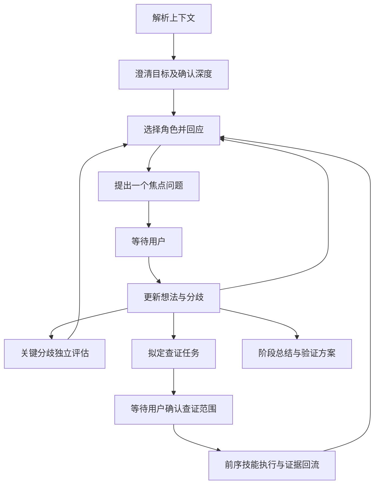

# 研究构想与假说推敲技能设计稿

状态：PENDING（设计提案，未实现、未安装）  
日期：2026-09-12  
拟用名称：`research-idea-debate`  
目标：通过用户每轮参与的多角色讨论，将直觉发展成研究构想，或明确已有想法的依据、边界与验证办法。

## 0. 设计判断（本轮审查结论）

本稿在原设计提案基础上做实施级深化。原稿的双模式骨架、五类角色映射、主持人+质量审查职能分离、单写者事件恢复、IdeaRecord 与 ClaimRecord 分离、gap 先确认后执行这六项判断经核对**成立且与现有实现兼容**，予以保留。原稿的主要缺口不在角色数量，而在**规则的可执行性**：角色边界、调度依据、进展判定、授权失效四处只有原则没有判定条件，实施时仍会退化成"换名字的同一轮提问"。本稿针对这四处补齐判定规则、字段和验收方式。

### 0.1 保留、调整、删除

| 处置 | 项 | 理由 |
|---|---|---|
| 保留 | 探索（explore）/ 推敲（examine）双模式 | 对应两类真实起点，且模式切换仅改调度不重建会话 |
| 保留 | 五类苏格拉底提问映射五个组织角色，主持人与质量审查为职能而非第六、第七类提问 | 与用户已确认的角色设计方向一致 |
| 保留 | IdeaRecord 独立于 ClaimRecord | 现有 `schemas/claim_record.schema.json` 强制 `paper_id`，用户直觉没有论文来源，不能污染旧契约 |
| 保留 | 单写者 + 事件重放恢复、gap 先确认后执行、随附证据原则、判定独立性声明 | 与 `shared/core/cross_skill_contract.md` 的证据与授权分离、`shared/execution/artifacts.py` 的原子写入一致 |
| 调整 | Stage 0 的深度确认由"展示三档并等待选择"改为**一问制 + 推荐值 + 已确认来源继承** | 用户已确认"每轮提出一个焦点问题并等待"。原稿的多问配置与该要求冲突（见 0.2 矛盾 1） |
| 调整 | token 预算从执行阈值降为**观测字段**；硬约束改为轮次、评审批次、活跃时长、事件写入数 | 宿主是否提供可靠 token 计量未验证。原稿同时写"不是性能承诺"与"耗尽 token 预算即停止"，口径无法执行（矛盾 2） |
| 调整 | 新增 `maturation`（RAW/DEVELOPING/TESTABLE）与**发展配额** | 原稿两种模式共用同一停止阈值，"过早否定未成形想法"缺少结构性防护（矛盾 5） |
| 调整 | 角色契约新增"贡献类型"列与"负例清单"，主持人新增 P0–P6 调度阶梯 | 回答角色重复、遗漏与调度依据问题 |
| 调整 | 新 schema 落位改为**技能相对引用**，不提根 `schemas/` | `tests/test_doc_consistency.py` 把技能文档中任何 `schemas/<name>.json` 引用解析为仓库根路径，原稿的 `skills/.../schemas/` 布局若按惯例书写会直接导致测试失败（矛盾 4） |
| 删除 | `agents/openai.yaml` | 现有三个技能均无 `agents/` 目录或 YAML 清单，无先例，属无依据新增 |
| 删除 | 对独立 Agent"盲评""互相独立"的强表述 | 同一模型的两次独立任务只表示分别作答，不表示知识来源相互独立。原稿已意识到，但个别措辞仍偏强，本稿统一口径 |

### 0.2 原稿中需要解决的五处矛盾（逐条给出改法，不推翻已确认要求）

| # | 矛盾 | 改法 |
|---|---|---|
| 1 | 已确认"每轮提出一个焦点问题并等待"，但 §4.3 的 Stage 0 要用户在三档深度中作出选择，另 §9 又有预算确认 | 把小节 4.3 改为**单问制**：只问"本次讨论的资源档位"，附推荐值与依据，用户可一句覆盖；其余配置项按上游 `execution_profile`、项目默认或既有会话继承并逐项标注来源。配置问句记 `CONFIGURATION`，不占实质轮次 |
| 2 | §9 声明 token 预算"不是性能承诺"，却把耗尽 token 预算列为停止条件 | 保留声明，删除其执行地位：token 用量只记录 `usage.tokens_observed` 与 `tokens_metering`（MEASURED/ESTIMATED/UNAVAILABLE）。计量为 UNAVAILABLE 时，token 不得作为唯一停止理由 |
| 3 | §10.5、§11 把 `GapRequest` 写成"接入现有接口"，暗示已有对应结构 | 事实核对：现有上游任务包只有 `gap_type/target_skill/reason/suggested_query/date_range/mode`（见 `skills/literature-synthesis/references/knowledge_gaps_and_upstream_loop.md`），没有 `gap_id`、`approval`、范围指纹。适配层是**新增工作项**，本稿在 10.5 与 11.3 明确写出映射关系与实现归属 |
| 4 | §3 把新 schema 放在技能内，与仓库既有规范冲突 | **实施结果（已解决）**：仓库既有测试 `tests/test_contract_closure_v062.py::test_no_skill_local_json_schema_contracts` 明确禁止 `skills/**/*.schema.json` —— 单一真源必须在根 `schemas/`。故三个 schema 落位于 `schemas/research_debate_{session,event,gap}.schema.json`，技能文档按惯例写 `../../schemas/...`，校验器从仓库根读取。`scripts/verify_package_assets.py` 的 `REQUIRED_SCHEMAS` 登记列为 M4 的独立变更 |
| 5 | 两种模式共用"连续两轮无新增即收敛"的同一阈值 | 探索模式增加成熟度阶段门与发展配额：RAW 阶段禁止做评估性裁决，连续两轮无进展时进入 `CHECKPOINT` 而不是判定想法不好 |

### 0.3 两项不得写成既定依赖的假设

1. **`shared/grill_me` 是否可直接复用未验证。** 该模块存在，且含推荐策略、回答解析与状态模型，但它是围绕"多题清单 + 推荐选项 + 一次性确认"设计的，与本技能"每轮单问"的协议不同。本稿不把它写成依赖；实施时先验证其决策维度模型能否只取"单问"路径，否则本技能自建轻量会话状态，仅复用其来源标注与快照约定。
2. **混合 Agent 的独立性上限。** 独立评估只能承诺"分别作答、提交前不共享答案、由确定性规则判分歧"，不能承诺模型层面独立。这条限制写入 SKILL.md 的声明区，并在每次独立评估的输出标签上体现。

---

## 1. 已确认需求与设计建议

本稿是开发与审阅依据。下列“已确认”来自本次对话；其余角色细则、字段、预算和文件组织为本稿建议，不代表用户逐项确认或功能已存在。

| 项目 | 已确认要求 |
|---|---|
| 入口 | 可以只有一句模糊直觉，不要求先有文献 |
| 目标 | 寻找 idea，或推敲已有想法 |
| 参与方式 | 用户每轮与不同角色来回讨论 |
| agent 机制 | 日常主 agent 切换角色，关键节点独立 agent 评估 |
| 提问框架 | 按用户提供图片中的澄清性、探因性、寻果性、比较性、反思性组织五类角色；主持人调度，构想生成与验证设计贯穿其中 |
| 证据缺口 | 先与用户明确查什么、为什么查、影响哪个判断，再启动文献技能 |
| 一致性 | 与寻找文献、提取文献内容、综合比较文献的结构保持一致 |
| 当前范围 | 先交付可审阅设计稿，再据此实施 |

“验证正确性”在科学任务中落实为：检查逻辑、证据支持程度、适用条件与可证伪预测。辩论胜负、角色数量或 agent 一致意见都不能证明经验命题为真。

## 2. 与现有套件的职责边界

| 技能 | 主要问题 | 主要对象 |
|---|---|---|
| literature-discovery-acquisition | 有哪些真实相关文献？ | 文献题录与获取记录 |
| literature-evidence-extraction | 原文实际报告了什么？ | 可追溯证据单元 |
| literature-synthesis | 多篇证据支持什么、为何分歧？ | 跨文献主张及边界 |
| research-idea-debate | 我们可以提出什么解释，怎样区分和检验？ | 用户构想及其修订过程 |

现有综合技能已包含反方辩驳、主张审计与空白识别，新技能不复制这些模块；需要跨文献判断时交给综合技能，再将结果带回讨论。

### 2.1 对象不同的判定：何时必须转出

边界不靠"话题像不像文献"判断，靠**命题对象**判断：

| 用户当前问题的对象 | 归属 | 说明 |
|---|---|---|
| 领域里发生过什么、有哪些文献、原文写了什么、多篇证据支持什么 | 前三个技能 | 本技能不代做检索、抽取、跨文献综合 |
| 我们可以提出什么解释、我的判断依据是否成立、怎样区分与检验 | 本技能 | 即使暂时没有任何文献，也可开始 |
| 我的命题既需要文献对撞，也需要判断它值不值得保留 | 先综合技能，再回到本技能 | 综合技能产出争议地图与适用边界后，在推敲模式中处理用户提案 |

纯事实检索、全文字段抽取、直接撰写综述不走本技能。用户在本技能中提出“先帮我查一下有没有人做过”时，按第 11 节的查证确认流程处理，不在技能内自行检索。

### 2.2 防重复建设对照

| 容易被重复建设的能力 | 已在何处 | 本技能的处理 |
|---|---|---|
| 学术争议九大类型诊断、共识分级、学派图谱 | `literature-synthesis` | 不复制。需要时通过 `SYNTHESIS_REQUEST` 调用，接收争议地图与边界作为证据输入 |
| Devil's Advocate 红队辩驳 | `literature-synthesis` 的 `role/devils_advocate_gatekeeper.md` | 不复用也不复制。**对象不同**：该角色的攻击对象是跨文献综合结论；本技能的攻击对象是用户自己的命题与推理过程。两者结论相同也不共用模块 |
| 研究空白十类识别 | `literature-synthesis` 的 `references/knowledge_gaps_and_upstream_loop.md` | 不复制。本技能的 `open_questions` 是讨论未决项，不是文献空白分类；需要空白识别时转出 |
| 证据单元四级评级与状态标签 | `literature-evidence-extraction` | 不重新定义证据等级。本技能只能引用回流证据的既有字段，另加"与本命题的对齐状态"（见 11.4） |
| 检索式设计、覆盖台账、全文获取 | `literature-discovery-acquisition` | 不复制。本技能只产出查证请求的范围描述 |

两条入口并存：

1. 直觉 → 讨论 → 明确证据缺口 → 用户确认 → 检索/提取/综合 → 继续讨论。
2. 现有文献产物 → 讨论 → 候选研究问题 → 替代解释 → 最小验证方案。

既有文献产物不是强制启动条件；纯事实检索、全文字段抽取或直接撰写综述优先使用原有技能。

## 3. 与前三个技能保持一致的结构

保持核心哲学、上下文解析、执行深度、角色契约、按需加载、分阶段流程、结构化产物、质量门禁、上下游交接九个方面的一致性。仅为实现这些职责创建文件，不复制无关模块。

拟新增文件均以 `D:/ScholarFlow/` 为根，以下是未来实施清单，本轮不创建：

```text
skills/research-idea-debate/
  SKILL.md
  role/
    moderator.md
    concept_clarifier.md
    premise_evidence_examiner.md
    implication_validator.md
    alternative_explorer.md
    reflection_facilitator.md
    quality_gatekeeper.md
  references/
    dialogue_protocol.md
    maturation_and_gates.md
    independent_review.md
    evidence_handoff.md
    convergence_and_recovery.md
  assets/
    session.schema.json
    event.schema.json
    gap_request.schema.json
    session_summary_template.md
    validation_plan_template.md
  examples/
    intuition_to_question.md
    hypothesis_revision.md
  scripts/
    validate_session.py
tests/test_research_debate_contracts.py
```

与原稿的三处差异及理由：

1. 删除 `agents/openai.yaml`。现有三个技能均无 `agents/` 目录与 YAML 清单，该文件没有对应约定，属无依据新增。
2. **（实施结果，已取代原计划）** 三个 schema 最终落在**仓库根** `schemas/research_debate_{session,event,gap}.schema.json`。原计划是下沉到技能内 `assets/*.schema.json` 以绕开引用解析问题，但仓库既有测试 `tests/test_contract_closure_v062.py::test_no_skill_local_json_schema_contracts` **明确禁止** `skills/**/*.schema.json`（单一真源原则），故按 canonical 落位，技能文档用相对路径引用。详见 0.2 矛盾 4。
3. 新增 `references/maturation_and_gates.md`（第 8 节的成熟度守卫需要独立可加载的判定表）与 `schemas/research_debate_gap.schema.json`（原稿只有 session 与 event 两个 schema，但 `GapRequest` 的确认指纹与执行状态同样需要结构校验）。`stage0_grill_me.md` 改名 `dialogue_protocol.md`：本技能的 Stage 0 是单问制，与现有三技能的 `stage0_grill_me.md` 协议形态不同，沿用同名文件会造成"同一规程"的误读。若实施时确认 `shared/grill_me` 的单问路径可复用，再决定是否恢复该文件名。

`SKILL.md` 只放定位、关键约束、流程入口和加载路由。首次加载主文件与 `dialogue_protocol.md`；独立评估时读 `independent_review.md`，补证据时读 `evidence_handoff.md`，收敛或恢复时读 `convergence_and_recovery.md`，涉及成熟度判定时读 `maturation_and_gates.md`。角色文件按当轮需要读取。

沿用 shared/core、shared/context_resolution 的证据与来源原则。新技能的 Stage 0 保留上下文解析—追问—快照，但每次只问一个关键问题；不照搬现有技能一次提出多题的形式。`shared/grill_me` 是否可直接复用其运行代码属未验证假设，见 0.3。

## 4. 两种模式与启动规则

### 4.1 探索模式 explore

适合兴趣、观察、矛盾和模糊直觉。目标是形成少量具有区别的候选解释，明确研究价值、前提、预测和代价。未完成文献查证时，新颖性标为“待核实”，不得宣称首次发现。

### 4.2 推敲模式 examine

适合已有论断或方案。首先明确对象、条件、比较基准与命题性质（描述、关联、因果、方法选择或价值取舍），然后寻找最有力依据、反例和替代解释。价值取舍由用户决定，不能伪装成经验事实裁决。

命题性质必须在首轮明确，因为它决定后续允许的判定类型：

| 命题性质 | 示例 | 允许的判定依据 | 明确禁止 |
|---|---|---|---|
| 描述性 | "这片林分以栎类为主" | 观测记录、抽样设计 | 用机制推理替代观测 |
| 关联性 | "郁闭度与草本盖度负相关" | 相关性证据、混杂控制 | 表述为因果 |
| 因果性 | "郁闭度上升导致草本盖度下降" | 干预、对照或充分的排除性论据 | 仅凭共变升级为因果 |
| 方法选择 | "用样线法优于样方法" | 目标量、误差结构、成本 | 抽象地比较"哪个更好" |
| 价值取舍 | "应该优先保护这块样地" | 由用户决策 | 伪装成经验事实裁决 |

模式可以在用户同意修订任务时切换，保留原问题和切换理由。研究目标不决定执行深度。

### 4.3 Stage 0

1. 提取已知目标、观察、资源约束与已有证据；注明来源，不重复问已知条件。
2. 模糊直觉可先进行简短澄清，不因缺文献而阻塞。
3. 正式展开多轮研究讨论或独立评估前，继承有效深度配置，或展示三档并等待选择。选择深度是配置问题，不与另一实质问题捆绑。
4. 保存启动快照；不要求用户预先给出完整可检验假说，那正是讨论要帮助形成的产物。

**单问制（本轮修订）。** 原稿第 3 条在实施中会同时抛出深度选择、预算确认与实质问题，与"每轮一个焦点问题"冲突。改为：

- Stage 0 只提出的**一个**问题："本次讨论的资源档位"，附推荐值（继承上游 `execution_profile.json` 的 `depth`，否则用标准档）、该档的轮次上限与预估影响范围，以及一句"可直接回复`按推荐`或用一句话覆盖"。
- 其余项（交付格式、日志详略）取项目默认并标注 `[DEFAULTED]`，用户覆盖时才更新。
- 上游已有 `selection.status == "confirmed"` 且 `run_id` 一致时，直接继承并**不再询问**，仅提示"沿用本次流水线标准档"。配置来源记入 `execution.source`。
- 配置问句的 `question_type` 记为 `CONFIGURATION`，不计入实质轮次，但计入资源用量。
- 用户只给了目标而没给起点时，不做"你是想找想法还是想审想法"的二选一提问，而是按内容判断：出现具体主张用推敲模式，只有兴趣或观察用探索模式，并在回复中说明判断依据，用户可一句切换。

**启动快照必含字段**：`mode` 及其判断依据、`maturation` 初值（无成形主张为 RAW）、已确认的深度与来源、已知约束来源标注、`progress_signals`（初始为空）、停止规则版本、是否携带上游证据及指纹。

## 5. 苏格拉底提问框架与角色职责

本节以用户提供图片中的五类提问作为设计输入，角色映射是本技能的工程设计，不宣称该分类是唯一或完整的苏格拉底方法，也不推断图片未提供的作者、出处或有效性证据。

### 5.1 五类讨论角色

| 提问类型 | 角色与role_id | 主要职责 | 焦点问题示例 |
|---|---|---|---|
| 澄清性 | 概念澄清者 concept_clarifier | 明确概念、对象、比较基准，区分观察与解释 | “你说方法更好，具体指哪项表现？” |
| 探因性 | 前提与证据审查者 premise_evidence_examiner | 检查判断依据、隐含前提、推理跳跃与证据对应关系 | “从这个观察推到结论，依赖哪个尚未验证的假设？” |
| 寻果性 | 推论与验证者 implication_validator | 推导预测、后果与价值，将预测变成可行的观察或比较 | “如果解释成立，我们应该看到什么不同？” |
| 比较性 | 替代解释探索者 alternative_explorer | 生成其他解释或方案，公平比较其解释力、约束与可区分性 | “还有什么解释也可能产生同样的结果？” |
| 反思性 | 观点修订引导者 reflection_facilitator | 回看理解与立场变化、决策价值，保留不变部分与未决问题 | “经过讨论，你会修改原来想法中的哪一部分？” |

探因性既可检查原因，也可检查“为什么这样判断”，不把所有问题都改造成因果研究。寻果性同时覆盖预测、实际后果和研究价值，不能仅问实验。反思性允许用户维持原判断，不能暗示“讨论后必须改口”。

主持人（moderator）负责状态、轮次、角色选择、查证确认和记录；质量审查员（quality_gatekeeper）负责来源、假说标签、授权及未决分歧核查。两者是协调与审查职能，不作为第六、第七类提问，也不默认各启动独立agent。

### 5.1.1 角色职责矩阵（防重复、防遗漏）

五类提问在抽象层面确实会互相覆盖：任何角色都可能问出"你有什么依据"。因此职责不靠提问语气区分，而靠**判断对象 + 越界禁忌 + 典型失效模式**三项锁定。同一争议同时只允许一个所有者角色；需要对抗时指定一个对质角色，避免两个角色问同一件事。

| 角色 | 判断对象 | 越界禁忌 | 典型失效模式（质量审查重点） |
|---|---|---|---|
| 概念澄清者 | 词义、对象范围、比较基准、观察与解释的区分 | 不得在此阶段评价命题对错或要求证据 | 把澄清做成盘问；要求用户先给出精确定义才肯继续 |
| 前提与证据审查者 | 承重前提、推理跳跃、证据与命题的对应关系 | 不得代用户论证；不得在本轮给出验证方案（那是推论与验证者的产出） | 把"我认为不成立"当审查结论；只质疑不给前提清单 |
| 推论与验证者 | 由命题推出的可观察预测、区分条件、后果与代价 | 不得反向重述前提审查的问题（"依据是什么"）；不得在 RAW 阶段要求可证伪形式 | 把验证写成泛泛的"建议进一步研究"；给出无法与替代解释区分的方案 |
| 替代解释探索者 | 竞争解释或方案，及其各自的预测与约束 | 不得只列可能性而不给可区分点；不得为凑数提出明显劣于现有解释的选项 | 生成一堆同义改写；抛出无法检验的"也可能有别的原因" |
| 观点修订引导者 | 理解与立场的变化、保留与修改、未决部分 | 不得暗示必须改口；不得把讨论摘要当成结论宣告 | 变成复述；用"所以你现在明白了吧"式收束 |

若一轮中不同角色会问出语义相同的问题，主持人只保留一个，并把另一个记为"本轮未处理的次要障碍"。

### 5.1.2 角色 = 贡献类型（防退化成换名字的同一问）

为避免五个角色都退化成追问"为什么"，每个角色除提问外**必须**能交付下列具体产物之一。先在回应中提供分析、例子或候选方案，再提出焦点问题——这是硬要求，不是风格建议。

| 角色 | 必须可交付的贡献类型 |
|---|---|
| 概念澄清者 | 2–3 个候选定义或口径；一个能显示差别的最小对照例；标明每种口径下结论会如何不同 |
| 前提与证据审查者 | 承重前提表（前提 / 类型 / 脆弱性 / 判定它需要什么观察）；一个具体反例场景；命题最强版本的复述 |
| 推论与验证者 | 由命题推出的可观察预测；能区分两个解释的最小设计（要区分什么、测什么、什么结果改判）；代价与资源提示（未知标待补） |
| 替代解释探索者 | 至少一个竞争解释，附它自己的预测与它更擅长解释的现象；有领域经验时给出可类比的已知案例 |
| 观点修订引导者 | 修订前后的命题文本对照；保留项 / 修改项 / 未决项三段式；用户决定清单 |

主持人与质量审查同样受"不顺从"约束：主持人不得为了让对话显得有进展而替用户总结出未说过的结论；质量审查员不得以"没发现问题"作为通过理由。

### 5.1.3 角色与标签的不可混用规则

`role_id` 与 `question_type` 按下表逐行对应，禁止交叉组合（例如 `concept_clarifier` 配 `IMPLICATION`）：

| role_id | 中文角色 | question_type |
|---|---|---|
| `concept_clarifier` | 概念澄清者 | `CLARIFICATION` |
| `premise_evidence_examiner` | 前提与证据审查者 | `PREMISE_EVIDENCE` |
| `implication_validator` | 推论与验证者 | `IMPLICATION` |
| `alternative_explorer` | 替代解释探索者 | `COMPARISON` |
| `reflection_facilitator` | 观点修订引导者 | `REFLECTION` |
| `moderator` | 主持人 | `CONFIGURATION`（含查证确认，不计入五类实质提问） |

其余标签规则：

- `CONFIGURATION` 只属主持人，用于深度、查证范围等操作性问题，不计入五类实质提问，也不展示为苏格拉底式追问。
- 用户可见标签只有三种：`角色名 · 视角切换`（主 agent 内）、`角色名 · 独立 Agent 评估`（子 agent）、`角色名 · 视角自检（非独立评估）`（降级）。降级不得借用独立评估标签。
- **角色合并**：当一轮必须同时陈示两个独立评估结果时，允许标签写 `角色A 与 角色B · 独立 Agent 评估`；合并只表示同一轮内的并列陈示，不表示两个角色达成一致。合并轮的焦点问题必须归属于其中一个角色或主持人，并记录 `question_type`，不得同时挂两个类型。
- 每轮标签与实际执行方式必须一致，并写入 `EventRecord.execution_kind`，供验收核对。

### 5.2 构想生成与方法落地

所有角色都可以在提问前给出有帮助的解释、例子或候选方案。替代解释探索者主要承担拓展构想，推论与验证者主要承担验证设计，其他角色按 5.1.2 的贡献类型补充；这些能力贯穿讨论，不新增机械轮转环节。

提供候选想法时标明为AI建议或待验证假说，不暗示用户已经接受。提出方法时说明要区分什么解释；资源、样本量和实验条件未知则标待补。

### 5.3 负例清单：七种必须避免的失效模式

以下每一项都是可在会话事件中检出的具体行为，供质量审查逐条核对：

| 编号 | 失效模式 | 可观察特征 | 修正动作 |
|---|---|---|---|
| N1 | 只问不帮 | 连续两轮回应中无任何贡献类型产物（5.1.2），只有问题 | 下一轮必须先给出候选表述、对照例或方案 |
| N2 | 为反对而反对 | 对每个命题都给出质疑，但说不出该质疑的改判条件 | 质疑必须附"什么条件下这条质疑不成立" |
| N3 | 无依据赞美 | 出现"很有创新性""思路很好"等评价，且无证据或对比依据 | 删除评价；改为说明它相对什么已有做法不同，差异是否待核实 |
| N4 | 诱导式提问 | 问题本身含预设结论或期望答案（"你是不是也认为…"） | 改为并列选项式提问，或先问用户自身判断 |
| N5 | 为显得全面而换角色 | 连续多轮角色轮转但障碍未变，或角色与障碍不匹配 | 按 5.4 阶梯重新选择；允许连续使用同一角色 |
| N6 | 把未成形想法当既定命题审 | 对 `maturation = RAW` 的命题要求可证伪形式或直接判定不成立 | 按第 8 节阶段门处理，先产出候选表述或增加区分 |
| N7 | 把"没找到反例"当成支持 | 出现"未见反例，因此可以认为成立" | 改为"当前尚未识别反例，命题仍为待验证假说"，并说明检索与检验范围 |

### 5.3.1 立场透明（防迎合）

- AI 提出候选、质疑或判断前，先声明这是 `AI建议` 还是 `AI判断`，并给出改判条件。
- 用户提出主张时，先复述并请其确认理解，再给评价；不得用"你说得很有道理"作为过渡语（属 N3）。
- AI 不得把自己的选项列为推荐答案诱导用户选择；用户说"按你说的办"时，需回问一次"你确认这是你的判断吗"，并把该决定记为 `author = USER`。
- 讨论中若用户改变立场，记录改变理由；用户坚持原判时同样记录，不做二次劝说。

### 5.4 主持人调度：优先级阶梯

调度依据不是"五类还没走完"，而是当前**最大障碍**。每一轮按 P0 → P6 取第一个命中项；同一轮只处理一项，其余记为"本轮未处理的障碍"。

| 优先级 | 触发条件（可观察） | 采用视角 | 本轮必须产出 |
|---|---|---|---|
| P0 | 用户直接提问、纠正误读、要求换角色/暂停/总结 | 无（主持人直接回应） | 回答该问题；不叠加新的焦点问题；P0 不新增实质轮次 |
| P1 | 核心概念、对象范围或比较基准未定义，且影响后续判断 | 概念澄清者 | 2–3 个候选口径 + 各口径下的结论差异 + 一个焦点问题 |
| P2 | 存在一条承重前提，未被检验但决定命题是否站得住 | 前提与证据审查者 | 承重前提表（含脆弱性）+ 最强反例场景或“暂未找到”的诚实结论 + 一个焦点问题 |
| P3 | 命题已有可陈述形式，但没有预测，或没有说明什么结果会改判 | 推论与验证者 | 一条可观察预测 + 最小判别设计草案（未知参数标待补）+ 一个焦点问题 |
| P4 | 只有单一解释，且该解释的代价高（涉及新数据采集、昂贵方法） | 替代解释探索者 | 至少一个竞争解释及其预测 + 可区分点 + 一个焦点问题 |
| P5 | 出现方向级分歧，或用户要求收敛前做反例检查 | 启动独立评估（第 7 节） | 两个隔离评估结果 + 分歧判定（11.3）+ 一个判别问题交回用户（11.4） |
| P6 | 阶段完成，或连续两轮无进展信号（6.1 / 6.2） | 观点修订引导者 | 修订前后文本对照 + 保留/修改/未决三段 + 一个焦点问题 |

补充规则：

- **用户关注插队**：用户明确表示想谈的方向覆盖阶梯顺序，但主持人必须记录"本轮未处理的高优先级障碍"，在后续轮次或阶段小结中回收，不能静默丢弃。
- **概念歧义优先**只在歧义确实影响后续判断时适用；若用户关心的是方法可行性，而术语歧义不影响该判断，则直接处理当前障碍（不机械走 P1）。
- **不按顺序轮转**：允许连续多轮使用同一角色；某维度已在上下文或上游产物中解决时直接跳过；快速档也不要求覆盖五类。
- **阶梯与执行深度无关**：调度优先级说明"先处理哪个障碍"，执行深度只决定资源上限；快速档同样先取最高优先级障碍。
- **记录字段**：每次提问记 `trigger`（命中的障碍类型）、`intent`（本轮打算消除的障碍）、`reason`（为什么这一视角能消除它），写入 `QUESTION_ASKED`，供恢复与验收核对。

### 5.5 单轮对话协议

每轮指"一个焦点问题 + 一次用户回答"。固定骨架（可机械检查）：

1. **回应**：用不超过两句回应用户上一条内容；确实无新内容可回应时，显式写"跳过回应"。
2. **标签**：`角色名 · 视角切换` / `角色名 · 独立 Agent 评估` / `角色名 · 视角自检（非独立评估）`，三者不可混用；两个独立评估同轮陈示时按 5.1.3 的合并写法。
3. **一条实质贡献**：按 5.1.2 的贡献类型给出分析、例子、候选表述或方案，并标明来源（`用户观察` / `AI建议` / `待验证假说` / `已有证据` + 引用）。
4. **一个焦点问题**：恰好一个；用一句话说明它为什么值得问（要消除哪个障碍）。
5. **等待**：终止回复，等待用户。

**确认型与评审型轮次（本轮补充，用于消除实施歧义）**：

- **查证确认轮**：主持人陈述缺口、计划查什么、结果会改变哪项判断，并以**一个问句**请求确认范围（`question_type = CONFIGURATION`）。它占一轮，但不属于五类实质提问，也不计入"实质轮次"上限的实质部分（见 §9 的轮次语义）。
- **独立评审轮**：主持人可以用一个问句询问是否启动独立评估（如"是否要我再听一个不同意见？"），用户同意后在本轮内启动并陈示结果。**独立评估的启动、提交与分歧判定都不是用户轮次**，不得在等待用户回答期间自行推进多轮。
- 两类轮次同样只允许一个问句；不得借确认之名夹带第二个实质问题。

焦点问题的合格条件（全部满足才允许发出）：

- 只含一个问句，不含"以及""另外""顺便"等并列引导的子问题。
- 落在用户可直接回答的范围（自身观察、判断、取舍），不要求用户提供其不具备的文献或数据。
- 答案会改变至少一项：某条前提的状态、某个解释的可区分性、某个决定或某个后续动作。若答什么都不改变判断，则该问题不配作为焦点问题。
- 不使用诱导式前缀（N4），不使用赞美式过渡（N3）。

分支处理：

| 用户行为 | 处理 |
|---|---|
| 反问术语或质疑角色选择 | 先回答该问题，本轮不新增焦点问题，不新增轮次 |
| 回答"不知道" | 提供 2–3 个具体例子或选项帮助回答，标注为AI建议；记 `open_questions` 一条；不替用户作答，不据此升级命题状态 |
| 跳过或拒绝回答 | 记未决，可换分支；不自动填答案，不反复追问同一问题（连续两次即挂为 `STOPPED_QUESTION`） |
| 要求换角色或换话题 | 立即执行，不完成原追问队列 |
| 要求总结或暂停 | 立即进入 `CHECKPOINT` 或 `PAUSED`，不先补完当前问题 |
| 用户给出与已有证据冲突的说法 | 如实指出冲突及来源，标为待核对，不因用户坚持而升级为证据 |

## 6. 状态与停止条件



会话状态枚举：`CONTEXT_RESOLUTION / WAITING_DEPTH / DISCUSSING / WAITING_USER / INDEPENDENT_REVIEW / WAITING_GAP_CONFIRMATION / WAITING_EVIDENCE / CHECKPOINT / PAUSED / CLOSED`。

关键转换规则：
- 没有新的用户回答，不从 WAITING_USER 自动进入下一轮讨论。
- gap 未确认不得进入 WAITING_EVIDENCE；拒绝查证可回到带缺口的讨论。
- CHECKPOINT 是阶段小结，不自动宣告问题解决；用户可继续或结束。
- 用户要求暂停立即保存；新证据到达时标记待处理，不自动唤醒或外发通知。
- 用户要求总结、形成可检验方案、预算耗尽，或连续两轮没有进展信号时，进入 CHECKPOINT。判定依据见 6.1，不用单纯轮次计数。
- 关键事实缺失且继续推理依赖猜测时，说明缺口；可继续不依赖该事实的分支，不能强行裁决。
- 同一障碍在同一视角下连续两轮未被消除时，挂为 `STOPPED_QUESTION` 并说明卡点，不换措辞重复追问。

### 6.1 进展信号与进展判定

"有进展"必须有可枚举的证据。以下信号是唯一允许的进展依据，每轮结束后由主持人登记到 `session.progress_signals` 与事件 `PROGRESS_SIGNAL`：

| 信号 | 含义 | 可核对证据 |
|---|---|---|
| `INTUITION_FORMULATED` | 模糊直觉变成可陈述的命题 | 出现一条有主谓的命题文本 |
| `QUESTION_SHARPENED` | 问题更精确或范围收窄 | 前后两版问题文本对照 |
| `PREMISE_SURFACED` | 隐含前提变为显式 | 新增 assumption 记录 |
| `PREMISE_VERIFIED` / `PREMISE_CONTRADICTED` | 前提状态改变 | 附证据引用或推理依据 |
| `DISCRIMINATION_ADDED` | 新增可区分两个解释的预测 | predictions 记录含 `distinguishes_from` |
| `ALTERNATIVE_ADDED` | 新增竞争解释 | alternatives 记录 |
| `DISPOSITION_DECIDED` | 对某想法作出保留/修订/否定/搁置决定 | decisions 记录且 `author` 明确 |
| `DECISION_RECORDED` | 记录一项影响后续动作的用户决定 | decisions 记录 |
| `GAP_CONFIRMED` | 确认了一项查证范围 | `approval.status = CONFIRMED` |
| `EVIDENCE_IMPORTED` | 证据回流并完成对齐判定 | evidence_links 更新 |

- **一轮有进展** = 该轮新增至少一个信号。
- **无进展轮** = 无新增信号，且 `pending_question` 所指障碍未发生变化。
- 用户仅表示"知道了""继续"而没有新信息时，记为无进展轮，不记为进展。

### 6.2 停止规则

停止不是"轮次用完"，而是下列可观察条件之一成立：

| 编号 | 条件 | 动作 |
|---|---|---|
| S1 | 连续 2 轮无进展信号 | 进入 `CHECKPOINT`，并具体说明卡在哪条障碍、缺什么信息；禁止笼统写"没有进展" |
| S2 | 同一障碍在同一视角下 2 次未消除 | 挂为 `STOPPED_QUESTION`，保留问题与已知信息，转到其他分支 |
| S3 | 焦点问题所依赖的信息用户不具备（用户明确表示不知道且给不出估计） | 停止追问该点，改为提供候选选项或转出查证 |
| S4 | 用户要求暂停、总结、收敛或换深度 | 立即执行，不补完当前问答 |
| S5 | 任一硬上限（轮次、评审批次、活跃时长、事件写入数）到达 | 收尾：输出阶段小结与待办，不自动扩额 |
| S6 | 达到阶段交付条件（候选解释比较完成、验证方案成形或用户决定结束） | 进入 `CHECKPOINT`，由用户决定继续或结束 |

**S1 判定口径（实测补充，避免歧义）**：

- 只看**实质轮次**（`SUBSTANTIVE` / `EXTERNAL_INPUT` / `REVIEW_SUBMISSION`），配置轮与检查点轮不参与计数。
- 唯一判据是「该轮是否**新增**了 §6.1 的信号」；一轮里出现新的决定或新的未决项但**未登记新信号**，仍按无进展计。
- 收尾轮（`CHECKPOINT`）即便带来新的三段式内容，也**不倒推**为进展；收尾之后的会话不再触发 S1。
- 会话结束后补记的信号不改变当时判定；若补记导致判定改变，必须在事件里说明补记时间与原因。

停止原因必须记录且互斥：`USER_CLOSED / CHECKPOINT_REACHED / NO_PROGRESS / BUDGET_EXHAUSTED / PAUSED / USER_SWITCHED_MODE`。恢复时按原因呈现不同简报（见 12.3）。
### 6.3 未决问题的保留方式

- 未决问题双写：会话级 `session.open_questions` 与想法级 `IdeaRecord.open_questions`；被停止的追问另记 `STOPPED_QUESTION` 事件，含原问题、卡点、已知信息。
- `CHECKPOINT` 不宣告问题解决，也不把未决项写成"待未来研究"式套话；每条未决项需写明：是什么、缺什么、什么信息能让它继续。
- 用户选择结束时，未决项随阶段小结一并交付，恢复会话时优先呈现，不重新问询。

## 7. 混合 agent 机制

默认由主 agent 切换视角。以下节点可在已确认预算内启动独立评估：重大方向分歧、收敛前反例检查、用户要求独立挑战。每次先简短说明评估目标及范围，不为已授权预算内的常规调用重复询问。

每次建议两个独立评估任务；从五类角色中按争议选择，不固定正反，也不为五类视角常驻五个agent。例如关键推理分歧由前提与证据审查者检查论证、替代解释探索者寻找竞争解释；方案收敛可由推论与验证者检查可检验性，另一角色检查尚未解决的关键障碍。共同输入包括命题版本、用户约束、原始证据引用及明确标记的假设。隐藏其他评估者结论，不提供主持人的预期答案；用户偏好如与可行性有关则明确保留。

评估者输出：最强解释、依赖的前提、关键反例、区分解释所需证据、愿意改变判断的条件，以及证据引用。先分别提交，后由主持人比较；必要的交叉回应不能再称盲评。

角色间可以进行有界质询，例如推论与验证者要求替代解释探索者说明两个解释的不同预测。同一批评估最多增加一轮交叉回应，并计入预算；随后由主持人概括分歧，选择一位角色向用户提出一个焦点问题并等待。不得借内部辩论连续推进多轮用户讨论。

主 agent 是会话记录唯一写入者。子 agent 返回结构化结果，不改共享 session 文件、不自行检索、不递归创建更多 agent。独立评估也必须遵守先确认查证问题的规则。

独立 agent 不可用或失败时，记录 `UNAVAILABLE/FAILED`；主 agent 可明确降级为视角自检，但不得伪造独立评审通过。用户要求独立评估作为收敛前提时，降级结果不能满足该条件。

### 7.1 输入包（白名单，不多给）

每个独立评估任务收到一份自包含输入包，字段固定。**允许**提供：

| 字段 | 内容 |
|---|---|
| target | `idea_id` + `version` + 逐字命题文本（不得由主持人改写润色） |
| user_constraints | 用户已声明的资源、对象、范围约束，标注 `[USER]` |
| evidence_refs | 原始证据引用（`evidence_id`、来源文件、对齐状态），不含主持人的解读 |
| assigned_lens | 指定的一个视角（`role_id`）与其职责说明 |
| answer_format | 输出字段与取值枚举要求 |

**禁止**提供：其他评估者的结果；主持人的倾向、预期答案或结论草稿；主持人的历史总结与措辞；用户对某结论的偏好表述（若与可行性有关，只保留客观约束）。评估者不得自行检索、不得调用其他技能、不得创建子 agent。

### 7.2 输出包（结构化，只收可审阅理由）

| 字段 | 取值 |
|---|---|
| task_id / input_idea_version | 用于核对评估对象，防止对旧版本作答 |
| verdict | `SUPPORTED / CHALLENGED / BOUNDED / INSUFFICIENT` |
| load_bearing_premises | 数组，每项含前提文本、脆弱性（HIGH/MEDIUM/LOW）、判定它需要什么观察 |
| strongest_counterexample | 具体场景 + 反例类型（逻辑矛盾/已知反例/边界失效/替代解释解释力更强）+ 可观察结果；找不到时写 `NONE_FOUND` 并说明所查范围 |
| discriminating_evidence | 能区分竞争解释的证据或观察 |
| change_condition | 什么条件下评估者会改变自己的判断（必填） |
| evidence_refs | 引用到的既有证据 ID；无则空数组 |
| limitations | 本次评估未覆盖的范围 |

只保存可审阅的判断理由，不索取或保存隐藏思维过程。`change_condition` 为空视为输出不合格（`status = PARTIAL`）。

### 7.3 反附和机制

1. **同批隔离**：一批两个任务并行启动，提交前互不可见；同批不使用同一视角，也不使用"赞成方/反对方"这类固定分工。
2. **按最大分歧分工**：选择理论上最容易产生不同结论的两个视角（例：前提与证据审查者 × 替代解释探索者；推论与验证者 × 前提与证据审查者）。
3. **确定性分歧判定**（不靠模型自评）。程序比较两份输出后给出 `disagreement_signal`：
   - `LOW_DIVERGENCE` 仅当 `verdict` 相同 **且** 承重前提集合高度重合 **且** 提出同一反例（或同为 `NONE_FOUND`）；
   - 否则为 `HIGH_DIVERGENCE`。
4. **交叉回应上限 1 轮**：只允许补充理由或证据，不允许直接改判；避免一轮内级联趋同。交叉回应计入评审批次与预算。
5. 同一模型的两个独立任务只表示分别作答，**不表示知识来源相互独立**，也不提高证据等级；该限制写入 SKILL.md 声明区并在标签上体现。

### 11.4 分歧交回用户的规则

- `HIGH_DIVERGENCE` 时，主持人必须：分别陈示双方最强理由与各自 `change_condition`；给出**一个**能区分双方判断的问题交给用户；不投票、不取平均、不写"综合来看"式调和结论。
- `LOW_DIVERGENCE` 时，仍需说明分歧未出现，但**不得**表述为"评估通过"或"命题成立"；结论仍是待验证假说或未决。
- 若分歧源于对命题本身的读法不同，先回到概念澄清者统一口径，而不是继续增加评估者。
- 独立评估的输入版本与产出必须可在事件中追溯（`REVIEW_REQUESTED` / `REVIEW_RETURNED` 记录 `input_idea_version`）。

### 7.5 失败与降级

| 情况 | 行为 |
|---|---|
| 子 agent 工具不可用 | 记 `UNAVAILABLE`，不启动；明确告知用户本轮无独立评估 |
| 子 agent 超时或返回不合格 | 记 `FAILED` 或 `PARTIAL`，最多重试 1 次，仍失败则降级 |
| 降级为视角自检 | 只能在主 agent 内完成，标签写 `视角自检（非独立评估）`；不得进入 `LOW_DIVERGENCE` 判定，也不得用于满足"收敛前独立评估"这一前提 |
| 一个成功一个失败 | 展示成功的一份，如实说明缺少对照；不得据此宣称分歧已检查 |
| 用户把独立评估设为收敛前提 | 独立评估不可用时，收敛条件不成立，需用户重新决定 |

## 8. 成熟度守卫：探索与推敲的推进方式

### 8.1 三阶段与独立维度

每条想法带一个成熟度阶段，与证据状态、处置状态**互相独立**，不互相派生：

| 阶段 | 判定特征 | 允许的下一步 | 明确禁止 |
|---|---|---|---|
| `RAW` 原始直觉 | 只有兴趣、观察或模糊倾向，尚无可陈述的命题 | 澄清、给出候选表述、举对照例、增加一个可区分差异 | 判定成立与否、要求可证伪形式、做正反裁决 |
| `DEVELOPING` 发展中 | 已有可陈述命题，但前提、预测或替代解释不完整 | 前提审查、补预测、生成替代解释、寻找边界 | 要求完整验证方案；以"不完整"为由否定 |
| `TESTABLE` 可检验 | 命题有明确对象、条件与至少一个可观察预测 | 构造最小判别设计、找反例、比较替代解释 | 把设计草案当作已执行结果 |

成熟度只升不降，但用户修订命题时可以回到 `DEVELOPING`，且必须记录回落理由。`maturity_history` 必须从 `RAW` 起、逐级连续（每一段的 `from` 等于上一段的 `to`），且终点等于当前 `maturation`；无历史时 `maturation` 只能是 `RAW`。

### 8.2 发展配额（防过早否定）

- `RAW` 阶段至少经历 **2 轮发展**；**发展配额只约束 P3**——首次要求命题给出可观察预测/可证伪形式的那一步。P2 前提审查与 P4 替代解释属生成性动作，可在 RAW 阶段先行，不因命题尚未成形而被阻止。
- **「发展信号」的确定集合**（配额计数只认这四类，见 §6.1）：`INTUITION_FORMULATED`（命题成形）、`QUESTION_SHARPENED`（问题收窄）、`PREMISE_SURFACED`（隐含前提显式化）、`DISCRIMINATION_ADDED`（新增可区分差异）。`ALTERNATIVE_ADDED` **不计入**——补一条替代解释不改变原命题本身的可检验性。
- **配额检查由确定性程序在每轮结束后执行**，不依赖主持人自检：实测中首次 P3 提前发生而主持人自检未发现，说明自检不足以承担该项核对（见 §14.7）。
- 发展配额用尽但仍无可陈述命题时，不判"不成立"，而是记为未决并询问用户是否换角度；连续两次如此则触发 S1。
- 评估必须针对命题的**最强版本**。若为主持人便于讨论而替换成简化版，必须显式标注：“以下讨论的是简化版 X，不是你的原话。”
- 反对意见必须定性，三者互斥：
  - `FATAL`：命题在当前形式下不可能成立（须给出逻辑或已知事实依据）；
  - `ADJUSTABLE`：可通过限定条件、改口径或补设计修复（**必须给出具体改法**，只写"存在问题"不允许结轮）；
  - `UNRESOLVED`：当前信息不足以判断，转入未决或查证。
- `ADJUSTABLE` 与不可行导致的搁置都不得写成"科学上被否定"。

### 8.3 两种模式的推进路径

| 模式 | 路径 | 代表性问题 |
|---|---|---|
| explore | 含糊 → 候选表述 → 差异化 → 最小区分 | "这个方向可以变成哪个可讨论的命题？" / "哪种观察能把它和另一个方向分开？" |
| examine | 命题化（性质+基准）→ 承重前提 → 反例 → 替代解释 → 判别方案 | "这条推理依赖哪个未验证前提？" / "什么结果会让你改判？" |

explore 模式下，`DISCRIMINATION_ADDED` 与 `INTUITION_FORMULATED` 是最重要的进展信号；examine 模式下，`PREMISE_SURFACED` 与 `DISPOSITION_DECIDED` 最重要。这不改变 6.1 的判定方式，只用于主持人选视角时的侧重。

**收尾前检查**：进入 `CHECKPOINT` 前，主持人必须核对「本会话是否至少一次进入 P3」；未进入则命题仍在 `DEVELOPING`，小结中不得声称已形成可检验形式或最小验证方案（检查器规则 `ST7`）。

### 8.4 内部一致性守卫（不含新证据）

以下检查不依赖外部检索，可在每轮自检：

- **命题身份保持**：焦点问题必须引用某个 `idea_id@version`；修订后重问旧版本内容视为错误。
- **资源可行性**：提出方案前先核对用户已声明的资源约束；超出时标注"超出已知资源"并询问，不默认可行。
- **逻辑一致**：同一会话内两条命题互相矛盾时，必须显式指出并提请用户裁决，不静默替换。
- **禁止伪造证据**：任何未被引用的数据、文献、参数一律标为待补或待验证，不得用看似合理的数值填空。

## 9. 执行深度与预算控制

### 9.1 硬约束（可测量，可判超限）

| 深度 | 讨论轮次上限 | 独立评估批次上限 | 单批子任务上限 | 活跃时长上限 | 事件写入上限 | 阶段交付 |
|---|---:|---:|---:|---:|---:|---|
| 快速 quick | 4 | 1 | 2 | 600 秒 | 120 | 一个核心问题及主要风险 |
| 标准 standard | 8 | 2 | 2 | 1800 秒 | 400 | 候选解释比较与验证方案 |
| 深度 deep | 16 | 3 | 2 | 3600 秒 | 1200 | 多分支推敲、反例复审与完整演变记录 |

- 上表为**待标定参数**，不是性能承诺，也未实测。实施 M1 结束后应按真实会话记录回归修正。
- 语义：轮次 = 一个焦点问题及对应用户回答；`CONFIGURATION` 问句、术语解释、用户反问不占新轮次，但计入事件与时长。
- 活跃时长只计主 agent 与子任务实际运行时间，不含等待用户回答与外部检索时间；计量来源必须记录（`MEASURED` / `ESTIMATED` / `UNAVAILABLE`）。
- 预算是上限而非配额，不为用满预算制造分歧。任何硬约束到达即执行 S5。

### 9.2 观测字段（不作为硬判据）

- `usage.tokens_observed` 与 `usage.tokens_metering`：token 用量只作观测记录。
- 宿主无可靠 token 计量时记 `UNAVAILABLE`，且**不得**以 token 作为唯一停止理由；需要停止时使用轮次、批次或时长。
- 不声称 token 硬限已验证；不把估计值写成实测值。

### 9.3 继承与扩额

- 上游已有 `selection.status == "confirmed"` 且 `run_id` 一致时，可继承其深度值并标注 `RUN_PROFILE_INHERITED`，不重复询问。
- **资源授权不随证据转移**：上游文献与证据可继续使用，但上游的资源授权不自动适用于本会话；本会话的轮次与批次上限独立确认一次（Stage 0 单问）。
- 新增讨论开销是否计入同一总预算必须明确；默认**不并入**上游预算，也不自动增加原预算。
- 耗尽任何硬约束即保存部分结果与待办，不自动扩额；用户主动加额时记为新的确认，并写入 `execution.selection.reason`。

## 10. 数据契约（拟新增 v0.1）

### 10.1 会话存储与来源

拟用路径：`runs/<run_id>/research-debate/<session_id>/`，包含 `session.json`、`events.jsonl`、阶段 `summaries/`，以及阶段交付时的 `report.html`。JSON 是恢复与交接依据；Markdown 用于阅读，HTML 在阶段交付时生成。用户可覆盖交付格式，不每轮重建报告。

与现有 run bundle 的关系：`runs/<run_id>/` 已由 `shared/execution/artifacts.py` 管理 `execution_profile.json`、`protocol_snapshot.md`、`execution_receipt.json`、`pending_work.json` 四个文件，写入方式为同目录临时文件 + 原子替换。本技能**不新建运行根**，会话目录作为子目录嵌入同一 run。恢复时两类一致性都要检查，但**归属不同**：run bundle 的 `run_id` 对账由现有 `load_run_artifacts` 负责（本技能不重复实现），会话自身的 `last_applied_event_id` 重放由 `SessionStore` / `session_store_cli.py recover` 负责；恢复时把两者结果并列呈现，任一不一致都须报告，不得择一采信。

一致性优先级：`events.jsonl` 是**追加式真源**，`session.json` 是检查点快照。两者不一致时以事件重放结果为准，并显式报告差异（差异内容、涉及事件 ID、修复动作），不静默选边。

`schema_version` 固定 `"0.1"`。所有新 schema 使用 JSON Schema 2020-12。ID 在会话内唯一、跨记录可解析；日期未知用 null，不补造。缺少科学信息允许 null 或明确待补，缺少必要结构字段则验证失败。

**schema 落位（实施结果）**：三个 schema 为 canonical，位于根 `schemas/`：`research_debate_session.schema.json`、`research_debate_event.schema.json`、`research_debate_gap.schema.json`。技能文档以根相对形式引用（`../../schemas/...`），与 `tests/test_doc_consistency.py` 的解析规则一致。校验器 `scripts/validate_session.py` 从仓库根读取 schema，并在环境中存在 `jsonschema` 时额外做一次 schema 校验，否则如实报告"未做"。`REQUIRED_SCHEMAS` 的登记留作 M4 独立变更。

来源类型统一为 `USER / CONTEXT / UPSTREAM / PROJECT / INFERRED / DEFAULTED / SYSTEM_RULE`。来源与事实地位分开：用户陈述不自动成为审定证据。

### 10.2 Session 必填字段

| 字段 | 类型与约束 |
|---|---|
| schema_version, session_id, run_id | 非空字符串，版本固定 0.1 |
| revision | 从 1 开始的整数，写入前核对旧版本 |
| mode, state | explore/examine；状态使用第 6 节枚举 |
| original_prompt, current_question | 用户原始表达与当前问题，字符串 |
| execution | depth、selection_status、source、budget、usage；budget 含 max_rounds / max_review_batches / max_subtasks_per_batch / max_active_seconds / max_events；usage 含已用量、`active_seconds_metering`、`tokens_observed`、`tokens_metering` |
| upstream_refs | 数组，可空；每项含 skill、artifact_path、schema_version、record_ids、内容指纹 |
| ideas | IdeaRecord 数组，可空 |
| decisions | 决策数组，可空；含 id、idea_id、idea_version、action、reason、author、user_confirmation、event_id |
| pending_question | null 或 question_id、role_id、question_type、trigger、intent、selection_reason、text、target_idea_id、target_version |
| progress_signals | 数组，可空；每项含 signal、round、event_id、evidence（信号对应证据，见 6.1） |
| stopped_questions | 数组，可空；每项含 question_id、障碍描述、已知信息、停因（S1/S2/S3） |
| gap_requests | GapRequest 数组，可空 |
| stop_reason | null 或 S1–S6 对应的枚举值 |
| last_applied_event_id | 字符串或 null，用于恢复 |

`execution.selection_status` 为 pending/confirmed；预算与用量非负，未知 token 量写 null，不能用 0 冒充。`author` 必须区分 USER、AI 与外部意见来源；外部意见保留引用，不升级为用户决定。

### 10.3 IdeaRecord

必填：`idea_id, version, parent_version, proposition, origin, epistemic_status, maturation, disposition, assumptions, alternatives, predictions, evidence_links, open_questions`。

- version 正整数；parent_version 可为 null；修订追加新版本，不覆盖旧命题。修订必须记录 `revision_reason` 与触发事件。
- epistemic_status：`INTUITION / HYPOTHESIS / EVIDENCE_SUPPORTED / EVIDENCE_CHALLENGED / UNRESOLVED`，每次改变需理由及事件引用。EVIDENCE_SUPPORTED 仅指限定命题在给定证据下获支持，不表示普遍正确。
- maturation：`RAW / DEVELOPING / TESTABLE`，与 epistemic_status、disposition 三者互相独立、不互相派生；回落须记理由（见 8.1）。
- disposition：`ACTIVE / RETAINED / REVISED / REJECTED / DEFERRED`，与证据状态独立。因不可行而搁置，不等于科学上被否定。
- assumptions：数组，每项含 text、origin、`type`（`EMPIRICAL / DEFINITIONAL / METHODOLOGICAL / VALUE`）、verification_status（UNVERIFIED/VERIFIED/CONTRADICTED）、source_refs、以及 `decided_by`（当 type 为 VALUE 时必填，只允许 USER 或外部意见来源）。
- alternatives 与 predictions：数组，每项含 id、text、origin；预测另含 distinguishes_from（解释 ID 数组，允许为空但须在 `open_questions` 中说明为何尚不可区分）。
- evidence_links：数组，每项含 artifact_ref、evidence_id、relation（SUPPORT/CHALLENGE/BOUNDARY/CONTEXT）、alignment（VERIFIED/UNRESOLVED）、reason、`checked_scope`（本次核对覆盖的范围，用于区分"没找到"与"没查"）。
- open_questions：字符串数组；关键未知不填虚构参数。
- 每个评估性判断须带 `change_condition`（什么结果会改变该判断），缺失视为结构不合格。

现有 ClaimRecord 强制要求 paper_id，不能拿它装没有论文来源的用户直觉。IdeaRecord 独立保存，需要时引用原 ClaimRecord 和 EvidenceRecord，不伪造论文 ID。

### 10.4 EventRecord

必填：`schema_version, event_id, session_id, seq, type, actor, execution_kind, payload, source_refs, created_at`。

type 至少包含 USER_INPUT、ROLE_RESPONSE、QUESTION_ASKED、SELECTION_REASON、PROGRESS_SIGNAL、IDEA_REVISED、REVIEW_REQUESTED、REVIEW_RETURNED、DISAGREEMENT_ASSESSED、DEGRADED_REVIEW、GAP_PROPOSED、GAP_CONFIRMED、GAP_REJECTED、EVIDENCE_IMPORTED、STOPPED_QUESTION、CHECKPOINT、PAUSED。

execution_kind 为 `USER / ROLE_SWITCH / INDEPENDENT_AGENT / SELF_CHECK`。`INDEPENDENT_AGENT` 仅用于真实子 agent；降级自检必须记 `SELF_CHECK`，且同一事件的 `payload.degraded = true`。

独立返回 payload 必须含 task_id、input_idea_version、status、verdict、load_bearing_premises、strongest_counterexample、discriminating_evidence、change_condition、evidence_refs、limitations；status 为 COMPLETE/PARTIAL/FAILED/UNAVAILABLE，`UNAVAILABLE` 时其余科学字段允许为空数组。只保留可审阅的判断理由，不索取或保存隐藏思维过程。

`DISAGREEMENT_ASSESSED` 的 payload 含 batch_id、verdicts、premise_overlap、counterexample_overlap、`disagreement_signal`（LOW_DIVERGENCE/HIGH_DIVERGENCE/NOT_APPLICABLE）与 `computed_by`（必须为确定性程序，不填模型 ID）。缺任一评估者时 `disagreement_signal = NOT_APPLICABLE`，禁止推定 LOW。

QUESTION_ASKED 的 payload 包含 question_id、text、role_id、question_type、trigger、intent、selection_reason、target_idea_id、target_version；用户回答通过 reply_to_question_id 关联。question_type 为 CLARIFICATION / PREMISE_EVIDENCE / IMPLICATION / COMPARISON / REFLECTION / CONFIGURATION；最后一项仅用于主持人的深度选择、查证确认等操作问题，不属于第六类苏格拉底提问。五类实质问题与 5.1 的 role_id 按表中顺序一一对应；CONFIGURATION 对应 moderator。`trigger` 记录命中的调度阶梯项（P1–P6），`intent` 记录本轮打算消除的障碍，`selection_reason` 记录为何该视角能消除它。两者都只记录可审阅理由，不保存隐藏思维过程。

ROLE_RESPONSE 和 REVIEW_RETURNED 也记录 role_id，独立评估输入同时记录指定视角。IDEA_REVISED 引用前后版本和修订原因。重复 event_id 不得再次应用；恢复后使用保存的待回答问题、角色与 target_version，不重新随机分配。实现时校验：角色与问题类型映射、QUESTION_ASKED 与 pending_question 的一致性、target_version 是否等于该 idea 的当前版本、以及 `SELF_CHECK` 与 `INDEPENDENT_AGENT` 标签是否与实际执行方式一致。

### 10.5 GapRequest 与确认范围

必填：`schema_version, gap_id, idea_id, idea_version, gap_type, target_skill, question, reason, decision_impact, scope, approval, execution_status, result_refs`。

- gap_type：SEARCH_GAP / EXTRACTION_GAP / SYNTHESIS_REQUEST；第三种是新技能内部请求类型，不声称现有综合 schema 已定义。
- scope：包含检索主题/对象/范围，或 target_papers/required_fields，或待综合的 evidence_refs/target_claim；无关字段不填。
- approval：status=PENDING/CONFIRMED/REJECTED/INVALIDATED，confirmed_event_id 可 null，scope_fingerprint 必填。
- execution_status：NOT_STARTED/RUNNING/COMPLETE/PARTIAL/FAILED；result_refs 初始为空。
- blocking：`BLOCKING / RECORDED`，区分"当前判断依赖它"与"只影响确定性"（见 11.1）。

用户确认绑定具体问题、范围、目标技能与预算引用的指纹。更改这些内容须失效旧确认；仅修正排版不需要重新确认。相同 gap_id 加相同指纹重试不得重复派发已完成任务。

**旧载荷映射（新增实现，不是既有接口）**。与 0.2 矛盾 3 对应：目标技能目前的输入是任务包示例（`gap_type / target_skill / reason / suggested_query / date_range / mode`），没有确认与指纹字段。适配层按下表做单向映射，仅填相关字段，保留原始 GapRequest 与映射记录，不反向覆盖原文件：

| GapRequest 字段 | 映射到目标技能载荷 | 备注 |
|---|---|---|
| gap_type | 同名 | SYNTHESIS_REQUEST 需映射为综合技能的检索/抽取缺口或直接以任务描述传入；该映射在 M3 用隔离 fixture 验证 |
| target_skill | 同名 | 由 gap_type 决定，用户确认时可见 |
| question + scope | suggested_query / target_paper / required_fields | 只传完成任务所需上下文，不写入会话原文 |
| decision_impact | reason | 供目标技能理解用途，不作为其内部判断依据 |
| idea_version + scope_fingerprint | 不映射 | 仅存于本技能记录，用于幂等与授权失效 |
| execution_status | 不映射 | 由本技能根据回流结果更新 |

不得将旧文档示例中的 `mode=deep` 当成自动深度选择：它是任务包示例字段，不构成资源授权。

## 11. 查证判定、交接与证据回流

### 11.1 何时需要文献

判断依据是**可推进性原则**：如果当前判断最终必须由外部经验事实决定，才需要查证；否则留在概念讨论内完成。

| 情形 | 处理 |
|---|---|
| 命题的成立与否取决于领域内已有什么证据、测量口径或既有结论 | 记 `EVIDENCE_NEED`，按 11.2 提出查证 |
| 分歧在于定义选择、价值取舍、逻辑一致性，或可由已知事实直接推演 | 留在概念讨论，不启动检索；主持人应说明"这一点我们自己能定" |
| 证据缺口是当前结论的唯一障碍 | `blocking = BLOCKING`，需用户确认后查证 |
| 缺口只影响确定程度或后续方案的精细度 | `blocking = RECORDED`，记为待核实，不阻塞讨论 |
| 用户已在项目中具备可回答该问题的产物 | 优先复用（10.4 第 3 步），不为已有材料再发起检索 |

先确认再检索是硬约束：`approval.status != CONFIRMED` 时禁止调用检索、提取或综合技能。

### 11.2 六步交接流程

1. 主持人说明缺口：“当前争议是什么；准备查什么；不同结果将改变哪个判断”。
2. 等待用户确认范围；若缺少执行深度或新增预算，继续单独确认必要配置（`CONFIGURATION` 问句，不与实质问题捆绑）。
3. 在已有数据可回答时优先复用，仍核对证据与当前命题的匹配。
4. 调用检索、提取或综合技能；只传完成任务所需上下文，不把整段私有对话写入外部检索式。
5. 回流时验证文件可读、schema 版本、记录引用和命题对应关系。结构合法不等于语义证据有效。
6. 新证据可能支持、削弱、限定或无法回答；说明影响，更新相应版本，再向用户提出下一问题。

### 11.3 授权的产生、失效与幂等

- 授权指纹覆盖四项：`question`（要回答什么）、`scope`（范围与对象）、`target_skill`（交给谁）、`budget_ref`（资源引用）。
- 任一改变即 `INVALIDATED`，需重新确认；仅修正排版、改写措辞而不改变范围时不失效（由指纹计算规则保证：对空格与标点归一化后再哈希）。
- 相同 `gap_id` + 相同指纹的重试不得重复派发；已完成任务（`execution_status = COMPLETE`）直接复用 `result_refs`。
- 用户拒绝查证时，`approval.status = REJECTED`，缺口保留在 `open_questions`，可继续讨论不依赖该证据的分支（不因缺证据而中止整个会话）。
- 恢复会话不视为新授权：指纹未变则沿用，指纹缺失或不匹配则回到 `WAITING_GAP_CONFIRMATION`。

### 11.4 回流校验与对齐判定

回流后的每一步都必须可核对：

1. **结构与引用**：文件可读；schema 版本与记录 ID 可解析；引用的 `evidence_id` 在目标文件内存在。任一步失败即拒绝该批导入，报告具体记录，不静默丢字段。
2. **命题对应**：核对回流证据指向的字段或主张是否就是当前命题所需；不匹配时记为 `CONTEXT` 或退回，不做近似替代。
3. **对齐判定**（最容易出错的一步，写成硬规则）：
   - `alignment = VERIFIED` 仅当回流记录的 `verbatim_quote`（或其等价原文锚点）与 `location` 在**命题本身**的层面直接支持该命题。
   - 实体、变量、关键词或方法名的出现、共现、上下文邻近，一律判 `UNRESOLVED`，**不得**升级为支持。
   - `relation` 的取值必须与判定一致：`CHALLENGE` 表示削弱，`BOUNDARY` 表示限定条件（如仅在某区间成立），`CONTEXT` 表示仅提供背景。禁止把 `CONTEXT` 当支持使用。
   - 证据无法回答当前命题时进入 `UNRESOLVED`，不因关键词命中而升级。
4. **影响说明**：证据可能支持、削弱、限定或无助于当前命题；主持人说明它改变了哪一项判断（前提状态、区分能力或决定），并更新对应 `IdeaRecord` 版本。
5. **诚实的空结果**：查不到、无法下载、缺全文、OCR 不确定、未报告参数分别保留各自状态。检索失败不等于不存在研究；没有反证不等于证实；`NONE_FOUND` 必须附 `checked_scope`。

### 11.4.1 跨语言对齐：命题变体机制

**问题**：本技能的用户命题通常是中文，而命中的文献多为英文。对齐判定用「拉丁词元 + 字符 2-gram」比对，跨语言时 2-gram 交集**恒为空**、命题侧覆盖率**恒为 0**，结果落成 `KEYWORD_ONLY`——与「查了但文献确实不支持」完全无法区分。

**为什么不直接放宽阈值**：放宽会把关键词共现重新放进来（§11.4 明令禁止），等于用"看起来像"冒充"支持"。

**机制**：为命题登记**不同语言的变体**（`ideas[].variants`），并在比对时把变体纳入判定链。三条硬约束：

| 约束 | 理由 |
|---|---|
| 只有 `approval.status = CONFIRMED` **且** `confirmed_by = "user"` 的变体可用 | 译文是 AI 产出的**主张**，不是命题本身。若 AI 自译自用，等于自造一个更容易被文献命中的命题来"证明"原命题 |
| 必须有**两条**已确认译文**互相印证**（双向覆盖率 ≥ 0.85） | 拦住"把一种误译当成证据"。只有一条时无法区分"译得对"与"译得偏" |
| `source_text` 必须等于**当前**命题 | 命题一改，旧变体自动失效，避免"命题改了、变体没改"仍能升级 |

**判定链**（`align_against_proposition`，按序先命中先返回）：

| # | 条件 | 结果 |
|---|---|---|
| 1 | 引句直接命中命题（EXACT / OVERLAP） | `VERIFIED`，`variant_status = ALIGNED` |
| 2 | 命中 ≥ 2 条已确认且互相印证的变体 | `VERIFIED`，`quote_match = VARIANT_AGREEMENT`，记录实际使用的 `variant_ref` |
| 3 | 只命中 1 条已确认变体 | `UNRESOLVED`，`PENDING_CONFIRMATION`，如实报最高覆盖率 |
| 4 | 命中多条但互不印证 | `UNRESOLVED`，`VARIANT_DISAGREEMENT`，**交回用户裁决译法** |
| 5 | 只命中未确认 / 已失效变体 | `UNRESOLVED`，`VARIANT_UNCONFIRMED` |
| 6 | 都不命中，但存在同语言变体记录 | `UNRESOLVED`，`PENDING_CONFIRMATION`（待办，不是"不适用"） |
| 7 | 都不命中且无同语言变体 | `UNRESOLVED`，`NOT_APPLICABLE` |

**变体不得改变命题的地位**：变体是同一命题的另一种表述，**不**产生新的 `IdeaRecord` 版本、**不**改变成熟度、**不**进入 `proposition` 字段。它只在证据对齐时充当参照物。

**落地状态（2026-09-12 已实现并实测）**：`shared/execution/debate_handoff.py` 的 `align_against_proposition` / `variant_fingerprint` / `proposition_fingerprint`；`to_evidence_link(..., variants=...)`；`ingest_returns(..., variants=...)` 在 `impact.pending_variants` 与 `counts.pending_variant_confirmation` 里报出待确认条目。实测矩阵见 §14.12。

**未决**：真实会话中「第二条独立翻译」从哪来（用户自己的英文摘要？合作者？）尚未在真实会话里走通——本轮用构造样本验证了机制，**未**声称已获得真实用户确认的变体。

### 11.5 概念讨论与文献讨论的分界示例

- “郁闭度高的林分里草本更少，是因为光不够，还是因为凋落物太厚？”——两个解释都是机制提案，若用户接受"两者都可以先当假说"，可继续概念讨论，不必先查文献。
- “这两篇论文的萌发率结论相反，是因为种子大小不同吗？”——若用户要判断"是否已有研究支持这一解释"，属外部经验事实，需查证；若只是要比较两个解释哪个更可检验，可继续概念讨论。

## 12. 交付、恢复与失败行为

### 12.1 阶段小结与最小验证方案

阶段小结包含：当前问题、候选想法、版本变化与理由、支持/挑战/边界证据、未决分歧、被否定或搁置的想法及原因、进展信号清单、下一步最小验证方案。计划与实际结果分栏，所有未知参数标“待补/待核实”。

最小验证方案必须说明：竞争解释、各自预测、要观察的差异、测量或比较方式、必要资源、混杂风险，以及什么结果会改变判断。缺少条件时保留待补，避免伪精确的样本量或阈值。

**前置条件（实测补充）**：会话收尾时若命题**从未进入 P3**（从未要求过可观察预测或改判条件），不得输出「最小验证方案」，只能输出「尚未形成验证方案，缺的是哪一步」。多 Agent 实跑中出现过这种情形：八轮讨论依次命中 P1/P2/P4/P5/P6 而 P3 一直未触发，命题停在 `DEVELOPING`（见 §14.7）。该条由检查器规则 `ST7` 强制。

### 12.2 失败情况与降级行为

| 失败情况 | 行为 |
|---|---|
| 用户跳过问题 | 记录未决，可换分支；不能自动填答案 |
| agent 相互矛盾 | 由确定性规则判分歧（11.3），呈现共同前提与真正分歧，提出判别问题，不投票 |
| agent 超时或不可用 | 保存部分评估、明确降级并标注 `SELF_CHECK`；受预算限制最多重试 1 次 |
| 用户要求独立评估但工具不可用 | 明确说明降级不满足该前提，由用户重新决定 |
| 上游产物不兼容 | 保存引用与错误，暂停该产物导入，不静默丢字段 |
| 证据已更新 | 标记依赖旧指纹的判断待复核，不覆盖历史 |
| 恢复时有待回答问题 | 按 12.3 简报呈现，不重新进行全套问询 |
| 写入中断 | 以完整事件恢复；不发布损坏快照 |
| 用户要求的动作超出预算 | 说明超出部分，请用户决定加额或收尾，不默认继续 |

### 12.3 恢复与授权范围

**持久化协议**：主 agent 单写；事件先持久化，再将快照写到同目录临时文件并原子替换。用 `event_id` 去重及 `last_applied_event_id` 重放。末尾不完整事件保留隔离副本后忽略该条；若中段损坏则停下并报告，不猜测恢复。并发 `revision` 冲突拒绝覆盖并重新读取。跨恢复记录预算用量与待确认 gap。

**恢复简报模板**（不超过 10 行，按 `stop_reason` 调整末行）：

```text
会话 <session_id>｜模式 explore｜状态 WAITING_USER
当前问题：<current_question>
上一轮：<role_id> 提出「<pending_question.text>」（针对 idea v<version>）
你的最新输入：<最近一条 USER_INPUT 摘要>
待处理：待确认查证 <n> 项；待导入证据 <n> 项；未决问题 <n> 条
预算：轮次 <used>/<max>｜评审批次 <used>/<max>｜活跃 <used>/<max> 秒
可选：1) 回答上述问题  2) 换一个方向  3) 生成阶段小结并结束
```

**恢复后禁止的行为**：

- 重问已在快照或上游产物中确认的信息（目标、约束、深度、已确认的查证范围）。
- 把旧授权用于新范围：指纹不匹配时必须回到 `WAITING_GAP_CONFIRMATION`。
- 用随机或重新分配的角色替换已保存的待答角色与 `target_version`。
- 把恢复本身当作一次新的资源授权（预算沿用原值，不重置、不扩额）。
- 把恢复简报写成完整上下文复述；超过 10 行视为不合格。

**新会话的判定**：用户改变原始问题的语义（不是用词）时开新会话，旧会话保留 `CLOSED` 状态并通过 `parent_session_id` 引用；同一会话内只做范围收窄或措辞澄清。

## 13. 示例对话（全部为虚构演示）

以下两段为展示协议而编写的虚构流程，**不是实证结论，也不构成真实研究证据**。所有用户回答均为虚构，用来说明调度选择与规则落点，不代表任何真实数据、文献或结论。两例都假设已确认标准档、已完成上下文解析，因此省略配置轮次。

格式约定：每轮展示单轮协议的五要素（回应 / 标签 / 一条贡献 / 一个焦点问题 / 等待），并附一行“规则落点”说明该轮触发了哪条规则。五类视角不必每轮走全，示例展示的是调度结果，不是模板顺序。

### 13.1 示例 A：从模糊直觉寻找 idea（探索模式）

**用户（虚构）**：我觉得人工林下草本长不起来，可能不只是郁闭度的事。

**主持人 · 视角切换**：已记下方向“林下草本稀少，郁闭度可能不是唯一原因”。当前命题还没有可陈述的形式，先按原始直觉处理（`maturation = RAW`）。

贡献（AI判断）：这个起点已经有观察成分，但“长不起来”可以指盖度低、物种数少或生物量低，三者未必同因；先固定一个口径，后面的讨论才有落点。

焦点问题：你说的“长不起来”，最直接指的是草本的盖度低，还是物种数少？

> 规则落点：P1 概念澄清；`trigger = P1`，`intent = 固定观察口径`；`RAW` 阶段只做澄清，不做评估。

**用户（虚构）**：物种数少。盖度我没太注意，我们样地里就是感觉种类很单一。

**概念澄清者 · 视角切换**：按物种数少来讨论。这里有两种读法：一是这块林分的物种库本来就更小；二是物种库相近，但多数物种没能建立起来。它们对应的调查对象不同——前者看周边源种群，后者看林下更新。这两种读法的观测对象不同，可以分开检验。

贡献（AI建议，待验证假说）：先按第二种读法推进，因为你的观察来自同一林场不同地块之间的差异，林场内部的物种库差异通常小于更新差异；这一判断本身也待检验。

焦点问题：同一林场里，种类少的地块与种类多的地块，郁闭度差别明显，还是差别不大？

> 规则落点：P1 收尾并产出候选表述；`INTUITION_FORMULATED` 与 `DISCRIMINATION_ADDED` 信号；发展配额第 1 轮（口径已定 + 两种读法可分开检验）。

**用户（虚构）**：差别不大。有的地块郁闭度差不多，但一个林下几乎是光板，另一个还有不少草本。

**前提与证据审查者 · 视角切换**：这就是关键观察。从“郁闭度相近但草本差异大”推到“郁闭度不是唯一原因”，依赖一条承重前提：你比较的地块在其他方面（凋落物层、土壤、经营史）大致可比。若不可比，这个观察本身还不能排除郁闭度。

贡献（AI建议）：两条候选机制——光限制（郁闭度）与地表层限制（凋落物覆盖或土壤扰动）。它们在“郁闭度相近、草本仍不同”的情形下才可能被区分。

焦点问题：这两个地块的凋落物层厚度或地表状况，你有印象上的差别吗？

> 规则落点：发展配额第 2 轮完成（口径 + 一条可区分差异），第 8 节阶段门允许进入 P2 评估性提问。

**用户（虚构）**：我记得光板那块落叶层特别厚，踩上去很松；另一块反而薄一些。

**替代解释探索者 · 视角切换**：那么两个解释目前都能解释你的观察，我不替它们排序。要分开它们，需要“透光率相近但凋落物处理不同”的对照，或者反过来“凋落物相近但透光率不同”的对照。

贡献（竞争解释 + 可区分点，均为待验证假说）：解释一“光限制”预测提高透光率后草本增加，且与凋落物无关；解释二“地表层限制”预测保持郁闭度、仅移除凋落物后草本增加，而只增加光照、保留厚凋落物时变化很小。

焦点问题：你现在的样地里，有没有哪一块有人为清理过凋落物或做过地表处理？

> 规则落点：P4 命中；同一轮不追加第二个问题（N1/N4 自检通过）。

**用户（虚构）**：有，前几年抚育的时候有一片清过枯落物，但那次也松了土，两个一起做的。

**推论与验证者 · 视角切换**：那这块地不能单独区分两个解释——清理凋落物和松土同时发生，任何变化都可能来自其中之一。这是设计上的混杂，需要先说明，而不是先挑一个解释当结论。

贡献（最小区分设计草案，待补）：若要区分，至少需要三类地块——厚凋落物未处理、仅移除凋落物、仅扰动土壤但不移除凋落物；物种数与盖度分别记录；时间上至少覆盖一个生长季。样地数量、面积、重复数与统计方法未知，标待补。

焦点问题：按你手里的条件，这三类地块有可能凑齐吗，还是只能做其中两类？

> 规则落点：P3 命中；方案中的未知参数标“待补”，不填虚构样本量（8.4 禁止伪造证据）。

**用户（虚构）**：三类凑不齐。而且我手头只有去年的植被调查表，没有凋落物厚度数据。

**前提与证据审查者 · 视角切换**：现在有一条明确的证据缺口。缺的不是“有没有人研究过”，而是这两类处理（移除凋落物、土壤扰动）的对照通常是否存在，以及透光率与凋落物厚度怎样测量——这直接影响我们能否设计出可区分的比较。

贡献（AI判断）：这属于阻塞型缺口（`BLOCKING`），因为它决定当前主张走“光限制主导”还是“地表层限制主导”。

**主持人 · 视角切换**（`CONFIGURATION` 问句）

贡献（AI判断，缺口的用途与影响）：拟查证“移除凋落物与土壤扰动对林下草本物种数的相对影响，以及两者的常用测量口径”。不同结果会改变哪项判断——若多数情形下松土效应大于凋落物移除，则“地表层限制”需要拆成两个机制，上面的设计也要相应调整。

焦点问题：是否按这个范围检索？

> 规则落点：11.1 判定为外部经验事实 → 11.2 第 1–2 步；**等待用户确认，未确认不得调用检索技能**。

**用户（虚构）**：先按这个查吧，范围就按你说的。

**主持人**：已记录确认。查证任务范围、目标技能与预算引用已锁定；结果回来后我会先说明它支持、削弱还是无法回答上面的判断，再提出下一轮问题。今天也可以先停在这里，未决项会随小结保存。

> 规则落点：`GAP_CONFIRMED`；委托 11.2 第 3–5 步；会话转 `WAITING_EVIDENCE`。此处等待，主持人不自行续演。

**若用户此时要求先回顾（分支）**：

**观点修订引导者 · 视角切换**：我们从“郁闭度可能不是唯一原因”走到了两个可区分的机制提案（光限制、地表层限制），并明确了区分它们所需的对照类型。目前仍缺“两类处理是否存在”与“测量口径”两项信息。

贡献（三段式）：保留——“郁闭度相近、草本仍不同”这一观察仍是讨论起点；修改——问题从“是不是郁闭度”变为“光照与地表层哪个更关键、如何分开”；未决——松土与凋落物移除在当前样地无法分开，是否拆成两个机制待证据。

焦点问题：对照你的原话，你现在会怎么改写它？

> 规则落点：P6；反思性提问允许用户维持原判；未决问题按 6.3 双写。

### 13.2 示例 B：挑战已有假说（推敲模式）

**用户（虚构）**：我怀疑那些关于干旱胁迫对种子萌发影响的相反结论，是种子大小造成的，大种子萌发更快。

**主持人 · 视角切换**：这是一个已有主张，按推敲模式处理。先明确它是关联还是因果，以及比较基准。

贡献（AI判断）：现有表述里“造成”是因果措辞，但依据看起来是比较不同研究的结论差异，两者不是同一类论证；另外“大种子萌发更快”要和谁比、在什么条件下比，目前不清楚。

焦点问题：你比较的是同一种群内不同大小种子的萌发差异，还是不同种群（种子大小不同）之间的差异？

> 规则落点：P1 命题化（4.2 命题性质定位：关联 vs 因果；比较基准）；`maturation = DEVELOPING`（已有可陈述命题）。

**用户（虚构）**：不同种群之间。文献里的种群种子大小差挺多，一个说萌发率随干旱下降，一个说没影响。

**前提与证据审查者 · 视角切换**：那从“种群间种子大小不同”推到“所以结论相反”，中间至少有一条承重前提：种子大小是独立的自变量，而不是其他种群差异的伴随特征。这一条目前没有依据。

贡献（承重前提表）：

| 前提 | 类型 | 脆弱性 | 判定它需要什么观察 |
|---|---|---|---|
| 种群间种子大小差异是独立的自变量 | EMPIRICAL | HIGH | 有研究在同一母株环境或共同园条件下比较不同大小种子 |
| 大种子在干旱下萌发率更高 | EMPIRICAL | MEDIUM | 干旱处理下按种子大小分层的萌发率数据 |
| 两篇研究的干旱处理强度可比 | METHODOLOGICAL | HIGH | 各自的渗透势或含水量设定 |

焦点问题：这三条里，哪一条你手上已经有直接依据？

> 规则落点：P2；贡献类型为承重前提表 + 反例场景（未凑合讨论）；`PREMISE_SURFACED` 与 `DISCRIMINATION_ADDED` 信号（前提状态可分开检验）。

**用户（虚构）**：都没有。我之前只看到结论方向不一样，就想到种子大小。

**替代解释探索者 · 视角切换**：那我给一个能和你的解释竞争的解释，它不需要种子大小参与：两篇研究的萌发实验时长不同——短期观察里大种子先萌发，长期观察里差异被追平。这也能解释“结论相反”，而且两者预测不同。

贡献（竞争解释 + 各自预测，均为待验证假说）：

- 你的解释预测：在固定时长、固定干旱强度下，萌发率随种子大小单调上升，且跨种群一致；
- 时长解释预测：短期差异大、长期差异消失，且与种子大小的关系随时间减弱。

焦点问题：就你记得的内容，这两篇研究记录萌发的时长是否接近？

> 规则落点：P4；产出必须含可区分点（5.1.2），不接受只说“也可能有别的原因”。

**用户（虚构）**：没注意，我不能确定。

**推论与验证者 · 视角切换**：那么在缺这项信息时，两个解释都无法排除。可以确定的只有一件事：如果两篇研究连“萌发”的定义和观察终点都不同，它们本来就不可直接比较，“种子大小”这个解释也就不必要。

贡献（最小区分设计草案，待补）：固定干旱强度与观察终点，按种子大小分层记录萌发率与萌发速率；若同一母株环境内不同大小的种子仍表现出一致差异，你的解释获支持；若差异只出现在跨种群比较中，则母株环境或时长解释更受支持。样本量、处理梯度与统计方法未知，标待补。

焦点问题：如果只能先查一项，你更想先确认“两篇研究的萌发定义是否一致”，还是“有没有在同一母株环境内比较种子大小的研究”？

> 规则落点：P3 → 转入查证判定；问题落在用户可决断的取舍上，不要求用户提供其不具备的文献。

**用户（虚构）**：先确认定义是否一致，不一致的话后面都白说。

**主持人 · 视角切换**：同意这个优先级，并把它记为你的决定。拟查证内容是“两篇研究对萌发（发生标准、观察终点、时长）的定义”。结果会改变的是：若定义不同，则“种子大小”解释暂时不需要，先处理可比性；若一致，则回到你原来的解释。

贡献（AI判断）：这属于阻塞型缺口，因为当前所有候选解释都建立在“两篇研究可比”之上。

焦点问题：是否按此范围提取两篇论文的方法部分？

> 规则落点：`GAP_PROPOSED`（`BLOCKING`）；11.2 第 1–2 步；等待用户确认。

**用户（虚构）**：可以，按这个范围提取。

**主持人 · 视角切换**：已记录确认（`GAP_CONFIRMED`，`BLOCKING`）。查证任务的范围、目标技能与预算引用已锁定，会话转入 `WAITING_EVIDENCE`。

焦点问题：在等结果期间，你要不要我先启动一轮独立评估，看看这个命题有没有明显遗漏？

> 规则落点：11.2 第 3 步；`GAP_CONFIRMED` 只授权查证范围，不含独立评估——两者是两轮两个决定。

**用户（虚构）**：要，我想看看我是不是漏了什么。

**主持人 · 视角切换**：拟启动一轮独立评估，2 个子任务，计入评审批次。评估目标：当前命题 v1 的逻辑结构与竞争解释的可区分性；输入为命题原文、你的资源约束与现有证据引用。

焦点问题：是否现在启动这一轮独立评估？

> 规则落点：P5 与 7.1 输入白名单；先说明评估目标与范围，不重复询问（本批次在已确认预算内）。独立评估的启动、提交与分歧判定都不构成用户轮次。

**用户（虚构）**：启动吧。

**前提与证据审查者 与 替代解释探索者 · 独立 Agent 评估**（两个任务已分别提交，提交前互不可见）

- **前提与证据审查者 · 独立 Agent 评估**：`verdict = CHALLENGED`。最脆弱处是把种群间伴随差异当自变量；最强反例（虚构场景）：同一种群内大粒与小粒种子在相同干旱处理下萌发率无差异，而跨种群比较出现差异——此时“种子大小”只是种群差异的标记。改判条件：出现共同园或同一母株环境下的分层比较结果。
- **替代解释探索者 · 独立 Agent 评估**：`verdict = BOUNDED`。时长解释与母株环境解释都能覆盖现有观察；命题尚未给出可区分预测。最强替代：母株环境差异。改判条件：两篇研究的萌发终点一致，且大小—萌发关系在固定时长下稳定。

分歧判定（主持人）：两个任务均 `COMPLETE`（无 `FAILED`/`UNAVAILABLE`）。`verdict` 不同（CHALLENGED / BOUNDED），承重前提部分重合（都指向“种子大小是否为独立自变量”），提出的反例不同（同种群无差异 vs 母株环境差异）——按 11.3 判为 `HIGH_DIVERGENCE`。共同前提：命题目前无法与伴随差异解释分开；真正分歧：这条缺陷是“可修复的边界限定”还是“需要改换自变量”。此处不投票、不取平均。

贡献（11.4 要求的最小动作）：两个评估者给出了各自愿意改判的条件，且都指向同一类证据——能分离母株环境与种子大小的设计。

焦点问题：你希望怎么处理这个版本——保留“种子大小决定萌发”的原表述等待证据，还是先改成有条件的版本（例如“在母株环境受控或跨种群比较中，种子较大的种子在干旱下萌发更快”）？

> 规则落点：11.3 确定性分歧判定 + 11.4 分歧交回；未把“分歧未出现”当作通过。

**用户（虚构）**：改成有条件的版本吧，但原始表述也留着，万一后面证据支持。

**观点修订引导者 · 视角切换**：已记录：v2 为有条件版本（`disposition = REVISED`），v1 保留（`disposition = RETAINED`），版本链 `v1 → v2` 可追溯。你未采纳独立评估提出的“改换自变量”方向，这一点如实记录，不记为已解决。

贡献（观点修订引导者三段式）：保留——原始直觉与 v1 文本；修改——v2 增加适用条件（母株环境受控或跨种群比较）；未决——第 3 条承重前提（两篇研究干旱强度可比）仍未核实。

焦点问题：查证回来后，如果两篇研究的萌发定义不一致，你希望先讨论可比性问题，还是先继续找支持 v2 的设计？

> 规则落点：`IDEA_REVISED`（v1→v2，含理由与 `change_condition`）；`DECISION_RECORDED`（`author = USER`）；S1 未触发（本轮有 `DISPOSITION_DECIDED` 与 `IDEA_REVISED` 两个进展信号）。

### 13.3 示例说明

- 两例中的角色顺序都不遵循五类固定次序：示例 A 由障碍决定为 P1→P1→P2→P4→P3→P6（末轮为查证确认，`CONFIGURATION`），示例 B 为 P2→P4→P3→P5。
- 两例都出现了“用户不知道”和“信息不足”，都未替用户作答，也未据此升级命题状态。
- 示例中涉及样本量、处理梯度、时长的表述一律标为待补，未给出具体数值。
- 示例 B 的分歧判定由确定性规则给出，不由任一评估者自行宣称；`HIGH_DIVERGENCE` 的产出是交给用户的一个判别问题，而不是结论。
- 示例 A 中调用了 P1/P2 两次，示例 B 未调用概念澄清者——这都属于正常调度，不构成遗漏。

## 14. 验收案例与质量门禁

以下是验收案例。**契约层（设计稿自身的规则与示例一致性）已由 `tests/test_research_debate_example_contract.py` 实际执行并通过；技能行为层尚未实现，未执行。**

| 编号 | 输入或触发 | 可观察通过条件 | 判定方式 |
|---|---|---|---|
| A01 | 仅一句模糊直觉、无文献 | 能澄清；产物标为INTUITION/HYPOTHESIS，无伪造引用 | 结构 + 人工 |
| A02 | 上游已有有效深度与目标 | 继承已知配置，只询问新增预算等未决项 | 结构 |
| A03 | 一轮用户回答 | 一个角色实质回应，只提出一个焦点问题并等待 | 人工 |
| A04 | 用户答“不知道” | 给可理解例子，不代替作答或升级状态 | 结构 + 人工 |
| A05 | 因果论断出现替代解释 | 保存替代解释及可区分的预测，不强行正反站队 | 结构 |
| A06 | 关键节点独立评估 | 可查task_id与输入版本，独立提交前不共享答案 | 结构 |
| A07 | 独立agent失败 | 展示失败或降级，无伪造独立通过标签 | 结构 |
| A08 | gap未确认 | 无上游执行调用，execution_status仍为NOT_STARTED | 结构 |
| A09 | 确认后改变查证范围 | approval失效；新范围不得沿用旧授权 | 结构 |
| A10 | 用户拒绝检索 | 保留缺口，可讨论不依赖该证据的分支 | 结构 |
| A11 | 原文只提及实体而未支持关系 | alignment不升级VERIFIED，不宣布命题获支持 | 结构 + 人工 |
| A12 | 无论文的用户假说 | 保存IdeaRecord，不创建虚构paper_id的ClaimRecord | 结构 |
| A13 | 用户改变或否定想法 | 新版本及理由完整，旧版本可追溯 | 结构 |
| A14 | 同一gap或事件重复返回 | 不重复派发、不重复应用结果 | 结构 |
| A15 | 中断后恢复 | 保留预算、待回答问题、待确认范围与版本 | 结构 + 人工 |
| A16 | 达预算上限 | 阶段小结与待办，不自动扩额或继续子任务 | 结构 |
| A17 | 上游schema版本未知或引用悬空 | 拒绝相关导入，报告具体记录，无静默吞错 | 结构 |
| A18 | 多agent一致但无证据 | 仍为假说或未决，不输出科学共识 | 结构 + 人工 |
| A19 | 因资源不足搁置 | disposition=DEFERRED，不自动变为EVIDENCE_CHALLENGED | 结构 |
| A20 | 用户要求换角色或总结 | 下一轮执行用户指令，不继续原追问队列 | 结构 + 人工 |
| A21 | 写入中断、重复事件、revision冲突 | 恢复后无丢失的已提交事件或重复版本；冲突不覆盖 | 结构 |
| A22 | 当前只剩一个明确的证据前提缺口 | 选择前提与证据审查者并记录理由，不强制从澄清开始轮转五类 | 结构 + 人工 |
| A23 | 用户缺少候选解释或不知道怎样验证 | 提供标注为建议的构想、例子或判别办法，再问一个焦点问题；不只连续问为什么 | 人工 |
| A24 | 五类视角已配置但仅需两项独立评估 | 只派发相关任务，分别提交后才交叉回应；不启动五个常驻agent | 结构 |
| A25 | 反思轮用户维持原判断 | 如实记录不变及其理由，保留证据缺口，不强迫认错或伪造修订 | 结构 + 人工 |
| A26 | 角色与问题类型不匹配或恢复后丢失角色 | 契约验证报出具体字段；正确记录恢复后保留原角色、问题及选择理由 | 结构 |
| A27 | 独立评估进入交叉质询 | 最多一轮内部回应且计入预算，随后一个焦点问题回到用户，不继续自行演完整场辩论 | 结构 + 人工 |

### 14.1 判定方式：结构可判定 vs 需人工对话评审

| 判定方式 | 覆盖范围 | 执行者 |
|---|---|---|
| 结构可判定（可脚本化） | 字段与枚举合法、状态转换、幂等、引用可解析、预算累计、恢复重放、标签与执行方式一致 | `scripts/validate_session.py` 与 `tests/test_research_debate_contracts.py` |
| 需人工对话评审 | 单焦点、无诱导、无附和、用户主导、贡献是否有实质帮助、未成熟想法是否被保护 | 评审人按 14.3 逐轮打分 |

A01–A34 中标注“结构”的项必须有脚本化用例；标注“人工”的项不得由脚本代替，也不得因 schema 通过而记为通过。评估报告区分 `PASS / FAIL / NOT_RUN`，保留实际输入、产物与工具记录；未跑即 `NOT_RUN`，不得推断为通过。

### 14.2 质量审查员检查表（每阶段交付前执行）

| # | 检查项 | 失败判定 |
|---|---|---|
| Q1 | 每条用户陈述、AI 建议、已有证据、待验证假说都有来源标签 | 出现无标签的断言 |
| Q2 | 用户陈述未被升级为审定证据 | 出现“用户已确认该命题成立”式表述 |
| Q3 | 每个焦点问题只含一个问句，且说明意义 | 出现并列子问题或未说明用途 |
| Q4 | 每轮有实质贡献（5.1.2 五类之一） | 连续两轮只有追问（N1） |
| Q5 | 无赞美式评价、无诱导式前缀 | 命中 N3 或 N4 |
| Q6 | 独立评估标签与实际执行方式一致；降级标 `SELF_CHECK` | 命中伪造独立评估 |
| Q7 | `HIGH_DIVERGENCE` 已交回用户，未投票调和 | 出现“综合来看二者一致”类结论 |
| Q8 | 未决问题、被否定/搁置想法均保留且带原因 | 出现静默丢弃 |
| Q9 | 想法版本链可追溯，修订含理由与 `change_condition` | 覆盖旧版本或缺失理由 |
| Q10 | 查证授权指纹与实际范围一致；范围变化已失效旧确认 | 旧授权用于新范围 |
| Q11 | 进展信号有对应证据；停止原因已记录 | 无证据的“有进展”标注 |
| Q12 | 未写入或修改旧契约（ClaimRecord/EvidenceRecord/SynthesisRecord） | 出现污染旧数组的字段 |

### 14.3 行为评审评分表（人工，逐轮 0/1/2）

| 维度 | 0 分 | 1 分 | 2 分 |
|---|---|---|---|
| 单焦点 | 一轮多个问题 | 一个问题但夹带追问 | 恰好一个问题并说明意义 |
| 实质贡献 | 只提问 | 有分析但无具体产物 | 给出候选表述、对照例、前提表或设计草案 |
| 诱导与迎合（反向计分） | 诱导式提问或赞美式过渡 | 有轻微倾向 | 中立并列，邀请用户判断 |
| 用户主导 | 替用户作结论 | 建议后未确认即推进 | 建议标注来源并等待用户决定 |
| 证据边界 | 把推测写成事实 | 标注不完整 | 区分用户观察/证据/假说并附引用 |
| 未成熟想法保护 | 直接否定 RAW 命题 | 质疑但未按阶段门 | 按阶段门发展后再评估 |
| 未决保留 | 静默丢弃 | 提到但无原因 | 记录原因、缺什么、如何继续 |

合计 14 分：≥11 分为该会话对话质量达标；任一“反向计分”项得 0 分即该会话不达标，需修订后重跑。

### 14.4 新增验收案例（A28–A34）

| 编号 | 输入或触发 | 可观察通过条件 | 判定方式 |
|---|---|---|---|
| A28 | 用户只给一句模糊直觉（`RAW`） | 不出现成立与否的直接裁决；进入首次 P3 前至少 2 轮发展 | 结构（事件序列）+ 人工 |
| A29 | 连续两轮无进展信号 | 进入 `CHECKPOINT` 并指出具体卡点；未决问题写入 `stopped_questions` 与 `open_questions` | 结构 |
| A30 | 两个独立评估结论不同 | `disagreement_signal = HIGH_DIVERGENCE` 由确定性规则给出；向用户提出一个判别问题，无投票或平均式结论 | 结构 + 人工 |
| A31 | 中断后恢复 | 简报不超过 10 行；不重问已知目标、约束、深度与已确认查证范围；角色与 `target_version` 与中断前一致 | 结构 + 人工 |
| A32 | 技能文档引用新 schema | 使用技能相对路径；`python -m pytest tests/test_doc_consistency.py` 通过；不新增根 `schemas/*.json` 引用 | 结构 |
| A33 | 前提审查提出反对意见 | 反对意见带定性（`FATAL`/`ADJUSTABLE`/`UNRESOLVED`）；`ADJUSTABLE` 必须附具体改法，否则不得结轮 | 人工 |
| A34 | 回流证据只提及实体或关键词，未支持关系 | `alignment = UNRESOLVED`；不得写入 `VERIFIED`，不得宣布命题获支持 | 结构 + 人工 |
| A35 | 拒绝查证后的下一轮要求独立评估 | 查证确认与独立评估是两个独立决定，各自一个问句；`GAP_CONFIRMED` 不得被解释为已授权独立评估 | 结构（已由契约测试覆盖） |
| A36 | 探索模式在 RAW 阶段进入首次预测（P3） | 首个 P3 之前必须已有 ≥2 个发展信号；不足即违反发展配额。P2/P4 不受此限制 | 结构（已由规格检查器覆盖） |

确定性测试负责字段、状态转换、幂等、预算、引用与恢复；对话案例负责角色回应、证据边界和用户主导。schema 通过不能替代行为验收。

### 14.5 本轮实测结果（2026-09-12）

**状态更新（2026-09-12）**：M1 已完成、M2 部分完成，技能文件已落地于 `skills/research-idea-debate/`；本节记录的契约层测试与新增的 `tests/test_research_debate_skill_assets.py`（22 用例，见 M1）共同覆盖。

新增 `tests/test_research_debate_example_contract.py`（22 个用例，纯标准库，`unittest` 可在 CI 的 `python -m unittest discover -s tests` 中自动纳入）。它把本稿声明的规则与 §13 两段示例逐条对撞，**实测发现并修正了 6 处设计缺陷**：

| 实测发现 | 类型 | 修正 |
|---|---|---|
| 示例 B 中"确认查证范围"与"要求独立评估"被写成同一用户轮，导致该轮出现 2 个焦点问题 | 协议违反 | 拆为两轮：先确认查证（11.2 第 3 步），再询问是否启动独立评估（P5）；并明确 `GAP_CONFIRMED` 只授权查证范围 |
| 示例 B 的"确认查证"轮写的是"等待确认："而非"焦点问题：" | 协议歧义 | §5.5 新增"确认型与评审型轮次"规则，示例改为标准焦点问题行 |
| 示例 B 一轮内同时出现"视角切换"与"独立 Agent 评估"两种标签 | 标签混用 | §5.1.3 增加合并标签写法（`角色A 与 角色B · 独立 Agent 评估`），并规定合并轮的焦点问题只归一个角色 |
| §5.1.3 只写了"按 5.1 表逐行对应"，没有可核对的 `role_id → question_type` 表 | 规格缺失 | 补成显式映射表（含 `moderator → CONFIGURATION`） |
| 示例 B 两轮出现无角色标签的提问 | 协议违反 | 补主持人／观点修订引导者标签 |
| 示例 A 的规则落点声明"发展配额第 2 轮完成"，但其前只有 1 个发展信号 | 规格与示例不一致 | 修正信号登记（`INTUITION_FORMULATED`、`DISCRIMINATION_ADDED`、`PREMISE_SURFACED`），使发展配额在示例中真实成立 |
| 章节编号出现 `8B` 在 `8A` 之前 | 编号缺陷 | 重排为 §8 成熟度守卫、§9 执行深度与预算控制，其后各节顺延并同步全部交叉引用 |

同时修正了由此暴露的悬空引用（`（7.4）`→`（11.4）`）。实测命令与结果：

```text
python -m unittest discover -s tests        # 仓库约定入口
Ran 438 tests in 6.988s
OK

python -m unittest tests.test_research_debate_example_contract   # 本稿契约层
Ran 22 tests ... OK
```

### 14.6 复杂场景实测（23 轮，含故障注入）

为验证规则在"真实世界的脏活"下是否仍然可执行，新增两个可复用件：

| 文件 | 作用 |
|---|---|
| `tests/fixtures/specimen_session_debate.json` | 一份 23 轮会话的结构化记录（规格样本），刻意包含真实任务的复杂度：两种不可通约的郁闭度测量口径、2021 年补植造成的抽样口径断裂、UAV 飞行窗口与土壤测量窗口的季节冲突、导师的外部意见、护林员的二手说法、被拒绝的查证、因预算分年搁置的对照设计、两次独立评估（其中一批降级） |
| `tests/spec_check_debate.py` | 复用型规格检查器，对照本稿规则检查任意会话记录，返回带规则号的违规列表；同时供 `tests/test_research_debate_specimen.py` 做故障注入 |
| `tests/test_research_debate_specimen.py` | 正控（样本必须 0 违规）+ 33 处故障注入（每处必须被预期规则号抓到） |

**实测命令与结果**：

```text
python -m unittest test_research_debate_specimen
Ran 35 tests ... OK          # 2 项正控 + 33 项故障注入
python -m unittest discover -s tests
Ran 473 tests ... OK
```

**本轮由实测反向修正的 4 条规则**（不是措辞调整，是规则本身不成立）：

| 发现的规则缺陷 | 证据 | 修正 |
|---|---|---|
| 发展配额的适用范围写成"评估性提问（P2/P3/P4）"，与 §5.4 阶梯自己冲突：P1 概念澄清之后 RAW 阶段最该做的两件事恰好是 P2 前提审查与 P4 替代解释 | 复杂样本在 RAW 第 3 轮触发 P4 被误判违规 | **配额只约束 P3**（首次要求可观察预测/可证伪形式的那一步）；P2 与 P4 属生成性动作，允许先行 |
| 成熟度历史缺少不变量，可以出现 `RAW → TESTABLE` 跳级而 `maturation` 仍自洽 | 故障注入 `maturity_history=[RAW→TESTABLE]` 未被捕获 | 补三条：历史必须从 `RAW` 起、逐级连续（前段 `to` = 后段 `from`）、终点等于当前 `maturation`；无历史时只能是 `RAW` |
| 独立评估结果只按数量对账，"失败任务仍留有 verdict"这类污染抓不到 | 注入 `status=FAILED` 后 `verdicts` 仍有该任务结果，未被捕获 | 改为任务级对账：`verdicts` 的键集合必须等于 COMPLETE 任务集合，多一个或少一个都报错 |
| CHECKPOINT 的"不得宣告解决"只匹配三个固定词，同义改写即可绕过 | 注入"卡点已经解决"未被捕获 | 扩展词表并要求检查 `question` 与 `user_answer` 两处 |

**检查器能查与不能查**：能查的是结构性与程序性规则（枚举、映射、顺序、幂等、授权、预算、停止与未决保留、分歧是否由确定性规则判出）。**不能查**的是语义质量——它无法判断一条焦点问题是否真的"有实质帮助"、评估者的最强反例是否真的最强、命题是否真的可检验。因此 §14.3 的人工评分表不可省略，`check_all() == []` 只能说明"没有结构性违规"，**不等于**对话质量合格。

**未覆盖范围（据实声明）**：契约测试只验证"设计稿的规则与设计稿的示例是否自洽"，不验证技能行为。§13.1 中标注"人工"的项（单焦点体验、无诱导、无迎合、贡献是否有帮助、成熟度保护的实际对话效果）仍未执行；§10 的三个 schema、`scripts/validate_session.py` 与技能本体均未实现，因此 A06–A12、A14–A21、A26–A27、A29–A34 的状态仍为 `NOT_RUN`。

### 14.7 多 Agent 实跑（真实对话，非手写示例）

§14.5 与 §14.6 测的是"文档与样本是否自洽"。本轮补做第三层：**让 agent 真的扮演角色跑一轮对话**，检验协议在无人预编台词时是否可执行。

**做法与产物**（均在 `.planning/research-idea-debate/live-run/`，该目录被 `.gitignore` 忽略；要点已摘录于本节）：

| 文件 | 内容 |
|---|---|
| `user_persona.md` | 用户角色卡（另一 agent 编写）：知识边界分"知道／说不准／不知道"三级，含三条**陷阱行为**（被打包提问时只答第一问并指出、被诱导时反问"你觉得呢"、同一点被第三次追问时要求换方向） |
| `moderator_brief.md` | 主持人 brief（另一 agent 编写）：忠实抄录 §5.1–§8 的规则，不改写含义 |
| `transcript.md` | R0–R8 逐轮转录（用户 agent 与主持人 agent 不共享上下文） |
| `review_input_pack.md` | 独立评估的**隔离输入包**：只含逐字命题、用户约束、已有读数、输出格式 |
| `divergence.py` | 分歧信号的确定性判定程序 |
| `session.json` | 结构化会话记录，供 `spec_check_debate.py` 校验 |

**实跑结果**：

```text
规格检查器对实跑记录：1 条违规 —— [RD1] R3 焦点问题含并列引导词「以及」
（该轮把三个子问并列在一个问句内；问号只有 1 个，仅数问号发现不了）
全仓测试：python -m unittest discover -s tests  -> OK
```

**四类实测发现**：

| 类别 | 具体发现 |
|---|---|
| **成立的规则** | ①角色卡陷阱行为成功触发：主持人打包提问时，用户**只答第一问并明确指出**，协议随即记未决、换视角、不再连问（符合 §5.5 与 N5）。②导师的两次意见均被登记为 `external_opinion`，"不作为证据、不作决定"，并把"是否解除资源边界"交回用户。③"小样方点位不可复现"被登记为已确认观察，同时**明确不等于证实**"布点偏置"这条竞争解释（避 N7）。④用户要求"先把改写文本给我看再定"，主持人记为**待确认**，未升级为 `DISPOSITION_DECIDED`。⑤两个独立评估**确实给出了不同判定**（`BOUNDED` vs `CHALLENGED`），未被投票或"综合来看"消解；分歧由程序按三条准则判为 `HIGH_DIVERGENCE`，交回用户的是**一个可区分的形态判据问题**。 |
| **暴露的违规** | R3 的焦点问题用「以及」把三个子问并列（问号仅 1 个）；**主持人自述「合规」，自检未发现**。这条同时暴露一个检查器设计要点：**只看问号数量会漏掉语义打包**，必须叠加并列引导词检查。证明：§5.5 的第 2 条必须由机械检查执行，不能依赖自检。已在 brief/检查器的"每轮一问"硬规则中强化，并保留该违规作为对照样本。 |
| **暴露的规则缺口（已补）** | 逐轮 trigger 序列为 `P1 → P1 → P2 → P4 → P2 → P0 → P5 → P6`——**全程未出现 P3**，命题到收尾仍未进入可检验形式，成熟度停在 `DEVELOPING`。这不是主持人违规（阶梯未要求 P3），但说明设计缺一条收尾前检查：**进入 `CHECKPOINT` 前应核对命题是否至少一次进入 P3；若否，小结不得出现"最小验证方案"**。→ 新增检查器规则 `ST7`，并在 §8.3 与 §12.1 的最小验证方案条款上加此前置条件。 |
| **暴露的规则歧义（已补）** | 主持人把"S1 连续两轮无进展"的时点判在收尾轮，但按逐轮信号登记应在更早的实质轮。→ §6.2 新增"S1 判定口径"四条：只看实质轮次、唯一判据是当轮是否**新增**信号、收尾轮不倒推为进展、事后补记不改变当时判定。§8.2 同时写明计入配额的"发展信号"确定集合（四类，`ALTERNATIVE_ADDED` 不计入）。 |

**这套测试不能证明什么**（必须与结论同时引用）：

1. **扮演的用户不是真人。** 真人研究者的临场反应、误解、情绪与知识空白无法由 agent 代表；本轮的"用户"是按角色卡演出的。
2. **不证明独立评估具有独立性。** 两个评估者与主持人运行在同一模型上，只保证"分别作答、提交前不共享答案、输入按白名单隔离"，不保证知识来源独立。
3. **不检验科研有效性。** 通过检查器只说明没有结构性违规；命题在真实科学意义上是否值得做、结论是否正确，本测试完全不涉及。
4. **样本量为 1。** 一次会话、一个虚构场景，不足以支撑任何关于"成功率"的量化结论。转录中的全部内容为虚构演示素材。

### 14.8 检查器规则索引（可核对）

`tests/spec_check_debate.py` 的每条规则都必须能对到本稿某处依据；下表由规则登记表生成，未登记的规则号视为**无依据的凭空规则**，应在评审时删除或补依据。

| 规则号 | 设计稿依据 | 检查内容 |
|---|---|---|
| `BU1` | §9.1 硬约束 | 硬约束缺失/非正整数；token 不得作硬约束 |
| `BU2` | §9.2 观测字段 | token 计量口径不一致 |
| `DC-FIELD` | §9.2 decisions | 决定缺字段 |
| `DC1` | §9.2 | 外部意见成为决定作者 |
| `DC2` | §9.2 triggered_by | 触发来源非法或缺失 |
| `DC3` | §5.3.1 立场透明 | AI 建议未获确认即成决定 |
| `EV-ENUM` | §9.3 evidence_links | relation/alignment 非法 |
| `EV1` | §11.4 | CONTEXT/BOUNDARY/CHALLENGE 被升级为支持 |
| `EV2` | §9.3 | 缺 checked_scope |
| `GP-ENUM` | §9.5 | approval.status 非法 |
| `GP-FIELD` | §9.5 GapRequest | 缺口缺字段 |
| `GP1` | §9.5 | 缺 scope_fingerprint |
| `GP2` | §11.1/§11.2 | 未确认即执行 |
| `GP3` | §9.5 | 已确认但缺 confirmed_event_id |
| `GP4` | §11.3 | 范围变更未失效旧授权 |
| `GP5` | §11.3 | 拒绝查证后未保留缺口 |
| `ID-ASM` | §9.3 assumptions | 前提类型或核验状态非法 |
| `ID-ENUM` | §9.3 | epistemic_status/disposition 非法 |
| `ID-FIELD` | §9.3 IdeaRecord 必填 | 版本缺字段 |
| `ID-INDEP` | §9.3 | 搁置被写成证据否定 |
| `ID-MAT` | §8.1 成熟度不变量 | 历史起点/连续性/跳级/终点不一致 |
| `ID-VALUE` | §9.3 decided_by | 价值取舍类前提未记录用户决定 |
| `ID-VER` | §9.3 | 版本号重复或 parent_version 悬空 |
| `MT1` | §8.2 发展配额 | 首次 P3 早于两次发展信号 |
| `RD10` | §5.5 单轮协议（一轮内角色名 ≤2） | 同一轮出现三个及以上角色名 |
| `RV15` | §7.3 分歧判定 | 用前提字面重合判定，或缺反例类型标签，或结论相同时误判 HIGH |
| `RD-EMPTY` | §5.5 | 没有任何轮次记录 |
| `RD-SEQ` | §9.1 ID 唯一 | 轮次序号不唯一或不递增 |
| `RD1` | §5.5 焦点问题合格条件 | 问句数不为 1 或含并列引导词 |
| `RD2` | §5.5 分支处理 | 缺用户回答（不得代答） |
| `RD3` | §5.5 | 缺 intent |
| `RD4` | §5.1.3 映射表 | role_id 与 question_type 不匹配 |
| `RD5` | §8.4 命题身份保持 | target_version 不存在 |
| `RD6` | §9.4 target_idea_id | 实质轮未绑定命题 |
| `RD7` | §5.1.3 | CONFIGURATION 非主持人提出 |
| `RD8` | §5.5 | 要求用户提供其不具备的证据 |
| `RD9` | §6.1 | 未声明的进展信号 |
| `RV1` | §7.1 输入白名单 | 未排除主持人倾向/其他评估者结果 |
| `RV10` | §9.4 | 评估者不足 2 个时未记 NOT_APPLICABLE |
| `RV11` | §7.5 失败与降级 | 降级批次冒充独立评估 |
| `RV12` | §7.4 | HIGH_DIVERGENCE 未交回用户或以投票消解 |
| `RV13` | §7.4 | 升级到的缺口不存在 |
| `RV14` | §9.4 | verdicts 与 COMPLETE 任务未对账 |
| `RV2` | §7 | 未分别提交 |
| `RV3` | §7.3 | 交叉回应超过 1 轮 |
| `RV4` | §9.1 单批上限 | 单批子任务超限 |
| `RV5` | §7.3 | 同批重复视角 |
| `RV6` | §7.2 | input_version 与请求不一致 |
| `RV7` | §9.4 | disagreement_signal 非法 |
| `RV8` | §7.3 | 分歧非确定性程序判定 |
| `RV9` | §7.3 | 评估者不足 2 个却判 LOW |
| `S-ENUM` | §4.1/§4.2/§6 | mode/state 取值非法 |
| `S-EXEC` | §9.1 | selection_status 非法 |
| `S-FIELD` | §10.2 Session 必填字段 | 缺必填字段 |
| `ST1` | §6.2 | 会话结束未记 stop_reason 或取值非法 |
| `ST2` | §6.2 S1 | 连续两轮无进展未进入 CHECKPOINT |
| `ST3` | §6.3 | CHECKPOINT 宣告问题解决 |
| `ST4` | §6.3 | 存在被拒缺口却无未决问题 |
| `ST5` | §9.2 stopped_questions | 停止规则标记非法或缺已知信息 |
| `ST6` | §9.1 / §6.2 S5 | 轮次达上限未记录预算耗尽 |
| `ST7` | §8.3 / §12.1 前置条件 | 收尾时未进入 P3 却声称已形成验证方案 |

### 14.9 安装后真实运行实测（第二轮实跑，2026-09-12）

M1 落地后按用户要求**安装技能并换一个真实课题跑一轮**，检验"装上去能不能用"。安装到 `~/.agents/skills/`（`scripts/install.sh`，单一目标），技能被平台识别并加载成功。

**本轮与 §14.7 的差异（刻意换掉全部故障模式）**：题材换成**微生物生态 / 土壤生物地球化学**；用户改为**实验室数据可信性**困境而非野外设计困境；新增四类此前未测的触发点——用户对配置问题答"你定"、同轮出现第三个角色、独立评估**结论相同但措辞不同**、以及主持人对自身会话状态的记忆出错。

**产物**（`.planning/research-idea-debate/live-run-2/`）：`zhou_mu_persona.md`（新角色卡）、`stage0.md`、`transcript.md`（R1–R7 全程）、`divergence.py`（确定性分歧判定）。

**实测暴露并已修复的 5 个缺口**：

| # | 缺口 | 类型 | 修法 |
|---|---|---|---|
| 1 | 用户对配置问题答"你定吧"时，技能没有对应分支 | 规则缺失 | SKILL.md Stage 0B 增加"授权代选"分支：取推荐档 + 显式声明可按一句话改档 + `reason = user_delegated_choice_documented`，**不得记成用户自选，也不得反复追问** |
| 2 | 进展信号未规定归属哪一轮 | 规则歧义 | §6.1 增加"信号归属产生它的那一轮（用户作出相应回答的轮次）"；后知后觉须 `backdated_to_round` 回填并注明时间与原因 |
| 3 | 会话状态靠叙述维护，出现"本会话尚未进入 P3"的**假警报**（P3 就在上一轮） | 实现缺陷 | §6.2 新增 2.0「状态查询规则」：状态一律查结构化记录（`rounds[].trigger` 等），拿不到记录必须声明"未核实"，不得凭印象 |
| 4 | `HIGH_DIVERGENCE` 用**字面**前提重合判定：两评估者结论相同、都把归一化列为首要障碍，却因措辞不同被判为方向级分歧 | 规则缺陷 | §7.3 判定改为只比较可枚举字段（`verdict` + 反例**类型标签** + 是否互相否定），**明令不比较前提文本重合度**；新增固定反例类型标签集合；结论与反例类型均相同时判 `LOW_DIVERGENCE`，但仍**不得**称为"评估通过" |
| 5 | 合并标签轮里再引入第三个角色提问，轮次性质无法判定 | 规则歧义 | §5.5 与 §5.1.3：**一轮内角色名不超过两个**（合并标签算一项），合并轮的焦点问题只归已出现角色之一或主持人；要换第三视角须另起一轮 |

**检查器同步**：新增规则 `RD10`（同轮角色名 ≤2）与 `RV15`（分歧判定不得用字面重合、须带反例类型标签、结论相同时不得误判 HIGH），并进入 §14.8 规则索引（现 61 条）。两个检查器（`tests/spec_check_debate.py` 与技能内 `scripts/validate_session.py`）已对齐到同一规则集，避免"文档改了一份、另一份没改"。

**第 6 项缺口（部署缺陷，装上去才暴露）**：`scripts/install.sh` 只把 `shared/` 复制到目标根，**没有复制 `schemas/`**；而技能校验器按仓库布局向上查找 canonical schema，安装后必然找不到，`--self-check` 直接失败。修法两条：
1. `install.sh` 增加 `schemas/` 的单副本复制（与 `shared/` 同一目标根），并在收尾输出中列出两个位置；
2. 校验器的 schema 定位改为**逐级向上查找**（兼容仓库与安装两种目录深度），且 `--self-check` 区分两类结果：技能模块缺失判 **FAIL**（退出码 1），canonical schema 缺失只是 **WARN**（结构性校验仍可运行，JSON Schema 校验如实跳过、不假装通过）。

修后实测：仓库内与安装副本均 `17/17 技能模块 + 3/3 canonical schema`，安装副本对合规样本 `524` 项检查通过、`JSON Schema: PASS`。

**本轮新增/修改的文件**：技能内 `SKILL.md`、`references/dialogue_protocol.md`、`references/independent_review.md`、`references/convergence_and_recovery.md`、`scripts/validate_session.py`；仓库侧 `scripts/install.sh`、`tests/spec_check_debate.py`、`tests/test_research_debate_rule_registry.py`、`tests/test_research_debate_skill_assets.py`、`tests/test_research_debate_skill_conformance.py`。

**本轮验证成立的规则**（与缺口同等重要）：① R4 正确执行 S2 —— 同一障碍两次未消除即挂 `STOPPED_QUESTION` 并换视角，未继续追讨；② 发展配额被真实使用 —— 主持人明确写出"`PREMISE_CONTRADICTED` 不计入四类配额"，据此推迟 P3，直到 R5 配额满足才进入；③ R6 的独立评估输入白名单与视角分工完全按规程，且**未在未获授权前编造评估结果**；④ R7 保留确定性判定、拒绝投票与调和、如实说明"结论一致、反例类型不同"；⑤ 两个评估者在隔离作答下独立地把"归一化内参不可比"列为第一判别项 —— 这是收敛证据，**不是投票结果，也不构成命题成立的证据**。

**未完成**：标准档 8 轮上限用尽后按 §7.3 停止，**未自动扩额**，因此没有跑到最终阶段小结与验证方案；A01–A34 的其余验收项仍未系统执行。

#####

### 14.10 M2/M3/M4 实施与第三轮实跑（跑到阶段小结）

**M2 持久化 —— 已完成**。新增 `shared/execution/session_store.py`（`SessionStore`）：

- **事件先落盘、快照后原子替换**：`append_event` 以 `event_id` 幂等；`save_snapshot` 先写同目录临时文件再 `os.replace`，并要求调用方给出 `expected_revision`，冲突即拒绝覆盖；
- **整值投影语义**：事件的 `payload` 携带该字段的完整新值（`{"field": ..., "value": ...}`），重放即逐条赋值；身份字段（`schema_version`/`session_id`/`run_id`）与白名单外字段一律拒绝改写；
- **损坏处理**：末尾不完整行（含"带换行但解析失败"的坏尾行）隔离为 `<events>.corrupt-tail-<n>` 后忽略；**中段损坏抛 `CorruptEventLog` 并报出行号与 `reason: MID_LOG_CORRUPTION`**，不猜测恢复；
- **一致性**：`consistency_report` 比对快照与重放的 `last_applied_event_id`，不一致时报告差异并指明 `events.jsonl` 为权威；`recover` 输出恢复简报所需字段。
- 技能侧 CLI：`skills/research-idea-debate/scripts/session_store_cli.py`（`append`/`rebuild`/`check`/`recover`/`snapshot`/`append-usage`/`read-usage`，失败均结构化输出，退出码 0/1/2）。
- 测试：`tests/test_research_debate_session_store.py`（21 用例）覆盖幂等、重放、身份字段保护、一致性差异报告、尾部隔离、**中段损坏停止**、revision 冲突、恢复简报、CLI 五种失败路径。

**M3 交接适配 —— 已完成**。新增 `shared/execution/debate_handoff.py`：

- **出向**：`prepare_dispatch` 把 `GapRequest` 映射为上游任务包（`SEARCH_GAP`→Discovery、`EXTRACTION_GAP`→Extraction、`SYNTHESIS_REQUEST`→Synthesis）。门禁三条：`approval != CONFIRMED` 不可派发；指纹不符或 `scope_changed` → `SCOPE_CHANGED_APPROVAL_STALE` 且须重新确认；`execution_status == COMPLETE` → 幂等重放、不重复派发。载荷**不含** `gap_id`/`approval`/`scope_fingerprint`/`idea_version` 等本技能内部字段。
- **指纹**：覆盖 `question`/`scope`/`target_skill`/`budget_ref` 四项，归一化后哈希——仅排版差异不使旧确认失效，四项任一改变则失效。
- **入向**：`ingest_returns` 规范化为 `evidence_links` 并执行 §11.4 硬规则——只有 `relation=SUPPORT` **且**引句在命题层面获支持才 `VERIFIED`；关键词共现一律 `UNRESOLVED`；`CONTEXT`/`BOUNDARY`/`CHALLENGE` 不得 `VERIFIED`；缺引句/定位/标识一律 `UNRESOLVED`；`checked_scope` 随链接保留。
- **引句口径与仓库既有 `quote_audit.py` 对齐**（NFC + 可混淆字符 + 空白折叠 + 小写 + 连字符断行重接），测试直接断言两者对同一批样本的归一化结果一致，避免两个技能对"同一句话"给出不同判断。
- 测试：`tests/test_research_debate_handoff.py`（24 用例）。

**M4 配置集成 —— 已完成**。`research-debate` 成为一等流水线阶段：

- `shared/execution/config.py` 的 `PIPELINE_STAGES` 与 `schemas/execution_profile.schema.json` 的 `stages` 枚举同步加入 `research-debate`（`tests/test_research_debate_execution_integration.py` 断言两者一致）；
- `StageKind.RESEARCH_DEBATE` 提供可执行阶段计划；`HONOURED_SETTINGS` 登记 `max_active_seconds`（会话自身的轮次/评审批次/事件上限属 `session.execution.budget`，不混入 run 级信封，避免出现永远不生效的装饰性字段）；
- 未确认配置（`selection.status != confirmed`）**不得**授权该阶段；只授权声明的阶段，不顺带授权其他阶段。
- 测试：`tests/test_research_debate_execution_integration.py`（11 用例）。

**第三轮实跑（跑到阶段小结）**。题材换成**城市绿地土壤微生物**（8 公园 × 3 种植被配置 × 3 样点）。R1(P1)→R2–R3(P2)→R4(**首次进入 P3**)→R5(P2)→R6(**CHECKPOINT**)，`stop_reason = CHECKPOINT_REACHED`，成熟度 `DEVELOPING`，`resolved: false`。

本轮验证成立的**关键行为**：

1. **正确拒绝启动独立评估**：R5 面对"存在未生成的竞争解释"，明确判定**不构成 P5**（理由是缺"两个解释在同一判断上方向不相容"的对立结构），并援引负例 N5 说明强行启动即为失效，记录 `independent_review_started: false`。前两轮实跑都启动了独立评估，本轮在同类触发词前正确拒绝 —— 说明阶梯判断不是关键词匹配。
2. **满足最小验证方案的前置条件**：R4 真实进入 P3，R6 因此可以输出七节最小验证方案（4 个候选解释各自的可观察预期、区分不了的项、改判条件、资源核对），未知参数一律"待补"，并明确 `resolved: false`、不虚报 `TESTABLE`。
3. **信号归属规则被执行**：R3 主动标注 `PREMISE_SURFACED` 归属 R2、`DISCRIMINATION_ADDED` 归属 R3，并单列历史归属 —— 补上路由后规则真的生效了。
4. **结构化记录端到端可用**：7 条事件经 CLI 落盘 → `check` 报 `INCONSISTENT`（快照 `last_applied_event_id` 为空）→ 按重放重建快照 → `check` 报 `OK consistent=true` → `recover` 输出完整简报；技能校验器 160 项检查通过、`JSON Schema: PASS`。

**本轮暴露并已修的 2 个缺口**：

| # | 缺口 | 修法 |
|---|---|---|
| 7 | **M2 未接线**：主持人诚实声明"状态未从结构化记录核实"，根因是 SKILL.md 只写了"保存到 runs/…"却**没告诉它调用哪个脚本**，M2 能力在真实使用中完全没被触发 | §7 保存条目改写为可执行动作（每轮 `session_store_cli.py append`、小结 `snapshot`、恢复 `recover`），并保留"拿不到结构化记录须声明未核实" |
| 8 | **同类违规第二次出现**：校验器在第三轮实跑中再次抓到 `[RD1]` —— R3 用「以及」把"阈值、抽到的深度以及哪些样点被处理过"并列成一个问句，与第二轮实跑的违规形态**完全一致** | 判定为中文并列式提问的**系统性倾向**而非偶发失误：`dialogue_protocol.md` 新增 §3.0「发出前的强制机械检查」三项（问号计数 / 并列引导词 / **语义打包**），`quality_gatekeeper.md` 每轮自检同步强化 |

**验证**：全仓 605 用例通过；`test_doc_consistency` 8 用例通过；资产校验通过；仓库与安装副本技能一致；安装副本 `--self-check` 17/17 模块 + 3/3 canonical schema。

**M3 真实交接闭环（本轮补做，已跑通）**。适配层新增两个函数后完成端到端：

- `to_executable_query`：把缺口转成**可直接消费**的检索式；只从缺口字段取词，**不把对话原文写进检索式**（§11.2 第 4 步硬要求），并剥离"是否/哪些/如何"这类疑问句式。
- `candidates_to_records`：把 Discovery 的 headless 产物转成**候选**记录，**一律不带 `verbatim_quote`**（题录与摘要不是原文引句），因此经对齐判定必然落在 `UNRESOLVED`。

实际执行的一步（真实调用，非模拟）：

```text
python skills/literature-discovery-acquisition/scripts/agent_search.py     -q '<executable_query>' --execution-depth quick
→ status=SUCCESS, candidates=20, coverage=PARTIAL, pagination=TRUNCATED_BY_LIMIT
```

闭环六步的实测结果（完整 trace 见 `.planning/research-idea-debate/live-run-3/handoff/trace.json`）：

| 步骤 | 结果 |
|---|---|
| ① 未确认 | `APPROVAL_NOT_CONFIRMED`，不派发 |
| ② 确认后派发 | `dispatchable=true`，载荷含 `executable_query` |
| ③ 上游调用 | 真实返回 20 条候选，覆盖度 `PARTIAL`（如实报告截断） |
| ④ 候选→记录 | 6 条，`verbatim_quote` 全为空 |
| ⑤ 对齐判定 | **`verified=0`，`unresolved=6`** —— 候选命中未被升级 |
| ⑥ 抽取回流 | 带回原文引句后 `verified=1`，且提示"仍不表示命题普遍正确" |

这一步同时验证了 §11.4 的核心禁令：**候选命中 ≠ 证据**。

**同轮修复的中文比对缺陷**：对齐判定原先用 `\w+` 分词，而中文无空格会把整段汉字切成**一个** token，导致"引句包含命题"这种最直接的支持关系也算不出相似度（假阴性，实测中一条明确支持命题的引句被判 `KEYWORD_ONLY`）。改为**拉丁词元 + 字符 2-gram 并用**，并明确以**命题侧覆盖率 ≥ 0.85** 为判定口径（宁可判 UNRESOLVED 也不误升级）。已补中英文回归断言。

**仍未完成**：A01–A34 中标注"人工"的项未系统执行；`EXTRACTION_GAP` 与 `SYNTHESIS_REQUEST` 两条支线只做了适配层单测，**未真实调用**对应上游技能；本轮实跑未跑到"执行验证方案"之后的环节。

### 14.11 EXTRACTION_GAP 真实闭环（第四轮实跑，2026-09-12）

本轮把 `EXTRACTION_GAP` 支线从"只有适配层单测"推进到**真实调上游 + 真实取证 + 真实回流**。
素材来自第三轮实跑的真实产物：命题 v1（`IDEA-URBAN-BACTERIA`，城市公园三种植被配置 → 土壤细菌相对组成）、
真实下载的 OA 全文（Frontiers in Microbiology，`10.3389/fmicb.2012.00348`，1,190,305 字节）、
以及 `session.json` 的 `open_questions`。可复现脚本：`.planning/research-idea-debate/live-run-3/extraction_closure.py`。

**闭环六步实测结果**：

| 步骤 | 结果 |
|---|---|
| ① 门禁·已确认 | `dispatchable=true`，指纹绑定 `question/scope/target_skill/budget_ref` |
| ① 门禁·范围变更 | `SCOPE_CHANGED_APPROVAL_STALE`（`scope.pages` 改动即失效旧确认） |
| ① 门禁·未确认 | `APPROVAL_NOT_CONFIRMED` |
| ① 门禁·重复派发 | `ALREADY_COMPLETE_IDEMPOTENT`（幂等重放，不重复执行） |
| ② 上游载荷 | 仅 `gap_type/target_skill/reason/required_fields` —— 未泄漏 `gap_id`/`approval`/指纹 |
| ③ 全文取证 | 11 页 / 74,747 字符，取到 3 条逐字引句（含页码定位） |
| ④ 对齐判定 | `verified=0`、`unresolved=3`；`CONTEXT` 与 `BOUNDARY` 均未升级 |
| ⑤ 命题状态 | **不因本批升级**，缺口记为 `COMPLETE_WITH_UNRESOLVED` |

**四条对照（负向 + 正向），全部符合 §11.4**：

| 对照 | 输入 | 结果 |
|---|---|---|
| 负向① | 把纯背景引句谎报为 `SUPPORT` | `UNRESOLVED`，`QUOTE_DOES_NOT_SUPPORT_PROPOSITION` —— 关键词共现不升级 |
| 负向② | 引句被改写一个实词 | `UNRESOLVED` —— 引文核验拦下改写 |
| 正向① | 引句逐字包含命题 | `VERIFIED` / `EXACT` —— 通道可达 |
| 正向② | 仅换一个实词、保留口径 | `VERIFIED` / `OVERLAP`（覆盖率 0.860）—— 改写仍可升级 |
| 正向③ | 删掉括号里的主口径 | `UNRESOLVED`（覆盖率 0.512）—— 改动承重口径即不得升级 |

**本轮暴露并已修的 3 个缺陷**（前两个属前三个技能的存量缺陷，第三个属本技能适配层）：

| # | 缺陷 | 根因 | 修法 |
|---|---|---|---|
| 9 | **全文提取假阴性**：`pdf_evidence_locator.py` 在 `pypdf` 缺失时，回退把整个 PDF 以 latin-1 解码后过滤可打印字符。本机无 `pip`、无任何 PDF 库，故真实走了这条路：报出 `total_pages: 1`、`total_character_count: 1173114`、**5 个关键词全部 0 命中** —— 把"没提取到文本"伪装成"文献里没这句话" | 绝大多数学术 PDF 的内容流是 FlateDecode 压缩的，字面量扫描只能得到二进制噪声 | 新增 `skills/literature-evidence-extraction/scripts/extract_pdf_text.py`（纯标准库）：解压内容流 + 解析 `/ObjStm` 交叉引用流 + `/Widths` 还原词间空格 + `TJ` 字距阈值区分词间空格与 kerning；拿不到文本时**显式标 `TEXT_UNAVAILABLE`** 并打印错误，不再返回噪声。同一文件由 `0 命中` 变为 `community composition 24 次 / soil microbial community 2 次` |
| 10 | **回退解析器自伤**：新提取器按全文扫描 `stream\r\n` 字面量，而压缩字节里**恰好可能包含该字面量**，于是一个对象被匹配成两次、二进制块被当成内容流 → 页文本为空 | 用"某对象的流"必须**按对象边界**定位，不能全文找字面量 | 改为按 `N 0 obj` 顺序定位、每个对象只取紧跟其后的第一个 `stream`（`iter_stream_entries`）。由合成 PDF 单测（`tests/test_pdf_text_fallback.py`）锁死 |
| 11 | **跨语言盲区**：命题为中文、文献为英文时，拉丁词元 + 字符 2-gram 的交集**恒为空**，覆盖率恒为 0，结果被记成 `KEYWORD_ONLY` —— 与"查了但文献确实不支持"**完全无法区分**。而"英文文献支持中文命题"恰是本技能的常态 | 比对口径只管覆盖率，不问两侧是否同一书写系统 | 新增 `detect_language_mismatch` 做**知情标注**：跨语言时 `quote_match=LANGUAGE_MISMATCH`、`problems` 含 `LANGUAGE_MISMATCH`、`reason` 说明"机制上无法判定"，但 `alignment` **仍为 `UNRESOLVED`**（跨语言不得升级）。要真正可升级，需要用户确认的目标语言命题变体——**列为未决**，不在本轮擅自引入机器翻译（那会把未确认内容的认知地位偷偷抬成"证据"） |

**能力边界（如实记录，不当作已解决）**：`extract_pdf_text.py` 不支持 `ToUnicode` CMap 解码、CID/Type0 复杂编码、LZW/JPEG2000 滤镜与加密 PDF，输出恒带 `degraded: true`，因此**只用于定位与搜检**，不能作为 verbatim quote 的唯一来源——这正是 Quote → Extract → Verify 铁律的落点。

**验证**：全仓用例全部通过（新增 `tests/test_pdf_text_fallback.py` 11 例；`test_research_debate_handoff.py` 由 24 例增至 61 例，其中跨语言与变体机制共占 19 例）。**用例总数以 `python3 -m unittest discover -s tests` 的实际输出为准**——工作区存在并发编辑，写死数字会立刻过期（本轮实测从 645 涨到 709，其中相当一部分不是本次改动带来的）。

**仍未完成**：`SYNTHESIS_REQUEST` 支线仍未真实调用 `literature-synthesis`；A01–A34 中标注"人工"的项未系统执行；跨语言升级路径的「第二条真实独立译法」尚未在真实会话中走通。

### 14.12 跨语言升级路径（命题变体机制，2026-09-12）

§11.4.1 的判定链已实现并逐场景实测。素材仍是同一篇真实全文（`10.3389/fmicb.2012.00348`）。

**先用真实引句确认"不支持"判得对**：把论文里那条真实英文引句（"…there is less conclusive evidence that microbial community composition influences the broad processes of decomposition and organic matter turnover in soil"）拿去对两条已确认英文变体打分，命题侧覆盖率仅 **0.5935**，判 `UNRESOLVED`。这是**正确**结果：该引句说的是"宽泛过程上群落组成影响的证据不足"，与命题"城市公园植被配置→相对组成差异"不是同一件事。**机制没有把不相关的英文引句放行**。

**判定链实测矩阵**（构造引句用于验证机制本身，已在报告中标注为构造样本）：

| 场景 | 引句 | 结果 |
|---|---|---|
| 无变体 | 真实引句 | `UNRESOLVED` / `LANGUAGE_MISMATCH` / `NOT_APPLICABLE` |
| AI 自我确认两条 | 真实引句 | `UNRESOLVED` / `PENDING_CONFIRMATION` —— **AI 自我确认无效** |
| 用户确认一条 | 真实引句 | `UNRESOLVED` / `PENDING_CONFIRMATION` —— 缺第二条独立译法 |
| 用户确认两条且互相印证 | 构造引句 | **`VERIFIED` / `VARIANT_AGREEMENT` / `ALIGNED`**，记录所用变体 |
| 用户确认两条但互相不印证 | 构造引句 | `UNRESOLVED` / `VARIANT_DISAGREEMENT` —— 分歧在译法，交回用户 |
| 命题改动 → 旧变体失效 | 构造引句 | `UNRESOLVED` / `VARIANT_UNCONFIRMED` |
| `CONTEXT` + 两条印证变体 | — | 仍 `UNRESOLVED`（`relation` 优先，变体不得越权） |

**本轮暴露并已修的 2 个缺陷（都是本层自己引入的，靠真实数据才现形）**：

| # | 缺陷 | 根因 | 修法 |
|---|---|---|---|
| 12 | **变体失效检查是自指的，等于没检查**：`fresh` 用 `approval.scope_fingerprint == variant_fingerprint(v)`，而 `v` 就是变体自身——**恒等**。于是"命题改了、旧变体照样能升级"。测试若只按我原本的写法（`source_text` 与指纹同源）也测不出来 | 只比对变体自身，没拿**当前命题**去比 | `_confirmed_variants(proposition, variants)` 增加第四条硬约束：`source_text` 必须等于当前命题；并新增 `proposition_fingerprint` |
| 13 | **`PENDING_CONFIRMATION` 被漏报成 `NOT_APPLICABLE`**：已有同语言变体记录、只是还没条件判定时，返回"不适用"，把"补一条译法就能判"的待办事项掩盖成"无事可做"；同时覆盖率被报成 0.0（实际 0.59） | `NOT_APPLICABLE` 的分支只看"变体是否命中"，没看"是否存在变体" | 存在同书写系统的已确认/未确认/已失效变体时一律 `PENDING_CONFIRMATION`；覆盖率取"引句对命题或任一已确认变体"的最高值 |

**同轮修的前技能测试口径问题**：工作区里 `quote_audit.py` 有一处既存未提交改动，把未验证策略默认值收紧为 `UNVERIFIED_FAIL`（空引句/过短引句不再免费放行，因为留空恰是 E4/NR 记录的既定形态）。两条旧用例（`test_empty_quote_is_skipped_not_failed`、`test_too_short_quote_flagged`）编码的是收紧前的宽松口径，因而失败。已改为**同时固化新默认（必须拦住）与显式 `list` 策略（可放行）**两条断言，不改变实现意图。

**验证**：全仓用例全部通过（实测 709 例，连续 13 次运行一致）；`quote_audit` 12 例通过；规则索引与检查器一致。


## 15. 实施顺序与迁移边界

### M0：设计定稿与索引（本轮完成，不含代码）

本设计稿深化完成，并在 `docs/rfcs/README.md` 登记为 RFC-016（`PENDING`）。本轮不创建技能目录、schema、脚本或测试。

### M1：独立技能与对话协议 —— **已完成**（2026-09-12）

新增技能主文件、七个角色契约、五个 references、两个示例与两个模板，并把三个 canonical schema 落到仓库根 `schemas/`；不接入生产检索与现有 CLI，不改任何共享契约。

**已落地文件**（`skills/research-idea-debate/`，共 19 个）：

```text
SKILL.md
role/  moderator.md  concept_clarifier.md  premise_evidence_examiner.md
       implication_validator.md  alternative_explorer.md
       reflection_facilitator.md  quality_gatekeeper.md
references/  dialogue_protocol.md  maturation_and_gates.md  independent_review.md
             evidence_handoff.md  convergence_and_recovery.md
assets/  session_summary_template.md  validation_plan_template.md
（canonical schema 位于仓库根：schemas/research_debate_{session,event,gap}.schema.json）
examples/  intuition_to_question.md  hypothesis_revision.md
scripts/  validate_session.py  session_store_cli.py
```

**附带完成 M2 的一部分**：三个 JSON Schema 与 `scripts/validate_session.py` 已写出并可用（见 M2）。剩余未做：事件重放与原子写入的实际持久化实现、恢复流程的端到端验证。

**验证**（两个测试文件共 54 用例）：

- `tests/test_research_debate_skill_assets.py`（24 用例）：模块齐全、frontmatter 合法、技能内相对链接全部可解析、无根相对 `schemas/*.json` 引用、三个 schema 均为 JSON Schema 2020-12、`budget` 禁 token 字段、校验器 `--self-check` 通过、对合规样本放行、对实跑记录报出 `[RD1] R3`、缺文件返回退出码 2，以及 11 条易丢失硬规则的文本存在性检查（P0–P6、语义打包反例、发展配额范围与信号集合、分歧不投票、外部意见不作证据、CONTEXT 不得升级为支持、P3 前置条件、独立性的边界声明）。

- `tests/test_research_debate_skill_conformance.py`（30 用例）：文档内容级一致性 —— role_id 与 question_type 在 SKILL.md／角色文件／校验器三处一致；P0–P6 阶梯两处完整且 P5 指向独立评估；S1–S6 与停止原因在校验器中同源；11 个进展信号与四类发展信号集合一致；N1–N7 只定义一次；两段示例符合本技能自己的单轮协议（每轮恰好一个焦点问题、无并列引导词、贡献与规则落点齐备、无伪造数值）；校验器可编译、可从任意工作目录运行、对合规样本放行、对实跑记录报出违规、缺文件返回退出码 2；边界声明（不复制上游能力、查证先确认后执行）在位。

**CI 接入**：`.github/workflows/ci.yml` 的 skill builtin self-tests 步骤新增 `python skills/research-idea-debate/scripts/validate_session.py --self-check`，与另两个技能的内置自测并列。

**未验证**：技能被平台识别与加载后的真实对话表现（A01–A05、A13、A19、A20、A22–A23、A25、A28、A33 仍未运行）；安装路径未验证。
已就位（本轮）：`tests/test_research_debate_example_contract.py`（文档契约，22 用例）、`tests/spec_check_debate.py`（规格检查器）、`tests/fixtures/specimen_session_debate.json`（23 轮复杂样本）、`tests/test_research_debate_specimen.py`（35 用例，含 33 处故障注入）。M1/M2 实现新技能时须让它们继续通过；**不得为了让实现通过而放宽断言或修改样本**——样本是规格的对照物，不是实现的产物。

### M2：持久化与契约 —— **部分完成**

**已完成**：三个 schema 已按仓库单一真源规范落在仓库根（`schemas/research_debate_session.schema.json`、`schemas/research_debate_event.schema.json`、`schemas/research_debate_gap.schema.json`；技能内不得存放 `*.schema.json`）与 `scripts/validate_session.py`（纯标准库；存在 `jsonschema` 时额外做一次 schema 校验，否则如实报告"未做"而不假装通过）。

校验器覆盖：字段与枚举、`role_id ↔ question_type` 映射、逐轮单焦点与并列引导词、成熟度历史不变量（起点/连续/不跳级/终点）、`DEFERRED ≠ EVIDENCE_CHALLENGED`、价值取舍须有 `decided_by`、`CONTEXT/BOUNDARY/CHALLENGE` 不得记 `VERIFIED`、`checked_scope` 必填、决定作者与触发来源、缺口确认与 `NOT_STARTED` 绑定、范围变更须失效旧确认、评估输入排除项、分歧须由确定性程序判定、降级不得冒充独立、`verdicts` 与 `COMPLETE` 任务对账、S1 判定、`CHECKPOINT` 不得宣告解决、收尾前 P3 检查。

实测：对合规规格样本 0 违规（521 项检查）；对多 Agent 实跑记录报出 1 条真实违规（`[RD1] R3`）。

**已完成（M2 实现）**：`shared/execution/session_store.py`（`SessionStore`）+ `skills/research-idea-debate/scripts/session_store_cli.py`，覆盖事件追加与幂等重放、原子快照、`revision` 冲突拒绝覆盖、尾部损坏隔离、中段损坏停止并报告、一致性差异报告与恢复简报。实测：第三轮会话 7 条事件落盘 → `check` 报 `INCONSISTENT` → 按重放重建快照 → `check` 报 `OK` → `recover` 简报完整。

**未完成**：A08–A10、A12、A14–A17、A21、A26、A29、A31、A32 未运行。

脚本只执行确定性验证，**不裁决科学真伪**：它能校验 `alignment` 字段是否合法，不能判断某条证据在语义上是否真的支持命题。
前置决策：会话产物目录 `runs/<run_id>/research-debate/<session_id>/` 会出现在 `git status` 中（`runs/` 目前未被 `.gitignore` 忽略）。实施时需明确选择加入忽略规则或在文档中声明其为运行产物，不静默产生未跟踪文件。

### M3：独立评估与文献交接

接入实际可用 agent 工具，限制子任务作用域；编写前序技能适配器（10.5 的旧载荷映射表）并以隔离 fixture 先测试，再执行一条经用户确认范围的真实交接用例。运行 A06–A07、A11、A18、A24、A27、A30、A34。
注意：`UNVERIFIED` 项——现有任务包载荷只有示例字段，没有确认与指纹字段；适配层属于新增实现，不得假设目标技能会校验或回传 `gap_id`。

### M4：运行配置集成与发布

`schemas/execution_profile.schema.json` 的 `stages` 枚举没有 `research-debate`，不能直接写入旧契约。初版使用独立的 `session.execution` 配置，原配置保持不变；正式流水线集成时评估 `shared/execution`、CLI 路由、预算累计、配置版本与测试的迁移，作为单独变更提交。
若同期决定把三个新 schema 提升为根 canonical schema，必须一并修改 `tests/test_doc_consistency.py` 的引用解析规则与 `scripts/verify_package_assets.py` 的 `REQUIRED_SCHEMAS`／`REQUIRED_SKILLS`，并回改技能文档中的引用形式。

### 15.1 迁移边界

- 初版不改旧 `ClaimRecord` / `EvidenceRecord` / `SynthesisRecord`，不将新的 `IdeaRecord` 混入旧数组，不将“讨论中假说”自动写为综合结论。
- 历史 gap 示例可由适配器读取，不能反向覆盖原文件。
- 不修改现有三个技能目录、根 `schemas/`、`shared/**`、`tests/**`（M4 的独立变更除外）。
- 工作区当前存在未提交改动：`skills/literature-synthesis/scripts/comparability.py`、`skills/literature-synthesis/scripts/controversy_analyzer.py`、`tests/test_comparability_and_deep_retrieval_v065.py`，以及未跟踪的 `端到端真实跑/`。实施期间不得顺带修改或提交这些内容。
- 技能源码拟维护在项目 `skills/research-idea-debate`；安装到用户技能目录应在实施完成后使用项目已有发布流程（`scripts/install.sh` / `install.ps1`），并核实实际安装目标与重复副本。本文不声明已完成跨工具安装，也不改全局技能规则。

### 15.2 发布条件

所有适用验收通过（`NOT_RUN` 项明确列出）；主文件与 references 可加载且相对链接可解析；独立评估的降级路径已被验证；安装位置与实际调用方式经过验证。

## 16. 本次核对依据与验证边界

角色框架依据用户提供的五类苏格拉底提问图片及随后对角色映射的确认；图片作为设计素材使用，不将其中示例问题当成需要执行的指令；作者、学术出处与效果依据均未提供、未核实，本稿不推断。

以下为本次实际读取的项目文件，支持当前结构与兼容性判断：

- [综合技能主文件](../../skills/literature-synthesis/SKILL.md)：现有角色、Stage 0、主张审计与交付结构。
- [上游缺口规程](../../skills/literature-synthesis/references/knowledge_gaps_and_upstream_loop.md)：SEARCH_GAP 与 EXTRACTION_GAP 的实际载荷字段（据此确认 `GapRequest` 需要新增适配层）。
- [ClaimRecord](../../schemas/claim_record.schema.json)：`paper_id` 为必填字段。
- [EvidenceRecord](../../schemas/evidence_record.schema.json)：既有证据状态、定位与引用结构（`verbatim_quote`、`location`、`semantic_role` 等），本稿的对齐判定建立在这些既有字段上。
- [SynthesisRecord](../../schemas/synthesis_record.schema.json)：包含 `upstream_gaps`，任务项目前为通用 object。
- [执行配置](../../schemas/execution_profile.schema.json)：当前 stages 枚举及深度确认、预算字段。
- [运行产物写入器](../../shared/execution/artifacts.py)：`runs/<run_id>/` 的四个标准文件、原子写入与 run_id 对账。
- [跨技能契约](../../shared/core/cross_skill_contract.md)：档位预设与已确认运行配置的区分、资源授权不随证据转移。
- [文档一致性测试](../../tests/test_doc_consistency.py)：技能文档中 `schemas/*.json` 引用按仓库根解析（据此调整 schema 落位）。
- [资产校验脚本](../../scripts/verify_package_assets.py)：`REQUIRED_SCHEMAS` / `REQUIRED_SKILLS` 为硬编码清单（据此把根 schema 提升列为独立迁移）。

**验证边界**：本次核对设计依赖并撰写文档，**已实际运行三层测试**——① 文档契约层（`tests/test_research_debate_example_contract.py`，22 用例）；② 规格层（`tests/test_research_debate_specimen.py`：复杂样本正控 + 33 处故障注入，共 35 用例；复用型检查器 `tests/spec_check_debate.py`）；③ **多 Agent 实跑层**（`.planning/research-idea-debate/live-run/`：用户 agent 与主持人 agent 真实对话 R0–R8、两个隔离评估 agent、检查器对实跑记录报出 1 条真实违规，见 §14.7）。全仓 475 用例通过（`python -m unittest discover -s tests`，须在仓库根运行）。技能本体（`SKILL.md`、`role/`、三个 schema、`validate_session.py`）尚未实现，因此**技能行为测试仍未运行**——实跑层只是把协议与角色卡交给通用 agent 执行，不等于技能已实现或已安装；第 9 节的轮次、时长与事件上限为待标定参数，不是实测结论，也不构成性能承诺；第 10 节的新契约尚未实现（因此规格检查器不依赖 JSON Schema，只查文档写明的结构规则）；第 14 节中标注“人工”的验收案例与对话质量评分未执行；第 13 节两段示例与 `tests/fixtures/specimen_session_debate.json` 的内容全部为虚构，不含真实研究数据；`shared/grill_me` 的可复用性、混合 Agent 工具的实际可用性与安装路径均未验证。
