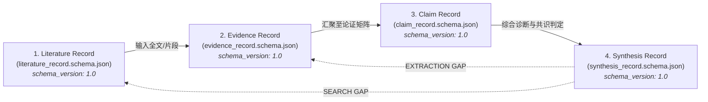

# ScholarFlow 统一跨技能数据契约规范 (Data Contract Specification v1.0)

> **版本**：1.0  
> **生效范围**：`literature-discovery-acquisition` ➔ `literature-evidence-extraction` ➔ `literature-synthesis`  
> **核心哲学**：**字段语义正交、单向契约严格、版本明确可溯源。**

---

## 一、契约架构概览 (Pipeline Flow)

---

## 二、核心正交解耦：`support_type` vs `evidence_strength`

在早期版本中，`E1–E4` 在抽取阶段（表示抽取自原文的方式）与综合阶段（表示证据的科学强度）发生了严重语义冲突。  
**v1.0 规范彻底解耦这两个正交维度**：

### 1. 抽取溯源维度：`support_type` (Extraction Dimension)
回答核心问题：**“这个字段值是如何从当前论文文本中得到的？”**

| 取值 (`support_type`) | 含义 | 对应行为 |
|---|---|---|
| `EXPLICIT` | 原文明确写明此数值或参数 | 附带原文 verbatim quote 及页码 |
| `DERIVED` | 原文给出原始数据，经同行公认公式计算推导得出 | 附带原始参数与推导公式 |
| `REFERENCED` | 本文实验并未自测，而是引用前人参考文献所得 | 附带引文作者与出版年，禁止冒充本文成果 |
| `NOT_REPORTED` | 全文及补充材料通篇未提及该参数 | 严格标记为 `NR`，严禁常识脑补填空 |

> [!CAUTION]
> **绝对隔离规则**：当 `support_type == "NOT_REPORTED"` 时，其进入下游综合分析的权重**恒为 0.0**，严禁被下游误当作“弱证据”或“专家观点”进行加权！

---

### 2. 证据论证强度维度：`evidence_strength` (Synthesis Dimension)
回答核心问题：**“这项科学断言本身的方法学与证据效力处于什么层级？”**

| 取值 (`evidence_strength`) | 固有权重参考 | 科学定义与适用范围 |
|---|:---:|---|
| `DIRECT_EMPIRICAL` | 1.0 | 原始直接实证：第一手分子测序读数、野外第一手实测捕获数据、严格对照实验 |
| `MODELED_EMPIRICAL` | 0.8 | 模型估计实证：经过空间捕获重捕（SECR）、混合线性模型推导的估计值 |
| `AUTHOR_INTERPRETATION`| 0.4 | 讨论推论假说：作者在 Discussion 中提出的机制推测或定性归纳 |
| `SECONDARY_EVIDENCE` | 0.2 | 二级文献转引：综述引用或引言中援引的其他学者数据 |
| `EXPERT_OPINION` | 0.1 | 专家观点/质性断言：无实测数据支持的呼吁、政策倡议或个人通讯 |
| `UNKNOWN` | 0.3 | 证据来源层级不详 |

---

## 三、声明核验状态：`claim_status`

每一个提取项与断言均附带机器可审计的校验状态：
- `SUPPORTED`：由同一上下文内的原文原句 100% 严密支撑；
- `PARTIALLY_SUPPORTED`：原文支持核心趋势，但在细节数值、单位或条件上有微小偏差；
- `UNSUPPORTED`：在指定页面或段落未找到任何支持证据；
- `CONTRADICTORY`：原文记载与所声称的结论直接相悖；
- `AMBIGUOUS`：原文语意模糊、表述含混，无法得出唯一判定；
- `OCR_UNCERTAIN`：扫描件存在字符识别噪声（如 `μL` 识别为乱码），需人工肉眼二次复核。

---

## 四、版本与兼容性保证 (Versioning & Compatibility)

1. 所有标准 JSON 文件必须在根级包含 `"schema_version": "1.0"`；
2. 现有脚本如果读取旧版包含 `evidence_tier: "E1"~"E4"` 的数据，将通过向下兼容映射层自动转换为对应的 `evidence_strength`；
3. 如果输入同时包含 `support_type` 和 `evidence_tier`，以 `support_type` 为事实依据，绝不产生跨技能语义畸变。
