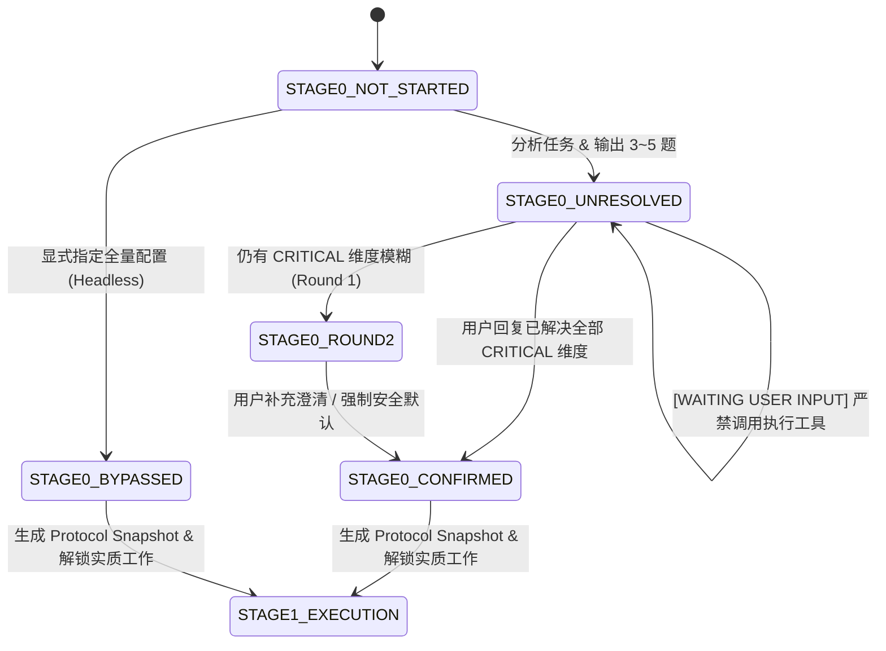

# ScholarFlow Stage 0 Core Protocol: Adaptive Research Decision Gate

> **Status**: Production Standard  
> **Applicability**: All ScholarFlow research skills (`literature-discovery-acquisition`, `literature-evidence-extraction`, `literature-synthesis`)

---

## 1. 核心定位与原则

Stage 0 不再是机械的静态问卷，而是**自适应科研决策门禁（Adaptive Research Decision Gate）**。其核心使命是在消耗实质性计算与检索资源之前，以最小交互成本收敛研究边界与方法学参数。

### 四大原则
1. **预设决策维度，动态生成问题**：不预设死板的固定题目；按学科透镜与任务语境评估 9~14 个决策维度，动态筛选 3~5 个最高影响度的未决要素提问。
2. **每题必带推荐，推荐必给理由**：每个选项题必须包含 `(Recommended)` 选项，并附带 1 句话依据（方法学惯例、学科规范或保守原则）与置信度标签。
3. **严格交互硬门禁（STOP Rule）**：Agent 在输出 Stage 0 问题清单后，**必须立即终止当前回复，进入静默等待状态**，严禁在同一回复中自问自答或直接调用下游工具展开实质性工作。
4. **低摩擦快捷协议与全量可追溯**：支持用户单指令极速确认（`按推荐`、`1A 2B 3C`），并在通过后生成带四级来源追溯（`USER` / `INFERRED` / `DEFAULTED` / `SYSTEM_RULE`）的协议快照（Protocol Snapshot）。

---

## 2. 交互预算与轮次约束

| 指标 | 约束上限 | 设计逻辑 |
|---|---|---|
| **首轮问题数** | 3 ~ 5 题 | 避免认知过载，聚焦关键方法学分歧 |
| **最大追问轮次** | 2 轮 | 严格防止无限循环质问；第 2 轮仅允许追问残留的未决 `CRITICAL` 要素（最多 2 题） |
| **全会话问题上限** | <= 7 题 | 超过 2 轮仍未达成共识时，强制应用系统安全默认值并标示警告 |
| **默认值静默应用** | `DEFAULTABLE` 维度 | 对已有成熟科学共识的次要维度自动应用默认值，列入快照供事后核实，不浪费提问槽位 |

---

## 3. 标准提问格式

每个生成的 Stage 0 问题必须严格遵守以下结构：

```markdown
### 问题 [序号]: [维度名称] (`[维度ID]`)
- **要素说明**: [简要说明该参数为何对后续研究产出具有实质性影响]
- **选项列表**:
  - **[A] (Recommended)** [选项内容] — *[推荐理由：简述为何在当前学科语境下推荐此项]* `[置信度: 高置信度 | 中置信度 | 需权衡]`
  - **[B]** [选项内容]
  - **[C]** [选项内容]
  - **[D]** 自定义输入：[提示用户可提供非预设参数]
```

---

## 4. 快捷回复协议

用户可采用以下任意方式极速回复：

1. **一键全盘采纳**：
   - 输入：`按推荐` / `全部按推荐` / `全部推荐` / `全选A` / `yes` / `ok`
   - 动作：系统将所有处于提问中的问题全部解析为 `(Recommended)` 对应的参数，来源标记为 `[USER]`。
2. **紧凑代号回复**：
   - 输入：`1A 2B 3C` / `1.A 2.B 3.C` / `1-A, 2-B` / `A B C`
   - 动作：系统按序号精确对应各维度选项。
3. **混合微调覆盖**：
   - 输入：`1按推荐，2选C，3自定义：仅限近五年中国东部研究`
   - 动作：系统解析对应项，未指定项自动继承推荐或默认值。

---

## 5. 交互执行硬阻断规则 (Hard Gate)



> [!CAUTION]
> **红线警示**：当系统处于 `STAGE0_UNRESOLVED` 或 `STAGE0_ROUND2` 时，属于未确认状态。任何智能体或自动化脚本均不得调用文献下载、正文提取、争议合成或网络检索等下游重度工具。必须等待用户输入！

---

## 6. 参数来源追溯体系 (Provenance)

协议快照必须为每个参数明确标定来源：
- `[USER]`：用户在 Stage 0 显式选定或自定义覆盖；
- `[INFERRED]`：基于用户初始提示词高置信度提取（如用户明确提及“检索 2018-2024 年关于...”）；
- `[DEFAULTED]`：未提问但按学科通用规范默认配置；
- `[SYSTEM_RULE]`：ScholarFlow 方法学硬性准则强制注入（如 E1-E4 证据隔离与双轨输出）。
