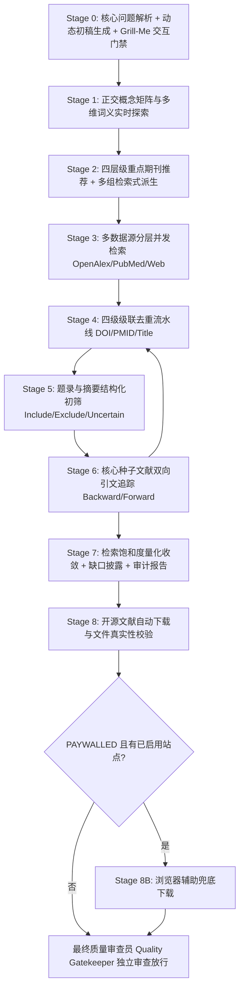

# 学科文献发现、交互问询与开源全文获取专业技能 (literature-discovery-acquisition)

本技能用于在严谨科研场景下执行系统化、高召回、可审计、防幻觉的文献发现与开源全文获取闭环工作流（Literature Discovery & Open-Access Acquisition）。

> **核心哲学**：
> 搜索的任务是发现真实的候选证据，而不是制造答案。
> 首要目标是提高召回率（Recall / Coverage），宁可如实陈述检索缺口，也绝不捏造文献元数据或根据摘要脑补全文实验细节。

---

## ⚡ 上下文预算与按需渐进加载准则 (Progressive Context Loading Protocol)

> [!CAUTION]
> **严禁全量一次性预加载**：本 Skill 完整知识库（28 个文件）总文本量约 158 KB。在初次触发激活时，**绝对禁止**一次性读取 `references/`、`role/`、`examples/` 或 `assets/` 中的所有文件。Agent 必须严格遵守以下阶段化与模式分支的渐进式按需读取策略，严守上下文预算！

### 阶段 1：启动与前置交互门禁（仅允许加载 1 个文件，~5 KB）
- **唯一必须读取**：[references/stage0_grill_me.md](references/stage0_grill_me.md)
- **禁止提前读取**：任何其他 references、role 文件、案例或资产模板。
- **核心动作**：解析用户输入，在对话中输出初步范围/概念词/推荐期刊草案，并**必须向用户发起核心第 1 题（Q1 检索模式选择：Deep Search vs Quick Search）与第 2 题（Q2 硕博学位论文需求）的 Grill-Me 决策询问**。

---

### 阶段 2：用户确认模式后的分支加载策略

#### 🚀 分支 A：用户选择 `Quick Search`（快速探索模式，总加载量 < 15 KB，节约 >90% 上下文）
- **适用**：组会讨论、热点速览、快速获取 10–30 篇顶刊代表作。
- **允许按需读取（仅 3 篇，随用随读）**：
  1. `references/concept_matrix.md`（仅参考核心概念展开规则）
  2. `references/databases_and_tools.md`（仅参考数据源调用逻辑）
  3. `references/saturation_and_qc.md`（仅参考轻量免责声明）
- **严格禁止读取**：
  - `references/subagent_screening.md`（不进行多子代理并发初筛）
  - `references/prisma_s_checklist.md`（不进行重型 PRISMA 机器评分）
  - `references/theses_retrieval.md`（除非用户明确勾选需要硕博论文）
  - `role/` 目录下全部文件（主代理依照当前上下文精简执行并声明“非系统性完整检索”）
  - `examples/` 目录下除快速案例外的长篇案例

#### 🔬 分支 B：用户选择 `Deep Search`（深度系统检索模式，严格按工作流阶段流水推进）
- **适用**：学位论文开题、基金立项申报、PRISMA 系统评价、期刊文献综述。
- **严禁跨阶段提前预加载**，推进到特定 Stage 时方可加载对应文件（Just-In-Time Loading）：
  - **进入 Stage 1-2 时**：读取 `references/concept_matrix.md` 与 `references/journal_mapping.md`；
  - **进入 Stage 3 时**：读取 `references/databases_and_tools.md`（若确认需学位论文，才加载 `references/theses_retrieval.md`）；
  - **进入 Stage 4-6 时**：仅在候选文献 $\ge 30$ 篇且确实启动子代理并发打分时，才读取 `references/subagent_screening.md`，否则使用主专家单流打分；
  - **进入 Stage 7 时**：读取 `references/saturation_and_qc.md`，质检时由审查员读取 `role/quality_gatekeeper.md` 与 `references/prisma_s_checklist.md` 执行 PRISMA-S 16 项打分；
  - **进入 Stage 8 时**：仅在需要下载全文且落盘时，才加载 `references/stage8_oa_download.md` 与 `references/zotero_watch_folder.md`；
  - **进入 Stage 8B 时**（可选）：仅当 Stage 8 台账中 PAYWALLED ≥ 1 篇**且** `site_registry.json` 中存在 `enabled: true` 的站点时，才加载 `references/stage8b_browser_fallback.md`。

#### 🤖 分支 C：若为 `Headless / Agent` 自动化模式（零对话加载，0 KB Markdown）
- **直接执行脚本**：运行 `python scripts/agent_search.py -q "..." --mode <quick|deep>`；
- **硬性输出契约**：输出 JSON 必须严格遵循 `assets/candidate_literature_schema.json`，不符合 schema 的输出由 Quality Gatekeeper 直接 REJECT。禁止加载对话型文档或生成非结构化 Markdown。

---

## 一、三位一体协同角色架构 (Triad Role Architecture)

技能执行过程中由以下三个专门角色协同运作（详见 `role/` 目录）：

1. **系统化检索主导专家 ([specialist_role.md](role/specialist_role.md))**：
   - 负责整体工作流统筹调度、Stage 0 前置 Grill-Me 交互门禁、数据源并发检索与双轨产物输出。
   - 严格恪守 6 大铁律（绝不全知宣称、DOI 零伪造、无全文不推断实验参数、三级证据分级）。
2. **通用词矩阵与重点期刊助手 ([domain_advisor.md](role/domain_advisor.md))**：
   - **动态实时探索**：不设僵化死板的学科分身，在明确用户课题后，**通过实时检索网络（Search Web）、学术知识库与受控词表（MeSH/NCBI/ACM等）**，动态提炼 2–4 个正交概念桶与 7 维术语拓展；
   - 实时生成四层级重点期刊列表及适配各大数据库（WoS/PubMed/Scopus/CNKI）的来源过滤检索代码。
3. **最终质量审查员 ([quality_gatekeeper.md](role/quality_gatekeeper.md))**：
   - **独立审计红蓝把关与三级质检架构**：在结果交付与报告生成前执行独立核验，诚实界定质检层级（Level-1 启发式角色自检、Level-2 确定性程序级硬检、Level-3 隔离子智能体盲审），行使一票否决权并签署放行决议；
   - 审查布尔语法正确性、漏词与查全风险、初筛决策与 Uncertain 保留、无脑补实验细节、全文下载文件魔数真实性。

---

## 二、运行模式 (Operation Modes)

| 模式名称 | 核心定位 | 目标产出 | 执行流程特征 | 适用场景 |
|---|---|:---:|---|---|
| **Deep Search** *(默认科研模式)* | 系统化全景文献发现与全文获取 | 50–200 篇题录 + OA 全文下载 | 动态词矩阵 → 多数据库联合检索 → 四级去重 → (≥30篇自动并发)初筛 → 种子文献引文双向追踪 → 饱和度量化收敛 → 开源全文下载与质检验收 | 学位论文、基金开题、系统评价、立项综述 |
| **Quick Search** | 快速精准探索 | 10–30 篇顶刊代表作 + 核心 OA 下载 | 聚焦高精检索式 + 四层级重点期刊限定过滤，不做多轮引文追踪与饱和度计算，显式声明“非系统性完整检索” | 快速组会讨论、前沿摸底、热点跟踪 |
| **Headless / Agent** | 机器纯数据执行管道 | 紧凑标准 JSON 流 (已初筛/去重/含OA直链) | **全自动环境感知或 `--headless` 触发**：抑制人机寒暄与视觉排版，以高置信度参数静默执行全流程，直出机器消费级 JSON | 供上层规划 Agent、论文写作智能体、自动化后台脚本消费 |

---

## 三、八阶段标准工作流 (Standard 8-Stage Workflow)

---

### Stage 0：自适应科研决策门禁 (Adaptive Research Decision Gate)

在执行任何实际搜索调用前，系统强制接入自适应科研决策门禁（详见 [stage0_grill_me.md](references/stage0_grill_me.md) 与 [grill_dimensions.md](references/grill_dimensions.md)）：

1. **预设决策维度，动态筛选提问**：
   - 评估 D1 至 D14 共 14 个决策维度，根据任务描述自动提取已知参数（标记 `[INFERRED]`）；
   - 从未决的 `CRITICAL` 维度（D1-D5）与高影响 `HIGH_IMPACT` 维度（D6-D9）中动态生成 **3~5 个** 结构化提问；
   - 每个问题必须提供带有明确依据的 `(Recommended)` 选项与置信度标签（`[高置信度]` / `[中置信度]` / `[需权衡]`）；
   - 次要 `DEFAULTABLE` 维度（D10-D14）自动按学科透镜应用科学默认值。
2. **严格交互硬门禁 (STOP Rule)**：
   - **Agent 在输出 Stage 0 问题清单后，必须立即终止当前回复，进入静默等待状态**，严禁自问自答或在同一轮次中调用检索/下载工具。
3. **低摩擦回复解析与协议快照生成**：
   - 支持一键通过（`按推荐`、`1A 2B 3C` 或混合覆盖）；
   - 确认通过后固化四级来源追溯（`[USER]` / `[INFERRED]` / `[DEFAULTED]` / `[SYSTEM_RULE]`）的【Stage 0 Protocol Snapshot】，流转至 Stage 1。

---

### Stage 1：正交概念矩阵实时探索 (Concept Matrix)

由通用词矩阵助手 ([domain_advisor.md](role/domain_advisor.md)) 实时解构为 2–4 个正交概念桶，并跨网络与学术知识库拓展 7 维同义词汇（详见 [concept_matrix.md](references/concept_matrix.md)）：
- **Concept A**：研究对象 / 目标分类群 / 疾病
- **Concept B**：核心方法 / 技术标记 / 干预措施
- **Concept C**：样本类型 / 介质 / 试验环境
- **Concept D**：目标产出 / 结果变量 / 评价指标
- **7 维发掘**：核心词、同义词、美英拼写变体（`fecal`/`faecal`）、缩写全称（`STR`/`microsatellite`）、分类层级（属/科/俗名/拉丁学名）、历史词汇、受控词表（MeSH/Emtree/ACM）。

---

### Stage 2：四层级重点期刊推荐与多组检索式派生

1. **四层级重点期刊推荐**（详见 [journal_mapping.md](references/journal_mapping.md)）：
   - **Tier 1（综合顶级与旗舰）**：*Nature*, *Science*, *PNAS*, *TPAMI*, *NEJM* 等；
   - **Tier 2（专业顶刊与主题核心）**：JCR Q1、中科院 1 区专业顶刊；
   - **Tier 3（权威综述期刊）**：*Trends in...*, *Annual Reviews*, *Biological Reviews*（**引文追踪最佳种子池**）；
   - **Tier 4（中文核心 / CSCD）**：国内权威核心学报（如《兽类学报》、《生态学报》）。
   - **生成来源过滤代码**：输出适配 WoS (`SO=...`)、PubMed (`[ta]`)、Scopus (`EXACTSRCTITLE(...)`)、CNKI (`文献来源=...`) 的可用语法块。
2. **派生多组互补检索式**：
   - **Q01 (高精核心式)**：严格多概念交叉，定位高相关度核心论文；
   - **Q02 (高召回扩展式)**：全面覆盖变体与上位分类群，防漏检；
   - **Q03 (方法导向式)**：聚焦技术协议与质控规范；
   - **Q04 (中文检索式)**：面向知网/万方/本土研究的针对性检索式。

---

### Stage 3：多数据源分层协同检索 (Multi-Source Retrieval)

调用环境中可用的学术工具与数据源，严格执行分层调度（详见 [databases_and_tools.md](references/databases_and_tools.md)）：
1. **第一层：开放学术 API**（OpenAlex 全学科、PubMed/Europe PMC 生命科学与医学、arXiv/bioRxiv 预印本）；
2. **第二层：Web 学术探测**（Google Scholar 关键文献补漏、出版商落地页解析、DOI 解析校验）；
3. **第三层：受限商业数据库声明与极速本地摄取**（中国知网 CNKI、Web of Science、Scopus、万方数据）：
   - 自动生成对应数据库专业布尔检索式；
   - 支持用户校园网内 30 秒导出后，运行 `scripts/ingest_external_records.py` 一键无缝解析并注入候选文献池；
4. **提取标准题录元数据**：提取标题、作者、年份、期刊、DOI、URL、摘要、来源库、证据分级（`VERIFIED` / `INFERRED` / `UNVERIFIED`）。

---

### Stage 4：四级渐进式去重流水线 (Deduplication)

跨库原始文献统一进入级联去重流水线（详见 [screening_and_chasing.md](references/screening_and_chasing.md)）：
1. **Level 1**：标准化 DOI 精确匹配；
2. **Level 2**：PMID / arXiv ID 匹配；
3. **Level 3**：文本归一化标题（去除标点、转小写、压空格）精确匹配；
4. **Level 4**：第一作者姓氏 + 出版年 + 标题高相似度匹配；
5. **记录合并**：命中同一文献时，合并其所有检出库至 `source_databases`，绝不简单粗暴丢弃。

---

### Stage 5：题录与摘要结构化初筛 (Screening & PRISMA Dual Independent Protocols)

依据预先确立的标准对每篇去重文献进行审查（详见 [subagent_screening.md](references/subagent_screening.md)）：
- **纳入 (`Include`)**：完全符合研究对象与方法；
- **排除 (`Exclude`)**：必须附带结构化排除原因代码（如 `EXC_TAXON` 对象错误、`EXC_METHOD` 非目标方法等）；
- **待定 (`Uncertain`)**：**绝不允许武断剔除**，凡标题摘要无法完全确证者一律保留至全文阶段；
- **双轨初筛执行模式**：
  - **模式一：高吞吐分块并行初筛 (Map-Reduce)**：当候选量 $N \ge 30$ 篇时，切片并行分发轻量 SubAgent 打分，防止长文本注意力漂移；
  - **模式二：PRISMA 2020 Item 8 双盲独立初筛规程**：面向发表级系统评价与 Meta 分析，调度 Reviewer-A 与 Reviewer-B 隔离盲审，并运行 `scripts/calculate_screening_agreement.py` 自动化计算 Cohen's Kappa（$\kappa$）检验一致性，输出 `screening_dual_audit.csv` 决策审计追踪表与分歧仲裁队列。

---

### Stage 6：核心种子文献双向引文追踪 (Citation Chasing)

挑选 3–5 篇经过初筛的里程碑论文与权威综述作为 Seed Papers：
- **Backward Citation Chasing (反向追溯)**：追溯种子论文的参考文献列表；
- **Forward Citation Chasing (正向追踪)**：追踪引用该种子论文的最新后续研究；
- **Author Chasing**：追踪核心作者/课题组相关成果；
- **再筛选门禁**：追踪到的所有新文献**必须重新送入 Stage 4 去重与 Stage 5 初筛**，严禁直接无条件入库。

---

### Stage 7：检索饱和度量化评估与审计报告 (Saturation Assessment)

1. **检索饱和度量化评估**（详见 [saturation_and_qc.md](references/saturation_and_qc.md)）：
   - 记录每轮检索的新增有效文献数与边际贡献率（Marginal Yield %）；
   - 当边际贡献率 $< 5\%$ 或连续追踪新增 $\le 2$ 篇时，判定达到边际收敛；
   - 严禁声称“找全了所有文献”，只能表述为“在当前策略与数据源下接近边际饱和”；
2. **检索缺口与局限性声明 (Search Gaps)**：明确列出未直接访问的商业数据库及人工补检指导；
3. **导出数据文件**：生成候选清单 `candidate_literature.csv` 与 Zotero/EndNote 导入词条 `literature_pool.bib`。

---

### Stage 8：开源文献全文自动下载与 Zotero 生态沉淀 (Open-Access & Zotero CSL-JSON)

对初筛为 `Include`（及可选 `Uncertain`）的文献，自动执行全文下载与入库闭环（详见 [stage8_oa_download.md](references/stage8_oa_download.md)、[zotero_watch_folder.md](references/zotero_watch_folder.md) 与执行脚本 `scripts/download_oa_papers.py`）：

1. **多源合法 OA 解析**：
   - 自动提取 OpenAlex `best_oa_location.pdf_url`、Europe PMC 官方全文直链、bioRxiv/arXiv 预印本 PDF 与高校机构知识库直链；
2. **流式安全下载至本地目录**：
   - 默认保存在 `papers/downloads/`（用户可配置为 Zotero 自动监听文件夹 Watch Folder）；
   - 标准化命名：普通论文 `<Year>_<FirstAuthor>_<TitleSlug>.pdf`，学位论文 `<Year>_<Degree>_<Author>_<TitleSlug>.pdf`；
3. **严苛二进制魔数核验 (%PDF-)**：
   - 检查文件前 5 字节必须以 `%PDF-` 开头，且体积 $\ge 10\text{ KB}$；彻底拦截 403/404 HTML 伪装页面；
4. **双层 CSL-JSON 生成 (Zotero 原生导入)**：
   - 为每个成功下载的 PDF 在同级目录配套生成单篇同名 `<Name>.csl.json`；
   - 自动在下载目录根部编译生成全局总汇池 `zotero_import.csl.json`；
5. **输出《全文获取台账》**：
   - 分类汇总 `OA_DOWNLOADED`、`PREPRINT_AVAILABLE`、`PAYWALLED`（附带官方 DOI 与机构/校园网访问指引）。

---

### Stage 8B：浏览器辅助兜底下载 (Browser-Assisted Fallback — 可选)

当 Stage 8 台账中仍存在 `PAYWALLED` 文献，且用户已配置启用站点适配器（`site_registry.json`）时，自动进入本阶段（详见 [stage8b_browser_fallback.md](references/stage8b_browser_fallback.md)）：

1. **站点匹配**：根据文献语言与类型匹配最高优先级的已启用适配器（CNKI/万方/学校代理等）；
2. **凭据加载**：从 `.env` 文件读取凭据（**绝不存储、回显或写入任何输出**）；
3. **浏览器操作序列**：自动登录 → 搜索 → 匹配验证（标题+作者+年份）→ 触发下载；
4. **验证码处理**：遇到验证码时暂停，请求用户手动通过后继续；
5. **文件校验**：与 Stage 8 相同的 `%PDF-` 魔数 + ≥ 10 KB 体积校验；CAJ 格式标记 `CAJ_ONLY`；
6. **并发控制**：单次最多处理 20 篇，同站点请求间隔 ≥ 3 秒；
7. **台账更新**：Stage 8B 结果合并进同一份全文获取台账，状态码扩展为五类：

| 状态码 | 标识 | 来源阶段 |
|---|---|---|
| `OA_DOWNLOADED` | `[已下载-OA]` | Stage 8 |
| `PREPRINT_AVAILABLE` | `[预印本]` | Stage 8 |
| `BROWSER_DOWNLOADED` | `[已下载-浏览器]` | Stage 8B |
| `CAJ_ONLY` / `BROWSER_FAILED` | `[仅CAJ]` / `[浏览器失败]` | Stage 8B |
| `PAYWALLED` | `[需商业权限]` | 全部兜底均失败 |

---

## 四、最终质量审查员独立门禁 (Gatekeeper Checkpoints)

在生成最终交付物前，最终质量审查员 ([quality_gatekeeper.md](role/quality_gatekeeper.md)) 必须执行独立核验并签署审查决议：

- [ ] 1. **检索式布尔语法**：括号严格匹配，无逻辑符号颠倒；
- [ ] 2. **概念矩阵查全度**：已发掘 7 维变体与拉丁学名，无单一检索式偷懒；
- [ ] 3. **重点期刊与来源过滤**：已生成四层级期刊及 WoS/PubMed 过滤代码；
- [ ] 4. **初筛一致性**：无主观随意排除，所有 `Uncertain` 文献均完整保留；
- [ ] 5. **零伪造红线**：无法核验 DOI 均标记 `DOI = NR`，无任何由摘要推断 PCR 反应参数等实验数值的违规；
- [ ] 6. **数据源披露透明度**：诚实标明实际检索与受限商业库，提供人工补检式；
- [ ] 7. **开源下载真实性**：若执行 Stage 8，本地 PDF 均通过 `%PDF-` 魔数与文件体量校验，无 HTML 伪装损坏文件；
- [ ] 8. **硕博士学位论文履约核验**：严格按照 Grill-Me 确认的学位论文需求，落实专属检索式生成、高校知识库直链探测与台账标识；
- [ ] 9. **PRISMA-S 系统评价扩展标准机审**：对照 [prisma_s_checklist.md](references/prisma_s_checklist.md) 校验适用条目，在最终决议中输出 PRISMA-S 评分卡（按实际工作流标明适用项与合规等级，严禁未核验写死 16/16）；
- [ ] 10. **浏览器兜底下载安全与凭据审计**（若执行 Stage 8B）：确认凭据未泄露、`.env` 在 `.gitignore` 中、下载文件通过校验、未下错文献、请求频率合规。

审查员必须在报告末尾签署形式化核验决议（PASS 放行 / REJECT 驳回重修）。

---

## 五、支撑文档与参考资源目录

- **角色与审查模块 (`role/`)**：
  - [specialist_role.md](role/specialist_role.md)：系统化检索主导专家契约与 6 大铁律 (含 Headless 与并发初筛协议)
  - [domain_advisor.md](role/domain_advisor.md)：通用词矩阵与重点期刊助手（动态探索机制与学位论文策略）
  - [quality_gatekeeper.md](role/quality_gatekeeper.md)：最终质量审查员独立审计规范与 PRISMA-S 评分放行令
- **阶段详细规程 (`references/`)**：
  - [stage0_grill_me.md](references/stage0_grill_me.md)：Stage 0 问题拆解与前置 Grill-Me 交互规程（含硕博必问项）
  - [theses_retrieval.md](references/theses_retrieval.md)：中英文硕博士学位论文专项检索与下载规程（CNKI博硕/PQDT/OATD/高校IR）
  - [subagent_screening.md](references/subagent_screening.md)：多 SubAgent 并发初筛分片与打分规程 (Map-Reduce)
  - [prisma_s_checklist.md](references/prisma_s_checklist.md)：PRISMA-S 16 项系统评价文献检索扩展标准机审规程
  - [concept_matrix.md](references/concept_matrix.md)：Stage 1-2 概念矩阵与检索式扩展规程
  - [journal_mapping.md](references/journal_mapping.md)：四层级重点期刊评价体系与语法映射
  - [databases_and_tools.md](references/databases_and_tools.md)：Stage 3 多数据源协同检索与工具调度指南
  - [screening_and_chasing.md](references/screening_and_chasing.md)：Stage 4-6 去重、初筛与引文追踪规程
  - [saturation_and_qc.md](references/saturation_and_qc.md)：Stage 7 饱和度收敛评估与 PRISMA 质控流
  - [stage8_oa_download.md](references/stage8_oa_download.md)：Stage 8 开源文献下载与完整性审计规程
  - [stage8b_browser_fallback.md](references/stage8b_browser_fallback.md)：Stage 8B 浏览器辅助兜底下载操作协议（站点适配、凭据安全、操作序列）
  - [zotero_watch_folder.md](references/zotero_watch_folder.md)：Zotero 监听目录与双层 CSL-JSON 文献库生态沉淀指南
- **执行脚本与工具 (`scripts/`)**：
  - `scripts/download_oa_papers.py`：开源文献批量下载、魔数核验与双层 CSL-JSON 生成脚本
  - `scripts/ingest_external_records.py`：外部文献 (CNKI/万方/WoS/RIS) 标准化导入与去重脚本
  - `scripts/calculate_screening_agreement.py`：PRISMA 2020 Item 8 双评阅人一致性检验与 Cohen's Kappa 计算脚本
  - `scripts/agent_search.py`：Headless / Agent 模式专用纯数据检索管道脚本

- **标准资产与模板 (`assets/`)**：
  - [concept_matrix_template.md](assets/concept_matrix_template.md)：概念矩阵输出模板
  - [journal_recommendation_template.md](assets/journal_recommendation_template.md)：重点期刊推荐与过滤语法模板
  - [candidate_literature_schema.json](assets/candidate_literature_schema.json)：候选文献标准 JSON Schema
  - [csl_json_schema.json](assets/csl_json_schema.json)：CSL-JSON 标准数据格式 Schema
  - [site_registry_template.json](assets/site_registry_template.json)：Stage 8B 站点适配器注册表模板（CNKI/万方/学校代理）
  - [browser_credentials_example.env](assets/browser_credentials_example.env)：Stage 8B 凭据文件示例（不含真实密码）
  - [download_ledger_template.md](assets/download_ledger_template.md)：全文文献获取台账模板
  - [search_log_template.md](assets/search_log_template.md)：检索审计日志模板
  - [search_saturation_template.md](assets/search_saturation_template.md)：饱和度轮次跟踪表模板
  - [screening_decision_template.md](assets/screening_decision_template.md)：初筛决策记录模板
- **案例与反模式对照 (`examples/`)**：
  - [deep_search_ecology_case.md](examples/deep_search_ecology_case.md)：生态学/分子遗传学深度检索全流程案例（设计时参考）
  - [quick_search_biomedical_case.md](examples/quick_search_biomedical_case.md)：生物医学快速精准检索案例（设计时参考）
  - [anti_patterns.md](examples/anti_patterns.md)：12 种学术检索反模式与负向清单
  - [real_execution_log_template.md](examples/real_execution_log_template.md)：真实执行日志归档模板——每次完成实际文献检索后，按 `real_execution_log_YYYY-MM-DD_<课题>.md` 归档，用于 Skill 校准与经验沉淀

---

## 六、下游技能交接协议 (Handoff & Skill Boundaries)

为了确保科研工作流的无缝衔接与职责边界清晰，本技能作为 ScholarFlow 科研文献生命周期的上游总入口，与下游分析与综合技能遵循如下交接协议：

1. **文献可信内容与证据链提取 (`literature-evidence-extraction`)**：
   - 当初筛与下载获得核心全文文献（PDF/HTML）后，若需按定制 Schema 提取结构化参数、实验设计、数值结果或事实核验，交接给 [`literature-evidence-extraction`](../literature-evidence-extraction/SKILL.md) 遵循 Quote → Extract → Verify 铁律进行 E1-E4 证据链抽取与伴生 JSON 生成。
2. **多篇文献交叉综合与学术争议发掘 (`literature-synthesis`)**：
   - 当完成文献批量初筛与证据提取，需要对多篇文献在核心假说、估算模型、机制分歧上展开横向跨篇对决、反方挑刺（Devil's Advocate）与学派图谱构建时，交接给 [`literature-synthesis`](../literature-synthesis/SKILL.md) 生成争议驱动型综述与共识边界矩阵。

