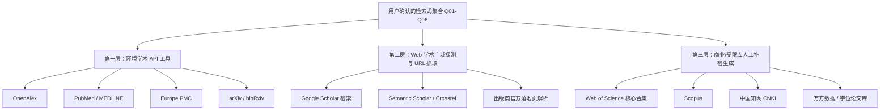

# Stage 3: 多数据源检索与工具调度规范 (Multi-Source Retrieval & Tool Strategy)

## 一、分层混合检索架构 (Tiered Hybrid Architecture)

为了实现高召回率（Recall）并保证检索过程的完全真实与透明，Skill 采用**三层数据源调度架构**：



---

## 二、学术工具与 API 调度优先级

### 1. 第一层：原生学术 API 工具（自动化高置信度）
当环境中具备对应工具或通用 API 可用时，必须按学科属性优先调度：

| 工具 / API | 覆盖学科与特点 | 优势与返回字段 | 调度建议 |
|---|---|---|---|
| **OpenAlex** | 全学科（2.5 亿+文献，覆盖跨学科、交叉学科） | 返回精准 DOI、Title、Authors、Year、Journal、Abstract (Inverted Index 重建)、Citation Count | **通用首选**，任何学科均应第一批次调用 |
| **PubMed / MEDLINE** | 生命科学、生物医学、动物遗传学 | 官方权威题录、MeSH 词标引精准、PMID 绑定 | **生物与医学首选**，遗传标记与分子生态学必查 |
| **Europe PMC** | 生物学、生物化学、生命科学开放获取 | 涵盖 PubMed 题录 + 欧洲生物学资源，支持全文直接扫描与引文检索 | 配合 PubMed 执行交叉补漏 |
| **bioRxiv / medRxiv** | 生命科学与医学最新预印本 | 获取尚未正式见刊的近 6–12 个月前沿突破 | 适用于探索性前沿主题调研 |
| **arXiv** | 计算机、人工智能、定量生物学 (q-bio) | 计算机与物理/数学绝对主力源 | 涉及计算模型、生物信息算法时必查 |

### 2. 第二层：Web 学术广域探测与网页提取
当特定长尾文献或预印本在直接 API 中未命中时，启动网页级学术搜索：
- **Google Scholar / Semantic Scholar 探测**：利用 `search_web` 针对特定复合检索短语进行检索，捕获高引用经典论文；
- **DOI 官方解析与落地页元数据抓取**：通过 `read_url_content` 访问 `https://doi.org/<DOI>` 或出版商官方摘要页，核实准确标题、作者列表与摘要，严格消除幻觉。

### 3. 第三层：商业/受限数据库人工补检式（声明式缺口）
因绝大部分 Agent 环境无法直接绕过校园网 IP / 商业付费鉴权（Web of Science, Scopus, CNKI, 万方, ProQuest），**严禁伪称已经检索了这些数据库**。必须在报告中开辟独立章节，输出已经格式化、测试过的专用检索代码块：
- **Web of Science Advanced Search** 检索式；
- **Scopus Advanced Search** 检索式；
- **CNKI 专业检索** 检索式（含中文字段限定）；
- **万方医学/科技高级检索** 检索式。

---

## 三、元数据提取字段规范 (Metadata Fields Extraction)

每一篇从 API 或网页检索到的文献，必须以统一数据模型提取并存储以下 14 个核心字段：

```json
{
  "id": "REC001",
  "title": "Normalized Paper Title",
  "authors": ["Author 1", "Author 2"],
  "year": 2024,
  "journal": "Molecular Ecology",
  "doi": "10.1111/mec.12345",
  "pmid": "38123456",
  "url": "https://doi.org/10.1111/mec.12345",
  "abstract": "Full abstract text...",
  "keywords": ["fecal DNA", "microsatellites", "individual identification"],
  "document_type": "Article",
  "source_databases": ["PubMed", "OpenAlex"],
  "query_id": "Q01",
  "evidence_level": "VERIFIED"
}
```

- 若缺少 DOI，字段填 `"doi": "NR"`，严禁虚构；
- 若缺少 PMID，字段填 `"pmid": null`；
- 若缺少摘要（如极早期论文），必须标记 `"abstract": "Not available"`。

---

## 四、检索异常与失败降级策略 (Failure Handling & Fallback)

1. **API 超时或频次限制 (Rate Limit / Timeout)**：
   - 自动指数退避重试（1s, 2s, 4s）；
   - 若重试 3 次仍失败，自动降级至 Web 学术搜索或备用镜像，并在检索日志中如实记录降级事件。
2. **检索结果过少 (Zero / Low Hits: < 5 篇)**：
   - 触发『概念放宽机制』：在 Concept Matrix 中启用 Broader Terms（如将种名放宽为属名或科名，将具体试剂放宽为通用方法）；
   - 移除过紧的字段限定（从 `Title-only` 放宽为 `Title/Abstract`）；
   - 检查布尔操作符是否错用了过多的 `AND`，将次要概念由必须限定改为可选项。
3. **检索结果过多 (Information Overload: > 1000 篇)**：
   - **严禁直接暴力截断前 50 条**；
   - 增加必要的方法学或目标变量限定概念（如增加 `AND ("individual identification" OR "genetic tagging")`）；
   - 施加时间窗口限定（如限制近 10 年）或限定同行评议期刊论文类型。
