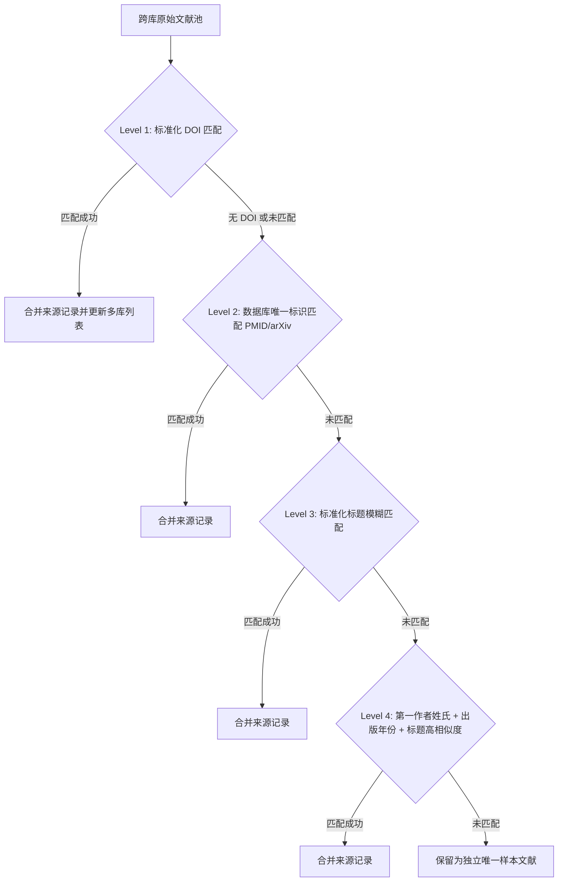

# Stage 4-6: 去重、初筛与引文追踪规程 (Deduplication, Screening & Citation Chasing)

## 一、Stage 4：四级渐进式去重流水线 (Deduplication Pipeline)

当来自多个数据源（OpenAlex、PubMed、Web、Europe PMC 等）的文献汇总后，必须执行严格的**多层级级联去重**，并完整保留该条文献的所有检出来源。



### 1. 标准化预处理规则
- **DOI 标准化**：统一转换为小写，剥离 `https://doi.org/` 或 `doi:` 前缀（例如：`10.1111/MEC.12345` → `10.1111/mec.12345`）。
- **标题文本归一化 (Title Normalization)**：
  - 全部转换为小写；
  - 剔除所有标点符号与特殊字符（如 `-`, `:`, `?`, `,`, `.`）；
  - 压缩连续多空格为单空格；
  - 剥离首尾 HTML 标签（如 `<i>`, `<b>`）。
- **作者归一化**：提取第一作者姓氏（Surname），如 "Smith, J. A." → "smith"。

### 2. 来源合并保留规则
当两篇文献判为同一记录时，**绝对禁止简单粗暴地删除其中一条**，必须合并记录字段：
- `source_databases`: 合并为集合（如 `["PubMed", "OpenAlex", "Europe PMC"]`）；
- `query_ids`: 合并所有检索到该文献的检索式编号（如 `["Q01", "Q03"]`）；
- 补全空缺字段（例如 A 库无摘要但 B 库有摘要，则自动吸收 B 库的完整摘要）。

---

## 二、Stage 5：标题与摘要初筛规程 (Title & Abstract Screening)

初筛的目标是在不阅读全文的情况下，剔除明显与研究主题不相干的噪声，同时确保高价值与边界文献**零误杀**。

### 1. 三分法决策模型
对候选库中每一篇去重后的文献，必须赋予明确的筛选状态：

| 决策分类 | 标识 | 判定依据 | 处理动作 |
|---|:---:|---|---|
| **纳入** | `Include` | 标题或摘要明确包含研究对象、核心方法或关键结果变量，完全符合纳入标准。 | 进入核心候选文献表，参与引文追踪。 |
| **排除** | `Exclude` | 标题或摘要明确属于排除范围（如对象错误、纯技术综述脱离该领域、纯临床误检等）。 | 移入排除库，必须记录简明且具体的【排除原因】。 |
| **待定** | `Uncertain` | 标题或摘要信息不充分、处于方法跨界交叉边缘、或仅在摘要最后提及相关变量。 | **绝对禁止剔除！** 必须保留在候选表中，标注入待定复核区。 |

### 2. 初筛铁律
- **禁止凭空脑补排除**：不能因为标题“看起来不像”而随意排除。如果摘要表明有潜在相关性，必须标记为 `Uncertain`。
- **排除原因规范化**：排除理由必须结构化，禁止使用“不相关”等模糊字眼，应采用标准标签：
  - `EXC_TAXON`：研究生物类群/对象不符
  - `EXC_METHOD`：未采用目标方法/分子标记
  - `EXC_TOPIC`：非目标研究科学问题（如纯解剖学/无遗传学）
  - `EXC_DOC_TYPE`：文献类型不符（如书评、勘误、会议征稿启事）

---

## 三、Stage 6：引文双向追踪规程 (Citation Chasing Protocol)

单靠关键词检索容易受限于学术界的“用词分歧”（同一概念不同学派使用完全不同的词汇）。必须依托**学术引用网络**进行引文追踪。

### 1. 种子文献挑选标准 (Seed Papers Selection)
从 Stage 5 判为 `Include` 的文献中，挑选 3–5 篇具有代表性的文献作为初始种子（Seed Papers）：
- **方法奠基论文 (Methodological Landmark)**：最早提出该分析方法或该物种微卫星体系的经典论文；
- **权威综述论文 (Authoritative Review)**：发表在顶级综述期刊（如 TREE）上的大篇幅综述；
- **高被引近期实证 (High-Impact Recent Empirical)**：近 3–5 年发表在领域顶刊、被引较高的代表性论文。

### 2. 双向追踪执行机制

```text
               ┌── Backward Citation Chasing (追溯过去) ──> 参考文献列表 (References)
               │
[Seed Paper] ──┼── Forward Citation Chasing  (追踪后续) ──> 施引文献列表 (Citations)
               │
               └── Author Chasing / Co-citation ─────────> 核心通讯作者/课题组相关成果
```

1. **反向追溯 (Backward Chasing)**：审查种子论文的参考文献列表，捕获该领域被反复引用的奠基性文献；
2. **正向追踪 (Forward Chasing)**：查询在种子论文见刊之后，有哪些后续研究引用了该论文（利用 OpenAlex 或 Crossref cited_by 接口，或 Google Scholar "Cited by"）；
3. **作者拓展 (Author Chasing)**：追踪核心论文第一作者与通讯作者近 3 年在同一方向上发表的新成果。

### 3. 引文追踪的再筛选门禁 (Re-screening Gate)
通过引文追踪发现的新文献，**绝不能直接作为最终成果输出**！必须重新投送至：
$$\text{新增文献} \longrightarrow \text{Stage 4 (去重)} \longrightarrow \text{Stage 5 (标题/摘要初筛)}$$
只有通过初筛（判为 `Include` 或 `Uncertain`）的新文献，才被计入该轮次的有效新增产出。

### 4. 自动化双向滚雪球 CLI 工具调用 (`agent_search.py --snowball`)
技能内置的 `scripts/agent_search.py` 原生支持依托 OpenAlex API 的一键自动化双向滚雪球扩展：
```bash
# 基于单篇核心种子文献 DOI 开展自动化双向引用滚雪球追溯
python scripts/agent_search.py --snowball "10.1016/j.biocon.2020.108581" --limit 20 -o snowball_output.json
```
- **输出载荷**：自动包含种子文献 (`SEED_PAPER`)、前向参考文献 (`BACKWARD_REFERENCE`) 与后向施引文献 (`FORWARD_CITATION`)。
- **自动对齐**：每条文献均挂载标准 DOI、OpenAlex ID、OA PDF 链接与逐篇引用次数，支持无缝流转至去重和初筛。
