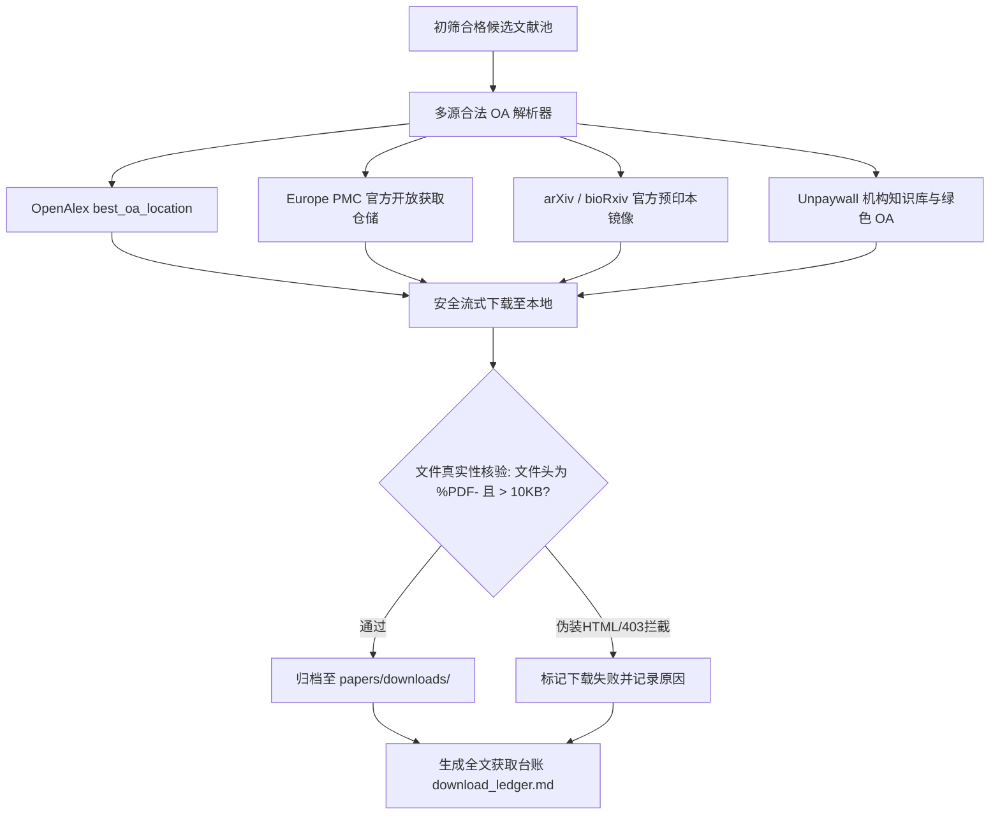

# Stage 8: 开源文献全文自动下载与完整性审计规程 (Open-Access Full-Text Download Protocol)

## 一、规程目的与核心定位

在科研文献调研链路中，检索出题录和摘要只是第一步。真正的实证评估、实验细节核查与后续精读，必须依赖完整的文献全文（Full-Text PDF）。

**Stage 8 核心定位**：
对 Stage 5 中初筛为 `Include`（及可选 `Uncertain`）的候选文献，自动探测合法的开放获取（Open Access, OA）全文直链并批量安全下载至本地目录，执行二进制魔数与完整性核验，最终生成可追溯的《全文获取台账》(Download Ledger)。



---

## 二、合法开放获取 (OA) 解析机制与数据源调度

严格依托合法、公共可访问的官方学术 API 与开放协议解析 PDF 直链，绝对禁止使用任何非法爬虫：

### 1. OpenAlex REST API 解析
- **查询路径**：`https://api.openalex.org/works/https://doi.org/<DOI>`
- **字段提取**：
  - 优先提取 `best_oa_location.pdf_url`；
  - 备选提取 `primary_location.pdf_url`；
  - 检查 `open_access.is_oa` 是否为 `true`，以及 `open_access.oa_status`（gold / green / hybrid / bronze）。

### 2. Europe PMC 官方开放仓储
- 若文献具备 `pmcid`（PubMed Central ID，形如 `PMC1234567`）：
- **PDF 直链**：`https://europepmc.org/backend/ptpmcrender.fcgi?accid=<PMCID>&blobtype=pdf`
- 具备完整的 CC-BY 等开放授权许可，可高稳定性直接获取。

### 3. bioRxiv / medRxiv / arXiv 预印本原生接口
- **arXiv**：基于 arXiv ID 构造直链：`https://arxiv.org/pdf/<arxiv_id>.pdf`；
- **bioRxiv / medRxiv**：通过官方 API 获取正式预印本 PDF 地址。

### 4. Unpaywall 开放获取备用接口
- **查询路径**：`https://api.unpaywall.org/v2/<DOI>?email=unpaywall_crawler@openacademic.org`
- 自动提取全球机构知识库（Institutional Repositories）与大学学者自存档的合法绿色 OA（Green OA）版本。

---

## 三、下载流控与文件命名标准化规范

### 1. 存储路径标准
默认保存至项目文献库的下载子目录：
`papers/downloads/`（或根据用户在 Grill-Me 环节指定的目录）。

### 2. 标准化文件命名 (Sanitized Naming)
为了保证跨操作系统兼容性与清晰检索，文件名统一采用以下结构：
```text
<出版年>_<第一作者姓氏>_<标题英文标识短串>.pdf
```
- **格式示例**：
  - `2024_Wang_Targeting_KRAS_G12D_pancreatic_cancer.pdf`
  - `2012_Zheng_Noninvasive_genetic_estimation_black_muntjac.pdf`
- **过滤规则**：
  - 剔除所有文件名非法字符（如 `\`, `/`, `:`, `*`, `?`, `"`, `<`, `>`, `|`）；
  - 连续空格替换为单下划线 `_`；
  - 标题短串截取前 4–6 个核心实词，总长度控制在 60 字符以内。

### 3. 安全请求配置
- **User-Agent 伪装**：设置合规学术检索 User-Agent，避免触发出版商反爬 403 拦截；
- **超时与重试**：单文件连接超时设置为 15 秒，读取超时设置为 30 秒，遇到网络抖动自动指数退避重试 2 次。

---

## 四、PDF 二进制真实性与完整性严苛校验 (Integrity Validation)

出版商网络经常会针对爬虫返回带有 200 HTTP 状态码但实际内容为 HTML 的“拦截或验证码页面”。**若不加校验直接保存为 `.pdf`，会导致用户本地积累巨量打不开的损坏垃圾文件**。

必须执行以下二进制硬检验：
1. **Magic Bytes 文件头检测**：
   - 打开文件读取前 5 个字节；
   - **必须严格以 `%PDF-`（ASCII 码：`0x25 0x50 0x44 0x46 0x2D`）开头**！
   - 若开头为 `<!DOCTYPE html`、`<html`、`{"error"`，立即判定为伪装文件，强制删除并记录失败原因。
2. **文件体量下限检测**：
   - 合法正规学术 PDF 通常在数十 KB 到数十 MB 之间；
   - 若下载文件大小 $< 10\text{ KB}$（10240 字节），一律标记为可疑异常，并进行人工复审拦截。

---

## 五、三级全文获取状态分类与台账记录

所有初筛合格文献在执行完 Stage 8 后，必须在《全文获取台账》(Download Ledger) 中明确归入以下三类之一：

| 获取状态代码 | 标识 | 定义与用户指导建议 |
|---|:---:|---|
| **OA_DOWNLOADED** | `[已下载]` | 官方期刊同行评议正式版本已成功下载至本地，且通过了 `%PDF-` 完整性校验。 |
| **PREPRINT_AVAILABLE** | `[预印本]` | 期刊正式见刊版受商业数据库付费墙限制，但已成功从 bioRxiv/arXiv 获取到作者自存档预印本全文。 |
| **PAYWALLED** | `[需商业权限]` | 全球合法开放渠道均未找到免费公开全文（通常为 Elsevier/Springer/Wiley 等需付费订阅文献）。**报告中自动生成该论文的官方 DOI 直达链接与校外机构代理访问建议**，提醒用户在学校/机构 IP 内一键补充下载。 |

---

## 六、下一步工作流承接

Stage 8 完成并生成本地 PDF 文件与《全文获取台账》后：

1. **若台账中存在 `PAYWALLED` 文献且 `site_registry.json` 中有已启用站点**：
   自动进入 **Stage 8B（浏览器辅助兜底下载）**，通过浏览器自动化进入知网/万方/学校代理等站点尝试补充下载。详见 [stage8b_browser_fallback.md](file:///d:/black-muntjac-project/.agents/skills/literature-discovery-acquisition/references/stage8b_browser_fallback.md)。

2. **若台账中无 `PAYWALLED`，或无已启用站点**：
   直接进入 Quality Gatekeeper 独立审查，输出标准指引：
   > **"已下载的文献 PDF 文件位于 `papers/downloads/`。下一步如需提取具体的 PCR 体系、引物设计参数、药品浓度与统计结果，请调用 `literature-extraction` 专用信息提取技能处理上述本地文件。"**
