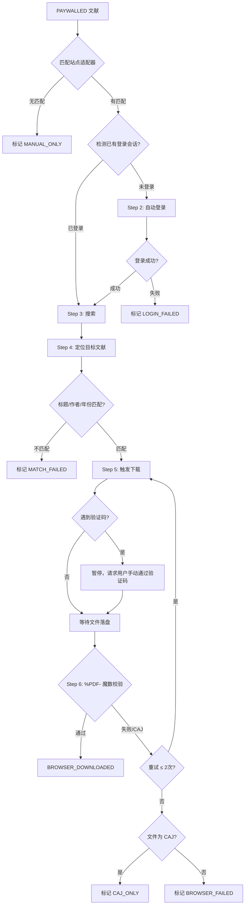

# Stage 8B: 浏览器辅助兜底下载操作协议 (Browser-Assisted Fallback Download Protocol)

## 一、规程目的与触发条件

当 Stage 8 的合法 OA 自动下载完成后，如果《全文获取台账》中仍存在 `PAYWALLED` 状态的文献，且用户已在项目中配置了至少一个 `enabled: true` 的站点适配器（`site_registry.json`），则自动进入本阶段。

**触发条件（必须同时满足）**：
1. Stage 8 台账中 `PAYWALLED` 文献数 ≥ 1；
2. `site_registry.json` 中至少有一个站点 `enabled: true`；
3. 对应站点所需的凭据在 `.env` 文件中完整存在。

**不触发**：以上任一条件不满足时，直接跳过本阶段，PAYWALLED 文献保留原状标记。

---

## 二、站点适配器注册表 (`site_registry.json`)

每个站点适配器描述一个学术文献下载源的完整操作序列。注册表是 JSON 数组结构，每个适配器包含以下字段：

| 字段 | 类型 | 说明 |
|---|---|---|
| `id` | string | 唯一标识符（如 `cnki`, `wanfang`, `university_proxy`） |
| `name` | string | 人类可读名称 |
| `enabled` | boolean | 是否启用 |
| `match_rules.language` | string[] | 匹配文献语言（如 `["zh"]` 或 `["en"]`） |
| `match_rules.doc_types` | string[] | 匹配文献类型（如 `["journal_article", "thesis"]`） |
| `match_rules.priority` | integer | 优先级，数字越小越优先 |
| `login.url` | string | 登录页面 URL |
| `login.credential_keys` | object | 凭据字段名到 `.env` 变量名的映射 |
| `login.method` | string | 登录方式：`form_submit` / `sso_redirect` |
| `login.success_indicator` | string | 登录成功的页面特征文本 |
| `search.url_template` | string | 搜索 URL 模板，`{title}` 和 `{doi}` 为占位符 |
| `search.strategy` | string | 搜索策略：`title_search`（默认） / `doi_redirect` |
| `post_download.expected_extension` | string | 预期下载格式（`.pdf`） |
| `post_download.fallback_extension` | string | 备选格式（如 `.caj`） |

用户使用时需将 `assets/site_registry_template.json` 复制到项目根目录或指定配置目录，填入实际 URL 并设置 `enabled: true`。

---

## 三、凭据安全铁律 (Credential Security Hard Rules)

> [!CAUTION]
> 以下规则为本阶段的不可违反安全边界。

### 铁律 1：凭据只存在于 `.env` 文件
- 凭据必须以环境变量形式存储在 `.env` 文件中；
- `.env` 文件必须在 `.gitignore` 中（Agent 启动 Stage 8B 前必须验证）；
- Agent 绝不以任何形式（硬编码、配置文件内联、命令行参数）存储或传输密码明文。

### 铁律 2：凭据绝不出现在输出中
- Agent 的对话输出、日志、台账、审计报告、Gatekeeper 评分卡中，**绝对禁止**包含用户名或密码明文；
- 日志中仅可记录 `[CREDENTIAL_LOADED: CNKI_USERNAME=***]` 形式的脱敏确认。

### 铁律 3：凭据缺失时静默跳过
- 如果 `.env` 不存在，或某站点所需的凭据变量缺失，该站点自动跳过；
- 跳过时标记 `CREDENTIAL_MISSING`，绝不向用户追问密码。

---

## 四、浏览器操作标准序列 (Browser Operation Sequence)

对每篇 PAYWALLED 文献，按以下 7 步执行：

### Step 1：站点匹配

根据文献的 `language` 和 `doc_type` 字段，遍历 `site_registry.json` 中所有 `enabled: true` 的适配器，选择 `priority` 最小（最高优先级）且规则匹配的适配器。

### Step 2：自动登录

1. 导航至适配器的 `login.url`；
2. 从 `.env` 读取 `credential_keys` 映射的变量值；
3. 在页面中定位用户名和密码输入框，填入凭据并提交；
4. 等待页面跳转或刷新，检查 `success_indicator` 文本是否出现；
5. 若 10 秒内未出现成功指示，标记 `LOGIN_FAILED` 并跳过该站点全部文献。

### Step 3：搜索

- **`title_search` 策略**：导航至 `search.url_template`，将 `{title}` 替换为文献标题（URL 编码）；
- **`doi_redirect` 策略**：导航至 `search.url_template`，将 `{doi}` 替换为文献 DOI，通过代理直达出版商页面。

### Step 4：定位与匹配验证

在搜索结果页中定位第一条结果，提取其标题、作者、年份，与目标文献进行交叉验证：
- **标题相似度**：归一化后模糊匹配（容差：去除标点和空格后 ≥ 85% 字符重叠）；
- **年份精确匹配**：必须完全一致；
- **作者模糊匹配**：第一作者姓氏必须出现在结果的作者列表中。

不满足以上任一条件时标记 `MATCH_FAILED`，绝不下载错误文献。

### Step 5：触发下载

- 点击 PDF 下载按钮（优先 PDF，备选 CAJ）；
- 等待文件下载完成（超时 60 秒）；
- 若遇到验证码弹窗，**暂停执行并在对话中通知用户**：
  > "站点 [站点名] 要求验证码验证。请在浏览器中手动完成验证码，完成后回复'继续'。"

### Step 6：文件校验

与 Stage 8 相同的严苛校验：
1. 文件头必须以 `%PDF-` 开头；
2. 文件大小 ≥ 10 KB；
3. 若文件头为 CAJ 格式（`0xC8 0xCA...` 或其他 CAJ 魔数），标记 `CAJ_ONLY` 并提示用户使用 CAJViewer 转换。

### Step 7：台账更新

将结果写入全文获取台账，更新状态码：

| 结果 | 状态码 | 说明 |
|---|---|---|
| PDF 下载成功且校验通过 | `BROWSER_DOWNLOADED` | 记录来源站点 ID |
| 仅获取到 CAJ 格式 | `CAJ_ONLY` | 需用户本地转换 |
| 登录失败 | `LOGIN_FAILED` | 记录失败原因 |
| 搜索结果不匹配 | `MATCH_FAILED` | 防止下错文献 |
| 下载或校验失败（重试耗尽） | `BROWSER_FAILED` | 记录失败原因 |
| 无匹配适配器 | `MANUAL_ONLY` | 建议用户手动下载 |
| 凭据缺失 | `CREDENTIAL_MISSING` | 静默跳过 |

---

## 五、并发控制与效率约束

- **单次 Stage 8B 最大处理文献数**：20 篇。超出部分按优先级排序后截断，标记 `QUOTA_EXCEEDED`，剩余文献保留 `PAYWALLED` 状态；
- **同站点连续请求间隔**：≥ 3 秒（避免触发反爬）；
- **登录会话复用**：同一站点的多篇文献共享一次登录会话，不重复登录。

---

## 六、与 Stage 8 的关系

- Stage 8B 是 Stage 8 的**可选延伸**，不是替代；
- Stage 8B 的所有下载结果合并进同一份《全文获取台账》；
- Quality Gatekeeper 的审计范围自动扩展至 Stage 8B 产出。
