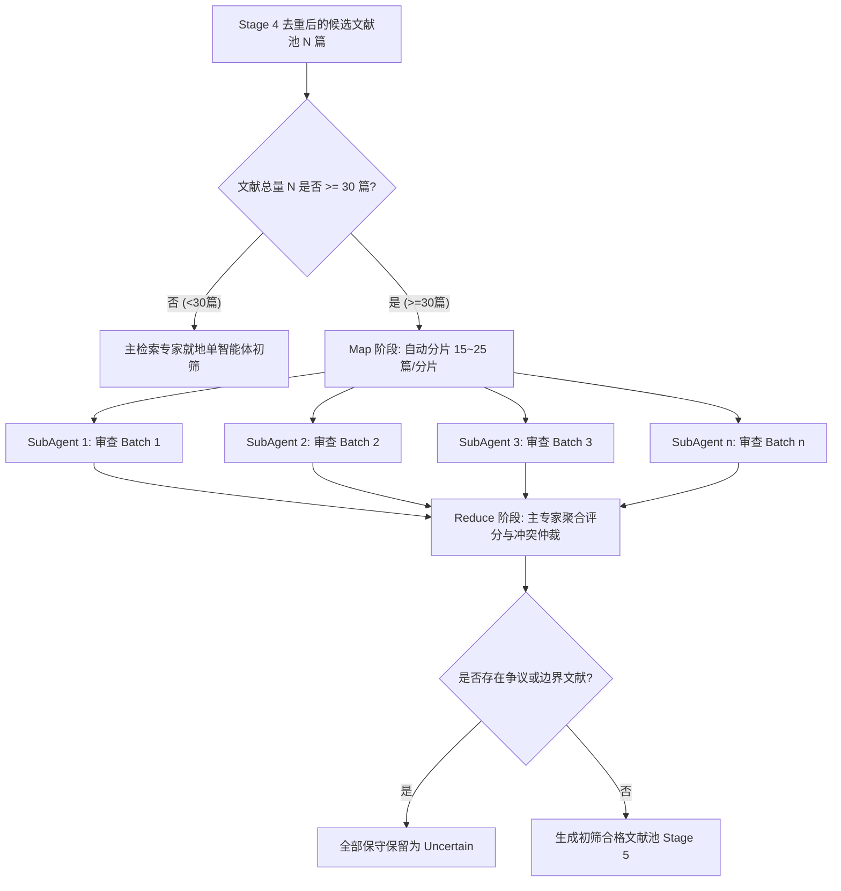

# 海量文献多 SubAgent 并发初筛规程 (Multi-SubAgent Concurrent Screening Protocol)

## 一、为什么需要多 SubAgent 并发初筛 (Map-Reduce)？

在系统化文献检索中，经过跨库检索与四级去重后，往往会产生 50–300 篇候选文献。
如果由单一 Agent 在同一个对话上下文中逐篇阅读摘要进行判断，将面临两大严重缺陷：
1. **上下文严重膨胀 (Context Bloat)**：数百篇文献的标题与摘要会迅速消耗数万 Token，极度挤占宝贵的推理窗口；
2. **注意力衰减与漂移 (Attention Drift)**：大模型在长文本单次处理后半段时，对纳入/排除标准的执行尺度容易发生疲劳漂移（出现首尾标准不一）。

**本规程引入 Map-Reduce 并发架构**：当文献量达到阈值时，自动将文献分块（Chunking），并发派生轻量子智能体（SubAgents）独立打分，最后由主导专家进行聚合与争议仲裁。

---

## 二、并发初筛触发阈值与分块策略 (Batching Strategy)



- **触发阈值**：$N \ge 30$ 篇；
- **分块尺寸**：每个 Batch 固定为 **15–25 篇**（单次调用 Token 控制在 4k–8k 内，处于 LLM 逻辑判断的最佳敏锐区间）；
- **最大并发度**：同时派生 2–5 个 SubAgent 并发运行。

---

## 三、SubAgent 独立初筛指令与输入契约 (SubAgent Prompt Contract)

当调用 `invoke_subagent` 派生子审查员时，必须传递标准化的微型提示词：

### 1. 角色与任务定义 (Role & Task)
```text
你是一名极其严谨的科研文献初筛审查员 (Literature Screening SubAgent)。
你的唯一任务是：对照给定的【科学问题】与【纳入/排除标准】，逐条审查下述文献批次（Batch）的标题与摘要，输出纯 JSON 格式的初筛裁决结果。
```

### 2. 传递的输入数据 (Input Payload)
```json
{
  "research_question": "利用粪便 DNA 微卫星进行鹿科动物个体识别与种群评估",
  "inclusion_criteria": [
    "I1: 研究涉及鹿科或有蹄类物种",
    "I2: 涉及粪便等非损伤性样本或微卫星 (STR) 标记",
    "I3: 涉及个体识别、遗传标记或种群估算"
  ],
  "exclusion_criteria": [
    "EXC_TAXON: 非目标动物类群",
    "EXC_METHOD: 纯非遗传学食性分析或解剖学",
    "EXC_DOC_TYPE: 征稿通知、书评、勘误"
  ],
  "batch_records": [
    {
      "id": "REC001",
      "title": "...",
      "abstract": "..."
    }
  ]
}
```

### 3. SubAgent 产出契约 (Output Schema)
SubAgent 必须严格返回如下 JSON 数组，严禁包含任何前缀闲聊：
```json
[
  {
    "id": "REC001",
    "status": "Include",
    "reason_code": "MATCH_ALL",
    "reason_detail": "摘要明确使用粪便微卫星进行个体识别与种群计数",
    "confidence_score": 0.95
  },
  {
    "id": "REC002",
    "status": "Exclude",
    "reason_code": "EXC_TAXON",
    "reason_detail": "研究对象为食肉目豹属，非鹿科有蹄类",
    "confidence_score": 0.98
  },
  {
    "id": "REC003",
    "status": "Uncertain",
    "reason_code": "BORDERLINE_TOPIC",
    "reason_detail": "摘要仅提及有蹄类调查，未说明具体分子标记类型，建议保留全文复核",
    "confidence_score": 0.60
  }
]
```

---

## 四、Reduce 阶段：聚合与冲突仲裁机制

主检索专家收集到所有 SubAgent 的 JSON 裁决后，执行标准化 Reduce 聚合：

1. **结构化拼装**：将各分片的打分结果按 `id` 回填至全局文献库；
2. **保守保留兜底 (Conservative Principle)**：
   - 凡有任何 SubAgent 标记为 `Uncertain` 或置信度 $\text{confidence} < 0.70$ 的文献，**一律直接归入 `Uncertain` 候选池**，禁止降级为 Exclude；
3. **排除原因审计**：
   - 检查所有 `Exclude` 文献是否附带标准错误代码（`EXC_TAXON`, `EXC_METHOD` 等），对未说明具体理由的排除项强制回退为 `Uncertain`。
4. **统计各批次初筛产出**：
   - 记录初筛批次总览表，作为检索报告中 Stage 5 的流转证据。
