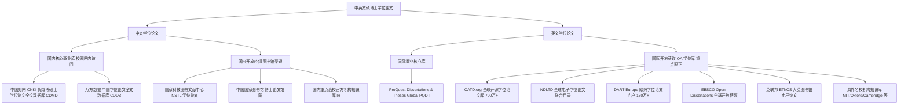

# 中英文硕博士学位论文专项检索与下载规程 (Theses & Dissertations Retrieval Protocol)

## 一、为什么学位论文在严谨科研中具有不可替代性？

在学术研究（尤其是生命科学、生态学、实验科学与工程技术）中，期刊论文（Journal Articles）往往受限于期刊版面、字数限制和出版成本，通常会大幅度精简甚至隐藏关键细节：
- ❌ 详细的实验体系优化过程与失败的负结果（Negative Results）；
- ❌ 完整的引物退火温度梯度、多管 PCR 重复批次详细参数、等位基因阶梯比对基线；
- ❌ 野外野外样线详细经纬度坐标、生境微生境调查原始附表；
- ❌ 完整的统计建模原始代码与长尾样本明细。

**而硕博士学位论文（Master's Theses & PhD Dissertations）具有篇幅宏大、数据详实、实验记录完整的特征**。对同行课题组历届硕博士论文的系统调研，是获取第一手实验方法、避开实验暗坑和挖掘海量原始数据的最强武器。

---

## 二、中英文硕博论文专门数据源矩阵 (Database Matrix)

学位论文的存储与检索入口与普通期刊论文截然不同，必须定向调度以下专门平台：



---

## 三、学位论文专属检索维度与操作法

在检索学位论文时，必须激活普通文献不具备的**四大专属维度**：

### 1. 导师与课题组反向追溯 (Advisor / Supervisor Chasing)
- **原理**：该领域的领军科学家、权威教授的历届研究生论文，往往在同一科学问题上进行了长达 10–20 年的连续深入探索。
- **操作**：通过检索特定导师姓名（如“郑荣泉”、“张恩迪”等），一次性锁定该课题组所有毕业生的第一手实证论文。

### 2. 学位授予单位 / 培养机构靶向筛选 (Degree Granting Institution)
- **原理**：国内外的顶级研究型大学与科研院所汇集了该领域最优质的学位论文产出。
- **操作**：限定该学科代表性机构（如生命科学领域的中国科学院动物研究所、华东师范大学、东北林业大学；国外如 UC Berkeley, Oxford, Cambridge, Wageningen University）。

### 3. 学位级别分层 (Degree Level Filtering)
- **硕士论文 (Master's Thesis)**：侧重于具体的野外实地调查、单点实验优化、位点多态性筛选或区域性本底数据调查；
- **博士论文 (PhD Dissertation)**：侧重于全局演化机制、复杂统计模型构建、体系化方法学创新或大尺度保护规划。

### 4. 答辩年份与保密期识别 (Defense Year & Embargo)
- 学位论文通常有 1–3 年的延期公开/保密期（Embargo Period）。对于近 1–2 年毕业的论文，若商业库未见全文，可通过大学官方机构知识库（IR）获取公开摘要或致谢中提及的已发表章节。

---

## 四、主流学位数据库专业检索语法生成标准

通用词矩阵助手 ([domain_advisor.md](../role/domain_advisor.md)) 在用户确认需要学位论文后，自动编译输出以下标准代码块：

### 1. 中国知网 CNKI 博硕士数据库 (CDMD) 专业检索语法
```text
(主题 = '粪便DNA' + '非损伤取样') AND (主题 = '微卫星' + 'STR') AND (主题 = '野生动物' + '濒危兽类') AND (学位级别 = '博士' + '硕士')
```
*若需要限定核心院校与导师*：
```text
((主题 = '微卫星') AND (学位级别 = '博士' + '硕士')) AND (学位授予单位 = '中国科学院' + '北京林业大学' + '东北林业大学')
```

### 2. 万方数据学位论文高级检索式
```text
(题名或关键词:("粪便DNA" OR "非损伤") AND 题名或关键词:("微卫星" OR "个体识别")) AND 学位级别:("博士" OR "硕士")
```

### 3. ProQuest Dissertations & Theses (PQDT) 高级检索语法
```text
ti("fecal DNA" OR "faecal DNA" OR "noninvasive") AND ab("microsatellite*" OR "STR") AND deg(ph.d. OR doctoral OR master)
```
*若限定特定大学或导师*：
```text
ti("fecal DNA" OR "noninvasive genetic") AND schl("University of California" OR "Oxford") AND deg(ph.d.)
```

---

## 五、开源学位论文 (OA) 专门下载流水线

由于普通 DOI 解析器对学位论文支持有限（多数学位论文分配的是 Handle、HDL 或内部 accession，而非 Crossref DOI），下载脚本执行专门的解析机制：

### 1. 识别并提取开源直链
- **OATD.org**：解析其返回的大学官方机构知识库（Institutional Repository）直链；
- **高校机构知识库 (DSpace / Eprints / Fedora)**：
  - 自动识别形如 `https://dspace.mit.edu/handle/...`、`https://ora.ox.ac.uk/...`、`https://hdl.handle.net/...` 的落地页；
  - 自动嗅探以 `/bitstream/...`、`/download/...`、`.pdf` 结尾的直链；
- **欧洲 DART-Europe**：直接获取参与欧洲高校联合体的公开 PDF。

### 2. 硕博论文专有命名规则
学位论文由于篇幅较大，统一命名规范为：
```text
<年份>_<学位级别(PhD/Master)>_<作者姓氏>_<学校缩写>_<标题英文短串>.pdf
```
*示例*：
- `2018_PhD_Zhang_PKU_Noninvasive_genetics_wildlife.pdf`
- `2021_Master_Li_CAS_Fecal_DNA_individual_identification.pdf`

### 3. 商业付费库（CNKI/万方/PQDT）人工补检指引
由于知网优秀博硕士库和 ProQuest PQDT 属于高价值商业付费数据库，无法直接通过外网无鉴权下载。系统将在《全文获取台账》中将此类文献明确标注为 🔒 **PAYWALLED**，并输出：
- 中文论文对应的知网/万方系统专属链接（URL）；
- 英文论文对应的 ProQuest Document ID / URL；
- 指导用户在学校校园网/机构 IP 内直接点击下载，或通过校图书馆“学位论文递送服务”获取。
