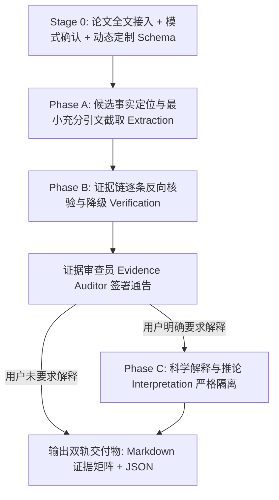

# 学科文献证据抽取与事实核验专业技能 (literature-evidence-extraction)

本技能用于在严谨科研场景下，从用户提供的学术论文全文（PDF、文本或补充材料）中，按照指定字段进行**严格、可追溯、证据绑定、零臆测**的信息抽取与结论核验（Evidence-Bound Literature Extraction & Claim Auditing）。

> **核心哲学**：
> 本技能是 **Evidence Extractor（证据抽取器）**，绝非 Summarizer（概述器）或 Explainer（解释器）。
> 它只回答：**“这篇论文实际上写了什么？”**
> 绝不回答：**“按照领域常识，它应该是什么？”**
> 
> 严厉执行总原则：**Quote → Extract → Verify → Interpret**
> 严厉禁止反模式：**Read → Remember → Guess → Answer**
> 核心承诺：**没有直接证据时输出 `NR`（Not Reported），严禁捏造看起来合理的参数。**

---

## ⚡ 上下文预算与按需渐进加载准则 (Progressive Context Loading Protocol)

> [!CAUTION]
> **严禁全量一次性预加载**：本 Skill 包含 20 个模块文件。在触发激活时，**绝对禁止**一次性通读 `references/`、`role/`、`examples/` 或 `assets/` 中的所有文件。Agent 必须严格遵守以下阶段化按需读取策略，严守上下文预算！

### 阶段 1：Stage 0 上下文感知科研决策门禁 (Context-Aware Research Gate)
- **执行序列**：
  1. **Stage 0A — Context Resolution**：自动读取任务附件/PDF、历史对话、上游 Discovery 检索产物与 Schema 快照，进行全文预检（无全文则熔断）；自动识别多队列/多数据集，输出《现有科研上下文确认简报》，已知约束与 Schema 自动确认，严禁对已知要素重复询问；
  2. **Stage 0B — Adaptive Grill-Me**：读取 [references/stage0_grill_me.md](./references/stage0_grill_me.md) 与 `shared/grill_me/`，仅从未决的 `CRITICAL`（目的、Schema、实验隔离）与关键 `HIGH_IMPACT` 维度中动态生成 3~5 个结构化提问，每题附带 Recommended 选项与依据，严格执行 STOP Rule 静默等待用户确认；
  3. **Stage 0C — Protocol Snapshot**：用户确认后固化全字段来源审计快照（`[USER]` / `[CONTEXT]` / `[UPSTREAM]` / `[PROJECT]` / `[INFERRED]` / `[DEFAULTED]` / `[SYSTEM_RULE]`），解锁 Phase A 实质抽取。
- **禁止提前读取**：任何 Phase A+ 的规程、角色文件、模板或案例。

---

### 阶段 2：模式分支按需流转加载

#### 📋 分支 A：常规字段抽取模式 (Extract Mode)
- **执行流转**：
  1. 仅按需加载 [references/evidence_levels_and_status.md](./references/evidence_levels_and_status.md)（掌握 E1-E4 评级与状态标签）；
  2. 若抽取关键实验参数（引物、温度、浓度、样品量），按需加载 [references/table_and_supplement_priority.md](./references/table_and_supplement_priority.md)；
  3. **仅当论文包含多个并行实验体系时**（如同时包含物种鉴定、分型、性别鉴定实验），才加载 [references/assay_context_isolation.md](./references/assay_context_isolation.md) 进行上下文隔离；
  4. 抽取完成进入质检前，由审查员加载 [role/evidence_auditor.md](./role/evidence_auditor.md) 进行独立红蓝核对。

#### 🔍 分支 B：既有结论事实审计模式 (Audit Mode)
- **执行流转**：
  1. 专门加载 [references/audit_mode_protocol.md](./references/audit_mode_protocol.md)；
  2. 针对用户提交的既有 Claim 列表，调用 `scripts/audit_claims.py` 进行表层候选定位与数值协同校验（确定性定位器，输出线索与位置）；
  3. 由 Evidence Auditor 审查员进行语义真伪判定，严禁将表层定位结果直接等同为最终事实裁决，给出标准判定标签（SUPPORTED / PARTIALLY_SUPPORTED / UNSUPPORTED / CONTRADICTORY / AMBIGUOUS / OCR_UNCERTAIN）。

#### 🤖 分支 C：Headless / 自动化脚本管道模式
- **直接执行辅助脚本**：使用 `scripts/pdf_evidence_locator.py` 或 `scripts/audit_claims.py`；
- **硬性输出契约**：结构化 JSON 输出必须严格遵循 canonical `schemas/extraction_result.schema.json`。

---

## 一、三位一体协同角色架构 (Triad Role Architecture)

技能执行中由三个专门角色协同运作（详见 `role/` 目录）：

1. **主导抽取专员 ([specialist_role.md](./role/specialist_role.md))**：
   - 统筹执行全流程抽取，严格遵循 8 大铁律；
   - 负责正文/表格/附录拆解、截取最小充分原文引句并提取候选值；
   - 严禁凭空脑补、严禁把引用别人研究当成本文结果、严禁将 Discussion 推测记为结论。
2. **实验上下文与动态 Schema 建模助手 ([context_modeler.md](./role/context_modeler.md))**：
   - 动态解析目标论文结构并构建针对性抽取 Schema；
   - 负责复杂实验体系（Assay Context）严格隔离，防止不同实验参数交叉污染；
   - 建立正文、主表与补充材料的数据映射层级。
3. **证据链独立核验审查员 ([evidence_auditor.md](./role/evidence_auditor.md))**：
   - **独立一票降级与否决权**：在交付最终报告前对每个字段进行反向对账核验；
   - 审查候选值是否能由引文直接推导；对无法证实者一律强制降级为 `DERIVED`、`REFERENCED` 或 `NR`；
   - 检查 OCR 风险标记，签署核验通告令。

---

## 二、运行模式 (Operating Modes)

| 模式名称 | 核心任务 | 典型输入 | 目标产出 | 适用场景 |
|---|---|---|---|---|
| **Extract Mode**<br>*(标准抽取)* | 结构化参数抽取与证据绑定 | 论文 PDF/全文 + 指定/建议 Schema | Markdown 证据矩阵<br>+ 伴生 JSON 实体文件 | 提取实验方法参数、建立样本数据库、收集引物/反应条件 |
| **Audit Mode**<br>*(结论反查)* | 既有主张/Claim 的原文真伪核实 | 论文全文 + 待核查结论清单 | 逐条核验证据表<br>(SUPPORTED/UNSUPPORTED/CONTRADICTORY) | 审稿事实核查、验证综述引用真实性、纠正文献笔记错误 |
| **Batch-Matrix**<br>*(多篇矩阵)* | 跨文献同字段横向横排提取 | 5–20 篇同主题论文全文 | 横向多文献对比矩阵<br>+ 差异标记 | 比较不同课题组实验体系、微卫星筛选策略对比 |

---

## 三、三阶段标准工作流 (Three-Phase Workflow)



### 0. Stage 0 — 自适应科研决策门禁 (Context-Aware Research Gate)
在执行任何正文解析或数据抽取前，系统强制接入自适应科研决策门禁（三阶段流水线，详见 [stage0_grill_me.md](./references/stage0_grill_me.md)、[grill_dimensions.md](./references/grill_dimensions.md) 与 `shared/context_resolution/`）：
- **Stage 0A：科研上下文解析层 (Context Resolution Layer)**：
  - 自动读取任务附件/PDF、对话历史、上游 Discovery 产物（继承已确定的时间范围与检索协议）以及上游 Schema 快照；
  - 核验输入是否具备论文全文（PDF 或完整文本）；若仅有摘要坚决熔断，拒绝提取实验参数；
  - 若输入文献中检测到多队列/多数据集（Multi-Cohort），自动识别出上下文复杂性，并在《现有科研上下文确认简报》中标记，保留 E4 隔离决策供确认；
  - 已知约束与上游 Schema 自动确认为 `RESOLVED`（标记 `[USER]` / `[CONTEXT]` / `[UPSTREAM]`），杜绝重复询问。
- **Stage 0B：自适应科研决策追问 (Adaptive Research Grill-Me)**：
  - 评估 E1 至 E9 决策维度，仅从未决的 `CRITICAL` 维度（E1 目的、E3 Schema、E4 实验隔离）与关键 `HIGH_IMPACT` 维度（E5 重计算、E6 单位归一化）中动态生成 **3~5 个** 结构化提问；
  - 每题配备带有充分依据的 `(Recommended)` 选项与置信度标签；
  - **严格交互硬门禁 (STOP Rule)**：**Agent 输出问题后必须立即终止当前回复，进入静默等待状态**，严禁在同一回复中自问自答或直接调用抽取工具。
- **Stage 0C：协议快照生成与执行放行 (Protocol Snapshot & Execution Gate)**：
  - 支持 `按推荐`、`1A 2B 3C` 极速回复，确认后生成包含完整来源追溯（`[USER]` / `[CONTEXT]` / `[UPSTREAM]` / `[PROJECT]` / `[INFERRED]` / `[DEFAULTED]` / `[SYSTEM_RULE]`）的 Protocol Snapshot，状态转为 `CONFIRMED` 后解锁 Phase A。

### 1. Phase A — Extraction（纯粹抽取）
- 只定位原文句子、表格行、附录；
- 截取“最小充分原句（Verbatim Quote）”；
- 提取原始字面值（Candidate Value），不做任何评价与推论。

### 2. Phase B — Verification（证据核验）
- 逐条审查：**当前候选值是否能由原句直接、完全支持？**
- 严格评定四级证据体系代码：
  - **E1 (EXPLICIT)**：原文明示，直接匹配；
  - **E2 (DERIVED)**：原文提供数据计算得出，必附推导公式；
  - **E3 (REFERENCED)**：引述外文（如“following Smith 2012”），本篇值记为 `NR`，引文单列；
  - **E4 (NR)**：Not Reported，全文未提及，绝不常识补缺。
- 标记状态标签（`SUPPORTED`, `UNSUPPORTED`, `CONTRADICTORY`, `AMBIGUOUS`, `OCR_UNCERTAIN`）。
- **NR 语义防护（NOT_REPORTED ≠ UNSUPPORTED）**：未报告记录的 `claim_status` 一律记 `AMBIGUOUS` 并在 notes 注明「NR 非论断」，严禁记 `UNSUPPORTED`——"论文没写"不等于"论文说错了"。

### 3. Phase C — Interpretation（科学解释，仅在用户明确要求时启用）
- **严格与证据表物理隔离**，以独立章节 `### 科学解释与分析推论 (Scientific Interpretation)` 呈现；
- 明确区分“文献事实记录”与“AI 分析推论”，绝不把推论回填至事实表。

---

## 四、三轨输出契约 (Output Contract: Markdown 底稿 + JSON 合同 + HTML 报告)

### 1. 标准 Markdown 证据矩阵
必须遵循统一表头与最小充分引用格式：
```markdown
| 字段 | 抽取值 | 支撑类型 | 证据强度 | 逐字引句（最小充分） | 位置 | 状态 | 备注 |
|---|---|---|---|---|---|---|---|
| PCR volume | 20 μL | EXPLICIT（明示/E1） | 直接实证 | “PCR was performed in a total volume of 20 μL containing...” | Page 4, §2.3 | SUPPORTED | — |
| Annealing Temp | 55°C (正文) / 53°C (表2) | EXPLICIT（明示/E1） | 直接实证 | Methods: “annealed at 55°C”; Table 2: “Ta = 53°C” | Page 4 & Table 2 | CONTRADICTORY | 正文与表格矛盾，需人工复核 |
| DNA Extraction | following Waits et al. 2001 | REFERENCED（引自他文/E3） | 二手证据 | “Fecal DNA was extracted following Waits et al. (2001).” | Page 3, §2.2 | SUPPORTED | 本文未列细节，仅引用；本篇值记 NR |
| BSA concentration | NR | NOT_REPORTED（未报告/E4） | 未知 | — | — | AMBIGUOUS | NR 语义防护：未报告≠不支持，严禁记 UNSUPPORTED |
```

### 2. 伴生落盘结构化 JSON 文件
每篇提取结果必须在工作区生成同名伴生 JSON（如 `<Paper_Slug>_evidence.json`），严格通过 `schemas/extraction_result.schema.json`（及其引用的 `schemas/evidence_record.schema.json`）结构验证。

### 3. HTML 可视化报告（全中文，便于直接阅读与归档）
由 `scripts/evidence_matrix_html.py -i <evidence.json> -o <report.html>` 自动渲染：全中文表头与色标徽章、统计面板、审计裁决框、
派生计算与未报告记录的特殊视觉标记。自包含单文件（内联 CSS、无 CDN、无 JS），离线双击即可阅读。HTML 是 Markdown 底稿的呈现层，
内容以 JSON 合同为单一真源，两者必须同批生成、同批交付。

---

## 五、技能协同与交接契约 (Workflow Handoff)

- **上游承接**：接收 [`literature-discovery-acquisition`](../literature-discovery-acquisition/SKILL.md) 检索下载的合法 OA PDF 或机构仓储全文；
- **下游交付**：将核验后的结构化事实矩阵与参数表直接交接给 [`literature-synthesis`](../literature-synthesis/SKILL.md)，作为学术争议诊断与跨篇证据对决的基础数据源。

---

## 六、支撑资源与文档目录

- **角色规范 (`role/`)**：
  - [specialist_role.md](./role/specialist_role.md)：主导抽取专员契约与 8 大硬铁律
  - [context_modeler.md](./role/context_modeler.md)：上下文隔离与动态 Schema 建模助手
  - [evidence_auditor.md](./role/evidence_auditor.md)：独立证据链核验员与一票否决审计
- **核心规程 (`references/`)**：
  - [stage0_grill_me.md](./references/stage0_grill_me.md)：Stage 0 模式选择与动态 Schema 交互规程
  - [evidence_levels_and_status.md](./references/evidence_levels_and_status.md)：E1-E4 四级证据与状态标签定义
  - [assay_context_isolation.md](./references/assay_context_isolation.md)：复杂多实验体系参数隔离指南
  - [table_and_supplement_priority.md](./references/table_and_supplement_priority.md)：表格优先与 OCR 噪声防护指南
  - [audit_mode_protocol.md](./references/audit_mode_protocol.md)：既有科研结论反查审计规程
  - [interpretation_boundary.md](./references/interpretation_boundary.md)：事实抽取与科学解释边界隔离指南
- **辅助工具 (`scripts/`)**：
  - `scripts/pdf_evidence_locator.py`：PDF 页面与精准原句定位器（含特殊符号与 OCR 噪声检测）
  - `scripts/audit_claims.py`：既有 Claim 事实核查反查比对工具
  - `scripts/quote_audit.py`：引句回查硬校验门——证据 JSON 每条 verbatim_quote 必须回查源文献定位（EXACT/HYPHEN_JOIN/FUZZY），NOT_FOUND 即门禁失败，零模型判断
  - `scripts/evidence_matrix_html.py`：证据 JSON → 全中文自包含 HTML 报告渲染器（色标徽章/统计面板/NR 视觉防护/派生公式高亮，零依赖离线可读）
- **资产与模板 (`assets/`)**：
  - **Canonical Schemas**：提取与证据产物遵循 [`schemas/extraction_result.schema.json`](../../schemas/extraction_result.schema.json) 与 [`schemas/evidence_record.schema.json`](../../schemas/evidence_record.schema.json)（统一单一真源，Skill assets 内不保留重复 executable schema）
  - [evidence_table_template.md](./assets/evidence_table_template.md)：标准 Markdown 证据矩阵模板
  - [audit_report_template.md](./assets/audit_report_template.md)：审计模式反查报告模板
  - [extraction_audit_log_template.md](./assets/extraction_audit_log_template.md)：抽取审计轨迹日志模板
- **案例与反模式 (`examples/`)**：
  - [molecular_ecology_extraction_case.md](./examples/molecular_ecology_extraction_case.md)：分子生态与 PCR 全流程实操案例
  - [audit_mode_verification_case.md](./examples/audit_mode_verification_case.md)：既有文献结论争议审查与纠错案例
  - [anti_patterns.md](./examples/anti_patterns.md)：14 大学术抽取反模式与负向对照清单
