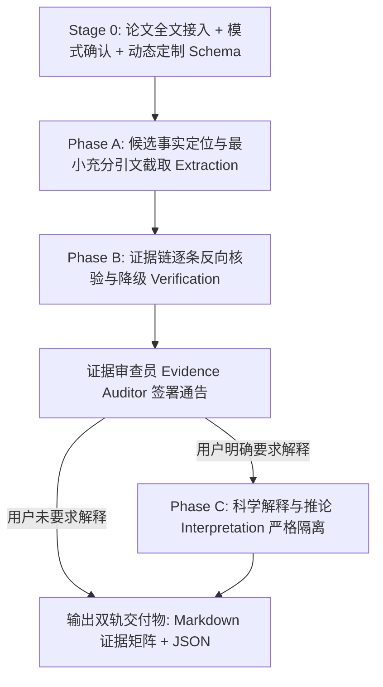

# 学科文献证据抽取与事实核验专业技能 (literature-evidence-extraction)

本技能用于在严谨科研场景下，从用户提供的学术论文全文（PDF、文本或补充材料）中，按照指定字段进行**严格、可追溯、证据绑定、零臆测**的信息抽取与结论核验（Evidence-Bound Literature Extraction & Claim Auditing）。

> **核心哲学**：
> 本技能是 **Evidence Extractor（证据抽取器）**，绝非 Summarizer（概述器）或 Explainer（解释器）。
> 它只回答：**“这篇论文实际上写了什么？”**
> 绝不回答：**“按照领域常识，它应该是什么？”**
> 
> 严厉执行总原则：**Quote → Extract → Verify → Interpret**
> 严厉禁止反模式：**Read → Remember → Guess → Answer**
> 核心承诺：**没有直接证据时输出 `NR`（Not Reported），严禁捏造看起来合理的参数。**

---

## ⚡ 上下文预算与按需渐进加载准则 (Progressive Context Loading Protocol)

> [!CAUTION]
> **严禁全量一次性预加载**：本 Skill 包含 20 个模块文件。在触发激活时，**绝对禁止**一次性通读 `references/`、`role/`、`examples/` 或 `assets/` 中的所有文件。Agent 必须严格遵守以下阶段化按需读取策略，严守上下文预算！

### 阶段 1：启动与前置交互门禁（仅允许加载 1 个文件，~5 KB）
- **唯一必须读取**：[references/stage0_grill_me.md](file:///d:/black-muntjac-project/.agents/skills/literature-evidence-extraction/references/stage0_grill_me.md)
- **核心动作**：确认文献全文输入、运行模式（Extract vs Audit）以及目标提取字段列表（用户指定或动态建议 Schema）。
- **禁止提前读取**：任何其他规程、角色文件、模板或案例。

---

### 阶段 2：模式分支按需流转加载

#### 📋 分支 A：常规字段抽取模式 (Extract Mode)
- **执行流转**：
  1. 仅按需加载 [references/evidence_levels_and_status.md](file:///d:/black-muntjac-project/.agents/skills/literature-evidence-extraction/references/evidence_levels_and_status.md)（掌握 E1-E4 评级与状态标签）；
  2. 若抽取关键实验参数（引物、温度、浓度、样品量），按需加载 [references/table_and_supplement_priority.md](file:///d:/black-muntjac-project/.agents/skills/literature-evidence-extraction/references/table_and_supplement_priority.md)；
  3. **仅当论文包含多个并行实验体系时**（如同时包含物种鉴定 16S PCR、微卫星分型 PCR、性别鉴定 PCR），才加载 [references/assay_context_isolation.md](file:///d:/black-muntjac-project/.agents/skills/literature-evidence-extraction/references/assay_context_isolation.md) 进行上下文隔离；
  4. 抽取完成进入质检前，由审查员加载 [role/evidence_auditor.md](file:///d:/black-muntjac-project/.agents/skills/literature-evidence-extraction/role/evidence_auditor.md) 进行独立红蓝核对。

#### 🔍 分支 B：既有结论事实审计模式 (Audit Mode)
- **执行流转**：
  1. 专门加载 [references/audit_mode_protocol.md](file:///d:/black-muntjac-project/.agents/skills/literature-evidence-extraction/references/audit_mode_protocol.md)；
  2. 针对用户提交的既有 Claim 列表，调用 `scripts/audit_claims.py` 或结合全文执行逐条反查；
  3. 仅输出三种核验裁决（SUPPORTED / UNSUPPORTED / CONTRADICTORY）。

#### 🤖 分支 C：Headless / 自动化脚本管道模式
- **直接执行辅助脚本**：使用 `scripts/pdf_evidence_locator.py` 或 `scripts/audit_claims.py`；
- **硬性输出契约**：结构化 JSON 输出必须严格遵循 `assets/evidence_extraction_schema.json`。

---

## 一、三位一体协同角色架构 (Triad Role Architecture)

技能执行中由三个专门角色协同运作（详见 `role/` 目录）：

1. **主导抽取专员 ([specialist_role.md](file:///d:/black-muntjac-project/.agents/skills/literature-evidence-extraction/role/specialist_role.md))**：
   - 统筹执行全流程抽取，严格遵循 8 大铁律；
   - 负责正文/表格/附录拆解、截取最小充分原文引句并提取候选值；
   - 严禁凭空脑补、严禁把引用别人研究当成本文结果、严禁将 Discussion 推测记为结论。
2. **实验上下文与动态 Schema 建模助手 ([context_modeler.md](file:///d:/black-muntjac-project/.agents/skills/literature-evidence-extraction/role/context_modeler.md))**：
   - 动态解析目标论文结构并构建针对性抽取 Schema；
   - 负责复杂实验体系（Assay Context）严格隔离，防止不同实验参数交叉污染；
   - 建立正文、主表与补充材料的数据映射层级。
3. **证据链独立核验审查员 ([evidence_auditor.md](file:///d:/black-muntjac-project/.agents/skills/literature-evidence-extraction/role/evidence_auditor.md))**：
   - **独立一票降级与否决权**：在交付最终报告前对每个字段进行反向对账核验；
   - 审查候选值是否能由引文直接推导；对无法证实者一律强制降级为 `DERIVED`、`REFERENCED` 或 `NR`；
   - 检查 OCR 风险标记，签署核验通告令。

---

## 二、运行模式 (Operating Modes)

| 模式名称 | 核心任务 | 典型输入 | 目标产出 | 适用场景 |
|---|---|---|---|---|
| **Extract Mode**<br>*(标准抽取)* | 结构化参数抽取与证据绑定 | 论文 PDF/全文 + 指定/建议 Schema | Markdown 证据矩阵<br>+ 伴生 JSON 实体文件 | 提取实验方法参数、建立样本数据库、收集引物/反应条件 |
| **Audit Mode**<br>*(结论反查)* | 既有主张/Claim 的原文真伪核实 | 论文全文 + 待核查结论清单 | 逐条核验证据表<br>(SUPPORTED/UNSUPPORTED/CONTRADICTORY) | 审稿事实核查、验证综述引用真实性、纠正文献笔记错误 |
| **Batch-Matrix**<br>*(多篇矩阵)* | 跨文献同字段横向横排提取 | 5–20 篇同主题论文全文 | 横向多文献对比矩阵<br>+ 差异标记 | 比较不同课题组实验体系、微卫星筛选策略对比 |

---

## 三、三阶段标准工作流 (Three-Phase Workflow)



### 1. Phase A — Extraction（纯粹抽取）
- 只定位原文句子、表格行、附录；
- 截取“最小充分原句（Verbatim Quote）”；
- 提取原始字面值（Candidate Value），不做任何评价与推论。

### 2. Phase B — Verification（证据核验）
- 逐条审查：**当前候选值是否能由原句直接、完全支持？**
- 严格评定四级证据体系代码：
  - **E1 (EXPLICIT)**：原文明示，直接匹配；
  - **E2 (DERIVED)**：原文提供数据计算得出，必附推导公式；
  - **E3 (REFERENCED)**：引述外文（如“following Smith 2012”），本篇值记为 `NR`，引文单列；
  - **E4 (NR)**：Not Reported，全文未提及，绝不常识补缺。
- 标记状态标签（`SUPPORTED`, `UNSUPPORTED`, `CONTRADICTORY`, `AMBIGUOUS`, `OCR_UNCERTAIN`）。

### 3. Phase C — Interpretation（科学解释，仅在用户明确要求时启用）
- **严格与证据表物理隔离**，以独立章节 `### 科学解释与分析推论 (Scientific Interpretation)` 呈现；
- 明确区分“文献事实记录”与“AI 分析推论”，绝不把推论回填至事实表。

---

## 四、双轨输出契约 (Output Contract)

### 1. 标准 Markdown 证据矩阵
必须遵循统一表头与最小充分引用格式：
```markdown
| Field | Extracted Value | Evidence Level | Verbatim Quote | Source Type | Location | Status | Notes |
|---|---|---|---|---|---|---|---|
| PCR volume | 20 μL | E1 (EXPLICIT) | “PCR was performed in a total volume of 20 μL containing...” | Text | Page 4, Section 2.3 | SUPPORTED | — |
| Annealing Temp | 55°C (正文) / 53°C (表2) | E1 (EXPLICIT) | Methods: “annealed at 55°C”; Table 2: “Ta = 53°C” | Text & Table | Page 4 & Table 2 | CONTRADICTORY | 存在矛盾，需人工复核 |
| DNA Extraction | following Waits et al. 2001 | E3 (REFERENCED) | “Fecal DNA was extracted following Waits et al. (2001).” | Text | Page 3, Section 2.2 | SUPPORTED | 本文未列提取细节，仅引用 Waits 2001 |
| BSA concentration | NR | E4 (NR) | — | — | — | NOT_REPORTED | 全文中未报告 BSA 参数 |
```

### 2. 伴生落盘结构化 JSON 文件
每篇提取结果必须在工作区生成同名伴生 JSON（如 `<Paper_Slug>_evidence.json`），严格通过 `assets/evidence_extraction_schema.json` 结构验证。

---

## 五、下游技能交接契约 (Handoff & Skill Boundaries)

- **上游承接**：接收 [`literature-discovery-acquisition`](file:///d:/black-muntjac-project/.agents/skills/literature-discovery-acquisition/SKILL.md) 检索下载的合法 OA PDF 或机构仓储全文；
- **单篇精读制作卡片**：将核验后的证据矩阵交接给 [`black-muntjac-literature-card`](file:///d:/black-muntjac-project/.agents/skills/black-muntjac-literature-card/SKILL.md) 凝练出标准化文献卡片；
- **多篇横向对比**：将跨论文提取的同字段结构化数据交接给 [`black-muntjac-paper-compare`](file:///d:/black-muntjac-project/.agents/skills/black-muntjac-paper-compare/SKILL.md) 自动构建学术对比大表。

---

## 六、支撑资源与文档目录

- **角色规范 (`role/`)**：
  - [specialist_role.md](file:///d:/black-muntjac-project/.agents/skills/literature-evidence-extraction/role/specialist_role.md)：主导抽取专员契约与 8 大硬铁律
  - [context_modeler.md](file:///d:/black-muntjac-project/.agents/skills/literature-evidence-extraction/role/context_modeler.md)：上下文隔离与动态 Schema 建模助手
  - [evidence_auditor.md](file:///d:/black-muntjac-project/.agents/skills/literature-evidence-extraction/role/evidence_auditor.md)：独立证据链核验员与一票否决审计
- **核心规程 (`references/`)**：
  - [stage0_grill_me.md](file:///d:/black-muntjac-project/.agents/skills/literature-evidence-extraction/references/stage0_grill_me.md)：Stage 0 模式选择与动态 Schema 交互规程
  - [evidence_levels_and_status.md](file:///d:/black-muntjac-project/.agents/skills/literature-evidence-extraction/references/evidence_levels_and_status.md)：E1-E4 四级证据与状态标签定义
  - [assay_context_isolation.md](file:///d:/black-muntjac-project/.agents/skills/literature-evidence-extraction/references/assay_context_isolation.md)：复杂多实验体系参数隔离指南
  - [table_and_supplement_priority.md](file:///d:/black-muntjac-project/.agents/skills/literature-evidence-extraction/references/table_and_supplement_priority.md)：表格优先与 OCR 噪声防护指南
  - [audit_mode_protocol.md](file:///d:/black-muntjac-project/.agents/skills/literature-evidence-extraction/references/audit_mode_protocol.md)：既有科研结论反查审计规程
  - [interpretation_boundary.md](file:///d:/black-muntjac-project/.agents/skills/literature-evidence-extraction/references/interpretation_boundary.md)：事实抽取与科学解释边界隔离指南
- **辅助工具 (`scripts/`)**：
  - `scripts/pdf_evidence_locator.py`：PDF 页面与精准原句定位器（含特殊符号与 OCR 噪声检测）
  - `scripts/audit_claims.py`：既有 Claim 事实核查反查比对工具
- **资产与模板 (`assets/`)**：
  - [evidence_extraction_schema.json](file:///d:/black-muntjac-project/.agents/skills/literature-evidence-extraction/assets/evidence_extraction_schema.json)：结构化证据标准 JSON Schema
  - [evidence_table_template.md](file:///d:/black-muntjac-project/.agents/skills/literature-evidence-extraction/assets/evidence_table_template.md)：标准 Markdown 证据矩阵模板
  - [audit_report_template.md](file:///d:/black-muntjac-project/.agents/skills/literature-evidence-extraction/assets/audit_report_template.md)：审计模式反查报告模板
  - [extraction_audit_log_template.md](file:///d:/black-muntjac-project/.agents/skills/literature-evidence-extraction/assets/extraction_audit_log_template.md)：抽取审计轨迹日志模板
- **案例与反模式 (`examples/`)**：
  - [molecular_ecology_extraction_case.md](file:///d:/black-muntjac-project/.agents/skills/literature-evidence-extraction/examples/molecular_ecology_extraction_case.md)：分子生态与 PCR 全流程实操案例
  - [audit_mode_verification_case.md](file:///d:/black-muntjac-project/.agents/skills/literature-evidence-extraction/examples/audit_mode_verification_case.md)：既有文献结论争议审查与纠错案例
  - [anti_patterns.md](file:///d:/black-muntjac-project/.agents/skills/literature-evidence-extraction/examples/anti_patterns.md)：14 大学术抽取反模式与负向对照清单
