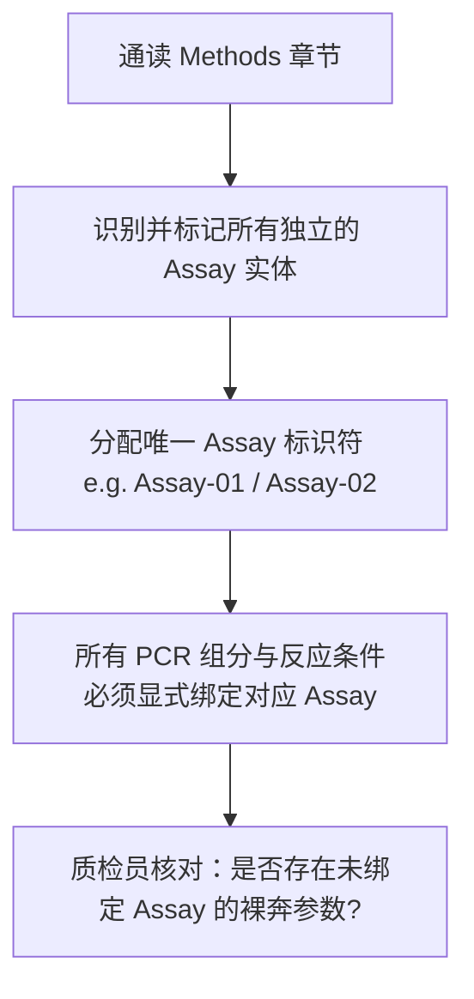

# 复杂多实验体系参数隔离指南 (Assay Context Isolation Protocol)

## 一、为什么多实验参数交叉污染是致命痛点？

在分子生物学、生态学和生物医学论文中，一篇完整的学术论文通常由多个不同的实验反应（Assays）串联而成。
例如，在一篇典型的非损伤性粪便遗传学论文中，往往同时包含以下多项实验：
1. **物种鉴定实验 (Species Identification Assay)**：扩增线粒体 Cytb 或 16S rRNA 片段，验证粪便是否来自目标物种；
2. **微卫星分型实验 (Microsatellite Multiplex PCR Assay)**：使用 10–15 对多态性 STR 引物进行个体识别；
3. **分子性别鉴定实验 (Sex Identification PCR Assay)**：扩增 Y 染色体特异性 SRY 基因；
4. **低浓度复孔实验 (Replicate PCR / Multi-tube Assay)**：对稀有或降解模板进行的多次独立复孔扩增。

### 常见的严重抽取事故（参数混淆）：
- ❌ 论文中写：`16S PCR 反应体系为 25 μL`，`微卫星 PCR 反应体系为 10 μL`。用户询问微卫星 PCR 条件时，模型却把 25 μL 填入微卫星字段；
- ❌ 论文中写：`物种鉴定退火温度 58°C`，`微卫星退火温度 53–56°C 梯度`。模型提取时直接混为一谈；
- ❌ 论文中写：`微卫星使用 AmpliTaq Gold`，`物种鉴定使用普通 Taq`。模型将试剂品牌张冠李戴。

---

## 二、Assay Context 隔离三步法

为了彻底杜绝此类串染事故，本技能推行严格的**实验上下文隔离机制**：



### 步骤 1：建立 Assay 实体清单
在进入参数提取前，首先由 `context_modeler` 在草稿区建立实验清单：

```markdown
- **[Assay-A: Species Identification]**
  - 目标：线粒体 Cytb 扩增 (395 bp)
  - 引物：L14724 / H15149
  - 章节：Methods 2.2
- **[Assay-B: Microsatellite Typing]**
  - 目标：15 个 STR 微卫星位点 (Mcr-01 ~ Mcr-15)
  - 章节：Methods 2.4 & Table 1
- **[Assay-C: Sex Identification]**
  - 目标：SRY / ZFX 扩增
  - 章节：Methods 2.5
```

---

### 步骤 2：字段命名空间化 (Namespaced Fields)
所有参数字段必须带上前缀命名空间，禁止出现无前缀的裸字段名：

| 规范字段名 (Namespaced Field) | 严禁使用的裸字段名 (Banned Naked Field) |
|---|---|
| `[Assay-B STR] PCR Reaction Volume` | `PCR Volume` (极易错取 Assay-A 的 25 μL) |
| `[Assay-B STR] Annealing Temperature` | `Annealing Temp` (极易错取 Assay-A 的 58°C) |
| `[Assay-B STR] Primer Concentration` | `Primer Concentration` |
| `[Assay-B STR] Polymerase Enzyme` | `Taq Polymerase` |

---

### 步骤 3：多 Assay 对比矩阵输出格式

当用户需要同时了解多项实验，或论文结构复杂时，应输出横向分列的 **Assay Context 对比证据表**：

```markdown
| Parameter Field | [Assay-A] Species ID (Cytb) | [Assay-B] Microsatellite STR | [Assay-C] Sexing (SRY) | Evidence Location | Status |
|---|---|---|---|---|---|
| **Target Gene / Marker** | mtDNA Cytb | 15 STR loci | SRY / ZFX | Section 2.2–2.5 | SUPPORTED |
| **Total Reaction Volume** | 25 μL (E1) | 10 μL (E1) | 15 μL (E1) | Section 2.2, 2.4, 2.5 | SUPPORTED |
| **DNA Template Volume** | 2.5 μL (E1) | 2.0 μL (E1) | 1.5 μL (E1) | Section 2.2, 2.4, 2.5 | SUPPORTED |
| **Annealing Temperature** | 58°C (E1) | 53–56°C (Table 1) (E1) | 55°C (E1) | Section 2.2 & Table 1 | SUPPORTED |
| **Polymerase Brand** | TaKaRa rTaq (E1) | Qiagen Multiplex PCR Kit (E1) | TaKaRa ExTaq (E1) | Section 2.2, 2.4, 2.5 | SUPPORTED |
| **BSA Included?** | Yes, 0.2 mg/mL (E1) | NR (E4) | NR (E4) | Section 2.2 | SUPPORTED |
```

通过此种格式，不同实验的条件一目了然，彻底杜绝了模型在潜意识中混淆试剂组分的可能。
