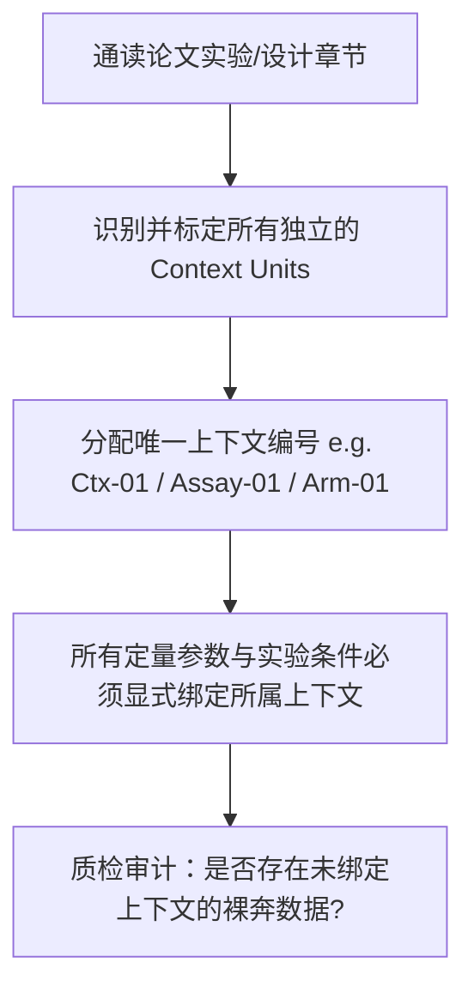

# 通用实验与观察上下文隔离指南 (Context Isolation Protocol)

> **Status**: Production Standard  
> **Applicability**: Literature Extraction across all scientific disciplines  
> **Core Principle**: Parameter extraction must be strictly bound to its independent context unit. Universal cross-discipline isolation prevents condition cross-contamination.

---

## 一、为什么跨条件/跨实验参数混淆是致命痛点？

在实证学术论文中，一篇完整的文献通常由多个不同的实验反应、对照组别、测试基准或观察批次（Context Units）组合而成。
如果不对上下文进行物理隔离，模型将产生严重的**上下文串染事故（Context Cross-Contamination）**：

### 跨学科典型混淆事故案例：
- **生命科学 / 分子实验**：
  - ❌ 论文中写：`物种鉴定 16S PCR 反应体系为 25 μL`，`微卫星分型 PCR 体系为 10 μL`。用户询问微卫星条件时，模型却错取了 25 μL。
- **计算机科学 / 机器学习**：
  - ❌ 论文在 `Dataset A (80k 数据)` 上准确率为 `88.5%`，在 `Dataset B (10k 少量样本)` 上为 `72.1%`。模型在汇报总体性能时将两个数据集的指标混为一谈。
- **临床医学 / 药理学**：
  - ❌ 试验包含 `低剂量组 (50mg)` 与 `高剂量组 (100mg)`。模型在提取不良反应发生率时，将两组数据合并计算或张冠李戴。
- **材料科学 / 化学**：
  - ❌ 在 `450°C 煅烧 2h` 条件下产物为相态 A，在 `600°C 煅烧 4h` 下为相态 B。模型错将 600°C 的物相性质赋给 450°C 的样品。
- **社会科学 / 经济学**：
  - ❌ 论文区分 `城市样本群` 与 `农村样本群` 分别做异质性分析。模型把城市子群的系数报告为全样本平均效应。

---

## 二、通用上下文隔离单元映射 (Context Unit Mapping)

根据当前激活的学科透镜（Domain Lens），上下文隔离单元（Context Unit）映射为对应的科学实体：

| 学科领域 | 最小上下文隔离单元 (Context Unit) | 典型标识符示例 | 典型混淆风险点 |
|---|---|---|---|
| **生命科学 / 分子** | 独立反应体系 (Assay / PCR Panel) | `[Assay-A: STR]`, `[Assay-B: Cytb]` | 反应体积、退火温度、试剂组分 |
| **生物医药 / 临床** | 治疗组别 / 队列 (Arm / Cohort) | `[Arm-1: Control]`, `[Arm-2: Drug-100mg]` | 样本量 N、不良反应率、给药周期 |
| **计算机科学 / AI** | 评测基准 / 模型变体 (Dataset / Variant) | `[Ctx-1: LLaMA-7B/MMLU]`, `[Ctx-2: LoRA]` | Benchmark Split、超参数、Metric |
| **材料 / 化学** | 制备批次 / 工况 (Condition / Batch) | `[Batch-A: 400C/Ar]`, `[Batch-B: 600C/Air]` | 煅烧气氛、退火温度、相变产率 |
| **社会 / 经济** | 调查轮次 / 样本亚群 (Wave / Subgroup) | `[Wave-2020: Urban]`, `[Wave-2022: Rural]` | 抽样权重、控制变量集、回归系数 |

---

## 三、上下文隔离三步法 (The 3-Step Isolation Workflow)



### 步骤 1：建立上下文实体清单 (Context Unit Inventory)
在进入参数提取前，首先由 `context_modeler` 在结构化草稿中建立上下文清单，例如：
```markdown
- **[Context-01: Low-temperature Annealing Batch]**
  - 条件：T = 400°C, Atmosphere = N2, Duration = 2h
  - 对应章节：Methods 2.2 & Table 1
- **[Context-02: High-temperature Annealing Batch]**
  - 条件：T = 600°C, Atmosphere = Air, Duration = 4h
  - 对应章节：Methods 2.3 & Table 2
```

### 步骤 2：字段命名空间化 (Namespaced Fields)
所有参数字段必须带上前缀命名空间，**严禁使用无上下文前缀的裸字段名**：
- ❌ 错误（裸字段）：`Reaction Volume` / `Accuracy` / `Yield`
- ✅ 正确（带命名空间）：`[Ctx-01] Reaction Volume` / `[Ctx-01: LLaMA-7B/GSM8k] Accuracy` / `[Batch-A] Yield`

### 步骤 3：多上下文对比矩阵输出 (Context Matrix Output)
输出横向分列的上下文对比证据表，清晰呈现组间差异：

```markdown
| Parameter Field | [Context-01] Condition A / Model A | [Context-02] Condition B / Model B | Evidence Location | Epistemic Status |
|---|---|---|---|---|
| **Primary Metric / Value** | 84.5% (E1) | 91.2% (E1) | Table 2, Page 6 | SUPPORTED |
| **Sample Size / Evaluation N**| 120 (E1) | 120 (E1) | Section 3.1 | SUPPORTED |
| **Baseline Setting** | Standard (E1) | Optimized (E1) | Section 2.4 | SUPPORTED |
| **Uncertainty / CI** | [82.1, 86.9] (E1) | [89.4, 93.0] (E1) | Table 2, Page 6 | SUPPORTED |
```
