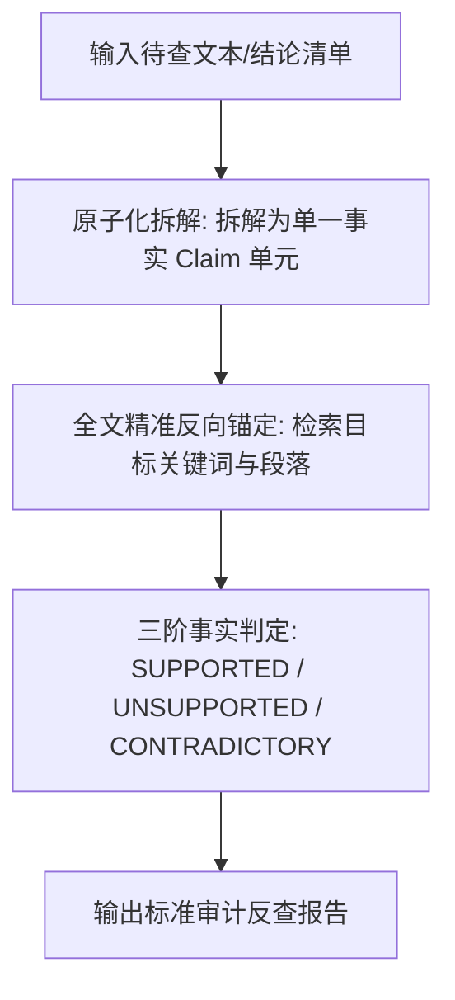

# 既有科研结论反查审计模式规程 (Audit Mode Protocol)

## 一、为什么 Audit Mode 是学术科研的核心刚需？

在学术研究、论文审稿、文献综述写作和毕业论文答辩中，研究人员经常会遇到以下场景：
1. **核对综述中的引用真伪**：某篇权威综述声称某论文发现“黑麂等位基因丢失率高达 35%”，需要核实原作者究竟是不是这样写的；
2. **核对前期文献笔记**：课题组师兄师姐留下的文献笔记记录“退火温度为 58°C”，需要核查原文是否如此；
3. **查证审稿人/答辩老师的质疑**：审稿人指出“文献 X 的体系与你引用的不符”，需要迅速进行逐字对账。

**Audit Mode（审计反查模式）** 的核心使命是：**不做大而全的被动总结，而是作为严苛的“学术打假机”，对用户提交的每一条具体主张（Claim）进行反向事实溯源与定性裁决。**

---

## 二、Audit Mode 执行三阶段流水线



### 步骤 1：原子化主张拆解 (Atomic Claim Decomposition)
用户输入的总结往往是一句复合句，必须先拆解为互不重叠的“原子主张（Atomic Claims）”。
- **用户原始输入**：
  > “张三 (2018) 使用磁珠法提取粪便 DNA，微卫星 PCR 体系为 20 μL，添加了 0.2 mg/mL BSA，扩增成功率达 85%。”
- **原子化拆解后清单**：
  - `Claim 1`：DNA 提取方法为磁珠法 (Magnetic bead method)；
  - `Claim 2`：微卫星 PCR 反应体积为 20 μL；
  - `Claim 3`：PCR 体系中添加了 0.2 mg/mL BSA；
  - `Claim 4`：微卫星扩增成功率为 85%。

---

### 步骤 2：全文反向寻证与裁决判定 (Verdict Classification)
针对拆解出的每一个 Atomic Claim，专员在全文中进行检索核验，并由审查员给出以下三类终极裁决：

| 裁决代码 | 裁决名称 | 判定标准 | 证据要求 |
|---|---|---|---|
| **`SUPPORTED`** | 证实有效 | 原文直接明确支持该主张 | 必须附带原文最小充分原句及精确位置 |
| **`UNSUPPORTED`** | 无中生有/查无实据 | 原文通篇未提及该内容，纯属后人误传或臆测 | 必须说明全文检索相关关键词无匹配 |
| **`CONTRADICTORY`** | 事实矛盾/严重颠倒 | 原文实际记录与待查主张截然相反（如实际为 10 μL） | 必须并列展示待查陈述与原文打脸原句 |

---

### 步骤 3：输出标准审计反查表格

```markdown
### 📋 结论反查审计报告 (Audit Report)

| Claim # | Atomic Claim Statement | Verdict | Evidence Level | Original Evidence Quote | Source Location | Audit Verdict & Correction Notes |
|:---:|---|:---:|:---:|---|---|---|
| **C1** | DNA提取采用磁珠法 | **SUPPORTED** | E1 | “Fecal DNA was isolated using MagPure Stool Kit...” | Page 3, Section 2.2 | 原文确认采用 MagPure 磁珠法试剂盒 |
| **C2** | 微卫星PCR体系为20 μL | **CONTRADICTORY** | E1 | “PCR was carried out in a final volume of 10 μL...” | Page 4, Section 2.4 | ⚠️ **存在事实错误！** 原文实际反应体积为 10 μL，并非 20 μL |
| **C3** | 体系中添加了0.2 mg/mL BSA | **UNSUPPORTED** | E4 (NR) | — | Full text scanned | ❌ **查无实据！** 全文未提及添加任何 BSA |
| **C4** | 扩增成功率达85% | **SUPPORTED** | E1 | “An overall PCR success rate of 85.2% was obtained across 15 loci.” | Page 6, Table 3 | 原文表 3 汇总数据为 85.2%，证实吻合 |
```

---

## 三、Audit 模式的辅助脚本联动
本技能配备了专用的自动化审计脚本 `scripts/audit_claims.py`。
当待查 Claim 数量较多时，可以直接通过命令行传入包含 Claims 的 JSON/Markdown 文件与 PDF 进行机器辅助打假初筛。
