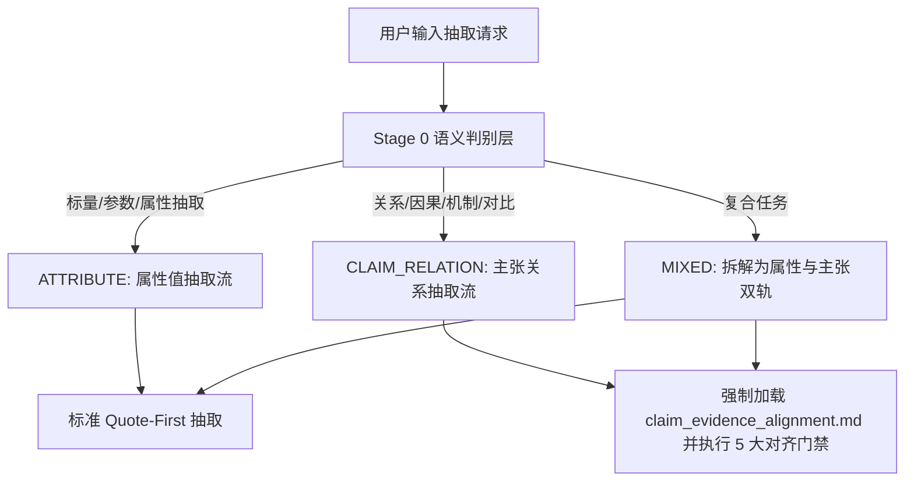

# 全学科通用主张—证据对齐规程与关系硬门禁 (Universal Claim–Evidence Alignment Protocol)

> **适用模块**：`literature-evidence-extraction`  
> **适用学科**：全学科通用（自然科学、生命医学、工程计算、人文与社会科学）  
> **核心使命**：杜绝“实体出现/共现/上下文邻近/文献引用”被错误升级为已证实的科学关系、因果结论或命题事实。

---

## 一、底层核心原则 (Core Principle)

在学术文献事实抽取中，必须恪守以下四条不可动摇的认识论底线：

> **Mention ≠ Relation.** （提及 ≠ 关系）  
> **Co-occurrence ≠ Relation.** （共现 ≠ 关系）  
> **Contextual proximity ≠ Relation.** （上下文邻近 ≠ 目标关系）  
> **Entity evidence ≠ Claim evidence.** （实体存在证据 ≠ 主张成立证据）  

A scientific claim must be supported at the level of the claim itself. Evidence that merely mentions, measures, or co-locates the entities involved is insufficient to establish the requested relation or proposition. ScholarFlow must preserve the distinction between entity evidence and claim evidence, and must never silently promote co-occurrence, contextual proximity, background description, cited work, or shared observation into a confirmed scientific relation.

---

## 二、抽取任务类型分流 (Attribute vs. Claim Extraction)

ScholarFlow 自动将信息抽取需求区分为两类语义范式：



### 1. 属性/数值抽取 (Attribute / Value Extraction)
- **典型特征**：提取单一研究、实体或对象的固有属性、离散参数或测量值（如样本量、反应温度、试验周期、数据集规模等）。
- **核验路径**：`Entity/Study → Attribute → Value`。遵循常规 Quote-First 规则，只要原句能够直接证明该数值属性即可。

### 2. 主张/关系抽取 (Claim / Relation Extraction)
- **典型特征**：提取实体间的相互作用、因果作用、关联倾向、性能比较、调控机制、理论支持/反驳等主张型事实（如 X 影响 Y、A 导致 B、模型 A 优于模型 B、基因 A 调控基因 B 等）。
- **核验路径**：必须执行 **5 大主张—证据对齐门禁 (Claim–Evidence Alignment Gates)**。证据不仅必须覆盖所涉实体，还必须在命题层级直接证明目标关系成立。

---

## 三、主张门禁触发条件 (Trigger Conditions)

当抽取目标或用户问询包含下列语义要素时，系统自动判定为 `CLAIM_RELATION`，严禁退化为简单属性抽取：

| 语义类型 | 典型语义触发词与意图 | 示例 |
|---|---|---|
| **因果与影响** | 影响、导致、诱发、降低、提升、抑制、促进、causes, affects, reduces | “某处理是否降低了指标？” |
| **相互作用与调控** | 调控、结合、互作、催化、激活、阻断、regulates, interacts, binds | “哪些因子调控该通路？” |
| **性能比较与优劣** | 优于、劣于、胜过、加速、提升精度、outperforms, surpasses, exceeds | “算法 A 在该基准上是否优于算法 B？” |
| **关联与倾向** | 相关、相伴、协同、正相关、负相关、associated with, correlated with | “指标 X 与指标 Y 是否存在正向关联？” |
| **理论与命题支持** | 支持、反驳、证实、证伪、适用、supports, refutes, corroborates | “该历史发现是否支持假说 H？” |
| **系统与交互关系** | 捕食、取食、共生、寄生、竞争、feeds on, preys upon, competes with | “该主体是否与客体存在特定交互？” |

---

## 四、五大主张—证据对齐门禁 (The 5 Alignment Gates)

任何声明为关系型结论的输出，必须无条件通过以下 5 道门禁：

```text
Target Claim
    ↓
[Gate 1: Target Claim Identity]     —— 明确目标主张，非实体存在
    ↓
[Gate 2: Evidence Context Match]    —— 锁定同质实验/队列/数据集上下文
    ↓
[Gate 3: Relation Support Test]     —— 原文直接支持关系本身，拒绝共现
    ↓
[Gate 4: Source Role Classification]—— 严别当前成果 vs 背景/引用/推测
    ↓
[Gate 5: Inference Boundary Check]  —— 拒绝未经声明的模型推论与谓词插入
    ↓
Confirmed Claim Output
```

### Gate 1 — 目标主张同一性 (Target Claim Identity)
- 明确用户真正需要核验的目标主张（例如：“A affects B”）。
- **红线**：严禁将目标主张降级为“A 出现且 B 出现”。必须确认主张的命题方向与谓词约束。

### Gate 2 — 证据上下文匹配 (Evidence Context Match)
- 证据必须来自同一严格匹配的实验、队列、数据集、时间段或论证单元。
- **红线**：严禁跨上下文拼接（例如：在队列 1 中观察到 A 升高，在队列 2 中观察到 B 降低，擅自拼凑“在研究中 A 抑制 B”）。

### Gate 3 — 命题支持性核验 (Relation / Proposition Support Test)
- 原文文字或结构化表格必须明确支持关系本身。
- **红线**：两实体在同一自然段共同被提及（Co-occurrence）或在同一生境/系统中共存，仅能证实二者共现，绝不能输出为相互作用或影响关系。

### Gate 4 — 证据来源角色鉴别 (Source Role Classification)
必须判定证据片段在论文中的知识角色（详见第七节）：
- 仅有 `CURRENT_STUDY_RESULT` 可作为当前研究的证实关系；
- `REFERENCED_ONLY`（引用前人成果）严禁输出为本文实证结论；
- `DISCUSSION_INTERPRETATION`（讨论推测）严禁输出为确认事实。

### Gate 5 — 推理边界与外推控制 (Inference Boundary Check)
- 检查是否存在模型擅自添加的关系谓词（Unsupported Predicate Insertion）。
- 若关系系从原始数据唯一推导得出，必须明确标记为 `DERIVED` 并给出严格推导公式；凡带有推测性、需未声明外部领域假设者，一律降级为 `AMBIGUOUS`。

---

## 五、证据上下文匹配规程 (Evidence Context Matching)

为保证 Gate 2 的执行，所有关系抽取必须锚定证据上下文（Evidence Context）。一个有效的证据上下文必须满足以下同一性要求：

1. **同一研究对象/队列**：处理组与对照组属于同一受控实验或同一样本群；
2. **同一数据切片/基准**：算法比较必须在同一数据集、同一评价指标及同一评测设定下完成；
3. **同一时空粒度**：观察或采样必须在同一时空尺度与分析单元内完成；
4. **同一次观测/测量**：不能将方法章节的描述与无关表型强行关联。

---

## 六、主张支持性测试 (Claim Support Test)

审查员和专员必须对候选引文执行“反向断言测试”：
- **提问**：如果将原文中的关系谓词抹去，仅保留实体名称，原文的核心信息是否丢失？
- **如果丢失**：说明原文原本表达了关系，支持性测试通过。
- **如果不丢失（原文仅陈述实体存在、被测量或共列）**：说明原文根本没有提供关系谓词，此时输出关系属于严重违规（共现偷换），必须坚决阻断！

---

## 七、证据来源角色体系 (Source Role Taxonomy)

每条关系证据必须绑定以下角色类型之一：

| 来源角色代码 | 定义 | 是否可作为本文证实结论 |
|---|---|---|
| `CURRENT_STUDY_RESULT` | 本文实验、观测或分析直接得出的实证结果 | **允许** (CONFIRMED) |
| `CURRENT_STUDY_METHOD` | 本文实际采用的实验方法或操作规程 | 仅限方法事实，不能作为结果 |
| `BACKGROUND` | 论文背景介绍或通用领域知识陈述 | **禁止** (BACKGROUND_ONLY) |
| `REFERENCED_WORK` | 论文对前人文献结果的引用陈述 | **禁止** 冒充本文 (REFERENCED_ONLY) |
| `DISCUSSION_INTERPRETATION` | 作者在讨论部分提出的假说、解释或外推推测 | **禁止** 记为确认结论 (AMBIGUOUS) |
| `ENVIRONMENT_OR_CONTEXT` | 实验背景环境、共存实体或伴随变量的客观描述 | **禁止** 升级为作用关系 (CONTEXT_ONLY) |
| `OTHER_ENTITY_CONTEXT` | 属于论文中其他对照组、其他研究对象或非目标主体的关系 | **禁止** 错配给目标主体 |

---

## 八、推理边界与外推控制 (Inference Boundary)

模型在抽取时严禁产生幻觉谓词（Unsupported Predicate Insertion）。
- **允许的推导 (DERIVED)**：数学上闭合且唯一的换算（例如：表 1 列出模型 A 准确率 92%，模型 B 准确率 85%，在同一数据集上，由此推导 `Model A outperforms Model B on Dataset X (+7%)`）；
- **禁止的外推 (UNSUPPORTED/AMBIGUOUS)**：因果机制联想（例如：A 在施加处理后上升，B 随后下降，作者在正文中未声称因果，模型擅自断言 `A suppresses B`）。

---

## 九、关系抽取十级状态全景图 (10-Status Taxonomy)

针对主张/关系抽取，ScholarFlow 采用结构完备的 10 级状态体系：

```text
                      [抽取候选判定]
                            │
       ┌────────────────────┴────────────────────┐
       ▼                                         ▼
[关系命题有直接证据支持]                    [仅实体出现或证据不匹配]
  - SUPPORTED (完全支持)                    - AMBIGUOUS (共现但关系存疑)
  - PARTIALLY_SUPPORTED (核心支持/边界漂移)  - CONTRADICTORY (原文明确矛盾)
  - DERIVED (数据严格唯一可推导)             - BACKGROUND_ONLY (仅背景提及)
                                            - CONTEXT_ONLY (仅环境伴随)
                                            - OTHER_ENTITY_CONTEXT (对象错位)
                                            - REFERENCED_ONLY (引述他人)
                                            - NOT_REPORTED (全文未提及)
```

### 状态详细说明与处置手段：
1. **`SUPPORTED`**：原文语句或表格清晰、完整支持目标主张；
2. **`PARTIALLY_SUPPORTED`**：原文支持主要方向，但在范围、样本限制、置信度区间或特定条件下成立；
3. **`DERIVED`**：原文无直接字面陈述，但经严格数据计算或逻辑闭包唯一推导得出（必须附推导式）；
4. **`AMBIGUOUS`**：实体真实存在或共现，但原文未明确表达目标主张，或存在多种合理解释；
5. **`CONTRADICTORY`**：原文实证数据或结论明确反驳目标主张；
6. **`BACKGROUND_ONLY`**：仅在引言或背景中作为通识陈述，非本文实证；
7. **`CONTEXT_ONLY`**：仅作为环境背景、伴生物质或伴随现象存在，无交互关系；
8. **`OTHER_ENTITY_CONTEXT`**：该关系由论文中其他实验组或对照实体展现，未在目标实体上证实；
9. **`REFERENCED_ONLY`**：仅为作者引用他人已发表文献的结论；
10. **`NOT_REPORTED`**：论文全文未提及该关系或所涉要素。

---

## 十、确认输出硬门禁 (Confirmed Output Gate)

> [!CAUTION]
> **放行铁律**：只有状态为 **`SUPPORTED`**、**`PARTIALLY_SUPPORTED`** 或 **`DERIVED`**，且来源角色为 **`CURRENT_STUDY_RESULT`**（或附带推导的原始实证数据）的事实项，才允许进入最终报告的 Confirmed Output（已确认事实集合）。
> 其余所有状态（`AMBIGUOUS`, `BACKGROUND_ONLY`, `CONTEXT_ONLY`, `OTHER_ENTITY_CONTEXT`, `REFERENCED_ONLY`, `NOT_REPORTED`）必须被分流隔离至待定证据或排除清单中，绝不允许混入实证结论表！

---

## 十一、结构化表格证据束 (Structured Table Evidence Bundle)

当主张由表格证明时，单一单元格往往不能构成充分证据。必须使用**证据束 (Evidence Bundle)** 结构：

```yaml
evidence_bundle:
  type: TABLE_HEADER_ROW_BUNDLE
  table_id: "Table 2"
  table_title: "Comparison of Model Performance across Benchmark Datasets"
  column_header: "F1-Score (%)"
  row_identifier: "Proposed Method"
  baseline_row_identifier: "Baseline-A"
  cell_values:
    target: "94.2"
    baseline: "88.1"
  dataset_context: "Dataset-Alpha"
```

只有当表头、对比行、基准行及数据集上下文完整闭合时，方可支持 `Model outperforms Baseline-A on Dataset-Alpha`。

---

## 十二、多跨度证据协同验证 (Multi-Span Evidence)

对于横跨方法与结果的复杂主张（例如：“处理组 A 显著提升了产率”），单一引句可能仅说明分组（方法），另一引句说明产率提升（结果）。
- **要求**：必须构造双引句关联对 `[Method Quote, Result Quote]`；
- **校验**：必须验证两处引句指代的是同一个实验编号与同一批次样本，严禁拼凑不同批次的数据。

---

## 十三、严禁跨上下文拼接 (Cross-Context Claim Assembly Prohibition)

> [!WARNING]
> **绝对禁令**：禁止从文档互不兼容的上下文中各摘取局部事实，拼接成一个原文未表达的全新主张！  
> **违规示例**：
> - 引句 1（队列 A，健康对照）：`“Biomarker X remained stable.”`
> - 引句 2（队列 B，严重病患）：`“Mortality reached 30%.”`
> - ❌ 违规拼接输出：`“Biomarker X stability is associated with 30% mortality.”`  
> 审查员一旦发现跨上下文拼接，必须立即按违规项予以 `REJECT` 驳回！

---

## 十四、审查员 15 项核查标准 (Auditor Alignment Checklist)

在审查关系型主张时，审查员必须对每条记录完成下列 6 点专项核验：
1. `[ ]` **Target Claim Explicitly Formulated**：目标主张已明确定义，未发生退化；
2. `[ ]` **Direct Propositional Support**：证据支持命题本身，而非实体共现；
3. `[ ]` **Context Homogeneity**：证据位于同一实验/队列/基准上下文内；
4. `[ ]` **No Cross-Context Assembly**：无跨章节、跨实验拼凑断言；
5. `[ ]` **No Cited-to-Current Leakage**：无他人引用偷换为本文成果；
6. `[ ]` **No Predicate Fabrication**：无模型脑补的关系动词与修饰词。

---

## 十五、跨学科对照示例 (Cross-Disciplinary Examples)

> 以下各领域示例仅用于阐明通用原则在不同场景下的具体表现，绝不代表针对特定学科的特殊规则。

### 1. 生命科学 (Life Sciences)
- **原文描述**：`“In our RNA-seq analysis, Gene X and Gene Y both showed elevated expression levels in liver tissues.”`
- **用户目标主张**：`Gene X regulates Gene Y.`
- **裁决**：`AMBIGUOUS`（共表达只能说明同时高表达，不等于调控关系；严禁脑补调控谓词）。

### 2. 生物医药与临床 (Biomedical & Clinical)
- **原文描述**：`“Compound A was administered to all hospitalized cohorts. Overall 30-day mortality was 12%.”`
- **用户目标主张**：`Compound A reduces mortality.`
- **裁决**：`AMBIGUOUS`（单臂描述给药与终点，未设对照，未声明因果降低效应；不能输出为“降低死亡率”）。

### 3. 生态学与环境 (Ecology & Environment)
- **原文描述**：`“Survey plots in Forest Alpha confirmed the presence of Species X. Vegetation sampling recorded abundant Plant Y in the same plots.”`
- **用户目标主张**：`Species X feeds on Plant Y.`
- **裁决**：`CONTEXT_ONLY`（物种与植物共存于同一样地只能证明生境重叠或共现，绝不证明捕食或取食关系）。

### 4. 计算机科学与工程 (Computer Science & Engineering)
- **原文描述**：`“We evaluated Model A and Model B under standard configurations. Table 1 lists their respective loss values.”`
- **用户目标主张**：`Model A outperforms Model B.`
- **裁决**：`AMBIGUOUS`（除非结合表格数值且某模型指标明确优于另一模型，否则正文单纯提及共同评估不能得出优劣主张）。

### 5. 社会科学与经济学 (Social Sciences & Economics)
- **原文描述**：`“We surveyed 1,200 households, recording both parental education levels and household income.”`
- **用户目标主张**：`Parental education causes higher household income.`
- **裁决**：`AMBIGUOUS`（同时调查两项指标不等于因果关系；未报告回归或因果推断时不可添加因果谓词）。

### 6. 历史学与文献学 (History & Philology)
- **原文描述**：`“Author P dedicated Chapter 3 to analyzing Theory Q.”`
- **用户目标主张**：`Author P endorsed Theory Q.`
- **裁决**：`AMBIGUOUS`（讨论某理论不等于赞同或支持该理论）。

### 7. 法学 (Law)
- **原文描述**：`“The court cited Principle K in its review of previous jurisprudence.”`
- **用户目标主张**：`Principle K determined the ruling in Case M.`
- **裁决**：`REFERENCED_ONLY`（提及前案原则不等于该原则是本案判决依据裁判要旨）。

---

## 十六、对抗测试基准案例 (Adversarial Benchmark Cases)

ScholarFlow 通过以下 7 组典型对抗测试确保对抗性鲁棒性（False Relation Rate 严格为 0%）：

| 测试编号 | 对抗场景模式 | 输入证据特征 | 目标主张 | 预期判定 | 拦截原因 |
|:---:|---|---|---|:---:|---|
| **Test A** | **Co-occurrence Only**<br>(纯实体共现) | A 与 B 在同一句子被共同测量或列举 | A 影响 B | `AMBIGUOUS` | 仅共现无关系谓词 |
| **Test B** | **Background Mention**<br>(引言背景提及) | Introduction 引用前人研究说明 A 与 B 有关 | 本文发现 A 作用于 B | `REFERENCED_ONLY` | 他人成果不得冒充当前研究 |
| **Test C** | **Wrong Entity Context**<br>(研究对象/组别错配) | 对照组或实验组 Y 呈现了该效果 | 实验组 X 具有该效果 | `OTHER_ENTITY_CONTEXT` | 上下文对象错位 |
| **Test D** | **Direct Claim**<br>(正向直接支持) | 结果章节明确指出“处理 A 显著降低了指标 B” | A 降低 B | `SUPPORTED` | 原文明确支持命题本身 |
| **Test E** | **Structured Table Relation**<br>(结构化表格多维证据) | 表头、数据集、对比行闭合显示指标优于对照 | 算法 A 优于 算法 B | `SUPPORTED` | 结构化证据束完整成立 |
| **Test F** | **Discussion Speculation**<br>(讨论章节作者推测) | Discussion 中作者声称“A 可能解释了 B 现象” | A 是 B 的机制原因 | `AMBIGUOUS` | 作者推测不可升级为实证结论 |
| **Test G** | **Cross-Context Assembly**<br>(跨实验/章节拼接) | 实验 1 出现 A，不相关的实验 2 出现 B | A 与 B 存在协同作用 | `REJECTED` | 严禁跨上下文拼接证据 |
