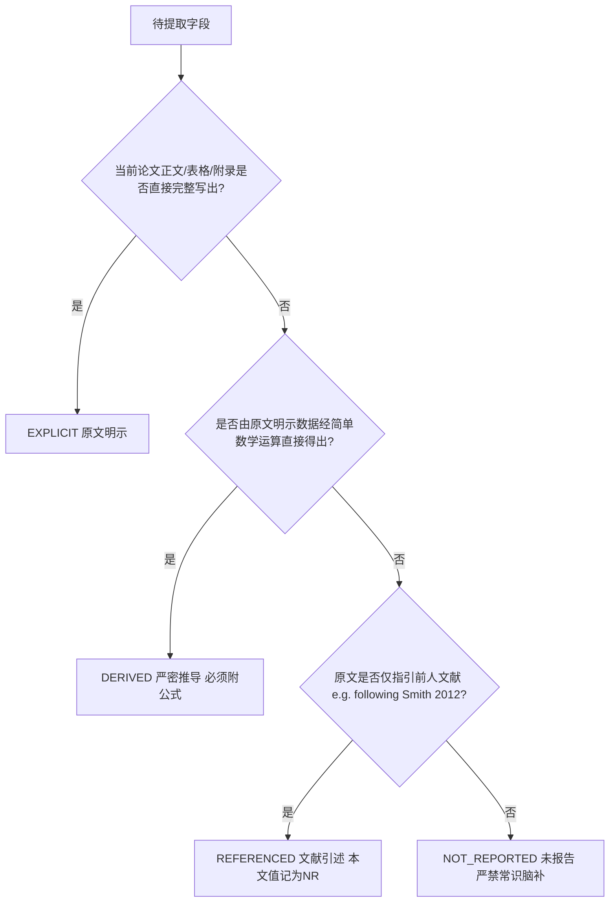

# 四级证据体系与状态标签判定规程 (Evidence Levels & Status Guidelines)

## 一、为什么需要四级证据分级体系？

在传统大模型提取学术信息时，最大的缺陷在于**把不同置信度的事实混为一谈**：
- 把“原文白纸黑字写出的”和“自己根据常识猜想的”混在一起；
- 把“原文引用别人论文的”冒充成“本文实际使用的”；
- 把“通过数字换算得出的”伪装成“原文明示的”。

为了彻底消除科研信息抽取中的模糊性与幻觉，本技能推行**双层证据评价模型**：
1. **第一层：原文溯源类型（Support Type，兼容代码 E1–E4）** —— 衡量字段值是如何从当前论文文本中得到的；
2. **第二层：证据裁决状态（Claim Status）** —— 衡量抽取结论与原文原句的字符级支持度与矛盾状态。

> [!IMPORTANT]
> **与下游综合分析 (Synthesis) 的严格正交解耦**：
> 抽取阶段的 `support_type` 仅描述“**提取溯源关系**”（原文明示、推导、转引、未报告），**绝不等于下游科学结论的论证强度 (`evidence_strength`)**。
> 特别声明：提取阶段的 `NOT_REPORTED (NR)` 表示本文通篇未提及该参数，在下游进入综合分析时权重恒为 0.0，绝不允许被误解为下游的 `EXPERT_OPINION` 进行加权！

---

## 二、第一层：原文溯源类型与判定边界 (`support_type` / E1–E4)



### 1. E1 — EXPLICIT（原文明示）
- **定义**：当前论文正文、主表、图例或补充材料中，对该参数存在字面、直接、完整的记录。
- **示例**：
  - 原文：`“PCR amplification was carried out in a total volume of 20 μL containing 2 μL 10× buffer...”`
  - 提取：`PCR volume = 20 μL`，`Level = E1 (EXPLICIT)`。
- **约束**：必须附带能够完整证明该数值的最简原句。

---

### 2. E2 — DERIVED（逻辑/数学推导）
- **定义**：原文虽然没有直接给出一个总值，但通过其明确报告的各个分量数据，可以通过基础算术加减乘除直接、唯一确定。
- **示例**：
  - 原文报告了反应组分：`“2 μL 10× buffer, 1.6 μL dNTPs, 1 μL primers, 0.2 μL Taq, 2 μL DNA, and 13.2 μL ddH2O.”`
  - 提取：`PCR total volume = 20 μL`，`Level = E2 (DERIVED)`。
  - **强制要求**：必须在 Notes 中完整列出推导公式：`2 + 1.6 + 1.0 + 0.2 + 2.0 + 13.2 = 20.0 μL`。
- **红线**：严禁把 E2 虚报为 E1。

---

### 3. E3 — REFERENCED（引述外部文献）
- **定义**：当前论文在描述该方法或参数时，没有给出具体操作步骤或数值，而是明确指引读者参考他人发表的文献。
- **示例**：
  - 原文：`“DNA was extracted from fecal samples following the protocol described by Waits et al. (2001).”`
  - 提取：
    - `Value = NR (详见 Waits et al. 2001)`
    - `Level = E3 (REFERENCED)`
    - `Reference = Waits et al. (2001)`
    - `Notes = 当前论文未列提取试剂与步骤，仅声明遵循 Waits et al. (2001)`。
- **红线**：**严禁自动搜索 Waits et al. 的内容回填为本文参数！** 除非用户在 Stage 0 明确追加了引文追踪指令。

---

### 4. E4 — NR（Not Reported / Not Found 未报告）
- **定义**：在用户提供的当前可访问全文、表格和补充材料中，完全没有提及该字段或相关信息。
- **示例**：
  - 字段：`BSA concentration`（牛血清白蛋白浓度）。
  - 原文：全文检索 `BSA`、`bovine serum albumin` 无任何匹配。
  - 提取：`Value = NR`，`Level = E4 (NR)`，`Status = NOT_REPORTED`。
- **红线**：**绝对禁止根据领域常识写出“根据常规经验通常为 0.1 mg/mL”！**

---

## 三、第二层：六大证据状态标签 (Evidence Status)

除了 E1–E4 的来源分级，必须在 `Status` 列标注以下六种状态之一：

| 状态代码 | 中文释义 | 判定准则 | 典型处理方式 |
|---|---|---|---|
| **`SUPPORTED`** | 充分支持 | 提取值与原句证据 100% 严密对齐，毫无疑义 | 正常放行 |
| **`PARTIALLY_SUPPORTED`** | 部分支持 | 原文涉及该主题，但信息残缺或缺乏单位（如仅写“加微量BSA”） | 在 Notes 中注明残缺部分 |
| **`UNSUPPORTED`** | 无证据支持 | 在 Audit Mode 下，发现待查 Claim 在原文中毫无文字依据 | 审查员一票驳回 |
| **`CONTRADICTORY`** | 内部矛盾 | 原文正文与表格、或正文不同段落对同一参数给出冲突数值 | 同时列出两处原句，保留矛盾 |
| **`AMBIGUOUS`** | 语意歧义 | 原文用词模棱两可（如“退火温度约为 55°C 上下”、“加入数微升”） | 原文摘抄，注明模糊性 |
| **`OCR_UNCERTAIN`** | 识别存疑 | 扫描件模糊、微升 `μL` 错显为乱码、`±` 符号缺失、引物序列断损 | 强制标记存疑，严禁自作主张修复 |
> **NR 语义防护（NOT_REPORTED ≠ UNSUPPORTED）**：未报告记录的 claim_status 一律记 `AMBIGUOUS`（notes 注明「NR 非论断」），严禁记 `UNSUPPORTED`——「论文没写」不等于「论文说错了」。

---

## 四、矛盾冲突处理标准化规范 (Contradiction Protocol)

如果同一篇论文中出现矛盾（如：Methods 描述 `annealing = 55°C`，但附表 1 记录 `annealing = 53°C`）：

```markdown
| Field | Extracted Value | Evidence Level | Verbatim Quote | Source Type | Location | Status | Notes |
|---|---|---|---|---|---|---|---|
| Annealing Temp | 55°C (正文) / 53°C (表1) | E1 (EXPLICIT) | 正文：“annealed at 55°C for 30 s”; 表1：“Locus STR-01 Ta = 53°C” | Text & Table | Page 4 & Table 1 | CONTRADICTORY | 正文与表格存在 2°C 温度分歧，未说明原因，需人工复核 |
```

**铁律**：Agent 绝不可自行拍脑袋推断“哪个是对的”，必须将冲突原样呈现给科研人员。
