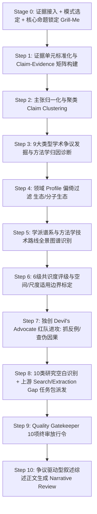

# 学科文献综合分析与学术争议发掘专业技能 (literature-synthesis)

本技能用于在严谨科研场景下，基于多篇已经验证的文献证据单元（优先接收 `literature-evidence-extraction` 的结构化证据表或本地文献集合），进行**跨文献证据对撞、学术争议深度发掘、学派与方法学演进分析、共识边界标定与争议驱动型综述生成**（Cross-Study Evidence Grounding, Controversy Mapping & Paradigm Synthesis）。

> **核心哲学**：
> 本技能是 **Evidence-Grounded Scientific Synthesizer（证据锚定型科学综合分析器）**，绝非“流水账文献总结器”，更不是“按论文篇数民主投票的统计工具”。
> 
> 严厉执行总原则：**Claims first, narrative later.**
> 严厉禁止反模式：**Read papers → immediately write review prose (流水账综述).**
> 核心任务链：**Evidence units → Claim extraction → Normalization → Clustering → Agreement/Conflict detection → Methodological diagnosis → School identification → Evidence weighting → Consensus boundary → Knowledge gaps → Controversy-driven narrative.**

---

## ⚡ 上下文预算与按需渐进加载准则 (Progressive Context Loading Protocol)

> [!CAUTION]
> **严禁全量一次性预加载**：本 Skill 包含 23 个系统模块。在触发激活时，**绝对禁止**一次性通读 `references/`、`role/`、`examples/` 或 `assets/` 中的所有文件。Agent 必须严格遵守以下阶段化按需读取策略，严守上下文预算！

### 阶段 1：启动与前置交互门禁（仅允许加载 1 个文件，~5 KB）
- **唯一必须读取**：[references/stage0_grill_me.md](./references/stage0_grill_me.md)
- **核心动作**：解析用户提供的多篇文献输入、确认四种运行模式之一、锁定核心科学命题、确认是否生成最终叙述性综述。
- **禁止提前读取**：任何其他规程、角色契约、模板或长案例。

---

### 阶段 2：模式分支按需流转加载

#### 🔍 分支 A：快速争议扫描模式 (Controversy Scan Mode)
- **适用**：快速摸底当前文献集合的主要分歧点。
- **允许加载清单**：
  1. `references/controversy_taxonomy_9types.md`（掌握 9 大争议分类诊断）
  2. `assets/controversy_map_template.md`（争议地图模板）
- **严格禁止加载**：学派图谱、长篇综述撰写指南、复杂演化分析文档。

#### 🔬 分支 B：深度学术综合模式 (Deep Evidence Synthesis Mode)
- **适用**：学位论文开题/第一章综述、国家基金立项背景、高水平 Review 文章。
- **严禁跨阶段提前预加载，严格按阶段流水推进（Just-In-Time Loading）**：
  - **进入 Claim 提取与对撞阶段**：加载 `references/controversy_taxonomy_9types.md` 与 `references/consensus_levels_and_boundaries.md`；
  - **进入学派与方法学演化阶段**：加载 `references/school_and_paradigm_mapping.md`；
  - **进入学科偏倚核查阶段**：根据学科按需加载 `references/domain_profiles/ecology_profile.md` 或 `molecular_ecology_profile.md`；
  - **进入红队辩驳与质量把关阶段**：加载 `role/devils_advocate_gatekeeper.md` 执行 10 项终审；
  - **进入缺口闭环反馈阶段**：加载 `references/knowledge_gaps_and_upstream_loop.md` 生成补检与补抽任务包；
  - **进入最终综述正文撰写阶段**：加载 `references/narrative_review_guidelines.md`。

#### 🏛️ 分支 C：学派与理论框架图谱模式 (School / Paradigm Mapping Mode)
- **仅加载**：`references/school_and_paradigm_mapping.md` 与 `assets/school_landscape_template.md`。

#### ⚖️ 分支 D：单项论断多源对撞审计模式 (Claim Audit Mode)
- **仅加载**：`references/consensus_levels_and_boundaries.md` 与 `role/devils_advocate_gatekeeper.md`。

---

## 一、四层主导协同架构 (Quad Role Architecture)

技能内部将 10 大职能高度凝聚为 4 个紧凑的角色契约（详见 `role/` 目录）：

1. **统筹协调组 ([synthesis_coordinator.md](./role/synthesis_coordinator.md))**：
   - 整合 `Role 0 Coordinator`、`Role 1 Claim Mapper` 与 `Role 2 Evidence Binder`；
   - 负责解析科学问题、将多文献证据原子化为可比主张（Normalized Claims）、建立 Claim–Evidence Matrix、识别 Search Gap 与 Extraction Gap 并向协调上游流水线派发任务。
2. **争议与方法学诊断组 ([controversy_analyst.md](./role/controversy_analyst.md))**：
   - 整合 `Role 3 Controversy Detector` 与 `Role 4 Methodology Critic`；
   - 负责运用 9 大争议分类器对表面矛盾进行病理学诊断，深入抽检抽样设计、时空尺度、检测概率、指标差异与统计模型假设，拒绝武断认定。
3. **学派演化与共识组 ([school_consensus_specialist.md](./role/school_consensus_specialist.md))**：
   - 整合 `Role 5 Paradigm Analyst`、`Role 6 Temporal Trend Analyst` 与 `Role 7 Consensus Assessor`；
   - 负责识别真实学术流派（严格区分公认学派与分析性聚类）、绘制技术与观点代际演化路线图、执行 6 级共识度评级并强制绑定适用边界。
4. **红队辩驳与终审组 ([devils_advocate_gatekeeper.md](./role/devils_advocate_gatekeeper.md))**：
   - 整合 `Role 8 Devil's Advocate (反方挑刺专员)` 与 `Role 9 Quality Gatekeeper (终审审查员)`；
   - 专门负责攻击当前主流综合结论：寻找被忽视的反例、排查同一数据集重复发表、检验伪因果与过度外推，并依据 10 项质量门禁执行一票否决。

---

## 二、四种核心运行模式 (Operational Modes)

| 模式名称 | 核心任务 | 典型产出 | 适用场景 |
|---|---|---|---|
| **Controversy Scan** *(快速争议扫描)* | 快速发现当前文献集的核心分歧与矛盾 | Controversy Map（9大类型分类表） | 组会研讨、快速摸清领域分歧、文献初筛分流 |
| **Deep Synthesis** *(全景学术综合)* | 完整执行主张对齐、争议诊断、学派图谱、共识边界、空白生成与争议驱动综述 | 13 模块标准综合报告 + 章节化综述正文 + 缺口任务包 | 博士/硕士开题报告、学位论文第一章、SCI综述论文、基金立项背景 |
| **School Mapping** *(学派与演化)* | 梳理学术阵营、理论框架与方法学迭代历史 | 学派对比矩阵 + 技术演进生命周期图谱 | 理论探索、方法学综述、领域前沿演进脉络分析 |
| **Claim Audit** *(多源主张对撞)* | 针对用户给出的学术论断，全景核验多方证据支撑与反证 | 赞成/反对/条件限制三方对撞核验表 | 论文审稿核查、答辩立论防御、验证经典结论真伪 |

---

## 三、十步标准执行工作流 (10-Step Workflow)

---

## 四、核心输出契约与模板

### 1. 结构化交付物 (Markdown Tables & Maps)
- **Claim–Evidence Matrix**：`[Claim ID | Proposition | Paper | Direction | Context | Strength]`
- **Controversy Map**：`[Controversy ID | Focus | Type A~I | Pro Side | Con Side | Likely Cause | Status]`
- **Consensus Map**：`[Question | Consensus Level | Supporting Papers | Exceptions | Boundary Condition]`
- **School Landscape**：`[School / Paradigm | Core Proposition | Representative Papers | Methods | Confidence]`
- **Upstream Gap Requests**：`[SEARCH GAP 任务包]` & `[EXTRACTION GAP 任务包]`

### 2. 争议驱动型综述正文 (Narrative Review)
严格遵循“**科学命题 → 支持证据 → 挑战/反面证据 → 产生分歧的方法学原因 → 当前最佳合理解释 → 遗留未知空白**”的争议驱动逻辑，彻底告别按文献编号逐一介绍的流水账。

---

## 五、下游技能交接与闭环联动 (Handoff & Closed-Loop)

- **接收上游**：
  - 无缝消费 [`literature-evidence-extraction`](../literature-evidence-extraction/SKILL.md) 产出的结构化 JSON 与证据表；
  - 接收 [`literature-discovery-acquisition`](../literature-discovery-acquisition/SKILL.md) 检索下载的文献集合。
- **反向闭环派发**：
  - 当发现文献断层时，自动生成 `SEARCH GAP` 任务包回传给 `literature-discovery-acquisition`；
  - 当发现关键参数未抽取时，自动生成 `EXTRACTION GAP` 任务包回传给 `literature-evidence-extraction`。

---

## 六、支撑资源与文档目录

- **角色规范 (`role/`)**：
  - [synthesis_coordinator.md](./role/synthesis_coordinator.md)：统筹协调组契约 (Coordinator + Claim Mapper + Evidence Binder)
  - [controversy_analyst.md](./role/controversy_analyst.md)：争议发掘与方法学诊断组契约 (Controversy Detector + Method Critic)
  - [school_consensus_specialist.md](./role/school_consensus_specialist.md)：学派演化与共识组契约 (Paradigm + Trend + Consensus)
  - [devils_advocate_gatekeeper.md](./role/devils_advocate_gatekeeper.md)：红队辩驳与终审把关组契约 (Devil's Advocate + Gatekeeper)
- **核心操作规程 (`references/`)**：
  - [stage0_grill_me.md](./references/stage0_grill_me.md)：Stage 0 模式选择与科学命题锁定 Grill-Me 规程
  - [controversy_taxonomy_9types.md](./references/controversy_taxonomy_9types.md)：9 大学术争议类型分类判定标准 (Type A~I)
  - [consensus_levels_and_boundaries.md](./references/consensus_levels_and_boundaries.md)：6 级共识度评级体系与边界标定规程
  - [school_and_paradigm_mapping.md](./references/school_and_paradigm_mapping.md)：学派与理论框架严谨识别指南
  - [knowledge_gaps_and_upstream_loop.md](./references/knowledge_gaps_and_upstream_loop.md)：10 类研究空白识别与上游闭环反馈规程
  - [narrative_review_guidelines.md](./references/narrative_review_guidelines.md)：争议驱动型综述正文撰写指南
  - `domain_profiles/ecology_profile.md`：生态学黄金偏倚与理论框架 Profile
  - `domain_profiles/molecular_ecology_profile.md`：分子生态与保护遗传学黄金 Profile
- **辅助分析脚本 (`scripts/`)**：
  - `scripts/controversy_analyzer.py`：跨文献 Claim 对撞、冲突矩阵生成与共识评分脚本
  - `scripts/school_clustering.py`：学派与方法学路线聚类辅助脚本
  - `scripts/claim_linter.py`：综述正文 Claim ID 可溯源门禁（未解析引用硬失败、孤儿论断段落启发式标记、未引用 Claim 覆盖率统计、--check-matrix 矩阵自校验）
- **资产与模板 (`assets/`)**：
  - [claim_evidence_matrix_schema.json](./assets/claim_evidence_matrix_schema.json)：Claim–Evidence Matrix JSON Schema
  - [controversy_map_template.md](./assets/controversy_map_template.md)：争议地图模板
  - [consensus_map_template.md](./assets/consensus_map_template.md)：共识地图模板
  - [school_landscape_template.md](./assets/school_landscape_template.md)：学派与方法学图谱模板
  - [upstream_gap_request_template.md](./assets/upstream_gap_request_template.md)：上游闭环任务包模板
  - [narrative_synthesis_template.md](./assets/narrative_synthesis_template.md)：综述正文模板
- **案例与反模式 (`examples/`)**：
  - [population_density_controversy_case.md](./examples/population_density_controversy_case.md)：种群密度估算争议综合实战案例
  - [road_genetic_connectivity_case.md](./examples/road_genetic_connectivity_case.md)：道路基因流阻隔争议案例
  - [anti_patterns.md](./examples/anti_patterns.md)：13 大文献综合反模式与负向对照清单
