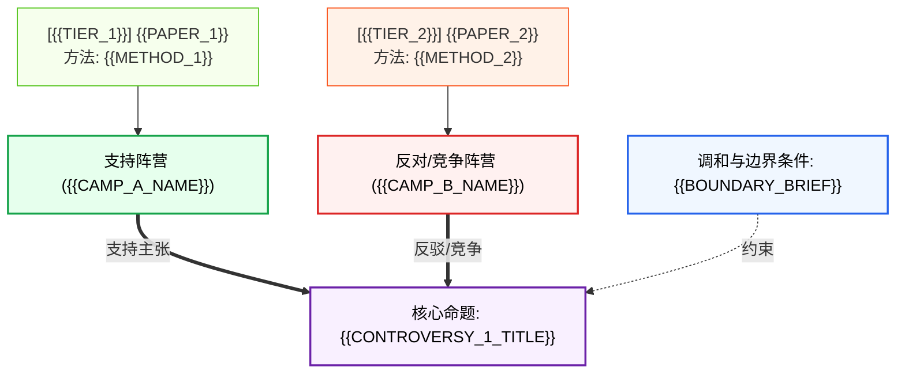

# 学术争议诊断图谱 (Controversy Diagnostic Map)

> **任务标识**：`{{TASK_ID}}` | **主题**：`{{TOPIC}}` | **生成时间**：`{{TIMESTAMP}}` | **领域配置文件**：`{{DOMAIN_PROFILE}}`

---

## 1. 学术争议宏观总览 (Executive Overview)

| 争议编号 | 核心争议命题 | 争议分类体系 | 涉及主要文献 / 学派 | 冲突烈度 | 关键根因简述 |
|---|---|---|---|---|---|
| **CTV-01** | {{CONTROVERSY_1_TITLE}} | `{{TYPE_A_TO_I}}` | {{PAPERS_A}} vs {{PAPERS_B}} | 高 / 中 / 低 | {{ROOT_CAUSE_BRIEF_1}} |
| **CTV-02** | {{CONTROVERSY_2_TITLE}} | `{{TYPE_A_TO_I}}` | {{PAPERS_C}} vs {{PAPERS_D}} | 高 / 中 / 低 | {{ROOT_CAUSE_BRIEF_2}} |

---

## 2. 争议深潜诊断与学术对决 (In-Depth Controversy Audits)

### 争议档案：CTV-01 - {{CONTROVERSY_1_TITLE}}

- **核心冲突命题**：
  > "{{STATEMENT_OF_CONFLICTING_PREMISES}}"
- **争议分类判据**：`{{TYPE_CLASSIFICATION_WITH_REASONING}}`
- **对立阵营格局**：
  - **支持方 (Camp A)**：{{CAMP_A_DESCRIPTION}} (代表文献: {{CAMP_A_PAPERS}})
  - **反对方 / 竞争方 (Camp B)**：{{CAMP_B_DESCRIPTION}} (代表文献: {{CAMP_B_PAPERS}})
  - **条件限定方 (Conditional Camp)**：{{CONDITIONAL_CAMP_PAPERS}}

#### 2.1 证据链条对决表 (Evidence Duel Matrix)

| 阵营 / 文献 | 立场 (Stance) | 证据等级 (Tier) | 核心主张与关键数值 | 调查/实验方法 | 理论模型与关键假定 | 适用边界与约束条件 |
|---|---|---|---|---|---|---|
| **{{PAPER_1}}** | `SUPPORT` | `{{TIER_1}}` | {{VALUE_OR_CLAIM_1}} | {{METHOD_1}} | {{ASSUMPTION_1}} | {{BOUNDARY_1}} |
| **{{PAPER_2}}** | `REFUTE` | `{{TIER_2}}` | {{VALUE_OR_CLAIM_2}} | {{METHOD_2}} | {{ASSUMPTION_2}} | {{BOUNDARY_2}} |

#### 2.2 学术论证拓扑图 (Argument Graph)

#### 2.3 方法论根因深度剖析 (Methodological Root Cause Analysis)
1. **抽样设计与数据代表性偏差**：
   - {{ANALYSIS_ON_SAMPLING_BIAS}}
2. **检测工具与标记分辨率差异**：
   - {{ANALYSIS_ON_RESOLUTION_DIFFERENCE}}
3. **统计模型假定与结构性误差**：
   - {{ANALYSIS_ON_MODEL_ASSUMPTIONS}}
4. **时空尺度与生态异质性效应**：
   - {{ANALYSIS_ON_SCALE_DEPENDENCE}}

#### 2.3 红队质询与反直觉假说 (Devil's Advocate Challenge)
> 🚩 **反方挑战假说**：{{DEVILS_ADVOCATE_HYPOTHESIS}}
> 
> - **为何主流解释可能误导**：{{WHY_MAINSTREAM_MAY_BE_BIASED}}
> - **混杂变量排查**：{{CONFOUNDING_VARIABLES_AUDIT}}

#### 2.4 裁决与破局条件 (Resolution Criteria)
- 要彻底平息该争议，必须满足以下实证或方法学条件：
  - [ ] {{RESOLUTION_CONDITION_1}}
  - [ ] {{RESOLUTION_CONDITION_2}}

---

## 3. 伴生上游空白请求 (Triggered Upstream Gaps)
- **检索空白 (Search Gap)**：需上游 `literature-discovery-acquisition` 补充补充检索：`{{SEARCH_GAP_QUERY}}`
- **抽取空白 (Extraction Gap)**：需上游 `literature-evidence-extraction` 精准回溯核验：`{{EXTRACTION_GAP_TARGET}}`
