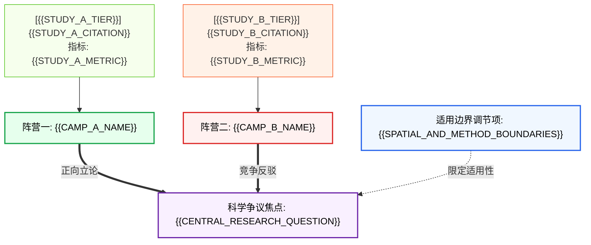

# {{SYNTHESIS_CHAPTER_TITLE}}

> **综述类型**：争议驱动型叙述性文献综述 (Controversy-Driven Narrative Review)  
> **主题范畴**：{{RESEARCH_THEME}} | **纳入文献数量**：{{STUDY_COUNT}} 篇 | **证据审计等级**：E1-E4 分层

---

## 1. 核心科学问题与认知分歧 (The Central Controversy)

{{INTRODUCTION_AND_CORE_QUESTION}}

学界针对该核心命题目前形成了两种截然不同（或相互竞争）的学术观点：
- **阵营一（以 {{CAMP_A_KEY_AUTHORS}} 为代表）**：主张 {{CAMP_A_CORE_THESIS}}。
- **阵营二（以 {{CAMP_B_KEY_AUTHORS}} 为代表）**：提出 {{CAMP_B_CORE_THESIS}}。

从争议性质审视，该分歧主要归属于 **`{{CONTROVERSY_TYPE}}`**。两派观点的对立本质上反映了 {{ESSENCE_OF_CONFLICT}}。

---

## 2. 冲突溯源与方法论根因剖析 (Methodological Root Cause Analysis)

文献分歧绝非偶然的随机波动，而是根植于实验设计与分析范式的系统性差异：

### 2.1 抽样设计与数据代表性偏误
{{SAMPLING_BIAS_AND_REPRESENTATIVENESS_ANALYSIS}}

### 2.2 检测分辨率与标记灵敏度差异
{{RESOLUTION_AND_SENSITIVITY_ANALYSIS}}

### 2.3 理论模型假定与统计边界
{{STATISTICAL_MODEL_ASSUMPTIONS_ANALYSIS}}

---

## 3. 学术对决与实证证据矩阵 (Evidence Duel Matrix)

综合对比两派最具代表性的实证工作，其核心参数与方法学特征如下表所示：

| 对立阵营 / 代表性文献 | 核心主张 (Claim) | 证据等级 (Tier) | 实测关键数值 (95% CI) | 调查/实验方法 | 核心理论假设 | 适用边界与约束 |
|---|---|---|---|---|---|---|
| **{{STUDY_A_CITATION}}** | {{STUDY_A_CLAIM}} | `{{STUDY_A_TIER}}` | {{STUDY_A_METRIC}} | {{STUDY_A_METHOD}} | {{STUDY_A_ASSUMPTION}} | {{STUDY_A_BOUNDARY}} |
| **{{STUDY_B_CITATION}}** | {{STUDY_B_CLAIM}} | `{{STUDY_B_TIER}}` | {{STUDY_B_METRIC}} | {{STUDY_B_METHOD}} | {{STUDY_B_ASSUMPTION}} | {{STUDY_B_BOUNDARY}} |

### 3.2 论证拓扑网络图 (Argument Topology Graph)

---

## 4. 共识收敛与适用边界界定 (Bounded Consensus & Uncertainties)

剥离方法学差异引发的表层冲突后，现有研究所能稳固支撑的核心共识如下：

### 4.1 收敛共识（共识层级：`{{CONSENSUS_LEVEL}}`）
> "{{CONVERGENT_CONSENSUS_STATEMENT}}"

该共识仅在以下**硬性边界条件**下成立：
- **空间尺度**：{{SPATIAL_BOUNDARY}}
- **时间窗口**：{{TEMPORAL_BOUNDARY}}
- **方法标准**：{{METHODOLOGICAL_BOUNDARY}}

### 4.2 残留未决盲区与红队质询 (Residual Gaps & Red-Team Critique)
> 🚩 **红队审计视点**：{{RED_TEAM_CRITIQUE}}
> 
> {{WHY_CONFIRMATION_BIAS_MUST_BE_AVOIDED}}

目前仍有以下关键参数与机制尚未完全厘清：
1. {{UNRESOLVED_GAP_1}}
2. {{UNRESOLVED_GAP_2}}

---

## 5. 破局路径与未来研究机遇 (Actionable Path Forward)

为彻底解决该科学争议并填补上述盲区，未来研究应重点推进以下方向：
1. **多范式交叉融合与联合建模**：{{METHOD_FUSION_PROPOSAL}}
2. **严苛对照实验设计与标准化质控**：{{EXPERIMENTAL_DESIGN_PROPOSAL}}
3. **技术跃迁与新型标记应用**：{{NOVEL_TOOL_PROPOSAL}}
