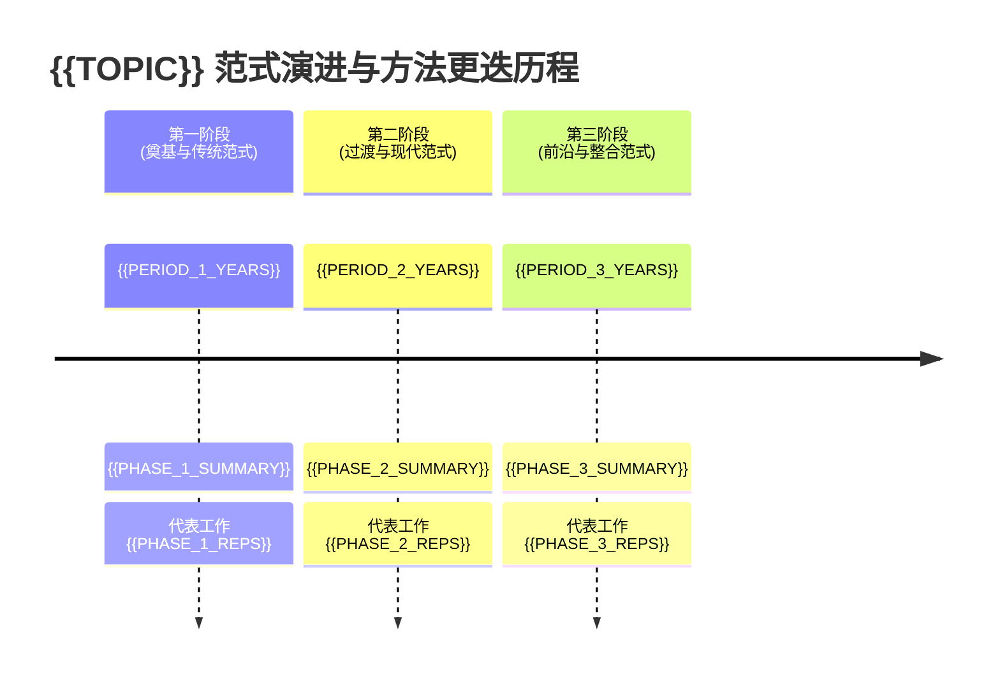

# 学派谱系与范式演进全景图 (School & Paradigm Landscape)

> **任务标识**：`{{TASK_ID}}` | **主题**：`{{TOPIC}}` | **生成时间**：`{{TIMESTAMP}}`

---

## 1. 范式格局与学派判定总览 (Paradigm Overview)

| 阵营 / 范式名称 | 类别判定 (Status) | 文献篇数 | 时间跨度 | 代表学者 / 领军机构 | 核心技术范式 | 理论核心假设 |
|---|---|---|---|---|---|---|
| **{{PARADIGM_1}}** | `{{STATUS_1}}` | {{COUNT_1}} | {{YEARS_1}} | {{AUTHORS_1}} | {{TECH_1}} | {{ASSUMPTION_1}} |
| **{{PARADIGM_2}}** | `{{STATUS_2}}` | {{COUNT_2}} | {{YEARS_2}} | {{AUTHORS_2}} | {{TECH_2}} | {{ASSUMPTION_2}} |

> 📌 **判定标准说明**：
> - `ESTABLISHED SCHOOL`：具备明确师承学术谱系、特定核心学者/机构、统一理论纲领与长期系统性主张。
> - `ANALYTICAL GROUPING`：仅因采用相同技术工具、统计模型或研究相同地理对象而聚合的分析性群组，不构成学术学派。

---

## 2. 范式演进时序轴 (Chronological Evolution)

---

## 3. 范式深潜对比与核心断层面 (Paradigm Fault Lines)

### 3.1 范式 A：{{PARADIGM_1}} (`{{STATUS_1}}`)
- **代表性文献**：{{REPRESENTATIVE_PAPERS_1}}
- **核心理论假设**：{{THEORETICAL_PREMISES_1}}
- **核心分析工具与统计框架**：{{TOOLKIT_AND_FRAMEWORK_1}}
- **核心优势**：{{STRENGTHS_1}}
- **固有局限与盲区**：{{LIMITATIONS_1}}

### 3.2 范式 B：{{PARADIGM_2}} (`{{STATUS_2}}`)
- **代表性文献**：{{REPRESENTATIVE_PAPERS_2}}
- **核心理论假设**：{{THEORETICAL_PREMISES_2}}
- **核心分析工具与统计框架**：{{TOOLKIT_AND_FRAMEWORK_2}}
- **核心优势**：{{STRENGTHS_2}}
- **固有局限与盲区**：{{LIMITATIONS_2}}

---

## 4. 范式碰撞与理论交锋焦点 (Inter-Paradigm Clashes)
- **交锋焦点 1：{{CLASH_FOCUS_1}}**
  - 范式 A 视点：{{PARADIGM_A_VIEW}}
  - 范式 B 视点：{{PARADIGM_B_VIEW}}
  - 调和与融合前瞻：{{SYNTHESIS_AND_FUSION}}
