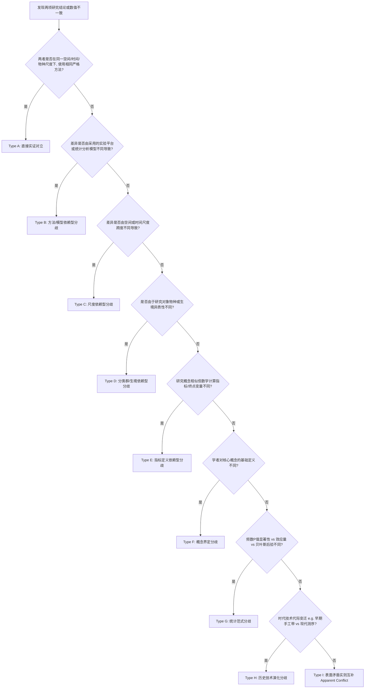

# 9 大学术争议类型分类诊断体系 (9-Type Controversy Taxonomy)

## 一、为什么不能把所有“结果不一致”都统称为“争议”？

在学术文献中，看到两篇论文得出的结论不同，很多初学者会立刻将其写入综述：“学界在此问题上存在严重争议”。
然而，在 80% 以上的科研场景中，这种所谓的“冲突”根本不是真正的理论或实证争议，而是因为：
- 一篇研究在人工湖岛屿（孤岛片段化生境），另一篇在连续大山系国家公园；
- 一篇使用了 1995 年的简单手工读带，另一篇使用了 2020 年的毛细管精准电泳；
- 一篇使用的是二阶段两项分布模型，另一篇使用的是空间显式点过程模型；
- 两者测量的核心指标名称相似，但数学公式完全不同。

为了对学术分歧进行精准定性，本技能严格推行 **9 大学术争议分类分类器 (Type A 到 Type I)**。

---

## 二、9 大争议分类器详解与判定标准

### Type A — Direct Empirical Contradiction（直接实证对立）
- **判定标准**：研究的科学命题、研究对象、实验体系、时空尺度和统计模型基本一致，但得出了截然相反的结论（如 Study A 发现添加 BSA 显著提高检出率，Study B 在同等降解样本中发现添加 BSA 抑制扩增）。
- **学术定位**：**这是最纯粹、最具科学价值的真正争议**，通常意味着存在尚未被发现的关键未知干扰变量。

---

### Type B — Method-Dependent Disagreement（方法/模型依赖型分歧）
- **判定标准**：结论差异直接取决于所采用的技术路线或数学分析模型。
- **典型案例**：
  - Capwire TIRM 模型（假设个体捕获概率仅为高低两档）估算种群为 68 只；
  - 传统 CMR 两阶段模型（假设所有个体捕获概率均等）估算为 112 只；
  - 空间标记重捕 SECR 模型（引入动物探测概率随距离衰减函数）估算密度为 0.18 只/km²。
- **处理要求**：必须在方法学归因中指出“模型假设的松弛或严苛程度是导致数值差异的核心原因”。

---

### Type C — Scale-Dependent Disagreement（时空尺度依赖型分歧）
- **判定标准**：结论的成立高度依赖于研究的空间广度（Micro vs Macro）或时间跨度（Short-term vs Decadal）。
- **典型案例**：
  - 微观尺度（局部 1 km² 样方）：未观察到道路对目标动物个体活动的阻隔；
  - 景观尺度（跨越县域交通干线）：检测到显著的遗传阻隔与基因流中断。

---

### Type D — Taxon / System Dependency（分类群与生境依赖型分歧）
- **判定标准**：由于物种生物学特性（如鹿科 vs 食肉目）或生态系统类型（常绿阔叶林 vs 农田交错带）的根本异质性导致的差异。

---

### Type E — Metric-Dependent Disagreement（响应指标依赖型分歧）
- **判定标准**：作者探讨的是同一个泛概念，但分别采用了不同的量化测量指标。
- **典型案例**：在食性分析中，一篇采用“食谱丰富度 (Dietary Richness)”，另一篇采用“相对读长丰度 (RRA)”，第三篇采用“出现频次 (FOO)”。

---

### Type F — Definition Disagreement（概念基础定义分歧）
- **判定标准**：不同学者对同一专业术语的内涵理解截然不同。
- **典型案例**：关于“景观连通性 (Connectivity)”，一派指的是“物理结构连通度（植被廊道覆盖率）”，另一派指的是“功能基因流连通度（基因交流速率）”。

---

### Type G — Statistical Disagreement（统计范式分歧）
- **判定标准**：表面结论不一致源于统计推断哲学的不同（传统 P < 0.05 显著性 vs 效应量置信区间 vs 贝叶斯后验概率分布）。

---

### Type H — Historical Disagreement（历史技术代际更替分歧）
- **判定标准**：早期文献受限于时代技术条件（如仅有 4 对位点、手工聚丙烯酰胺凝胶银染），与现代自动化高通量毛细管测序产生数值差异。

---

### Type I — Apparent Disagreement（表面矛盾实则互补 / 伪争议）
- **判定标准**：两篇论文看似结论矛盾，实则在逻辑上完全可以同时成立，纯属由于作者叙述侧重点不同造成的表面冲突。
- **典型案例**：Paper A 称“冬季某有蹄类强烈依赖南坡向阳生境”，Paper B 称“该物种在沟谷常绿阔叶林常年保持稳定活动”。二者实为微生境季节性迁移行为。
- **铁律**：**必须直接打上 `APPARENT_CONFLICT` 标签，严禁虚构争议！**
